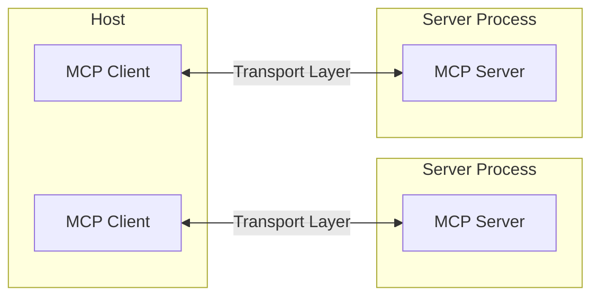
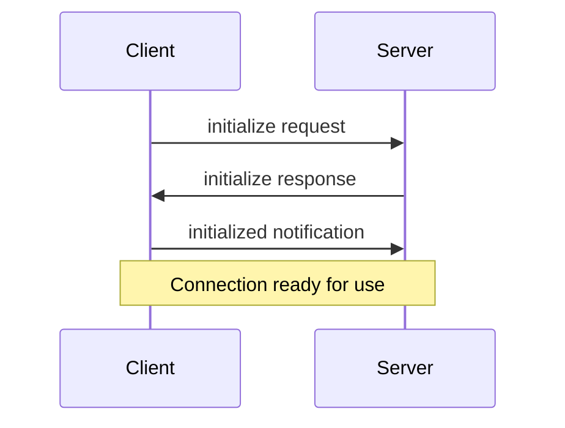

This file is a merged representation of the entire codebase, combined into a single document by Repomix.

# File Summary

## Purpose
This file contains a packed representation of the entire repository's contents.
It is designed to be easily consumable by AI systems for analysis, code review,
or other automated processes.

## File Format
The content is organized as follows:
1. This summary section
2. Repository information
3. Directory structure
4. Multiple file entries, each consisting of:
  a. A header with the file path (## File: path/to/file)
  b. The full contents of the file in a code block

## Usage Guidelines
- This file should be treated as read-only. Any changes should be made to the
  original repository files, not this packed version.
- When processing this file, use the file path to distinguish
  between different files in the repository.
- Be aware that this file may contain sensitive information. Handle it with
  the same level of security as you would the original repository.

## Notes
- Some files may have been excluded based on .gitignore rules and Repomix's configuration
- Binary files are not included in this packed representation. Please refer to the Repository Structure section for a complete list of file paths, including binary files
- Files matching patterns in .gitignore are excluded
- Files matching default ignore patterns are excluded
- Files are sorted by Git change count (files with more changes are at the bottom)

## Additional Info

# Directory Structure
```
.github/
  ISSUE_TEMPLATE/
    bug_report.md
    feature_request.md
  workflows/
    issue-comment-created.yml
    labels-assigner.yml
    lock-threads.yml
    stale-actions.yaml
  auto-comment.yml
  CODEOWNERS
  config.yml
  labeler.yml
  no-response.yml
  PULL_REQUEST_TEMPLATE.md
  settings.yml
  stale.yml
docs/
  mcp-concepts/
    architecture.md
    prompts.md
    resources.md
    roots.md
    sampling.md
    tools.md
    transports.md
  mcp-debugging/
    Debugging - Model Context Protocol.md
    Inspector - Model Context Protocol.md
  typescript-sdk/
    mcp-typescript-sdk.md
    typescript-sdk-repo-summary.md
libs/
  adapters/
    http-client.ts
  services/
    terragrunt-repo.ts
  utils/
    logger-events.ts
tests/
  terragrunt-repo.test.ts
.env.example
.gitattributes
.gitignore
.nvmrc
deno.json
deno.lock
justfile
main.ts
README.md
```

# Files

## File: docs/mcp-debugging/Debugging - Model Context Protocol.md
`````markdown
Effective debugging is essential when developing MCP servers or integrating them with applications. This guide covers the debugging tools and approaches available in the MCP ecosystem.

MCP provides several tools for debugging at different levels:

1.  **MCP Inspector**
    
    -   Interactive debugging interface
    -   Direct server testing
    -   See the [Inspector guide](https://modelcontextprotocol.io/docs/tools/inspector) for details
2.  **Claude Desktop Developer Tools**
    
    -   Integration testing
    -   Log collection
    -   Chrome DevTools integration
3.  **Server Logging**
    
    -   Custom logging implementations
    -   Error tracking
    -   Performance monitoring

## Debugging in Claude Desktop

### Checking server status

The Claude.app interface provides basic server status information:

1.  Click the  icon to view:
    
    -   Connected servers
    -   Available prompts and resources
2.  Click the  icon to view:
    
    -   Tools made available to the model

### Viewing logs

Review detailed MCP logs from Claude Desktop:

The logs capture:

-   Server connection events
-   Configuration issues
-   Runtime errors
-   Message exchanges

### Using Chrome DevTools

Access Chrome’s developer tools inside Claude Desktop to investigate client-side errors:

1.  Create a `developer_settings.json` file with `allowDevTools` set to true:

2.  Open DevTools: `Command-Option-Shift-i`

Note: You’ll see two DevTools windows:

-   Main content window
-   App title bar window

Use the Console panel to inspect client-side errors.

Use the Network panel to inspect:

-   Message payloads
-   Connection timing

## Common issues

### Working directory

When using MCP servers with Claude Desktop:

-   The working directory for servers launched via `claude_desktop_config.json` may be undefined (like `/` on macOS) since Claude Desktop could be started from anywhere
-   Always use absolute paths in your configuration and `.env` files to ensure reliable operation
-   For testing servers directly via command line, the working directory will be where you run the command

For example in `claude_desktop_config.json`, use:

Instead of relative paths like `./data`

### Environment variables

MCP servers inherit only a subset of environment variables automatically, like `USER`, `HOME`, and `PATH`.

To override the default variables or provide your own, you can specify an `env` key in `claude_desktop_config.json`:

### Server initialization

Common initialization problems:

1.  **Path Issues**
    
    -   Incorrect server executable path
    -   Missing required files
    -   Permission problems
    -   Try using an absolute path for `command`
2.  **Configuration Errors**
    
    -   Invalid JSON syntax
    -   Missing required fields
    -   Type mismatches
3.  **Environment Problems**
    
    -   Missing environment variables
    -   Incorrect variable values
    -   Permission restrictions

### Connection problems

When servers fail to connect:

1.  Check Claude Desktop logs
2.  Verify server process is running
3.  Test standalone with [Inspector](https://modelcontextprotocol.io/docs/tools/inspector)
4.  Verify protocol compatibility

## Implementing logging

### Server-side logging

When building a server that uses the local stdio [transport](https://modelcontextprotocol.io/docs/concepts/transports), all messages logged to stderr (standard error) will be captured by the host application (e.g., Claude Desktop) automatically.

For all [transports](https://modelcontextprotocol.io/docs/concepts/transports), you can also provide logging to the client by sending a log message notification:

Important events to log:

-   Initialization steps
-   Resource access
-   Tool execution
-   Error conditions
-   Performance metrics

### Client-side logging

In client applications:

1.  Enable debug logging
2.  Monitor network traffic
3.  Track message exchanges
4.  Record error states

## Debugging workflow

### Development cycle

1.  Initial Development
    
    -   Use [Inspector](https://modelcontextprotocol.io/docs/tools/inspector) for basic testing
    -   Implement core functionality
    -   Add logging points
2.  Integration Testing
    
    -   Test in Claude Desktop
    -   Monitor logs
    -   Check error handling

### Testing changes

To test changes efficiently:

-   **Configuration changes**: Restart Claude Desktop
-   **Server code changes**: Use Command-R to reload
-   **Quick iteration**: Use [Inspector](https://modelcontextprotocol.io/docs/tools/inspector) during development

## Best practices

### Logging strategy

1.  **Structured Logging**
    
    -   Use consistent formats
    -   Include context
    -   Add timestamps
    -   Track request IDs
2.  **Error Handling**
    
    -   Log stack traces
    -   Include error context
    -   Track error patterns
    -   Monitor recovery
3.  **Performance Tracking**
    
    -   Log operation timing
    -   Monitor resource usage
    -   Track message sizes
    -   Measure latency

### Security considerations

When debugging:

1.  **Sensitive Data**
    
    -   Sanitize logs
    -   Protect credentials
    -   Mask personal information
2.  **Access Control**
    
    -   Verify permissions
    -   Check authentication
    -   Monitor access patterns

## Getting help

When encountering issues:

1.  **First Steps**
    
    -   Check server logs
    -   Test with [Inspector](https://modelcontextprotocol.io/docs/tools/inspector)
    -   Review configuration
    -   Verify environment
2.  **Support Channels**
    
    -   GitHub issues
    -   GitHub discussions
3.  **Providing Information**
    
    -   Log excerpts
    -   Configuration files
    -   Steps to reproduce
    -   Environment details

## Next steps
`````

## File: docs/mcp-debugging/Inspector - Model Context Protocol.md
`````markdown
The [MCP Inspector](https://github.com/modelcontextprotocol/inspector) is an interactive developer tool for testing and debugging MCP servers. While the [Debugging Guide](https://modelcontextprotocol.io/docs/tools/debugging) covers the Inspector as part of the overall debugging toolkit, this document provides a detailed exploration of the Inspector’s features and capabilities.

## Getting started

### Installation and basic usage

The Inspector runs directly through `npx` without requiring installation:

#### Inspecting servers from NPM or PyPi

A common way to start server packages from [NPM](https://npmjs.com/) or [PyPi](https://pypi.com/).

#### Inspecting locally developed servers

To inspect servers locally developed or downloaded as a repository, the most common way is:

Please carefully read any attached README for the most accurate instructions.

## Feature overview

The Inspector provides several features for interacting with your MCP server:

### Server connection pane

-   Allows selecting the [transport](https://modelcontextprotocol.io/docs/concepts/transports) for connecting to the server
-   For local servers, supports customizing the command-line arguments and environment

### Resources tab

-   Lists all available resources
-   Shows resource metadata (MIME types, descriptions)
-   Allows resource content inspection
-   Supports subscription testing

### Prompts tab

-   Displays available prompt templates
-   Shows prompt arguments and descriptions
-   Enables prompt testing with custom arguments
-   Previews generated messages

### Tools tab

-   Lists available tools
-   Shows tool schemas and descriptions
-   Enables tool testing with custom inputs
-   Displays tool execution results

### Notifications pane

-   Presents all logs recorded from the server
-   Shows notifications received from the server

## Best practices

### Development workflow

1.  Start Development
    
    -   Launch Inspector with your server
    -   Verify basic connectivity
    -   Check capability negotiation
2.  Iterative testing
    
    -   Make server changes
    -   Rebuild the server
    -   Reconnect the Inspector
    -   Test affected features
    -   Monitor messages
3.  Test edge cases
    
    -   Invalid inputs
    -   Missing prompt arguments
    -   Concurrent operations
    -   Verify error handling and error responses

## Next steps

On this page

-   [Getting started](https://modelcontextprotocol.io/docs/tools/inspector#getting-started)
-   [Installation and basic usage](https://modelcontextprotocol.io/docs/tools/inspector#installation-and-basic-usage)
-   [Inspecting servers from NPM or PyPi](https://modelcontextprotocol.io/docs/tools/inspector#inspecting-servers-from-npm-or-pypi)
-   [Inspecting locally developed servers](https://modelcontextprotocol.io/docs/tools/inspector#inspecting-locally-developed-servers)
-   [Feature overview](https://modelcontextprotocol.io/docs/tools/inspector#feature-overview)
-   [Server connection pane](https://modelcontextprotocol.io/docs/tools/inspector#server-connection-pane)
-   [Resources tab](https://modelcontextprotocol.io/docs/tools/inspector#resources-tab)
-   [Prompts tab](https://modelcontextprotocol.io/docs/tools/inspector#prompts-tab)
-   [Tools tab](https://modelcontextprotocol.io/docs/tools/inspector#tools-tab)
-   [Notifications pane](https://modelcontextprotocol.io/docs/tools/inspector#notifications-pane)
-   [Best practices](https://modelcontextprotocol.io/docs/tools/inspector#best-practices)
-   [Development workflow](https://modelcontextprotocol.io/docs/tools/inspector#development-workflow)
-   [Next steps](https://modelcontextprotocol.io/docs/tools/inspector#next-steps)
`````

## File: libs/adapters/http-client.ts
`````typescript
/**
 * A simple HTTP client wrapper around Deno's built-in fetch API.
 */

// Define common HTTP status codes 
enum Status {
  OK = 200,
  Created = 201,
  Accepted = 202,
  NoContent = 204,
  BadRequest = 400,
  Unauthorized = 401,
  Forbidden = 403,
  NotFound = 404,
  MethodNotAllowed = 405,
  InternalServerError = 500,
  BadGateway = 502,
  ServiceUnavailable = 503,
  GatewayTimeout = 504
}

export class HttpClient {
  private baseURL: string;
  private defaultHeaders: Headers;

  /**
   * Creates an instance of HttpClient.
   * @param baseURL Optional base URL to prepend to relative paths.
   * @param defaultOptions Optional default fetch options (e.g., headers).
   */
  constructor(baseURL = "", defaultOptions: RequestInit = {}) {
    // Ensure baseURL ends with a slash if provided
    this.baseURL = baseURL && !baseURL.endsWith('/') ? `${baseURL}/` : baseURL;
    this.defaultHeaders = new Headers(defaultOptions.headers);

    // Ensure common defaults if not provided
    if (!this.defaultHeaders.has("Accept")) {
      this.defaultHeaders.set("Accept", "application/json");
    }
    // Content-Type is typically set per request (e.g., in POST)
  }

  /**
   * Performs an HTTP request.
   * @param method The HTTP method (GET, POST, PUT, DELETE, etc.).
   * @param path The URL path (relative to baseURL if set, or absolute).
   * @param options Additional fetch options (body, headers, queryParams, etc.).
   * @returns A Promise resolving to the parsed JSON response or raw Response object.
   */
  async request<T = unknown>(
    method: string,
    path: string,
    options: RequestInit & { queryParams?: Record<string, string>, parseJson?: boolean } = {},
  ): Promise<T | Response> {
    const url = new URL(path, this.baseURL || undefined); // Use URL constructor for robust path joining

    // Add query parameters if provided (using for...of)
    if (options.queryParams) {
      for (const [key, value] of Object.entries(options.queryParams)) {
        url.searchParams.append(key, value);
      }
    }

    // Merge headers: default < request-specific
    const requestHeaders = new Headers(this.defaultHeaders);
    if (options.headers) {
      new Headers(options.headers).forEach((value, key) => {
        requestHeaders.set(key, value);
      });
    }

    // Default Content-Type for relevant methods if body exists and header isn't set
    if (options.body && !requestHeaders.has("Content-Type") && (method === 'POST' || method === 'PUT' || method === 'PATCH')) {
        requestHeaders.set("Content-Type", "application/json");
    }

    // Prepare fetch options
    const _fetchOptions: RequestInit = {
      ...options, // Include user-provided options like body, signal, etc.
      method: method.toUpperCase(),
      headers: requestHeaders,
    };

    // Avoid delete: Create a clean options object for fetch
    const { queryParams: _queryParams, parseJson = true, ...nativeFetchOptions } = options;
    const finalFetchOptions: RequestInit = {
        ...nativeFetchOptions, // Include user-provided native options
        method: method.toUpperCase(),
        headers: requestHeaders,
    };

    try {
      const response = await fetch(url.toString(), finalFetchOptions); // Use cleaned options

      if (!response.ok) {
        // Attempt to read body for more error context, then throw
        let errorBody: string | object = `Request failed with status ${response.status}`;
        try {
            const text = await response.text();
            try {
                errorBody = JSON.parse(text); // Try parsing as JSON
            } catch {
                errorBody = text; // Fallback to text
            }
        } catch {
            // Ignore if reading body fails
        }
        throw new HttpError(response.status, errorBody, response.headers);
      }

      // Default to parsing JSON, allow opting out
      if (parseJson) {
          if (response.status === Status.NoContent || response.headers.get('content-length') === '0') {
              // Handle No Content responses
              return undefined as T;
          }
          // Check content-type before assuming JSON
          const contentType = response.headers.get("content-type");
          if (contentType?.includes("application/json")) {
              return await response.json() as T;
          }
          // If not JSON but parsing was expected, return raw response with warning
          console.warn(`Expected JSON response but received Content-Type: ${contentType}. Returning raw response.`);
          return response;
      }
      // Return the raw Response object if JSON parsing is disabled
      return response;
    } catch (error) {
      if (error instanceof HttpError) {
          throw error; // Re-throw specific HTTP errors
      }
      // Wrap generic network/fetch errors
      throw new Error(`HTTP request failed: ${error instanceof Error ? error.message : String(error)}`);
    }
  }

  // Convenience methods

  /** Performs a GET request. */
  get<T = unknown>(path: string, options?: Omit<RequestInit, 'method' | 'body'> & { queryParams?: Record<string, string>, parseJson?: boolean }): Promise<T | Response> {
    return this.request<T>("GET", path, options);
  }

  /** Performs a POST request. */
  post<T = unknown>(path: string, body?: unknown, options?: Omit<RequestInit, 'method' | 'body'> & { queryParams?: Record<string, string>, parseJson?: boolean }): Promise<T | Response> {
    const requestOptions = { ...options } as RequestInit & { queryParams?: Record<string, string>, parseJson?: boolean };
    if (body !== undefined) {
        requestOptions.body = typeof body === 'string' ? body : JSON.stringify(body);
        // Ensure Content-Type is set if providing a body, unless explicitly overridden
        if (!requestOptions.headers || !new Headers(requestOptions.headers).has("Content-Type")) {
            const headers = new Headers(requestOptions.headers);
            headers.set("Content-Type", "application/json");
            requestOptions.headers = headers;
        }
    }
    return this.request<T>("POST", path, requestOptions);
  }

  /** Performs a PUT request. */
  put<T = unknown>(path: string, body?: unknown, options?: Omit<RequestInit, 'method' | 'body'> & { queryParams?: Record<string, string>, parseJson?: boolean }): Promise<T | Response> {
     const requestOptions = { ...options } as RequestInit & { queryParams?: Record<string, string>, parseJson?: boolean };
    if (body !== undefined) {
        requestOptions.body = typeof body === 'string' ? body : JSON.stringify(body);
        if (!requestOptions.headers || !new Headers(requestOptions.headers).has("Content-Type")) {
            const headers = new Headers(requestOptions.headers);
            headers.set("Content-Type", "application/json");
            requestOptions.headers = headers;
        }
    }
    return this.request<T>("PUT", path, requestOptions);
  }

  /** Performs a PATCH request. */
  patch<T = unknown>(path: string, body?: unknown, options?: Omit<RequestInit, 'method' | 'body'> & { queryParams?: Record<string, string>, parseJson?: boolean }): Promise<T | Response> {
     const requestOptions = { ...options } as RequestInit & { queryParams?: Record<string, string>, parseJson?: boolean };
    if (body !== undefined) {
        requestOptions.body = typeof body === 'string' ? body : JSON.stringify(body);
        if (!requestOptions.headers || !new Headers(requestOptions.headers).has("Content-Type")) {
            const headers = new Headers(requestOptions.headers);
            headers.set("Content-Type", "application/json");
            requestOptions.headers = headers;
        }
    }
    return this.request<T>("PATCH", path, requestOptions);
  }

  /** Performs a DELETE request. */
  delete<T = unknown>(path: string, options?: Omit<RequestInit, 'method' | 'body'> & { queryParams?: Record<string, string>, parseJson?: boolean }): Promise<T | Response> {
    return this.request<T>("DELETE", path, options);
  }
}

/** Custom Error class for HTTP errors */
export class HttpError extends Error {
  status: number;
  body: string | object | null;
  headers: Headers;

  constructor(status: number, body: string | object | null, headers: Headers) {
    super(`HTTP Error ${status}: ${Status[status] || 'Unknown'}`);
    this.name = "HttpError";
    this.status = status;
    this.body = body;
    this.headers = headers;
  }
}

// Example Usage:
/*
const githubClient = new HttpClient("https://api.github.com", {
  headers: {
    "User-Agent": "my-deno-app",
    // Authorization: `Bearer ${Deno.env.get("GITHUB_TOKEN")}` // Example auth
  }
});

try {
  const user = await githubClient.get<{ login: string, id: number }>("users/octocat");
  console.log(user.login);

  // Example POST (replace with actual endpoint and body)
  // const issue = await githubClient.post("repos/owner/repo/issues", { title: "New Issue", body: "Details..." });
  // console.log(issue);

} catch (error) {
  if (error instanceof HttpError) {
    console.error(`HTTP Error ${error.status}:`, error.body);
  } else {
    console.error("Request failed:", error);
  }
}
*/
`````

## File: libs/services/terragrunt-repo.ts
`````typescript
import { HttpClient } from "../adapters/http-client.ts";

// Define types for GitHub API responses
interface GitHubIssue {
  id: number;
  number: number;
  title: string;
  state: "open" | "closed";
  html_url: string;
  body?: string;
  created_at: string;
  updated_at: string;
  user: {
    login: string;
    avatar_url: string;
    html_url: string;
  };
  labels: Array<{
    name: string;
    color: string;
  }>;
}

interface GitHubContent {
  name: string;
  path: string;
  sha: string;
  type: "file" | "dir" | "symlink" | "submodule";
  url: string;
  html_url: string;
  download_url: string | null;
}

/**
 * Represents a documentation category from the Terragrunt repository
 */
interface DocCategory {
  name: string;
  path: string;
  url: string;
  html_url: string;
}

/**
 * Represents a documentation file from the Terragrunt repository
 */
interface DocFile {
  name: string;
  path: string;
  content: string;
  html_url: string;
  download_url: string;
  size: number;
  sha: string;
}

/**
 * Represents a documentation file summary without the full content
 */
interface DocFileSummary {
  name: string;
  path: string;
  html_url: string;
  download_url: string;
  size: number;
  sha: string;
}

export class TerragruntRepo {
  private client: HttpClient;
  private readonly owner: string;
  private readonly repo: string;

  constructor(options: {
    owner?: string;
    repo?: string;
    apiBaseUrl?: string;
    token?: string;
  } = {}) {
    this.owner = options.owner || "gruntwork-io";
    this.repo = options.repo || "terragrunt";
    const apiBaseUrl = options.apiBaseUrl || "https://api.github.com";

    const headers: Record<string, string> = {
      "Accept": "application/vnd.github+json",
      "X-GitHub-Api-Version": "2022-11-28",
    };

    // Add authorization if token is provided
    if (options.token) {
      headers.Authorization = `Bearer ${options.token}`;
    }

    this.client = new HttpClient(apiBaseUrl, {
      headers,
    });
  }

  /**
   * Get a single page of open issues from the Terragrunt repository
   * @param options Optional parameters to filter issues
   * @returns Promise with an array of issues for the requested page
   */
  async getOpenIssues(options: {
    perPage?: number;
    page?: number;
  } = {}): Promise<GitHubIssue[]> {
    const queryParams: Record<string, string> = {
      state: "open",
      per_page: String(options.perPage || 30),
      page: String(options.page || 1),
    };

    const response = await this.client.get<GitHubIssue[]>(
      `repos/${this.owner}/${this.repo}/issues`,
      { queryParams }
    );

    return response as GitHubIssue[];
  }

  /**
   * Get all open issues from the Terragrunt repository by automatically handling pagination
   * with a configurable page limit
   * @param options Optional parameters to customize the request
   * @returns Promise with an array of all open issues
   */
  async getAllOpenIssues(options: {
    perPage?: number;
    maxPages?: number; // Limit the number of pages to fetch (for testing/limiting)
  } = {}): Promise<GitHubIssue[]> {
    const perPage = options.perPage || 30;
    const maxPages = options.maxPages || 10; // Reasonable default limit
    
    let currentPage = 1;
    let hasMorePages = true;
    const allIssues: GitHubIssue[] = [];
    
    while (hasMorePages && currentPage <= maxPages) {
      const pageIssues = await this.getOpenIssues({
        perPage,
        page: currentPage,
      });
      
      // Add current page results to the collection
      allIssues.push(...pageIssues);
      
      // Check if we've reached the end
      if (pageIssues.length < perPage) {
        hasMorePages = false;
      } else {
        currentPage++;
      }
    }
    
    return allIssues;
  }

  /**
   * Get absolutely ALL open issues from the Terragrunt repository without any page limit
   * @param options Optional parameters to customize the request
   * @returns Promise with an array of all open issues
   */
  async fetchAllOpenIssues(options: {
    perPage?: number;
  } = {}): Promise<GitHubIssue[]> {
    const perPage = options.perPage || 100; // Use max page size for efficiency
    
    let currentPage = 1;
    let hasMorePages = true;
    const allIssues: GitHubIssue[] = [];
    
    while (hasMorePages) {
      const pageIssues = await this.getOpenIssues({
        perPage,
        page: currentPage,
      });
      
      // Add current page results to the collection
      allIssues.push(...pageIssues);
      
      // Check if we've reached the end (last page)
      if (pageIssues.length < perPage) {
        hasMorePages = false;
      } else {
        currentPage++;
      }
    }
    
    return allIssues;
  }

  /**
   * Get all documentation categories from the Terragrunt repository
   * Categories are represented as folders in the docs/_docs path
   * @returns Promise with an array of documentation categories
   */
  async getDocCategories(): Promise<DocCategory[]> {
    // The docs are stored in the 'docs/_docs' directory of the repo
    const path = "docs/_docs";
    
    try {
      const response = await this.client.get<GitHubContent[]>(
        `repos/${this.owner}/${this.repo}/contents/${path}`,
        {}
      );
      
      const contents = response as GitHubContent[];
      
      // Filter to include only directories (these are our categories)
      const categories = contents
        .filter(item => item.type === "dir")
        .map(dir => ({
          name: this.formatCategoryName(dir.name),
          path: dir.path,
          url: dir.url,
          html_url: dir.html_url,
        }));
      
      return categories;
    } catch (error) {
      const errorMessage = error instanceof Error ? error.message : String(error);
      throw new Error(`Failed to fetch documentation categories: ${errorMessage}`);
    }
  }

  /**
   * List all markdown documents in a specific category
   * @param category The category name to list documents from
   * @returns Promise with an array of document summaries
   */
  async listDocumentsInCategory(category: string): Promise<DocFileSummary[]> {
    try {
      // First, get all categories to find the matching one
      const categories = await this.getDocCategories();
      
      // Find the category that matches the requested one (case-insensitive)
      const categoryName = category.toLowerCase();
      const matchedCategory = categories.find(cat => 
        cat.name.toLowerCase().includes(categoryName) || 
        cat.path.toLowerCase().includes(categoryName)
      );
      
      if (!matchedCategory) {
        throw new Error(`Category "${category}" not found`);
      }
      
      // Get all files in the category
      const response = await this.client.get<GitHubContent[]>(
        `repos/${this.owner}/${this.repo}/contents/${matchedCategory.path}`,
        {}
      );
      
      const contents = response as GitHubContent[];
      
      // Find and return only markdown files
      const mdFiles = contents
        .filter(item => item.type === "file" && item.name.endsWith(".md"))
        .map(file => ({
          name: file.name,
          path: file.path,
          html_url: file.html_url,
          download_url: file.download_url || "",
          size: 0, // Size will be fetched if needed
          sha: file.sha
        }));
      
      return mdFiles;
    } catch (error) {
      const errorMessage = error instanceof Error ? error.message : String(error);
      throw new Error(`Failed to list documents in category: ${errorMessage}`);
    }
  }

  /**
   * Get a specific markdown document from a category
   * @param options The category and document to fetch
   * @returns Promise with the document content and metadata
   */
  async getDocumentFromCategory(options: {
    category: string;
    document: string;
  }): Promise<DocFile> {
    try {
      // First, get all categories to find the matching one
      const categories = await this.getDocCategories();
      
      // Find the category that matches the requested one (case-insensitive)
      const categoryName = options.category.toLowerCase();
      const category = categories.find(cat => 
        cat.name.toLowerCase().includes(categoryName) || 
        cat.path.toLowerCase().includes(categoryName)
      );
      
      if (!category) {
        throw new Error(`Category "${options.category}" not found`);
      }
      
      // Get all files in the category
      const response = await this.client.get<GitHubContent[]>(
        `repos/${this.owner}/${this.repo}/contents/${category.path}`,
        {}
      );
      
      const contents = response as GitHubContent[];
      
      // Find markdown files
      const mdFiles = contents.filter(item => 
        item.type === "file" && 
        item.name.endsWith(".md")
      );
      
      // Find the requested document (case-insensitive)
      const docName = options.document.toLowerCase();
      const docFile = mdFiles.find(file => 
        file.name.toLowerCase().includes(docName) || 
        file.path.toLowerCase().includes(docName)
      );
      
      if (!docFile) {
        throw new Error(`Document "${options.document}" not found in category "${category.name}"`);
      }
      
      // Get the content of the file
      const fileResponse = await this.client.get<{
        content: string;
        encoding: string;
        size: number;
        name: string;
        path: string;
        sha: string;
        url: string;
        html_url: string;
        download_url: string;
      }>(
        `repos/${this.owner}/${this.repo}/contents/${docFile.path}`,
        {}
      );
      
      const fileContent = fileResponse as {
        content: string;
        encoding: string;
        size: number;
        name: string;
        path: string;
        sha: string;
        url: string;
        html_url: string;
        download_url: string;
      };
      
      // GitHub returns content as base64 encoded
      const content = fileContent.encoding === "base64" 
        ? new TextDecoder().decode(
            this.base64Decode(fileContent.content)
          )
        : fileContent.content;
      
      return {
        name: fileContent.name,
        path: fileContent.path,
        content,
        html_url: fileContent.html_url,
        download_url: fileContent.download_url,
        size: fileContent.size,
        sha: fileContent.sha,
      };
    } catch (error) {
      const errorMessage = error instanceof Error ? error.message : String(error);
      throw new Error(`Failed to fetch document: ${errorMessage}`);
    }
  }

  /**
   * Format a category folder name to a more readable format
   * Converts names like "01_getting-started" to "Getting Started"
   * @param folderName The raw folder name from GitHub
   * @returns A formatted, human-readable category name
   */
  private formatCategoryName(folderName: string): string {
    // Remove any leading numbers and underscores (e.g., "01_")
    const withoutPrefix = folderName.replace(/^\d+_/, "");
    
    // Replace hyphens and underscores with spaces
    const withSpaces = withoutPrefix.replace(/[-_]/g, " ");
    
    // Capitalize each word
    return withSpaces
      .split(" ")
      .map(word => word.charAt(0).toUpperCase() + word.slice(1))
      .join(" ");
  }
  
  /**
   * Decode a base64 string to Uint8Array
   * This is a Deno-friendly implementation that doesn't rely on Buffer
   * @param b64String The base64 encoded string
   * @returns Decoded Uint8Array
   */
  private base64Decode(b64String: string): Uint8Array {
    return Uint8Array.from(atob(b64String), c => c.charCodeAt(0));
  }
}
`````

## File: libs/utils/logger-events.ts
`````typescript
import type { Server } from "@modelcontextprotocol/sdk/server/index.js";
import type { McpServer } from "@modelcontextprotocol/sdk/server/mcp.js";

export class McpNotificationLogger {
  // The server instance
  private server: Server;

  constructor(mcpServer: McpServer) {
    this.server = mcpServer.server;
  }

  sendInfoLogMessage(data?: Record<string, unknown>): void {
    this.server.sendLoggingMessage({
      level: "info",
      data,
    });
  }

  sendDebugLogMessage(data?: Record<string, unknown>): void {
    this.server.sendLoggingMessage({
      level: "debug",
      data,
    });
  }

  sendWarnLogMessage(data?: Record<string, unknown>): void {
    this.server.sendLoggingMessage({
      level: "warning",
      data,
    });
  }

  sendErrorLogMessage(data?: Record<string, unknown>): void {
    this.server.sendLoggingMessage({
      level: "error",
      data,
    });
  }
}
`````

## File: tests/terragrunt-repo.test.ts
`````typescript
import { assertEquals, assertExists } from "https://deno.land/std@0.177.0/testing/asserts.ts";
import { TerragruntRepo } from "../libs/services/terragrunt-repo.ts";

/**
 * These integration tests require GitHub API access.
 * To avoid rate limiting issues, it's recommended to set up a GitHub token.
 * 
 * You can run the tests with a GitHub token by setting the GITHUB_TOKEN environment variable:
 * 
 * ```
 * GITHUB_TOKEN=your_github_token deno test --allow-net --allow-env
 * ```
 * 
 * Without a token, the tests may fail due to GitHub API rate limits (403 Forbidden errors).
 */

// Helper function to create a TerragruntRepo instance with auth token if available
function createTerragruntRepo(): TerragruntRepo {
  // Check for GitHub token in environment variables
  const token = Deno.env.get("GITHUB_TOKEN");
  if (!token) {
    console.warn("Warning: GITHUB_TOKEN not set. Tests may fail due to rate limiting.");
  }
  return new TerragruntRepo({ token });
}

Deno.test("TerragruntRepo - getOpenIssues - single page", async () => {
  const terragruntRepo = createTerragruntRepo();
  
  // Get open issues (limit to 5 for testing)
  const issues = await terragruntRepo.getOpenIssues({ perPage: 5 });
  
  // Check that we got an array of issues
  assertExists(issues);
  assertEquals(Array.isArray(issues), true);
  
  // If there are issues, check the structure of the first one
  if (issues.length > 0) {
    const issue = issues[0];
    assertExists(issue.id);
    assertExists(issue.number);
    assertExists(issue.title);
    assertEquals(issue.state, "open");
    assertExists(issue.html_url);
    assertExists(issue.user);
    assertExists(issue.user.login);
  }
  
  console.log(`Found ${issues.length} open issues in single page`);
});

Deno.test("TerragruntRepo - getAllOpenIssues - pagination", async () => {
  const terragruntRepo = createTerragruntRepo();
  
  // We'll ask for 3 items per page and get up to 3 pages (9 items max)
  const allIssues = await terragruntRepo.getAllOpenIssues({ 
    perPage: 3,
    maxPages: 3 
  });
  
  // Verify we got a valid array of issues
  assertExists(allIssues);
  assertEquals(Array.isArray(allIssues), true);
  
  // Given the screenshot shows more than 5 open issues, we expect to get more 
  // than just one page (3 items) when using pagination
  console.log(`Found ${allIssues.length} total open issues with pagination`);
  
  // Check that pagination actually fetched more issues than a single page would
  const singlePageIssues = await terragruntRepo.getOpenIssues({ perPage: 3 });
  assertEquals(allIssues.length > singlePageIssues.length, true, 
    "Pagination should retrieve more issues than a single page");
  
  // Verify all issues are unique (no duplicates from pagination)
  const issueIds = new Set(allIssues.map(issue => issue.id));
  assertEquals(issueIds.size, allIssues.length, "All issues should be unique");
});

Deno.test("TerragruntRepo - fetchAllOpenIssues - no page limit", async () => {
  const terragruntRepo = createTerragruntRepo();
  
  // Test with a smaller page size to ensure multiple pages
  // but still reasonable for testing (we don't want to hammer the API)
  const allIssues = await terragruntRepo.fetchAllOpenIssues({ 
    perPage: 10 
  });
  
  // Verify we got a valid array of issues
  assertExists(allIssues);
  assertEquals(Array.isArray(allIssues), true);
  
  console.log(`Fetched ALL ${allIssues.length} open issues with no page limit`);
  
  // Compare with the limited pagination to ensure we're getting more results
  const limitedIssues = await terragruntRepo.getAllOpenIssues({ 
    perPage: 10,
    maxPages: 1 
  });
  
  // We should have more issues from unlimited fetching (unless there are very few open issues)
  // We know from the screenshot there are more than 10 issues, so this should pass
  assertEquals(allIssues.length >= limitedIssues.length, true, 
    "Unlimited fetching should retrieve at least as many issues as limited fetching");
  
  // Verify all issues are open
  for (const issue of allIssues) {
    assertEquals(issue.state, "open", `Issue #${issue.number} should be open`);
  }
  
  // Verify all issues are unique
  const issueIds = new Set(allIssues.map(issue => issue.id));
  assertEquals(issueIds.size, allIssues.length, "All fetched issues should be unique");
});

Deno.test("TerragruntRepo - getDocCategories", async () => {
  const terragruntRepo = createTerragruntRepo();
  
  // Fetch all documentation categories
  const categories = await terragruntRepo.getDocCategories();
  
  // Verify we got a valid array of categories
  assertExists(categories);
  assertEquals(Array.isArray(categories), true);
  
  // We should have at least 6 categories based on the GitHub repository structure
  // (01_getting-started, 02_features, 03_community, 04_reference, 05_troubleshooting, 06_migration_guides)
  console.log(`Found ${categories.length} documentation categories:`);
  
  // Use for...of instead of forEach to satisfy linter
  for (const category of categories) {
    console.log(`- ${category.name} (${category.path})`);
  }
  
  assertEquals(categories.length >= 6, true, 
    "Should find at least the 6 main documentation categories");
  
  // Check the structure of each category
  for (const category of categories) {
    assertExists(category.name);
    assertExists(category.path);
    assertExists(category.url);
    assertExists(category.html_url);
    
    // Verify the path matches the expected format (docs/_docs/*)
    assertEquals(category.path.startsWith("docs/_docs/"), true, 
      `Category path should start with "docs/_docs/": ${category.path}`);
    
    // Check that names are properly formatted (capitalized words without numbers)
    assertEquals(/^[A-Z][a-z]/.test(category.name), true, 
      "Category name should start with a capitalized letter");
    assertEquals(/^\d/.test(category.name), false, 
      "Category name should not start with a number");
  }
  
  // Verify specific expected categories exist
  const categoryNames = categories.map(c => c.name);
  const expectedCategories = [
    "Getting Started",
    "Features",
    "Community",
    "Reference",
    "Troubleshooting",
    "Migration Guides"
  ];
  
  for (const expected of expectedCategories) {
    assertEquals(
      categoryNames.some(name => name.includes(expected)), 
      true, 
      `Should find a category containing "${expected}"`
    );
  }
}); 

// Add tests for the new functions
Deno.test("TerragruntRepo - listDocumentsInCategory", async () => {
  const terragruntRepo = createTerragruntRepo();
  
  // Test with a known category
  const documents = await terragruntRepo.listDocumentsInCategory("getting-started");
  
  // Verify we got a valid array of documents
  assertExists(documents);
  assertEquals(Array.isArray(documents), true);
  
  console.log(`Found ${documents.length} documents in Getting Started category:`);
  for (const doc of documents) {
    console.log(`- ${doc.name} (${doc.path})`);
  }
  
  // We should have some documents in this category
  assertEquals(documents.length > 0, true, 
    "Should find at least one document in the Getting Started category");
  
  // Check the structure of each document
  for (const doc of documents) {
    assertExists(doc.name);
    assertExists(doc.path);
    assertExists(doc.html_url);
    assertExists(doc.download_url);
    assertExists(doc.sha);
    
    // Verify the extension is markdown
    assertEquals(doc.name.endsWith(".md"), true, 
      `Document should be a markdown file: ${doc.name}`);
    
    // Verify the path matches the expected format
    assertEquals(doc.path.startsWith("docs/_docs/"), true, 
      `Document path should start with "docs/_docs/": ${doc.path}`);
  }
});

Deno.test("TerragruntRepo - listDocumentsInCategory - invalid category", async () => {
  const terragruntRepo = createTerragruntRepo();
  
  // Test with an invalid category name
  let error: Error | undefined;
  try {
    await terragruntRepo.listDocumentsInCategory("nonexistent-category");
  } catch (e) {
    error = e as Error;
  }
  
  // Verify we got an error
  assertExists(error, "Should throw an error for invalid category");
  assertEquals(error instanceof Error, true);
  assertEquals(error.message.includes("Category"), true,
    "Error message should mention the category");
});

Deno.test("TerragruntRepo - listDocumentsInCategory - features", async () => {
  const terragruntRepo = createTerragruntRepo();
  
  // Test with the Features category
  const documents = await terragruntRepo.listDocumentsInCategory("features");
  
  // Verify we got documents
  assertExists(documents);
  assertEquals(Array.isArray(documents), true);
  
  console.log(`Found ${documents.length} documents in Features category:`);
  
  // We should have several documents in this category, including keep-your-terraform-code-dry.md
  assertEquals(documents.length > 0, true, 
    "Should find multiple documents in the Features category");
  
  // Check if we can find some expected document names
  const docNames = documents.map(doc => doc.name.toLowerCase());
  
  // We expect to find at least one of these common feature documents
  const expectedDocs = ["dry", "modules", "backend", "remote"];
  let foundExpectedDoc = false;
  
  for (const expectedDoc of expectedDocs) {
    if (docNames.some(name => name.includes(expectedDoc))) {
      foundExpectedDoc = true;
      break;
    }
  }
  
  assertEquals(foundExpectedDoc, true, 
    "Should find at least one of the expected feature documents");
});

Deno.test("TerragruntRepo - getDocumentFromCategory and listDocumentsInCategory integration", async () => {
  const terragruntRepo = createTerragruntRepo();
  
  // First, list all documents in the Getting Started category
  const documents = await terragruntRepo.listDocumentsInCategory("getting-started");
  
  // Verify we got some documents
  assertExists(documents);
  assertEquals(documents.length > 0, true, "Should find at least one document");
  
  // Then, try to fetch the first document using getDocumentFromCategory
  const firstDocName = documents[0].name;
  console.log(`Fetching document "${firstDocName}" from Getting Started category`);
  
  const document = await terragruntRepo.getDocumentFromCategory({
    category: "getting-started",
    document: firstDocName
  });
  
  // Verify we got the correct document
  assertExists(document);
  assertEquals(document.name, firstDocName, 
    "Document name should match what we requested");
  
  // Verify the document has content
  assertExists(document.content);
  assertEquals(document.content.length > 0, true, 
    "Document should have content");
  
  console.log(`Successfully fetched document "${document.name}" with ${document.content.length} characters of content`);
});
`````

## File: .nvmrc
`````
23.10.0
`````

## File: .github/ISSUE_TEMPLATE/bug_report.md
`````markdown
---
name: 🐞 Bug Report
about: Create a detailed bug report to help improve the MCP Server
title: "bug: "
labels: ["bug"]
assignees: ["Excoriate"] # Adjust if needed
---

## 🔍 Bug Description

> [!WARNING]
> Provide a clear and concise description of the bug you encountered with the MCP server.

### Expected Behavior

> [!NOTE]
> Describe what you expected to happen:
>
> - What was the intended outcome when interacting with the server?
> - How should the server have responded or behaved?

### Actual Behavior

> [!IMPORTANT]
> Describe what actually happened:
>
> - What went wrong?
> - What unexpected results, errors, or responses did you observe?

## 🔬 Steps to Reproduce

> [!TIP]
> Provide detailed steps to reproduce the bug:

1. Start the server using `deno task dev` or relevant command...
2. Connect using MCP client '....' (e.g., Claude Desktop, MCP Inspector)
3. Send request / Perform action '....'
4. Observe the error/unexpected behavior '....'

### Minimal Reproducible Example

> [!WARNING]
> If applicable, include a minimal code snippet (TypeScript) or configuration that demonstrates the issue:

```typescript
// Your minimal reproducible TypeScript code snippet (if applicable)
// or relevant configuration details
```

## 🌍 Environment Details

> [!IMPORTANT]
> Provide context about your environment:

- **Deno Version**: (e.g., `deno --version`)
- **MCP SDK Version**: (from `deno.lock` or `deno.json`, e.g., `npm:@modelcontextprotocol/sdk@1.8.0`)
- **Operating System**: (e.g., macOS Sonoma 14.1, Windows 11, Ubuntu 22.04)
- **MCP Client Used**: (e.g., Claude Desktop vX.Y.Z, MCP Inspector, Custom Client)
- **Relevant `deno.json` / `deno.lock` sections**: (if applicable)

## 📋 Diagnostic Information

> [!TIP]
> Include any relevant diagnostic information:

- Full error messages from the server console
- Full error messages or unexpected responses from the MCP client
- Screenshots of the error or unexpected behavior
- Relevant logs (please ensure no sensitive data is included)

## 🖼️ Additional Context

> [!NOTE]
> Add any other context about the problem:
>
> - When did you first notice this issue?
> - Does it happen consistently or intermittently?
> - Any recent changes (e.g., dependency updates, code changes) that might have introduced the bug?

### Checklist

- [ ] I've checked existing issues for duplicates
- [ ] I've provided a clear description of the bug
- [ ] I've included steps to reproduce
- [ ] I've shared relevant environment details
- [ ] I've added diagnostic information (if applicable)

**Thank you for helping improve the `mcp-terragrunt-docs` server!** 🐛
`````

## File: .github/ISSUE_TEMPLATE/feature_request.md
`````markdown
---
name: 🚀 Feature Request
about: Suggest an idea to improve the mcp-terragrunt-docs server
title: "feat: "
labels: ["feature"] # Changed from enhancement to match settings.yml
assignees: ["Excoriate"] # Adjust if needed
---

## 🌟 Feature Description

> [!TIP]
> Provide a clear and concise description of the feature you're proposing for the MCP server.

### Problem Statement

> [!NOTE]
> Is your feature request related to a problem? Describe the pain point.
>
> Example: "I'm always frustrated when I cannot get X context from the server..."

### Proposed Solution

> [!IMPORTANT]
> Describe the solution you'd like to see implemented.
>
> - What specific functionality are you suggesting?
> - How would this improve the server or its interactions?

## 🎯 Use Case and Value

> [!TIP]
> Explain the specific use case and the value this feature would bring:

- How would this feature be used?
- What benefits would it provide (e.g., better context, new capabilities, improved developer experience)?

## 🔍 Alternatives Considered

> [!NOTE]
> Have you explored alternative solutions or workarounds?
>
> - Describe other approaches you've considered
> - Why weren't they sufficient?

## 🖼️ Additional Context

> [!TIP]
> Add any other context, screenshots, examples, or references that might help explain the feature request.

### Checklist

- [ ] I've checked that a similar feature doesn't already exist in open/closed issues
- [ ] I've provided a clear problem statement (if applicable)
- [ ] I've described the proposed solution
- [ ] I've explained the use case and value

**Thank you for helping improve the `mcp-terragrunt-docs` server!** 🎉
`````

## File: .github/workflows/issue-comment-created.yml
`````yaml
---
name: Remove outdated labels
on:
  pull_request_target:
    types:
      - closed
  issues:
    types:
      - closed
jobs:
  remove-merged-pr-labels:
    name: Remove merged pull request labels
    if: github.event.pull_request.merged
    runs-on: ubuntu-latest
    steps:
      - uses: mondeja/remove-labels-gh-action@v1
        with:
          token: ${{ secrets.GITHUB_TOKEN }}
          labels: |
            awaiting reply
            changes requested
            duplicate
            in discussion
            invalid
            out of scope
            pending
            won't add
  remove-closed-pr-labels:
    name: Remove closed pull request labels
    if: github.event_name == 'pull_request_target' && (! github.event.pull_request.merged)
    runs-on: ubuntu-latest
    steps:
      - uses: mondeja/remove-labels-gh-action@v1
        with:
          token: ${{ secrets.GITHUB_TOKEN }}
          labels: in discussion
  remove-closed-issue-labels:
    name: Remove closed issue labels
    if: github.event.issue.state == 'closed'
    runs-on: ubuntu-latest
    steps:
      - uses: mondeja/remove-labels-gh-action@v1
        with:
          token: ${{ secrets.GITHUB_TOKEN }}
          labels: |
            in discussion
            pending
`````

## File: .github/workflows/labels-assigner.yml
`````yaml
---
name: Assign labels on PR
on:
  pull_request:
    types: [opened, labeled, unlabeled, synchronize]
defaults:
  run:
    shell: bash
permissions:
  contents: write
  pull-requests: write
jobs:
  triage:
    runs-on: ubuntu-latest
    steps:
      - uses: actions/labeler@v3
        with:
          repo-token: ${{ secrets.GITHUB_TOKEN }}
  size-label:
    runs-on: ubuntu-latest
    steps:
      - name: size-label
        uses: pascalgn/size-label-action@v0.4.3
        env:
          GITHUB_TOKEN: ${{ secrets.GITHUB_TOKEN }}
        with:
          sizes: >
            {
              "0": "XS",
              "15": "S",
              "30": "M",
              "50": "L",
              "250": "Too Large"
            }
`````

## File: .github/workflows/lock-threads.yml
`````yaml
---
name: Lock Threads
on:
  schedule:
    - cron: 50 1 * * *
jobs:
  lock:
    runs-on: ubuntu-latest
    steps:
      - uses: dessant/lock-threads@v4
        with:
          github-token: ${{ github.token }}
          issue-lock-comment: >
            I'm going to lock this issue because it has been closed for _30 days_ ⏳. This helps our maintainers find and focus
            on the active issues. #magic___^_^___line If you have found a problem that seems similar to this, please open
            a new issue and complete the issue template so we can capture all the details necessary to investigate further.

          issue-lock-inactive-days: '30'
          pr-lock-comment: >
            I'm going to lock this pull request because it has been closed for _30 days_ ⏳. This helps our maintainers find
            and focus on the active contributions. #magic___^_^___line If you have found a problem that seems related to this
            change, please open a new issue and complete the issue template so we can capture all the details necessary to
            investigate further. #magic___^_^___line
          pr-lock-inactive-days: '30'
`````

## File: .github/workflows/stale-actions.yaml
`````yaml
---
name: 'Mark or close stale issues and PRs'
on:
  schedule:
    - cron: '0 0 * * *'

jobs:
  stale:
    runs-on: ubuntu-latest
    steps:
      - uses: actions/stale@v9
        with:
          repo-token: ${{ secrets.GITHUB_TOKEN }}
          # Staling issues and PR's
          days-before-stale: 30
          stale-issue-label: wontfix # Use label consistent with .github/stale.yml
          stale-pr-label: wontfix # Use label consistent with .github/stale.yml
          stale-issue-message: |
            This issue has been automatically marked as stale because it has been open 30 days
            with no activity. Remove stale label or comment or this issue will be closed in 10 days
          stale-pr-message: |
            This PR has been automatically marked as stale because it has been open 30 days
            with no activity. Remove stale label or comment or this PR will be closed in 10 days
          # Not stale if have this labels or part of milestone
          exempt-issue-labels: bug,wip,on-hold
          exempt-pr-labels: bug,wip,on-hold
          exempt-all-milestones: true
          # Close issue operations
          # Label will be automatically removed if the issues are no longer closed nor locked.
          days-before-close: 10
          delete-branch: true
          close-issue-message: This issue was automatically closed because of stale in 10 days
          close-pr-message: This PR was automatically closed because of stale in 10 days
`````

## File: .github/auto-comment.yml
`````yaml
---
pullRequestOpened: |
  :wave: Thanks for creating a PR!

  Before we can merge this PR, please make sure that all the following items have been
  checked off. If any of the checklist items are not applicable, please leave them but
  write a little note why.

  - [ ] Wrote tests
  - [ ] Check the CONTRIBUTING guide for other ways to contribute
  - [ ] Linked to Github issue with discussion and accepted design OR link to spec that
        describes this work.
  - [ ] Updated relevant documentation (`docs/`) and code comments
  - [ ] Re-reviewed `Files changed` in the Github PR explorer
  - [ ] Applied Appropriate Labels


  Thank you for your contribution! :rocket:
`````

## File: .github/CODEOWNERS
`````
# CODEOWNERS file indicates code owners for certain files
#
# Code owners will automatically be added as a reviewer for PRs that touch
# the owned files.
#

# Default owners for everything in the repo
#
# Unless a later match takes precedence, these owners will be requested for
# review when someone opens a pull request.

* @Excoriate
`````

## File: .github/config.yml
`````yaml
---
# Configuration for new-issue-welcome - https://github.com/behaviorbot/new-issue-welcome
# Comment to be posted to on first time issues
newIssueWelcomeComment: >
  Thanks for opening your first issue here! 👍 Be sure to follow the issue template. #magic___^_^___line
# Configuration for new-pr-welcome - https://github.com/behaviorbot/new-pr-welcome
# Comment to be posted to on PRs from first time contributors in your repository
newPRWelcomeComment: >
  Thanks for opening this pull request! 👍 Please check out our contributing guidelines. #magic___^_^___line
# Configuration for first-pr-merge - https://github.com/behaviorbot/first-pr-merge
# Comment to be posted to on pull requests merged by a first time user
firstPRMergeComment: >
  Congrats on merging your first pull request! 🎉 We here at `mcp-terragrunt-docs` are proud of you.
`````

## File: .github/labeler.yml
`````yaml
# .github/labeler.yml - Config for actions/labeler action
# Defines labels based on files modified in a PR

# Label for CI/CD changes
ci/cd:
  - .github/workflows/*

# Label for documentation changes
documentation:
  - README.md
  - docs/**/*.md # Updated path for all docs
  - '*.md' # Root level markdown files

# Label for source code changes
source:
  - main.ts
  - '**/*.ts' # All TypeScript files

# Label for configuration changes / patches
patch:
  - LICENSE
  - justfile # Added
  - deno.json # Added
  - deno.lock # Added
  - .github/labeler.yml
  - .github/settings.yml
  - .github/dependabot.yml # Keep if dependabot is used
  - .github/ISSUE_TEMPLATE/* # Added
  - .github/CODEOWNERS # Added
  - .github/*.yml # Other root .github YAML configs
  - .gitignore
  - .gitattributes
`````

## File: .github/no-response.yml
`````yaml
---
# Configuration for probot-no-response - https://github.com/probot/no-response

# Number of days of inactivity before an Issue is closed for lack of response
daysUntilClose: 30
# Label requiring a response
responseRequiredLabel: more-information-needed
# Comment to post when closing an Issue for lack of response. Set to `false` to disable
closeComment: >-
  This issue has been automatically closed because there has been no response to our request for more information from the
  original author. With only the information that is currently in the issue, we don't have enough information to take action.
  Please feel free to reach out if you have or find the answers we need so that we can investigate further. Thank you!
`````

## File: .github/PULL_REQUEST_TEMPLATE.md
`````markdown
## 🎯 What
Provide a concise description of the changes:
* ❓ What changes have you made? (High-level overview)
* 🎉 What does it mean to the user? (In plain English)

Example:
* 🚀 Added new MCP tool `get_terragrunt_config`.
* 🎉 This allows clients to request specific Terragrunt configuration details via the MCP server.

## 🤔 Why
Explain why the changes are necessary:
* 💡 Why were these changes made?
* 🎯 What's the benefit?

Example:
* 💡 This tool was added to provide necessary context for an AI agent analyzing Terragrunt setups.
* 🎯 This enables more accurate and context-aware interactions related to Terragrunt documentation and state.

## 📚 References
Link any supporting context or documentation:
* 🔗 Github issues, documentation, helpful links.
* ✅ Use `closes #123`, if this PR closes a GitHub issue `#123`
`````

## File: .github/settings.yml
`````yaml
# Repository settings are managed by the settings app (https://github.com/apps/settings)
# Documentation: https://github.com/repository-settings/app#configuration
---
repository:
  # Updated repository name
  name: mcp-terragrunt-docs
  # Updated repository description
  description: Deno/TypeScript MCP Server providing context related to Terragrunt documentation.

  # This is not a template repository
  is_template: false

  # Updated topics relevant to this project
  topics:
    - mcp
    - typescript
    - deno
    - terragrunt
    - documentation
    - language-server # Assuming it might act like one

  # Merge Strategy (Kept defaults from original)
  default_branch: main
  allow_squash_merge: true
  allow_merge_commit: false
  allow_rebase_merge: true
  delete_branch_on_merge: true

  # Repository Features (Kept defaults from original)
  has_projects: true
  has_wiki: false
  has_discussions: true

  # Security Enhancements (Kept defaults from original)
  enable_vulnerability_alerts: true
  enable_automated_security_fixes: true

  # Team Access (Kept defaults - ADJUST IF NEEDED)
  teams:
    - name: maintainers
      permission: admin
    - name: contributors
      permission: push
    # - name: template-users # Removed template-specific team
    #   permission: pull

# Updated Label Strategy (Removed template labels, added project-specific)
labels:
  - name: bug
    color: '#CC0000'
    description: Something is not working fine 🐛
  - name: feature
    color: '#336699'
    description: New functionality or enhancement 🚀
  - name: documentation
    color: '#0075ca'
    description: Improvements or additions to documentation 📚
  - name: help-wanted
    color: '#008672'
    description: Community contributions welcome 🤝
  - name: mcp
    color: '#5DADE2' # Example color
    description: Related to the Model Context Protocol
  - name: typescript
    color: '#3178C6' # Official TS color
    description: Related to TypeScript code
  - name: deno
    color: '#000000' # Deno logo color
    description: Related to the Deno runtime or configuration
  # Add other relevant labels as needed, e.g., 'terragrunt', 'refactor', 'testing'

# Branch Protection (Updated status checks - PLACEHOLDERS, ADJUST TO ACTUAL CI JOB NAMES)
branches:
  - name: main
    protection:
      required_pull_request_reviews:
        required_approving_review_count: 1
        dismiss_stale_reviews: true
        require_code_owner_reviews: true # Requires CODEOWNERS file
        dismissal_restrictions: {}
        # code_owner_approval: true # Note: require_code_owner_reviews implies this
        required_conversation_resolution: true

      required_status_checks:
        strict: true # Require branches to be up to date before merging
        contexts: # ADJUST THESE TO MATCH YOUR ACTUAL GITHUB ACTIONS JOB NAMES
          - "Lint"
          - "Test"
          # - "Format Check" # Often done locally or via pre-commit, but can be added
          # Add other required checks like build steps if applicable

      enforce_admins: false # Admins are not exempt from protection rules
      required_linear_history: true # Enforce linear history
      restrictions: # Restrict who can push to main (ADJUST AS NEEDED)
        users: [Excoriate]
        teams: [maintainers]

# Removed Template-Specific Repository Metadata
# repository_config:
#   template_generation_date: 2024-01-15
#   template_version: "1.0.0"
#   recommended_terraform_version: ">= 1.5.0"
`````

## File: .github/stale.yml
`````yaml
---
# Number of days of inactivity before an issue becomes stale
daysUntilStale: 10
# Number of days of inactivity before a stale issue is closed
daysUntilClose: 3
# Issues with these labels will never be considered stale
exemptLabels:
  - pinned
  - security
# Label to use when marking an issue as stale
staleLabel: wontfix
# Comment to post when marking an issue as stale. Set to `false` to disable
markComment: >
  👋  Hello. Is this still relevant? If so, what is blocking it? Is there anything you can do to help move it forward? #magic___^_^___line
  > This issue has been automatically marked as stale because it has not had recent activity. It will be closed if no further
  activity occurs. #magic___^_^___line Thank you for your contributions. #magic___^_^___line
# Comment to post when closing a stale Issue or Pull Request. Set to `false` to disable
closeComment: >
  ⚡️ This issue has been automatically closed because it has not had recent activity.
`````

## File: docs/mcp-concepts/architecture.md
`````markdown
---
title: "Core architecture"
description: "Understand how MCP connects clients, servers, and LLMs"
---

The Model Context Protocol (MCP) is built on a flexible, extensible architecture that enables seamless communication between LLM applications and integrations. This document covers the core architectural components and concepts.

## Overview

MCP follows a client-server architecture where:

- **Hosts** are LLM applications (like Claude Desktop or IDEs) that initiate connections
- **Clients** maintain 1:1 connections with servers, inside the host application
- **Servers** provide context, tools, and prompts to clients



## Core components

### Protocol layer

The protocol layer handles message framing, request/response linking, and high-level communication patterns.

### TypeScript
```typescript
class Protocol<Request, Notification, Result> {
    // Handle incoming requests
    setRequestHandler<T>(schema: T, handler: (request: T, extra: RequestHandlerExtra) => Promise<Result>): void

    // Handle incoming notifications
    setNotificationHandler<T>(schema: T, handler: (notification: T) => Promise<void>): void

    // Send requests and await responses
    request<T>(request: Request, schema: T, options?: RequestOptions): Promise<T>

    // Send one-way notifications
    notification(notification: Notification): Promise<void>
}
```

### Python
```python
class Session(BaseSession[RequestT, NotificationT, ResultT]):
    async def send_request(
        self,
        request: RequestT,
        result_type: type[Result]
    ) -> Result:
        """
        Send request and wait for response. Raises McpError if response contains error.
        """
        # Request handling implementation

    async def send_notification(
        self,
        notification: NotificationT
    ) -> None:
        """Send one-way notification that doesn't expect response."""
        # Notification handling implementation

    async def _received_request(
        self,
        responder: RequestResponder[ReceiveRequestT, ResultT]
    ) -> None:
        """Handle incoming request from other side."""
        # Request handling implementation

    async def _received_notification(
        self,
        notification: ReceiveNotificationT
    ) -> None:
        """Handle incoming notification from other side."""
        # Notification handling implementation
```

Key classes include:

* `Protocol`
* `Client`
* `Server`

### Transport layer

The transport layer handles the actual communication between clients and servers. MCP supports multiple transport mechanisms:

1. **Stdio transport**
   - Uses standard input/output for communication
   - Ideal for local processes

2. **HTTP with SSE transport**
   - Uses Server-Sent Events for server-to-client messages
   - HTTP POST for client-to-server messages

All transports use [JSON-RPC](https://www.jsonrpc.org/) 2.0 to exchange messages. See the [specification](https://spec.modelcontextprotocol.io) for detailed information about the Model Context Protocol message format.

### Message types

MCP has these main types of messages:

1. **Requests** expect a response from the other side:
    ```typescript
    interface Request {
      method: string;
      params?: { ... };
    }
    ```

2. **Results** are successful responses to requests:
    ```typescript
    interface Result {
      [key: string]: unknown;
    }
    ```

3. **Errors** indicate that a request failed:
    ```typescript
    interface Error {
      code: number;
      message: string;
      data?: unknown;
    }
    ```

4. **Notifications** are one-way messages that don't expect a response:
    ```typescript
    interface Notification {
      method: string;
      params?: { ... };
    }
    ```

## Connection lifecycle

### 1. Initialization



1. Client sends `initialize` request with protocol version and capabilities
2. Server responds with its protocol version and capabilities
3. Client sends `initialized` notification as acknowledgment
4. Normal message exchange begins

### 2. Message exchange

After initialization, the following patterns are supported:

- **Request-Response**: Client or server sends requests, the other responds
- **Notifications**: Either party sends one-way messages

### 3. Termination

Either party can terminate the connection:
- Clean shutdown via `close()`
- Transport disconnection
- Error conditions

## Error handling

MCP defines these standard error codes:

```typescript
enum ErrorCode {
  // Standard JSON-RPC error codes
  ParseError = -32700,
  InvalidRequest = -32600,
  MethodNotFound = -32601,
  InvalidParams = -32602,
  InternalError = -32603
}
```

SDKs and applications can define their own error codes above -32000.

Errors are propagated through:
- Error responses to requests
- Error events on transports
- Protocol-level error handlers

## Implementation example

Here's a basic example of implementing an MCP server:

### TypeScript
```typescript
import { Server } from "@modelcontextprotocol/sdk/server/index.js";
import { StdioServerTransport } from "@modelcontextprotocol/sdk/server/stdio.js";

const server = new Server({
  name: "example-server",
  version: "1.0.0"
}, {
  capabilities: {
    resources: {}
  }
});

// Handle requests
server.setRequestHandler(ListResourcesRequestSchema, async () => {
  return {
    resources: [
      {
        uri: "example://resource",
        name: "Example Resource"
      }
    ]
  };
});

// Connect transport
const transport = new StdioServerTransport();
await server.connect(transport);
```

### Python
```python
import asyncio
import mcp.types as types
from mcp.server import Server
from mcp.server.stdio import stdio_server

app = Server("example-server")

@app.list_resources()
async def list_resources() -> list[types.Resource]:
    return [
        types.Resource(
            uri="example://resource",
            name="Example Resource"
        )
    ]

async def main():
    async with stdio_server() as streams:
        await app.run(
            streams[0],
            streams[1],
            app.create_initialization_options()
        )

if __name__ == "__main__":
    asyncio.run(main)
```

## Best practices

### Transport selection

1. **Local communication**
   - Use stdio transport for local processes
   - Efficient for same-machine communication
   - Simple process management

2. **Remote communication**
   - Use SSE for scenarios requiring HTTP compatibility
   - Consider security implications including authentication and authorization

### Message handling

1. **Request processing**
   - Validate inputs thoroughly
   - Use type-safe schemas
   - Handle errors gracefully
   - Implement timeouts

2. **Progress reporting**
   - Use progress tokens for long operations
   - Report progress incrementally
   - Include total progress when known

3. **Error management**
   - Use appropriate error codes
   - Include helpful error messages
   - Clean up resources on errors

## Security considerations

1. **Transport security**
   - Use TLS for remote connections
   - Validate connection origins
   - Implement authentication when needed

2. **Message validation**
   - Validate all incoming messages
   - Sanitize inputs
   - Check message size limits
   - Verify JSON-RPC format

3. **Resource protection**
   - Implement access controls
   - Validate resource paths
   - Monitor resource usage
   - Rate limit requests

4. **Error handling**
   - Don't leak sensitive information
   - Log security-relevant errors
   - Implement proper cleanup
   - Handle DoS scenarios

## Debugging and monitoring

1. **Logging**
   - Log protocol events
   - Track message flow
   - Monitor performance
   - Record errors

2. **Diagnostics**
   - Implement health checks
   - Monitor connection state
   - Track resource usage
   - Profile performance

3. **Testing**
   - Test different transports
   - Verify error handling
   - Check edge cases
   - Load test servers
`````

## File: docs/mcp-concepts/prompts.md
`````markdown
---
title: "Prompts"
description: "Create reusable prompt templates and workflows"
---

Prompts enable servers to define reusable prompt templates and workflows that clients can easily surface to users and LLMs. They provide a powerful way to standardize and share common LLM interactions.

> **Note:**
>   Prompts are designed to be **user-controlled**, meaning they are exposed from servers to clients with the intention of the user being able to explicitly select them for use.

## Overview

Prompts in MCP are predefined templates that can:
- Accept dynamic arguments
- Include context from resources
- Chain multiple interactions
- Guide specific workflows
- Surface as UI elements (like slash commands)

## Prompt structure

Each prompt is defined with:

```typescript
{
  name: string;              // Unique identifier for the prompt
  description?: string;      // Human-readable description
  arguments?: [              // Optional list of arguments
    {
      name: string;          // Argument identifier
      description?: string;  // Argument description
      required?: boolean;    // Whether argument is required
    }
  ]
}
```

## Discovering prompts

Clients can discover available prompts through the `prompts/list` endpoint:

```typescript
// Request
{
  method: "prompts/list"
}

// Response
{
  prompts: [
    {
      name: "analyze-code",
      description: "Analyze code for potential improvements",
      arguments: [
        {
          name: "language",
          description: "Programming language",
          required: true
        }
      ]
    }
  ]
}
```

## Using prompts

To use a prompt, clients make a `prompts/get` request:

```typescript
// Request
{
  method: "prompts/get",
  params: {
    name: "analyze-code",
    arguments: {
      language: "python"
    }
  }
}

// Response
{
  description: "Analyze Python code for potential improvements",
  messages: [
    {
      role: "user",
      content: {
        type: "text",
        text: "Please analyze the following Python code for potential improvements:\n\n```python\ndef calculate_sum(numbers):\n    total = 0\n    for num in numbers:\n        total = total + num\n    return total\n\nresult = calculate_sum([1, 2, 3, 4, 5])\nprint(result)\n```"
      }
    }
  ]
}
```

## Dynamic prompts

Prompts can be dynamic and include:

### Embedded resource context

```json
{
  "name": "analyze-project",
  "description": "Analyze project logs and code",
  "arguments": [
    {
      "name": "timeframe",
      "description": "Time period to analyze logs",
      "required": true
    },
    {
      "name": "fileUri",
      "description": "URI of code file to review",
      "required": true
    }
  ]
}
```

When handling the `prompts/get` request:

```json
{
  "messages": [
    {
      "role": "user",
      "content": {
        "type": "text",
        "text": "Analyze these system logs and the code file for any issues:"
      }
    },
    {
      "role": "user",
      "content": {
        "type": "resource",
        "resource": {
          "uri": "logs://recent?timeframe=1h",
          "text": "[2024-03-14 15:32:11] ERROR: Connection timeout in network.py:127\n[2024-03-14 15:32:15] WARN: Retrying connection (attempt 2/3)\n[2024-03-14 15:32:20] ERROR: Max retries exceeded",
          "mimeType": "text/plain"
        }
      }
    },
    {
      "role": "user",
      "content": {
        "type": "resource",
        "resource": {
          "uri": "file:///path/to/code.py",
          "text": "def connect_to_service(timeout=30):\n    retries = 3\n    for attempt in range(retries):\n        try:\n            return establish_connection(timeout)\n        except TimeoutError:\n            if attempt == retries - 1:\n                raise\n            time.sleep(5)\n\ndef establish_connection(timeout):\n    # Connection implementation\n    pass",
          "mimeType": "text/x-python"
        }
      }
    }
  ]
}
```

### Multi-step workflows

```typescript
const debugWorkflow = {
  name: "debug-error",
  async getMessages(error: string) {
    return [
      {
        role: "user",
        content: {
          type: "text",
          text: `Here's an error I'm seeing: ${error}`
        }
      },
      {
        role: "assistant",
        content: {
          type: "text",
          text: "I'll help analyze this error. What have you tried so far?"
        }
      },
      {
        role: "user",
        content: {
          type: "text",
          text: "I've tried restarting the service, but the error persists."
        }
      }
    ];
  }
};
```

## Example implementation

Here's a complete example of implementing prompts in an MCP server:

### TypeScript
```typescript
import { Server } from "@modelcontextprotocol/sdk/server";
import {
  ListPromptsRequestSchema,
  GetPromptRequestSchema
} from "@modelcontextprotocol/sdk/types";

const PROMPTS = {
  "git-commit": {
    name: "git-commit",
    description: "Generate a Git commit message",
    arguments: [
      {
        name: "changes",
        description: "Git diff or description of changes",
        required: true
      }
    ]
  },
  "explain-code": {
    name: "explain-code",
    description: "Explain how code works",
    arguments: [
      {
        name: "code",
        description: "Code to explain",
        required: true
      },
      {
        name: "language",
        description: "Programming language",
        required: false
      }
    ]
  }
};

const server = new Server({
  name: "example-prompts-server",
  version: "1.0.0"
}, {
  capabilities: {
    prompts: {}
  }
});

// List available prompts
server.setRequestHandler(ListPromptsRequestSchema, async () => {
  return {
    prompts: Object.values(PROMPTS)
  };
});

// Get specific prompt
server.setRequestHandler(GetPromptRequestSchema, async (request) => {
  const prompt = PROMPTS[request.params.name];
  if (!prompt) {
    throw new Error(`Prompt not found: ${request.params.name}`);
  }

  if (request.params.name === "git-commit") {
    return {
      messages: [
        {
          role: "user",
          content: {
            type: "text",
            text: `Generate a concise but descriptive commit message for these changes:\n\n${request.params.arguments?.changes}`
          }
        }
      ]
    };
  }

  if (request.params.name === "explain-code") {
    const language = request.params.arguments?.language || "Unknown";
    return {
      messages: [
        {
          role: "user",
          content: {
            type: "text",
            text: `Explain how this ${language} code works:\n\n${request.params.arguments?.code}`
          }
        }
      ]
    };
  }

  throw new Error("Prompt implementation not found");
});
```

### Python
```python
from mcp.server import Server
import mcp.types as types

# Define available prompts
PROMPTS = {
    "git-commit": types.Prompt(
        name="git-commit",
        description="Generate a Git commit message",
        arguments=[
            types.PromptArgument(
                name="changes",
                description="Git diff or description of changes",
                required=True
            )
        ],
    ),
    "explain-code": types.Prompt(
        name="explain-code",
        description="Explain how code works",
        arguments=[
            types.PromptArgument(
                name="code",
                description="Code to explain",
                required=True
            ),
            types.PromptArgument(
                name="language",
                description="Programming language",
                required=False
            )
        ],
    )
}

# Initialize server
app = Server("example-prompts-server")

@app.list_prompts()
async def list_prompts() -> list[types.Prompt]:
    return list(PROMPTS.values())

@app.get_prompt()
async def get_prompt(
    name: str, arguments: dict[str, str] | None = None
) -> types.GetPromptResult:
    if name not in PROMPTS:
        raise ValueError(f"Prompt not found: {name}")

    if name == "git-commit":
        changes = arguments.get("changes") if arguments else ""
        return types.GetPromptResult(
            messages=[
                types.PromptMessage(
                    role="user",
                    content=types.TextContent(
                        type="text",
                        text=f"Generate a concise but descriptive commit message "
                        f"for these changes:\n\n{changes}"
                    )
                )
            ]
        )

    if name == "explain-code":
        code = arguments.get("code") if arguments else ""
        language = arguments.get("language", "Unknown") if arguments else "Unknown"
        return types.GetPromptResult(
            messages=[
                types.PromptMessage(
                    role="user",
                    content=types.TextContent(
                        type="text",
                        text=f"Explain how this {language} code works:\n\n{code}"
                    )
                )
            ]
        )

    raise ValueError("Prompt implementation not found")
```

## Best practices

When implementing prompts:

1. Use clear, descriptive prompt names
2. Provide detailed descriptions for prompts and arguments
3. Validate all required arguments
4. Handle missing arguments gracefully
5. Consider versioning for prompt templates
6. Cache dynamic content when appropriate
7. Implement error handling
8. Document expected argument formats
9. Consider prompt composability
10. Test prompts with various inputs

## UI integration

Prompts can be surfaced in client UIs as:

- Slash commands
- Quick actions
- Context menu items
- Command palette entries
- Guided workflows
- Interactive forms

## Updates and changes

Servers can notify clients about prompt changes:

1. Server capability: `prompts.listChanged`
2. Notification: `notifications/prompts/list_changed`
3. Client re-fetches prompt list

## Security considerations

When implementing prompts:

- Validate all arguments
- Sanitize user input
- Consider rate limiting
- Implement access controls
- Audit prompt usage
- Handle sensitive data appropriately
- Validate generated content
- Implement timeouts
- Consider prompt injection risks
- Document security requirements
`````

## File: docs/mcp-concepts/resources.md
`````markdown
---
title: "Resources"
description: "Expose data and content from your servers to LLMs"
---

Resources are a core primitive in the Model Context Protocol (MCP) that allow servers to expose data and content that can be read by clients and used as context for LLM interactions.

> **Note:**
>   Resources are designed to be **application-controlled**, meaning that the client application can decide how and when they should be used.
>   Different MCP clients may handle resources differently. For example:
>   - Claude Desktop currently requires users to explicitly select resources before they can be used
>   - Other clients might automatically select resources based on heuristics
>   - Some implementations may even allow the AI model itself to determine which resources to use
> 
>   Server authors should be prepared to handle any of these interaction patterns when implementing resource support. In order to expose data to models automatically, server authors should use a **model-controlled** primitive such as [Tools](./tools).

## Overview

Resources represent any kind of data that an MCP server wants to make available to clients. This can include:

- File contents
- Database records
- API responses
- Live system data
- Screenshots and images
- Log files
- And more

Each resource is identified by a unique URI and can contain either text or binary data.

## Resource URIs

Resources are identified using URIs that follow this format:

```
[protocol]://[host]/[path]
```

For example:
- `file:///home/user/documents/report.pdf`
- `postgres://database/customers/schema`
- `screen://localhost/display1`

The protocol and path structure is defined by the MCP server implementation. Servers can define their own custom URI schemes.

## Resource types

Resources can contain two types of content:

### Text resources

Text resources contain UTF-8 encoded text data. These are suitable for:
- Source code
- Configuration files
- Log files
- JSON/XML data
- Plain text

### Binary resources

Binary resources contain raw binary data encoded in base64. These are suitable for:
- Images
- PDFs
- Audio files
- Video files
- Other non-text formats

## Resource discovery

Clients can discover available resources through two main methods:

### Direct resources

Servers expose a list of concrete resources via the `resources/list` endpoint. Each resource includes:

```typescript
{
  uri: string;           // Unique identifier for the resource
  name: string;          // Human-readable name
  description?: string;  // Optional description
  mimeType?: string;     // Optional MIME type
}
```

### Resource templates

For dynamic resources, servers can expose [URI templates](https://datatracker.ietf.org/doc/html/rfc6570) that clients can use to construct valid resource URIs:

```typescript
{
  uriTemplate: string;   // URI template following RFC 6570
  name: string;          // Human-readable name for this type
  description?: string;  // Optional description
  mimeType?: string;     // Optional MIME type for all matching resources
}
```

## Reading resources

To read a resource, clients make a `resources/read` request with the resource URI.

The server responds with a list of resource contents:

```typescript
{
  contents: [
    {
      uri: string;        // The URI of the resource
      mimeType?: string;  // Optional MIME type

      // One of:
      text?: string;      // For text resources
      blob?: string;      // For binary resources (base64 encoded)
    }
  ]
}
```

> **Tip:**
>   Servers may return multiple resources in response to one `resources/read` request. This could be used, for example, to return a list of files inside a directory when the directory is read.

## Resource updates

MCP supports real-time updates for resources through two mechanisms:

### List changes

Servers can notify clients when their list of available resources changes via the `notifications/resources/list_changed` notification.

### Content changes

Clients can subscribe to updates for specific resources:

1. Client sends `resources/subscribe` with resource URI
2. Server sends `notifications/resources/updated` when the resource changes
3. Client can fetch latest content with `resources/read`
4. Client can unsubscribe with `resources/unsubscribe`

## Example implementation

Here's a simple example of implementing resource support in an MCP server:

### TypeScript
```typescript
const server = new Server({
  name: "example-server",
  version: "1.0.0"
}, {
  capabilities: {
    resources: {}
  }
});

// List available resources
server.setRequestHandler(ListResourcesRequestSchema, async () => {
  return {
    resources: [
      {
        uri: "file:///logs/app.log",
        name: "Application Logs",
        mimeType: "text/plain"
      }
    ]
  };
});

// Read resource contents
server.setRequestHandler(ReadResourceRequestSchema, async (request) => {
  const uri = request.params.uri;

  if (uri === "file:///logs/app.log") {
    const logContents = await readLogFile();
    return {
      contents: [
        {
          uri,
          mimeType: "text/plain",
          text: logContents
        }
      ]
    };
  }

  throw new Error("Resource not found");
});
```

### Python
```python
app = Server("example-server")

@app.list_resources()
async def list_resources() -> list[types.Resource]:
    return [
        types.Resource(
            uri="file:///logs/app.log",
            name="Application Logs",
            mimeType="text/plain"
        )
    ]

@app.read_resource()
async def read_resource(uri: AnyUrl) -> str:
    if str(uri) == "file:///logs/app.log":
        log_contents = await read_log_file()
        return log_contents

    raise ValueError("Resource not found")

# Start server
async with stdio_server() as streams:
    await app.run(
        streams[0],
        streams[1],
        app.create_initialization_options()
    )
```

## Best practices

When implementing resource support:

1. Use clear, descriptive resource names and URIs
2. Include helpful descriptions to guide LLM understanding
3. Set appropriate MIME types when known
4. Implement resource templates for dynamic content
5. Use subscriptions for frequently changing resources
6. Handle errors gracefully with clear error messages
7. Consider pagination for large resource lists
8. Cache resource contents when appropriate
9. Validate URIs before processing
10. Document your custom URI schemes

## Security considerations

When exposing resources:

- Validate all resource URIs
- Implement appropriate access controls
- Sanitize file paths to prevent directory traversal
- Be cautious with binary data handling
- Consider rate limiting for resource reads
- Audit resource access
- Encrypt sensitive data in transit
- Validate MIME types
- Implement timeouts for long-running reads
- Handle resource cleanup appropriately
`````

## File: docs/mcp-concepts/roots.md
`````markdown
---
title: "Roots"
description: "Understanding roots in MCP"
---

Roots are a concept in MCP that define the boundaries where servers can operate. They provide a way for clients to inform servers about relevant resources and their locations.

## What are Roots?

A root is a URI that a client suggests a server should focus on. When a client connects to a server, it declares which roots the server should work with. While primarily used for filesystem paths, roots can be any valid URI including HTTP URLs.

For example, roots could be:

```
file:///home/user/projects/myapp
https://api.example.com/v1
```

## Why Use Roots?

Roots serve several important purposes:

1. **Guidance**: They inform servers about relevant resources and locations
2. **Clarity**: Roots make it clear which resources are part of your workspace
3. **Organization**: Multiple roots let you work with different resources simultaneously

## How Roots Work

When a client supports roots, it:

1. Declares the `roots` capability during connection
2. Provides a list of suggested roots to the server
3. Notifies the server when roots change (if supported)

While roots are informational and not strictly enforcing, servers should:

1. Respect the provided roots
2. Use root URIs to locate and access resources
3. Prioritize operations within root boundaries

## Common Use Cases

Roots are commonly used to define:

- Project directories
- Repository locations
- API endpoints
- Configuration locations
- Resource boundaries

## Best Practices

When working with roots:

1. Only suggest necessary resources
2. Use clear, descriptive names for roots
3. Monitor root accessibility
4. Handle root changes gracefully

## Example

Here's how a typical MCP client might expose roots:

```json
{
  "roots": [
    {
      "uri": "file:///home/user/projects/frontend",
      "name": "Frontend Repository"
    },
    {
      "uri": "https://api.example.com/v1",
      "name": "API Endpoint"
    }
  ]
}
```

This configuration suggests the server focus on both a local repository and an API endpoint while keeping them logically separated.
`````

## File: docs/mcp-concepts/sampling.md
`````markdown
---
title: "Sampling"
description: "Let your servers request completions from LLMs"
---

Sampling is a powerful MCP feature that allows servers to request LLM completions through the client, enabling sophisticated agentic behaviors while maintaining security and privacy.

> **Info:**
>   This feature of MCP is not yet supported in the Claude Desktop client.

## How sampling works

The sampling flow follows these steps:

1. Server sends a `sampling/createMessage` request to the client
2. Client reviews the request and can modify it
3. Client samples from an LLM
4. Client reviews the completion
5. Client returns the result to the server

This human-in-the-loop design ensures users maintain control over what the LLM sees and generates.

## Message format

Sampling requests use a standardized message format:

```typescript
{
  messages: [
    {
      role: "user" | "assistant",
      content: {
        type: "text" | "image",

        // For text:
        text?: string,

        // For images:
        data?: string,             // base64 encoded
        mimeType?: string
      }
    }
  ],
  modelPreferences?: {
    hints?: [{
      name?: string                // Suggested model name/family
    }],
    costPriority?: number,         // 0-1, importance of minimizing cost
    speedPriority?: number,        // 0-1, importance of low latency
    intelligencePriority?: number  // 0-1, importance of capabilities
  },
  systemPrompt?: string,
  includeContext?: "none" | "thisServer" | "allServers",
  temperature?: number,
  maxTokens: number,
  stopSequences?: string[],
  metadata?: Record<string, unknown>
}
```

## Request parameters

### Messages

The `messages` array contains the conversation history to send to the LLM. Each message has:

- `role`: Either "user" or "assistant"
- `content`: The message content, which can be:
  - Text content with a `text` field
  - Image content with `data` (base64) and `mimeType` fields

### Model preferences

The `modelPreferences` object allows servers to specify their model selection preferences:

- `hints`: Array of model name suggestions that clients can use to select an appropriate model:
  - `name`: String that can match full or partial model names (e.g. "claude-3", "sonnet")
  - Clients may map hints to equivalent models from different providers
  - Multiple hints are evaluated in preference order

- Priority values (0-1 normalized):
  - `costPriority`: Importance of minimizing costs
  - `speedPriority`: Importance of low latency response
  - `intelligencePriority`: Importance of advanced model capabilities

Clients make the final model selection based on these preferences and their available models.

### System prompt

An optional `systemPrompt` field allows servers to request a specific system prompt. The client may modify or ignore this.

### Context inclusion

The `includeContext` parameter specifies what MCP context to include:

- `"none"`: No additional context
- `"thisServer"`: Include context from the requesting server
- `"allServers"`: Include context from all connected MCP servers

The client controls what context is actually included.

### Sampling parameters

Fine-tune the LLM sampling with:

- `temperature`: Controls randomness (0.0 to 1.0)
- `maxTokens`: Maximum tokens to generate
- `stopSequences`: Array of sequences that stop generation
- `metadata`: Additional provider-specific parameters

## Response format

The client returns a completion result:

```typescript
{
  model: string,  // Name of the model used
  stopReason?: "endTurn" | "stopSequence" | "maxTokens" | string,
  role: "user" | "assistant",
  content: {
    type: "text" | "image",
    text?: string,
    data?: string,
    mimeType?: string
  }
}
```

## Example request

Here's an example of requesting sampling from a client:
```json
{
  "method": "sampling/createMessage",
  "params": {
    "messages": [
      {
        "role": "user",
        "content": {
          "type": "text",
          "text": "What files are in the current directory?"
        }
      }
    ],
    "systemPrompt": "You are a helpful file system assistant.",
    "includeContext": "thisServer",
    "maxTokens": 100
  }
}
```

## Best practices

When implementing sampling:

1. Always provide clear, well-structured prompts
2. Handle both text and image content appropriately
3. Set reasonable token limits
4. Include relevant context through `includeContext`
5. Validate responses before using them
6. Handle errors gracefully
7. Consider rate limiting sampling requests
8. Document expected sampling behavior
9. Test with various model parameters
10. Monitor sampling costs

## Human in the loop controls

Sampling is designed with human oversight in mind:

### For prompts

- Clients should show users the proposed prompt
- Users should be able to modify or reject prompts
- System prompts can be filtered or modified
- Context inclusion is controlled by the client

### For completions

- Clients should show users the completion
- Users should be able to modify or reject completions
- Clients can filter or modify completions
- Users control which model is used

## Security considerations

When implementing sampling:

- Validate all message content
- Sanitize sensitive information
- Implement appropriate rate limits
- Monitor sampling usage
- Encrypt data in transit
- Handle user data privacy
- Audit sampling requests
- Control cost exposure
- Implement timeouts
- Handle model errors gracefully

## Common patterns

### Agentic workflows

Sampling enables agentic patterns like:

- Reading and analyzing resources
- Making decisions based on context
- Generating structured data
- Handling multi-step tasks
- Providing interactive assistance

### Context management

Best practices for context:

- Request minimal necessary context
- Structure context clearly
- Handle context size limits
- Update context as needed
- Clean up stale context

### Error handling

Robust error handling should:

- Catch sampling failures
- Handle timeout errors
- Manage rate limits
- Validate responses
- Provide fallback behaviors
- Log errors appropriately

## Limitations

Be aware of these limitations:

- Sampling depends on client capabilities
- Users control sampling behavior
- Context size has limits
- Rate limits may apply
- Costs should be considered
- Model availability varies
- Response times vary
- Not all content types supported
`````

## File: docs/mcp-concepts/tools.md
`````markdown
---
title: "Tools"
description: "Enable LLMs to perform actions through your server"
---

Tools are a powerful primitive in the Model Context Protocol (MCP) that enable servers to expose executable functionality to clients. Through tools, LLMs can interact with external systems, perform computations, and take actions in the real world.

> **Note:**
>   Tools are designed to be **model-controlled**, meaning that tools are exposed from servers to clients with the intention of the AI model being able to automatically invoke them (with a human in the loop to grant approval).

## Overview

Tools in MCP allow servers to expose executable functions that can be invoked by clients and used by LLMs to perform actions. Key aspects of tools include:

- **Discovery**: Clients can list available tools through the `tools/list` endpoint
- **Invocation**: Tools are called using the `tools/call` endpoint, where servers perform the requested operation and return results
- **Flexibility**: Tools can range from simple calculations to complex API interactions

Like [resources](/docs/concepts/resources), tools are identified by unique names and can include descriptions to guide their usage. However, unlike resources, tools represent dynamic operations that can modify state or interact with external systems.

## Tool definition structure

Each tool is defined with the following structure:

```typescript
{
  name: string;          // Unique identifier for the tool
  description?: string;  // Human-readable description
  inputSchema: {         // JSON Schema for the tool's parameters
    type: "object",
    properties: { ... }  // Tool-specific parameters
  }
}
```

## Implementing tools

Here's an example of implementing a basic tool in an MCP server:

### TypeScript
```typescript
const server = new Server({
  name: "example-server",
  version: "1.0.0"
}, {
  capabilities: {
    tools: {}
  }
});

// Define available tools
server.setRequestHandler(ListToolsRequestSchema, async () => {
  return {
    tools: [{
      name: "calculate_sum",
      description: "Add two numbers together",
      inputSchema: {
        type: "object",
        properties: {
          a: { type: "number" },
          b: { type: "number" }
        },
        required: ["a", "b"]
      }
    }]
  };
});

// Handle tool execution
server.setRequestHandler(CallToolRequestSchema, async (request) => {
  if (request.params.name === "calculate_sum") {
    const { a, b } = request.params.arguments;
    return {
      content: [
        {
          type: "text",
          text: String(a + b)
        }
      ]
    };
  }
  throw new Error("Tool not found");
});
```

### Python
```python
app = Server("example-server")

@app.list_tools()
async def list_tools() -> list[types.Tool]:
    return [
        types.Tool(
            name="calculate_sum",
            description="Add two numbers together",
            inputSchema={
                "type": "object",
                "properties": {
                    "a": {"type": "number"},
                    "b": {"type": "number"}
                },
                "required": ["a", "b"]
            }
        )
    ]

@app.call_tool()
async def call_tool(
    name: str,
    arguments: dict
) -> list[types.TextContent | types.ImageContent | types.EmbeddedResource]:
    if name == "calculate_sum":
        a = arguments["a"]
        b = arguments["b"]
        result = a + b
        return [types.TextContent(type="text", text=str(result))]
    raise ValueError(f"Tool not found: {name}")
```

## Example tool patterns

Here are some examples of types of tools that a server could provide:

### System operations

Tools that interact with the local system:

```typescript
{
  name: "execute_command",
  description: "Run a shell command",
  inputSchema: {
    type: "object",
    properties: {
      command: { type: "string" },
      args: { type: "array", items: { type: "string" } }
    }
  }
}
```

### API integrations

Tools that wrap external APIs:

```typescript
{
  name: "github_create_issue",
  description: "Create a GitHub issue",
  inputSchema: {
    type: "object",
    properties: {
      title: { type: "string" },
      body: { type: "string" },
      labels: { type: "array", items: { type: "string" } }
    }
  }
}
```

### Data processing

Tools that transform or analyze data:

```typescript
{
  name: "analyze_csv",
  description: "Analyze a CSV file",
  inputSchema: {
    type: "object",
    properties: {
      filepath: { type: "string" },
      operations: {
        type: "array",
        items: {
          enum: ["sum", "average", "count"]
        }
      }
    }
  }
}
```

## Best practices

When implementing tools:

1. Provide clear, descriptive names and descriptions
2. Use detailed JSON Schema definitions for parameters
3. Include examples in tool descriptions to demonstrate how the model should use them
4. Implement proper error handling and validation
5. Use progress reporting for long operations
6. Keep tool operations focused and atomic
7. Document expected return value structures
8. Implement proper timeouts
9. Consider rate limiting for resource-intensive operations
10. Log tool usage for debugging and monitoring

## Security considerations

When exposing tools:

### Input validation

- Validate all parameters against the schema
- Sanitize file paths and system commands
- Validate URLs and external identifiers
- Check parameter sizes and ranges
- Prevent command injection

### Access control

- Implement authentication where needed
- Use appropriate authorization checks
- Audit tool usage
- Rate limit requests
- Monitor for abuse

### Error handling

- Don't expose internal errors to clients
- Log security-relevant errors
- Handle timeouts appropriately
- Clean up resources after errors
- Validate return values

## Tool discovery and updates

MCP supports dynamic tool discovery:

1. Clients can list available tools at any time
2. Servers can notify clients when tools change using `notifications/tools/list_changed`
3. Tools can be added or removed during runtime
4. Tool definitions can be updated (though this should be done carefully)

## Error handling

Tool errors should be reported within the result object, not as MCP protocol-level errors. This allows the LLM to see and potentially handle the error. When a tool encounters an error:

1. Set `isError` to `true` in the result
2. Include error details in the `content` array

Here's an example of proper error handling for tools:

### TypeScript
```typescript
try {
  // Tool operation
  const result = performOperation();
  return {
    content: [
      {
        type: "text",
        text: `Operation successful: ${result}`
      }
    ]
  };
} catch (error) {
  return {
    isError: true,
    content: [
      {
        type: "text",
        text: `Error: ${error.message}`
      }
    ]
  };
}
```

### Python
```python
try:
    # Tool operation
    result = perform_operation()
    return types.CallToolResult(
        content=[
            types.TextContent(
                type="text",
                text=f"Operation successful: {result}"
            )
        ]
    )
except Exception as error:
    return types.CallToolResult(
        isError=True,
        content=[
            types.TextContent(
                type="text",
                text=f"Error: {str(error)}"
            )
        ]
    )
```

This approach allows the LLM to see that an error occurred and potentially take corrective action or request human intervention.

## Testing tools

A comprehensive testing strategy for MCP tools should cover:

- **Functional testing**: Verify tools execute correctly with valid inputs and handle invalid inputs appropriately
- **Integration testing**: Test tool interaction with external systems using both real and mocked dependencies
- **Security testing**: Validate authentication, authorization, input sanitization, and rate limiting
- **Performance testing**: Check behavior under load, timeout handling, and resource cleanup
- **Error handling**: Ensure tools properly report errors through the MCP protocol and clean up resources
`````

## File: docs/mcp-concepts/transports.md
`````markdown
---
title: "Transports"
description: "Learn about MCP's communication mechanisms"
---

Transports in the Model Context Protocol (MCP) provide the foundation for communication between clients and servers. A transport handles the underlying mechanics of how messages are sent and received.

## Message Format

MCP uses [JSON-RPC](https://www.jsonrpc.org/) 2.0 as its wire format. The transport layer is responsible for converting MCP protocol messages into JSON-RPC format for transmission and converting received JSON-RPC messages back into MCP protocol messages.

There are three types of JSON-RPC messages used:

### Requests
```typescript
{
  jsonrpc: "2.0",
  id: number | string,
  method: string,
  params?: object
}
```

### Responses
```typescript
{
  jsonrpc: "2.0",
  id: number | string,
  result?: object,
  error?: {
    code: number,
    message: string,
    data?: unknown
  }
}
```

### Notifications
```typescript
{
  jsonrpc: "2.0",
  method: string,
  params?: object
}
```

## Built-in Transport Types

MCP includes two standard transport implementations:

### Standard Input/Output (stdio)

The stdio transport enables communication through standard input and output streams. This is particularly useful for local integrations and command-line tools.

Use stdio when:
- Building command-line tools
- Implementing local integrations
- Needing simple process communication
- Working with shell scripts

### TypeScript (Server)
```typescript
const server = new Server({
  name: "example-server",
  version: "1.0.0"
}, {
  capabilities: {}
});

const transport = new StdioServerTransport();
await server.connect(transport);
```

### TypeScript (Client)
```typescript
const client = new Client({
  name: "example-client",
  version: "1.0.0"
}, {
  capabilities: {}
});

const transport = new StdioClientTransport({
  command: "./server",
  args: ["--option", "value"]
});
await client.connect(transport);
```

### Python (Server)
```python
app = Server("example-server")

async with stdio_server() as streams:
    await app.run(
        streams[0],
        streams[1],
        app.create_initialization_options()
    )
```

### Python (Client)
```python
params = StdioServerParameters(
    command="./server",
    args=["--option", "value"]
)

async with stdio_client(params) as streams:
    async with ClientSession(streams[0], streams[1]) as session:
        await session.initialize()
```

### Server-Sent Events (SSE)

SSE transport enables server-to-client streaming with HTTP POST requests for client-to-server communication.

Use SSE when:
- Only server-to-client streaming is needed
- Working with restricted networks
- Implementing simple updates

### TypeScript (Server)
```typescript
import express from "express";

const app = express();

const server = new Server({
  name: "example-server",
  version: "1.0.0"
}, {
  capabilities: {}
});

let transport: SSEServerTransport | null = null;

app.get("/sse", (req, res) => {
  transport = new SSEServerTransport("/messages", res);
  server.connect(transport);
});

app.post("/messages", (req, res) => {
  if (transport) {
    transport.handlePostMessage(req, res);
  }
});

app.listen(3000);
```

### TypeScript (Client)
```typescript
const client = new Client({
  name: "example-client",
  version: "1.0.0"
}, {
  capabilities: {}
});

const transport = new SSEClientTransport(
  new URL("http://localhost:3000/sse")
);
await client.connect(transport);
```

### Python (Server)
```python
from mcp.server.sse import SseServerTransport
from starlette.applications import Starlette
from starlette.routing import Route

app = Server("example-server")
sse = SseServerTransport("/messages")

async def handle_sse(scope, receive, send):
    async with sse.connect_sse(scope, receive, send) as streams:
        await app.run(streams[0], streams[1], app.create_initialization_options())

async def handle_messages(scope, receive, send):
    await sse.handle_post_message(scope, receive, send)

starlette_app = Starlette(
    routes=[
        Route("/sse", endpoint=handle_sse),
        Route("/messages", endpoint=handle_messages, methods=["POST"]),
    ]
)
```

### Python (Client)
```python
async with sse_client("http://localhost:8000/sse") as streams:
    async with ClientSession(streams[0], streams[1]) as session:
        await session.initialize()
```

## Custom Transports

MCP makes it easy to implement custom transports for specific needs. Any transport implementation just needs to conform to the Transport interface:

You can implement custom transports for:
- Custom network protocols
- Specialized communication channels
- Integration with existing systems
- Performance optimization

### TypeScript
```typescript
interface Transport {
  // Start processing messages
  start(): Promise<void>;

  // Send a JSON-RPC message
  send(message: JSONRPCMessage): Promise<void>;

  // Close the connection
  close(): Promise<void>;

  // Callbacks
  onclose?: () => void;
  onerror?: (error: Error) => void;
  onmessage?: (message: JSONRPCMessage) => void;
}
```

### Python
Note that while MCP Servers are often implemented with asyncio, we recommend
implementing low-level interfaces like transports with `anyio` for wider compatibility.
```python
@contextmanager
async def create_transport(
    read_stream: MemoryObjectReceiveStream[JSONRPCMessage | Exception],
    write_stream: MemoryObjectSendStream[JSONRPCMessage]
):
    """
    Transport interface for MCP.

    Args:
        read_stream: Stream to read incoming messages from
        write_stream: Stream to write outgoing messages to
    """
    async with anyio.create_task_group() as tg:
        try:
            # Start processing messages
            tg.start_soon(lambda: process_messages(read_stream))

            # Send messages
            async with write_stream:
                yield write_stream

        except Exception as exc:
            # Handle errors
            raise exc
        finally:
            # Clean up
            tg.cancel_scope.cancel()
            await write_stream.aclose()
            await read_stream.aclose()
```

## Error Handling

Transport implementations should handle various error scenarios:

1. Connection errors
2. Message parsing errors
3. Protocol errors
4. Network timeouts
5. Resource cleanup

Example error handling:

### TypeScript
```typescript
class ExampleTransport implements Transport {
  async start() {
    try {
      // Connection logic
    } catch (error) {
      this.onerror?.(new Error(`Failed to connect: ${error}`));
      throw error;
    }
  }

  async send(message: JSONRPCMessage) {
    try {
      // Sending logic
    } catch (error) {
      this.onerror?.(new Error(`Failed to send message: ${error}`));
      throw error;
    }
  }
}
```

### Python
Note that while MCP Servers are often implemented with asyncio, we recommend
implementing low-level interfaces like transports with `anyio` for wider compatibility.
```python
@contextmanager
async def example_transport(scope: Scope, receive: Receive, send: Send):
    try:
        # Create streams for bidirectional communication
        read_stream_writer, read_stream = anyio.create_memory_object_stream(0)
        write_stream, write_stream_reader = anyio.create_memory_object_stream(0)

        async def message_handler():
            try:
                async with read_stream_writer:
                    # Message handling logic
                    pass
            except Exception as exc:
                logger.error(f"Failed to handle message: {exc}")
                raise exc

        async with anyio.create_task_group() as tg:
            tg.start_soon(message_handler)
            try:
                # Yield streams for communication
                yield read_stream, write_stream
            except Exception as exc:
                logger.error(f"Transport error: {exc}")
                raise exc
            finally:
                tg.cancel_scope.cancel()
                await write_stream.aclose()
                await read_stream.aclose()
    except Exception as exc:
        logger.error(f"Failed to initialize transport: {exc}")
        raise exc
```

## Best Practices

When implementing or using MCP transport:

1. Handle connection lifecycle properly
2. Implement proper error handling
3. Clean up resources on connection close
4. Use appropriate timeouts
5. Validate messages before sending
6. Log transport events for debugging
7. Implement reconnection logic when appropriate
8. Handle backpressure in message queues
9. Monitor connection health
10. Implement proper security measures

## Security Considerations

When implementing transport:

### Authentication and Authorization
- Implement proper authentication mechanisms
- Validate client credentials
- Use secure token handling
- Implement authorization checks

### Data Security
- Use TLS for network transport
- Encrypt sensitive data
- Validate message integrity
- Implement message size limits
- Sanitize input data

### Network Security
- Implement rate limiting
- Use appropriate timeouts
- Handle denial of service scenarios
- Monitor for unusual patterns
- Implement proper firewall rules

## Debugging Transport

Tips for debugging transport issues:

1. Enable debug logging
2. Monitor message flow
3. Check connection states
4. Validate message formats
5. Test error scenarios
6. Use network analysis tools
7. Implement health checks
8. Monitor resource usage
9. Test edge cases
10. Use proper error tracking
`````

## File: docs/typescript-sdk/mcp-typescript-sdk.md
`````markdown
# MCP TypeScript SDK  

## Table of Contents
- [Overview](#overview)
- [Installation](#installation)
- [Quickstart](#quickstart)
- [What is MCP?](#what-is-mcp)
- [Core Concepts](#core-concepts)
  - [Server](#server)
  - [Resources](#resources)
  - [Tools](#tools)
  - [Prompts](#prompts)
- [Running Your Server](#running-your-server)
  - [stdio](#stdio)
  - [HTTP with SSE](#http-with-sse)
  - [Testing and Debugging](#testing-and-debugging)
- [Examples](#examples)
  - [Echo Server](#echo-server)
  - [SQLite Explorer](#sqlite-explorer)
- [Advanced Usage](#advanced-usage)
  - [Low-Level Server](#low-level-server)
  - [Writing MCP Clients](#writing-mcp-clients)
  - [Server Capabilities](#server-capabilities)

## Overview

The Model Context Protocol allows applications to provide context for LLMs in a standardized way, separating the concerns of providing context from the actual LLM interaction. This TypeScript SDK implements the full MCP specification, making it easy to:

- Build MCP clients that can connect to any MCP server
- Create MCP servers that expose resources, prompts and tools
- Use standard transports like stdio and SSE
- Handle all MCP protocol messages and lifecycle events

## Installation

```bash
npm install @modelcontextprotocol/sdk
```

## Quick Start

Let's create a simple MCP server that exposes a calculator tool and some data:

```typescript
import { McpServer, ResourceTemplate } from "@modelcontextprotocol/sdk/server/mcp.js";
import { StdioServerTransport } from "@modelcontextprotocol/sdk/server/stdio.js";
import { z } from "zod";

// Create an MCP server
const server = new McpServer({
  name: "Demo",
  version: "1.0.0"
});

// Add an addition tool
server.tool("add",
  { a: z.number(), b: z.number() },
  async ({ a, b }) => ({
    content: [{ type: "text", text: String(a + b) }]
  })
);

// Add a dynamic greeting resource
server.resource(
  "greeting",
  new ResourceTemplate("greeting://{name}", { list: undefined }),
  async (uri, { name }) => ({
    contents: [{
      uri: uri.href,
      text: `Hello, ${name}!`
    }]
  })
);

// Start receiving messages on stdin and sending messages on stdout
const transport = new StdioServerTransport();
await server.connect(transport);
```

## What is MCP?

The [Model Context Protocol (MCP)](https://modelcontextprotocol.io) lets you build servers that expose data and functionality to LLM applications in a secure, standardized way. Think of it like a web API, but specifically designed for LLM interactions. MCP servers can:

- Expose data through **Resources** (think of these sort of like GET endpoints; they are used to load information into the LLM's context)
- Provide functionality through **Tools** (sort of like POST endpoints; they are used to execute code or otherwise produce a side effect)
- Define interaction patterns through **Prompts** (reusable templates for LLM interactions)
- And more!

## Core Concepts

### Server

The McpServer is your core interface to the MCP protocol. It handles connection management, protocol compliance, and message routing:

```typescript
const server = new McpServer({
  name: "My App",
  version: "1.0.0"
});
```

### Resources

Resources are how you expose data to LLMs. They're similar to GET endpoints in a REST API - they provide data but shouldn't perform significant computation or have side effects:

```typescript
// Static resource
server.resource(
  "config",
  "config://app",
  async (uri) => ({
    contents: [{
      uri: uri.href,
      text: "App configuration here"
    }]
  })
);

// Dynamic resource with parameters
server.resource(
  "user-profile",
  new ResourceTemplate("users://{userId}/profile", { list: undefined }),
  async (uri, { userId }) => ({
    contents: [{
      uri: uri.href,
      text: `Profile data for user ${userId}`
    }]
  })
);
```

### Tools

Tools let LLMs take actions through your server. Unlike resources, tools are expected to perform computation and have side effects:

```typescript
// Simple tool with parameters
server.tool(
  "calculate-bmi",
  {
    weightKg: z.number(),
    heightM: z.number()
  },
  async ({ weightKg, heightM }) => ({
    content: [{
      type: "text",
      text: String(weightKg / (heightM * heightM))
    }]
  })
);

// Async tool with external API call
server.tool(
  "fetch-weather",
  { city: z.string() },
  async ({ city }) => {
    const response = await fetch(`https://api.weather.com/${city}`);
    const data = await response.text();
    return {
      content: [{ type: "text", text: data }]
    };
  }
);
```

### Prompts

Prompts are reusable templates that help LLMs interact with your server effectively:

```typescript
server.prompt(
  "review-code",
  { code: z.string() },
  ({ code }) => ({
    messages: [{
      role: "user",
      content: {
        type: "text",
        text: `Please review this code:\n\n${code}`
      }
    }]
  })
);
```

## Running Your Server

MCP servers in TypeScript need to be connected to a transport to communicate with clients. How you start the server depends on the choice of transport:

### stdio

For command-line tools and direct integrations:

```typescript
import { McpServer } from "@modelcontextprotocol/sdk/server/mcp.js";
import { StdioServerTransport } from "@modelcontextprotocol/sdk/server/stdio.js";

const server = new McpServer({
  name: "example-server",
  version: "1.0.0"
});

// ... set up server resources, tools, and prompts ...

const transport = new StdioServerTransport();
await server.connect(transport);
```

### HTTP with SSE

For remote servers, start a web server with a Server-Sent Events (SSE) endpoint, and a separate endpoint for the client to send its messages to:

```typescript
import express, { Request, Response } from "express";
import { McpServer } from "@modelcontextprotocol/sdk/server/mcp.js";
import { SSEServerTransport } from "@modelcontextprotocol/sdk/server/sse.js";

const server = new McpServer({
  name: "example-server",
  version: "1.0.0"
});

// ... set up server resources, tools, and prompts ...

const app = express();

// to support multiple simultaneous connections we have a lookup object from
// sessionId to transport
const transports: {[sessionId: string]: SSEServerTransport} = {};

app.get("/sse", async (_: Request, res: Response) => {
  const transport = new SSEServerTransport('/messages', res);
  transports[transport.sessionId] = transport;
  res.on("close", () => {
    delete transports[transport.sessionId];
  });
  await server.connect(transport);
});

app.post("/messages", async (req: Request, res: Response) => {
  const sessionId = req.query.sessionId as string;
  const transport = transports[sessionId];
  if (transport) {
    await transport.handlePostMessage(req, res);
  } else {
    res.status(400).send('No transport found for sessionId');
  }
});

app.listen(3001);
```

### Testing and Debugging

To test your server, you can use the [MCP Inspector](https://github.com/modelcontextprotocol/inspector). See its README for more information.

## Examples

### Echo Server

A simple server demonstrating resources, tools, and prompts:

```typescript
import { McpServer, ResourceTemplate } from "@modelcontextprotocol/sdk/server/mcp.js";
import { z } from "zod";

const server = new McpServer({
  name: "Echo",
  version: "1.0.0"
});

server.resource(
  "echo",
  new ResourceTemplate("echo://{message}", { list: undefined }),
  async (uri, { message }) => ({
    contents: [{
      uri: uri.href,
      text: `Resource echo: ${message}`
    }]
  })
);

server.tool(
  "echo",
  { message: z.string() },
  async ({ message }) => ({
    content: [{ type: "text", text: `Tool echo: ${message}` }]
  })
);

server.prompt(
  "echo",
  { message: z.string() },
  ({ message }) => ({
    messages: [{
      role: "user",
      content: {
        type: "text",
        text: `Please process this message: ${message}`
      }
    }]
  })
);
```

### SQLite Explorer

A more complex example showing database integration:

```typescript
import { McpServer } from "@modelcontextprotocol/sdk/server/mcp.js";
import sqlite3 from "sqlite3";
import { promisify } from "util";
import { z } from "zod";

const server = new McpServer({
  name: "SQLite Explorer",
  version: "1.0.0"
});

// Helper to create DB connection
const getDb = () => {
  const db = new sqlite3.Database("database.db");
  return {
    all: promisify<string, any[]>(db.all.bind(db)),
    close: promisify(db.close.bind(db))
  };
};

server.resource(
  "schema",
  "schema://main",
  async (uri) => {
    const db = getDb();
    try {
      const tables = await db.all(
        "SELECT sql FROM sqlite_master WHERE type='table'"
      );
      return {
        contents: [{
          uri: uri.href,
          text: tables.map((t: {sql: string}) => t.sql).join("\n")
        }]
      };
    } finally {
      await db.close();
    }
  }
);

server.tool(
  "query",
  { sql: z.string() },
  async ({ sql }) => {
    const db = getDb();
    try {
      const results = await db.all(sql);
      return {
        content: [{
          type: "text",
          text: JSON.stringify(results, null, 2)
        }]
      };
    } catch (err: unknown) {
      const error = err as Error;
      return {
        content: [{
          type: "text",
          text: `Error: ${error.message}`
        }],
        isError: true
      };
    } finally {
      await db.close();
    }
  }
);
```

## Advanced Usage

### Low-Level Server

For more control, you can use the low-level Server class directly:

```typescript
import { Server } from "@modelcontextprotocol/sdk/server/index.js";
import { StdioServerTransport } from "@modelcontextprotocol/sdk/server/stdio.js";
import {
  ListPromptsRequestSchema,
  GetPromptRequestSchema
} from "@modelcontextprotocol/sdk/types.js";

const server = new Server(
  {
    name: "example-server",
    version: "1.0.0"
  },
  {
    capabilities: {
      prompts: {}
    }
  }
);

server.setRequestHandler(ListPromptsRequestSchema, async () => {
  return {
    prompts: [{
      name: "example-prompt",
      description: "An example prompt template",
      arguments: [{
        name: "arg1",
        description: "Example argument",
        required: true
      }]
    }]
  };
});

server.setRequestHandler(GetPromptRequestSchema, async (request) => {
  if (request.params.name !== "example-prompt") {
    throw new Error("Unknown prompt");
  }
  return {
    description: "Example prompt",
    messages: [{
      role: "user",
      content: {
        type: "text",
        text: "Example prompt text"
      }
    }]
  };
});

const transport = new StdioServerTransport();
await server.connect(transport);
```

### Writing MCP Clients

The SDK provides a high-level client interface:

```typescript
import { Client } from "@modelcontextprotocol/sdk/client/index.js";
import { StdioClientTransport } from "@modelcontextprotocol/sdk/client/stdio.js";

const transport = new StdioClientTransport({
  command: "node",
  args: ["server.js"]
});

const client = new Client(
  {
    name: "example-client",
    version: "1.0.0"
  },
  {
    capabilities: {
      prompts: {},
      resources: {},
      tools: {}
    }
  }
);

await client.connect(transport);

// List prompts
const prompts = await client.listPrompts();

// Get a prompt
const prompt = await client.getPrompt("example-prompt", {
  arg1: "value"
});

// List resources
const resources = await client.listResources();

// Read a resource
const resource = await client.readResource("file:///example.txt");

// Call a tool
const result = await client.callTool({
  name: "example-tool",
  arguments: {
    arg1: "value"
  }
});
```

## Documentation

- [Model Context Protocol documentation](https://modelcontextprotocol.io)
- [MCP Specification](https://spec.modelcontextprotocol.io)
- [Example Servers](https://github.com/modelcontextprotocol/servers)

## Contributing

Issues and pull requests are welcome on GitHub at https://github.com/modelcontextprotocol/typescript-sdk.

## License

This project is licensed under the MIT License—see the [LICENSE](LICENSE) file for details.
`````

## File: docs/typescript-sdk/typescript-sdk-repo-summary.md
`````markdown
This file is a merged representation of the entire codebase, combined into a single document by Repomix.

# File Summary

## Purpose
This file contains a packed representation of the entire repository's contents.
It is designed to be easily consumable by AI systems for analysis, code review,
or other automated processes.

## File Format
The content is organized as follows:
1. This summary section
2. Repository information
3. Directory structure
4. Multiple file entries, each consisting of:
  a. A header with the file path (## File: path/to/file)
  b. The full contents of the file in a code block

## Usage Guidelines
- This file should be treated as read-only. Any changes should be made to the
  original repository files, not this packed version.
- When processing this file, use the file path to distinguish
  between different files in the repository.
- Be aware that this file may contain sensitive information. Handle it with
  the same level of security as you would the original repository.

## Notes
- Some files may have been excluded based on .gitignore rules and Repomix's configuration
- Binary files are not included in this packed representation. Please refer to the Repository Structure section for a complete list of file paths, including binary files
- Files matching patterns in .gitignore are excluded
- Files matching default ignore patterns are excluded
- Files are sorted by Git change count (files with more changes are at the bottom)

## Additional Info

# Directory Structure
```
.github/
  workflows/
    main.yml
src/
  __mocks__/
    pkce-challenge.ts
  client/
    auth.test.ts
    auth.ts
    cross-spawn.test.ts
    index.test.ts
    index.ts
    sse.test.ts
    sse.ts
    stdio.test.ts
    stdio.ts
    websocket.ts
  integration-tests/
    process-cleanup.test.ts
  server/
    auth/
      handlers/
        authorize.test.ts
        authorize.ts
        metadata.test.ts
        metadata.ts
        register.test.ts
        register.ts
        revoke.test.ts
        revoke.ts
        token.test.ts
        token.ts
      middleware/
        allowedMethods.test.ts
        allowedMethods.ts
        bearerAuth.test.ts
        bearerAuth.ts
        clientAuth.test.ts
        clientAuth.ts
      clients.ts
      errors.ts
      provider.ts
      router.test.ts
      router.ts
      types.ts
    completable.test.ts
    completable.ts
    index.test.ts
    index.ts
    mcp.test.ts
    mcp.ts
    sse.ts
    stdio.test.ts
    stdio.ts
  shared/
    auth.ts
    protocol.test.ts
    protocol.ts
    stdio.test.ts
    stdio.ts
    transport.ts
    uriTemplate.test.ts
    uriTemplate.ts
  cli.ts
  inMemory.test.ts
  inMemory.ts
  types.ts
.gitattributes
.gitignore
.npmrc
CLAUDE.md
CODE_OF_CONDUCT.md
CONTRIBUTING.md
eslint.config.mjs
jest.config.js
LICENSE
package.json
README.md
SECURITY.md
tsconfig.cjs.json
tsconfig.json
tsconfig.prod.json
```

# Files

## File: .github/workflows/main.yml
````yaml
on:
  push:
    branches:
      - main
  pull_request:
  release:
    types: [published]

concurrency:
  group: ${{ github.workflow }}-${{ github.ref }}
  cancel-in-progress: true

jobs:
  build:
    runs-on: ubuntu-latest

    steps:
      - uses: actions/checkout@v4
      - uses: actions/setup-node@v4
        with:
          node-version: 18
          cache: npm

      - run: npm ci
      - run: npm run build
      - run: npm test
      - run: npm run lint

  publish:
    runs-on: ubuntu-latest
    if: github.event_name == 'release'
    environment: release
    needs: build

    permissions:
      contents: read
      id-token: write

    steps:
      - uses: actions/checkout@v4
      - uses: actions/setup-node@v4
        with:
          node-version: 18
          cache: npm
          registry-url: 'https://registry.npmjs.org'

      - run: npm ci

      # TODO: Add --provenance once the repo is public
      - run: npm publish --access public
        env:
          NODE_AUTH_TOKEN: ${{ secrets.NPM_TOKEN }}
````

## File: src/client/index.test.ts
````typescript
/* eslint-disable @typescript-eslint/no-unused-vars */
/* eslint-disable no-constant-binary-expression */
/* eslint-disable @typescript-eslint/no-unused-expressions */
import { Client } from "./index.js";
import { z } from "zod";
import {
  RequestSchema,
  NotificationSchema,
  ResultSchema,
  LATEST_PROTOCOL_VERSION,
  SUPPORTED_PROTOCOL_VERSIONS,
  InitializeRequestSchema,
  ListResourcesRequestSchema,
  ListToolsRequestSchema,
  CreateMessageRequestSchema,
  ListRootsRequestSchema,
  ErrorCode,
} from "../types.js";
import { Transport } from "../shared/transport.js";
import { Server } from "../server/index.js";
import { InMemoryTransport } from "../inMemory.js";

test("should initialize with matching protocol version", async () => {
  const clientTransport: Transport = {
    start: jest.fn().mockResolvedValue(undefined),
    close: jest.fn().mockResolvedValue(undefined),
    send: jest.fn().mockImplementation((message) => {
      if (message.method === "initialize") {
        clientTransport.onmessage?.({
          jsonrpc: "2.0",
          id: message.id,
          result: {
            protocolVersion: LATEST_PROTOCOL_VERSION,
            capabilities: {},
            serverInfo: {
              name: "test",
              version: "1.0",
            },
            instructions: "test instructions",
          },
        });
      }
      return Promise.resolve();
    }),
  };

  const client = new Client(
    {
      name: "test client",
      version: "1.0",
    },
    {
      capabilities: {
        sampling: {},
      },
    },
  );

  await client.connect(clientTransport);

  // Should have sent initialize with latest version
  expect(clientTransport.send).toHaveBeenCalledWith(
    expect.objectContaining({
      method: "initialize",
      params: expect.objectContaining({
        protocolVersion: LATEST_PROTOCOL_VERSION,
      }),
    }),
  );

  // Should have the instructions returned
  expect(client.getInstructions()).toEqual("test instructions");
});

test("should initialize with supported older protocol version", async () => {
  const OLD_VERSION = SUPPORTED_PROTOCOL_VERSIONS[1];
  const clientTransport: Transport = {
    start: jest.fn().mockResolvedValue(undefined),
    close: jest.fn().mockResolvedValue(undefined),
    send: jest.fn().mockImplementation((message) => {
      if (message.method === "initialize") {
        clientTransport.onmessage?.({
          jsonrpc: "2.0",
          id: message.id,
          result: {
            protocolVersion: OLD_VERSION,
            capabilities: {},
            serverInfo: {
              name: "test",
              version: "1.0",
            },
          },
        });
      }
      return Promise.resolve();
    }),
  };

  const client = new Client(
    {
      name: "test client",
      version: "1.0",
    },
    {
      capabilities: {
        sampling: {},
      },
    },
  );

  await client.connect(clientTransport);

  // Connection should succeed with the older version
  expect(client.getServerVersion()).toEqual({
    name: "test",
    version: "1.0",
  });

  // Expect no instructions
  expect(client.getInstructions()).toBeUndefined();
});

test("should reject unsupported protocol version", async () => {
  const clientTransport: Transport = {
    start: jest.fn().mockResolvedValue(undefined),
    close: jest.fn().mockResolvedValue(undefined),
    send: jest.fn().mockImplementation((message) => {
      if (message.method === "initialize") {
        clientTransport.onmessage?.({
          jsonrpc: "2.0",
          id: message.id,
          result: {
            protocolVersion: "invalid-version",
            capabilities: {},
            serverInfo: {
              name: "test",
              version: "1.0",
            },
          },
        });
      }
      return Promise.resolve();
    }),
  };

  const client = new Client(
    {
      name: "test client",
      version: "1.0",
    },
    {
      capabilities: {
        sampling: {},
      },
    },
  );

  await expect(client.connect(clientTransport)).rejects.toThrow(
    "Server's protocol version is not supported: invalid-version",
  );

  expect(clientTransport.close).toHaveBeenCalled();
});

test("should respect server capabilities", async () => {
  const server = new Server(
    {
      name: "test server",
      version: "1.0",
    },
    {
      capabilities: {
        resources: {},
        tools: {},
      },
    },
  );

  server.setRequestHandler(InitializeRequestSchema, (_request) => ({
    protocolVersion: LATEST_PROTOCOL_VERSION,
    capabilities: {
      resources: {},
      tools: {},
    },
    serverInfo: {
      name: "test",
      version: "1.0",
    },
  }));

  server.setRequestHandler(ListResourcesRequestSchema, () => ({
    resources: [],
  }));

  server.setRequestHandler(ListToolsRequestSchema, () => ({
    tools: [],
  }));

  const [clientTransport, serverTransport] =
    InMemoryTransport.createLinkedPair();

  const client = new Client(
    {
      name: "test client",
      version: "1.0",
    },
    {
      capabilities: {
        sampling: {},
      },
      enforceStrictCapabilities: true,
    },
  );

  await Promise.all([
    client.connect(clientTransport),
    server.connect(serverTransport),
  ]);

  // Server supports resources and tools, but not prompts
  expect(client.getServerCapabilities()).toEqual({
    resources: {},
    tools: {},
  });

  // These should work
  await expect(client.listResources()).resolves.not.toThrow();
  await expect(client.listTools()).resolves.not.toThrow();

  // This should throw because prompts are not supported
  await expect(client.listPrompts()).rejects.toThrow(
    "Server does not support prompts",
  );
});

test("should respect client notification capabilities", async () => {
  const server = new Server(
    {
      name: "test server",
      version: "1.0",
    },
    {
      capabilities: {},
    },
  );

  const client = new Client(
    {
      name: "test client",
      version: "1.0",
    },
    {
      capabilities: {
        roots: {
          listChanged: true,
        },
      },
    },
  );

  const [clientTransport, serverTransport] =
    InMemoryTransport.createLinkedPair();

  await Promise.all([
    client.connect(clientTransport),
    server.connect(serverTransport),
  ]);

  // This should work because the client has the roots.listChanged capability
  await expect(client.sendRootsListChanged()).resolves.not.toThrow();

  // Create a new client without the roots.listChanged capability
  const clientWithoutCapability = new Client(
    {
      name: "test client without capability",
      version: "1.0",
    },
    {
      capabilities: {},
      enforceStrictCapabilities: true,
    },
  );

  await clientWithoutCapability.connect(clientTransport);

  // This should throw because the client doesn't have the roots.listChanged capability
  await expect(clientWithoutCapability.sendRootsListChanged()).rejects.toThrow(
    /^Client does not support/,
  );
});

test("should respect server notification capabilities", async () => {
  const server = new Server(
    {
      name: "test server",
      version: "1.0",
    },
    {
      capabilities: {
        logging: {},
        resources: {
          listChanged: true,
        },
      },
    },
  );

  const client = new Client(
    {
      name: "test client",
      version: "1.0",
    },
    {
      capabilities: {},
    },
  );

  const [clientTransport, serverTransport] =
    InMemoryTransport.createLinkedPair();

  await Promise.all([
    client.connect(clientTransport),
    server.connect(serverTransport),
  ]);

  // These should work because the server has the corresponding capabilities
  await expect(
    server.sendLoggingMessage({ level: "info", data: "Test" }),
  ).resolves.not.toThrow();
  await expect(server.sendResourceListChanged()).resolves.not.toThrow();

  // This should throw because the server doesn't have the tools capability
  await expect(server.sendToolListChanged()).rejects.toThrow(
    "Server does not support notifying of tool list changes",
  );
});

test("should only allow setRequestHandler for declared capabilities", () => {
  const client = new Client(
    {
      name: "test client",
      version: "1.0",
    },
    {
      capabilities: {
        sampling: {},
      },
    },
  );

  // This should work because sampling is a declared capability
  expect(() => {
    client.setRequestHandler(CreateMessageRequestSchema, () => ({
      model: "test-model",
      role: "assistant",
      content: {
        type: "text",
        text: "Test response",
      },
    }));
  }).not.toThrow();

  // This should throw because roots listing is not a declared capability
  expect(() => {
    client.setRequestHandler(ListRootsRequestSchema, () => ({}));
  }).toThrow("Client does not support roots capability");
});

/*
  Test that custom request/notification/result schemas can be used with the Client class.
  */
test("should typecheck", () => {
  const GetWeatherRequestSchema = RequestSchema.extend({
    method: z.literal("weather/get"),
    params: z.object({
      city: z.string(),
    }),
  });

  const GetForecastRequestSchema = RequestSchema.extend({
    method: z.literal("weather/forecast"),
    params: z.object({
      city: z.string(),
      days: z.number(),
    }),
  });

  const WeatherForecastNotificationSchema = NotificationSchema.extend({
    method: z.literal("weather/alert"),
    params: z.object({
      severity: z.enum(["warning", "watch"]),
      message: z.string(),
    }),
  });

  const WeatherRequestSchema = GetWeatherRequestSchema.or(
    GetForecastRequestSchema,
  );
  const WeatherNotificationSchema = WeatherForecastNotificationSchema;
  const WeatherResultSchema = ResultSchema.extend({
    temperature: z.number(),
    conditions: z.string(),
  });

  type WeatherRequest = z.infer<typeof WeatherRequestSchema>;
  type WeatherNotification = z.infer<typeof WeatherNotificationSchema>;
  type WeatherResult = z.infer<typeof WeatherResultSchema>;

  // Create a typed Client for weather data
  const weatherClient = new Client<
    WeatherRequest,
    WeatherNotification,
    WeatherResult
  >(
    {
      name: "WeatherClient",
      version: "1.0.0",
    },
    {
      capabilities: {
        sampling: {},
      },
    },
  );

  // Typecheck that only valid weather requests/notifications/results are allowed
  false &&
    weatherClient.request(
      {
        method: "weather/get",
        params: {
          city: "Seattle",
        },
      },
      WeatherResultSchema,
    );

  false &&
    weatherClient.notification({
      method: "weather/alert",
      params: {
        severity: "warning",
        message: "Storm approaching",
      },
    });
});

test("should handle client cancelling a request", async () => {
  const server = new Server(
    {
      name: "test server",
      version: "1.0",
    },
    {
      capabilities: {
        resources: {},
      },
    },
  );

  // Set up server to delay responding to listResources
  server.setRequestHandler(
    ListResourcesRequestSchema,
    async (request, extra) => {
      await new Promise((resolve) => setTimeout(resolve, 1000));
      return {
        resources: [],
      };
    },
  );

  const [clientTransport, serverTransport] =
    InMemoryTransport.createLinkedPair();

  const client = new Client(
    {
      name: "test client",
      version: "1.0",
    },
    {
      capabilities: {},
    },
  );

  await Promise.all([
    client.connect(clientTransport),
    server.connect(serverTransport),
  ]);

  // Set up abort controller
  const controller = new AbortController();

  // Issue request but cancel it immediately
  const listResourcesPromise = client.listResources(undefined, {
    signal: controller.signal,
  });
  controller.abort("Cancelled by test");

  // Request should be rejected
  await expect(listResourcesPromise).rejects.toBe("Cancelled by test");
});

test("should handle request timeout", async () => {
  const server = new Server(
    {
      name: "test server",
      version: "1.0",
    },
    {
      capabilities: {
        resources: {},
      },
    },
  );

  // Set up server with a delayed response
  server.setRequestHandler(
    ListResourcesRequestSchema,
    async (_request, extra) => {
      const timer = new Promise((resolve) => {
        const timeout = setTimeout(resolve, 100);
        extra.signal.addEventListener("abort", () => clearTimeout(timeout));
      });

      await timer;
      return {
        resources: [],
      };
    },
  );

  const [clientTransport, serverTransport] =
    InMemoryTransport.createLinkedPair();

  const client = new Client(
    {
      name: "test client",
      version: "1.0",
    },
    {
      capabilities: {},
    },
  );

  await Promise.all([
    client.connect(clientTransport),
    server.connect(serverTransport),
  ]);

  // Request with 0 msec timeout should fail immediately
  await expect(
    client.listResources(undefined, { timeout: 0 }),
  ).rejects.toMatchObject({
    code: ErrorCode.RequestTimeout,
  });
});
````

## File: src/client/index.ts
````typescript
import {
  mergeCapabilities,
  Protocol,
  ProtocolOptions,
  RequestOptions,
} from "../shared/protocol.js";
import { Transport } from "../shared/transport.js";
import {
  CallToolRequest,
  CallToolResultSchema,
  ClientCapabilities,
  ClientNotification,
  ClientRequest,
  ClientResult,
  CompatibilityCallToolResultSchema,
  CompleteRequest,
  CompleteResultSchema,
  EmptyResultSchema,
  GetPromptRequest,
  GetPromptResultSchema,
  Implementation,
  InitializeResultSchema,
  LATEST_PROTOCOL_VERSION,
  ListPromptsRequest,
  ListPromptsResultSchema,
  ListResourcesRequest,
  ListResourcesResultSchema,
  ListResourceTemplatesRequest,
  ListResourceTemplatesResultSchema,
  ListToolsRequest,
  ListToolsResultSchema,
  LoggingLevel,
  Notification,
  ReadResourceRequest,
  ReadResourceResultSchema,
  Request,
  Result,
  ServerCapabilities,
  SubscribeRequest,
  SUPPORTED_PROTOCOL_VERSIONS,
  UnsubscribeRequest,
} from "../types.js";

export type ClientOptions = ProtocolOptions & {
  /**
   * Capabilities to advertise as being supported by this client.
   */
  capabilities?: ClientCapabilities;
};

/**
 * An MCP client on top of a pluggable transport.
 *
 * The client will automatically begin the initialization flow with the server when connect() is called.
 *
 * To use with custom types, extend the base Request/Notification/Result types and pass them as type parameters:
 *
 * ```typescript
 * // Custom schemas
 * const CustomRequestSchema = RequestSchema.extend({...})
 * const CustomNotificationSchema = NotificationSchema.extend({...})
 * const CustomResultSchema = ResultSchema.extend({...})
 *
 * // Type aliases
 * type CustomRequest = z.infer<typeof CustomRequestSchema>
 * type CustomNotification = z.infer<typeof CustomNotificationSchema>
 * type CustomResult = z.infer<typeof CustomResultSchema>
 *
 * // Create typed client
 * const client = new Client<CustomRequest, CustomNotification, CustomResult>({
 *   name: "CustomClient",
 *   version: "1.0.0"
 * })
 * ```
 */
export class Client<
  RequestT extends Request = Request,
  NotificationT extends Notification = Notification,
  ResultT extends Result = Result,
> extends Protocol<
  ClientRequest | RequestT,
  ClientNotification | NotificationT,
  ClientResult | ResultT
> {
  private _serverCapabilities?: ServerCapabilities;
  private _serverVersion?: Implementation;
  private _capabilities: ClientCapabilities;
  private _instructions?: string;

  /**
   * Initializes this client with the given name and version information.
   */
  constructor(
    private _clientInfo: Implementation,
    options?: ClientOptions,
  ) {
    super(options);
    this._capabilities = options?.capabilities ?? {};
  }

  /**
   * Registers new capabilities. This can only be called before connecting to a transport.
   *
   * The new capabilities will be merged with any existing capabilities previously given (e.g., at initialization).
   */
  public registerCapabilities(capabilities: ClientCapabilities): void {
    if (this.transport) {
      throw new Error(
        "Cannot register capabilities after connecting to transport",
      );
    }

    this._capabilities = mergeCapabilities(this._capabilities, capabilities);
  }

  protected assertCapability(
    capability: keyof ServerCapabilities,
    method: string,
  ): void {
    if (!this._serverCapabilities?.[capability]) {
      throw new Error(
        `Server does not support ${capability} (required for ${method})`,
      );
    }
  }

  override async connect(transport: Transport): Promise<void> {
    await super.connect(transport);

    try {
      const result = await this.request(
        {
          method: "initialize",
          params: {
            protocolVersion: LATEST_PROTOCOL_VERSION,
            capabilities: this._capabilities,
            clientInfo: this._clientInfo,
          },
        },
        InitializeResultSchema,
      );

      if (result === undefined) {
        throw new Error(`Server sent invalid initialize result: ${result}`);
      }

      if (!SUPPORTED_PROTOCOL_VERSIONS.includes(result.protocolVersion)) {
        throw new Error(
          `Server's protocol version is not supported: ${result.protocolVersion}`,
        );
      }

      this._serverCapabilities = result.capabilities;
      this._serverVersion = result.serverInfo;

      this._instructions = result.instructions;

      await this.notification({
        method: "notifications/initialized",
      });
    } catch (error) {
      // Disconnect if initialization fails.
      void this.close();
      throw error;
    }
  }

  /**
   * After initialization has completed, this will be populated with the server's reported capabilities.
   */
  getServerCapabilities(): ServerCapabilities | undefined {
    return this._serverCapabilities;
  }

  /**
   * After initialization has completed, this will be populated with information about the server's name and version.
   */
  getServerVersion(): Implementation | undefined {
    return this._serverVersion;
  }

  /**
   * After initialization has completed, this may be populated with information about the server's instructions.
   */
  getInstructions(): string | undefined {
    return this._instructions;
  }

  protected assertCapabilityForMethod(method: RequestT["method"]): void {
    switch (method as ClientRequest["method"]) {
      case "logging/setLevel":
        if (!this._serverCapabilities?.logging) {
          throw new Error(
            `Server does not support logging (required for ${method})`,
          );
        }
        break;

      case "prompts/get":
      case "prompts/list":
        if (!this._serverCapabilities?.prompts) {
          throw new Error(
            `Server does not support prompts (required for ${method})`,
          );
        }
        break;

      case "resources/list":
      case "resources/templates/list":
      case "resources/read":
      case "resources/subscribe":
      case "resources/unsubscribe":
        if (!this._serverCapabilities?.resources) {
          throw new Error(
            `Server does not support resources (required for ${method})`,
          );
        }

        if (
          method === "resources/subscribe" &&
          !this._serverCapabilities.resources.subscribe
        ) {
          throw new Error(
            `Server does not support resource subscriptions (required for ${method})`,
          );
        }

        break;

      case "tools/call":
      case "tools/list":
        if (!this._serverCapabilities?.tools) {
          throw new Error(
            `Server does not support tools (required for ${method})`,
          );
        }
        break;

      case "completion/complete":
        if (!this._serverCapabilities?.prompts) {
          throw new Error(
            `Server does not support prompts (required for ${method})`,
          );
        }
        break;

      case "initialize":
        // No specific capability required for initialize
        break;

      case "ping":
        // No specific capability required for ping
        break;
    }
  }

  protected assertNotificationCapability(
    method: NotificationT["method"],
  ): void {
    switch (method as ClientNotification["method"]) {
      case "notifications/roots/list_changed":
        if (!this._capabilities.roots?.listChanged) {
          throw new Error(
            `Client does not support roots list changed notifications (required for ${method})`,
          );
        }
        break;

      case "notifications/initialized":
        // No specific capability required for initialized
        break;

      case "notifications/cancelled":
        // Cancellation notifications are always allowed
        break;

      case "notifications/progress":
        // Progress notifications are always allowed
        break;
    }
  }

  protected assertRequestHandlerCapability(method: string): void {
    switch (method) {
      case "sampling/createMessage":
        if (!this._capabilities.sampling) {
          throw new Error(
            `Client does not support sampling capability (required for ${method})`,
          );
        }
        break;

      case "roots/list":
        if (!this._capabilities.roots) {
          throw new Error(
            `Client does not support roots capability (required for ${method})`,
          );
        }
        break;

      case "ping":
        // No specific capability required for ping
        break;
    }
  }

  async ping(options?: RequestOptions) {
    return this.request({ method: "ping" }, EmptyResultSchema, options);
  }

  async complete(params: CompleteRequest["params"], options?: RequestOptions) {
    return this.request(
      { method: "completion/complete", params },
      CompleteResultSchema,
      options,
    );
  }

  async setLoggingLevel(level: LoggingLevel, options?: RequestOptions) {
    return this.request(
      { method: "logging/setLevel", params: { level } },
      EmptyResultSchema,
      options,
    );
  }

  async getPrompt(
    params: GetPromptRequest["params"],
    options?: RequestOptions,
  ) {
    return this.request(
      { method: "prompts/get", params },
      GetPromptResultSchema,
      options,
    );
  }

  async listPrompts(
    params?: ListPromptsRequest["params"],
    options?: RequestOptions,
  ) {
    return this.request(
      { method: "prompts/list", params },
      ListPromptsResultSchema,
      options,
    );
  }

  async listResources(
    params?: ListResourcesRequest["params"],
    options?: RequestOptions,
  ) {
    return this.request(
      { method: "resources/list", params },
      ListResourcesResultSchema,
      options,
    );
  }

  async listResourceTemplates(
    params?: ListResourceTemplatesRequest["params"],
    options?: RequestOptions,
  ) {
    return this.request(
      { method: "resources/templates/list", params },
      ListResourceTemplatesResultSchema,
      options,
    );
  }

  async readResource(
    params: ReadResourceRequest["params"],
    options?: RequestOptions,
  ) {
    return this.request(
      { method: "resources/read", params },
      ReadResourceResultSchema,
      options,
    );
  }

  async subscribeResource(
    params: SubscribeRequest["params"],
    options?: RequestOptions,
  ) {
    return this.request(
      { method: "resources/subscribe", params },
      EmptyResultSchema,
      options,
    );
  }

  async unsubscribeResource(
    params: UnsubscribeRequest["params"],
    options?: RequestOptions,
  ) {
    return this.request(
      { method: "resources/unsubscribe", params },
      EmptyResultSchema,
      options,
    );
  }

  async callTool(
    params: CallToolRequest["params"],
    resultSchema:
      | typeof CallToolResultSchema
      | typeof CompatibilityCallToolResultSchema = CallToolResultSchema,
    options?: RequestOptions,
  ) {
    return this.request(
      { method: "tools/call", params },
      resultSchema,
      options,
    );
  }

  async listTools(
    params?: ListToolsRequest["params"],
    options?: RequestOptions,
  ) {
    return this.request(
      { method: "tools/list", params },
      ListToolsResultSchema,
      options,
    );
  }

  async sendRootsListChanged() {
    return this.notification({ method: "notifications/roots/list_changed" });
  }
}
````

## File: src/client/stdio.test.ts
````typescript
import { JSONRPCMessage } from "../types.js";
import { StdioClientTransport, StdioServerParameters } from "./stdio.js";

const serverParameters: StdioServerParameters = {
  command: "/usr/bin/tee",
};

test("should start then close cleanly", async () => {
  const client = new StdioClientTransport(serverParameters);
  client.onerror = (error) => {
    throw error;
  };

  let didClose = false;
  client.onclose = () => {
    didClose = true;
  };

  await client.start();
  expect(didClose).toBeFalsy();
  await client.close();
  expect(didClose).toBeTruthy();
});

test("should read messages", async () => {
  const client = new StdioClientTransport(serverParameters);
  client.onerror = (error) => {
    throw error;
  };

  const messages: JSONRPCMessage[] = [
    {
      jsonrpc: "2.0",
      id: 1,
      method: "ping",
    },
    {
      jsonrpc: "2.0",
      method: "notifications/initialized",
    },
  ];

  const readMessages: JSONRPCMessage[] = [];
  const finished = new Promise<void>((resolve) => {
    client.onmessage = (message) => {
      readMessages.push(message);

      if (JSON.stringify(message) === JSON.stringify(messages[1])) {
        resolve();
      }
    };
  });

  await client.start();
  await client.send(messages[0]);
  await client.send(messages[1]);
  await finished;
  expect(readMessages).toEqual(messages);

  await client.close();
});
````

## File: src/client/websocket.ts
````typescript
import { Transport } from "../shared/transport.js";
import { JSONRPCMessage, JSONRPCMessageSchema } from "../types.js";

const SUBPROTOCOL = "mcp";

/**
 * Client transport for WebSocket: this will connect to a server over the WebSocket protocol.
 */
export class WebSocketClientTransport implements Transport {
  private _socket?: WebSocket;
  private _url: URL;

  onclose?: () => void;
  onerror?: (error: Error) => void;
  onmessage?: (message: JSONRPCMessage) => void;

  constructor(url: URL) {
    this._url = url;
  }

  start(): Promise<void> {
    if (this._socket) {
      throw new Error(
        "WebSocketClientTransport already started! If using Client class, note that connect() calls start() automatically.",
      );
    }

    return new Promise((resolve, reject) => {
      this._socket = new WebSocket(this._url, SUBPROTOCOL);

      this._socket.onerror = (event) => {
        const error =
          "error" in event
            ? (event.error as Error)
            : new Error(`WebSocket error: ${JSON.stringify(event)}`);
        reject(error);
        this.onerror?.(error);
      };

      this._socket.onopen = () => {
        resolve();
      };

      this._socket.onclose = () => {
        this.onclose?.();
      };

      this._socket.onmessage = (event: MessageEvent) => {
        let message: JSONRPCMessage;
        try {
          message = JSONRPCMessageSchema.parse(JSON.parse(event.data));
        } catch (error) {
          this.onerror?.(error as Error);
          return;
        }

        this.onmessage?.(message);
      };
    });
  }

  async close(): Promise<void> {
    this._socket?.close();
  }

  send(message: JSONRPCMessage): Promise<void> {
    return new Promise((resolve, reject) => {
      if (!this._socket) {
        reject(new Error("Not connected"));
        return;
      }

      this._socket?.send(JSON.stringify(message));
      resolve();
    });
  }
}
````

## File: src/integration-tests/process-cleanup.test.ts
````typescript
import { Server } from "../server/index.js";
import { StdioServerTransport } from "../server/stdio.js";

describe("Process cleanup", () => {
  jest.setTimeout(5000); // 5 second timeout

  it("should exit cleanly after closing transport", async () => {
    const server = new Server(
      {
        name: "test-server",
        version: "1.0.0",
      },
      {
        capabilities: {},
      }
    );

    const transport = new StdioServerTransport();
    await server.connect(transport);

    // Close the transport
    await transport.close();

    // If we reach here without hanging, the test passes
    // The test runner will fail if the process hangs
    expect(true).toBe(true);
  });
});
````

## File: src/server/completable.test.ts
````typescript
import { z } from "zod";
import { completable } from "./completable.js";

describe("completable", () => {
  it("preserves types and values of underlying schema", () => {
    const baseSchema = z.string();
    const schema = completable(baseSchema, () => []);

    expect(schema.parse("test")).toBe("test");
    expect(() => schema.parse(123)).toThrow();
  });

  it("provides access to completion function", async () => {
    const completions = ["foo", "bar", "baz"];
    const schema = completable(z.string(), () => completions);

    expect(await schema._def.complete("")).toEqual(completions);
  });

  it("allows async completion functions", async () => {
    const completions = ["foo", "bar", "baz"];
    const schema = completable(z.string(), async () => completions);

    expect(await schema._def.complete("")).toEqual(completions);
  });

  it("passes current value to completion function", async () => {
    const schema = completable(z.string(), (value) => [value + "!"]);

    expect(await schema._def.complete("test")).toEqual(["test!"]);
  });

  it("works with number schemas", async () => {
    const schema = completable(z.number(), () => [1, 2, 3]);

    expect(schema.parse(1)).toBe(1);
    expect(await schema._def.complete(0)).toEqual([1, 2, 3]);
  });

  it("preserves schema description", () => {
    const desc = "test description";
    const schema = completable(z.string().describe(desc), () => []);

    expect(schema.description).toBe(desc);
  });
});
````

## File: src/server/completable.ts
````typescript
import {
  ZodTypeAny,
  ZodTypeDef,
  ZodType,
  ParseInput,
  ParseReturnType,
  RawCreateParams,
  ZodErrorMap,
  ProcessedCreateParams,
} from "zod";

export enum McpZodTypeKind {
  Completable = "McpCompletable",
}

export type CompleteCallback<T extends ZodTypeAny = ZodTypeAny> = (
  value: T["_input"],
) => T["_input"][] | Promise<T["_input"][]>;

export interface CompletableDef<T extends ZodTypeAny = ZodTypeAny>
  extends ZodTypeDef {
  type: T;
  complete: CompleteCallback<T>;
  typeName: McpZodTypeKind.Completable;
}

export class Completable<T extends ZodTypeAny> extends ZodType<
  T["_output"],
  CompletableDef<T>,
  T["_input"]
> {
  _parse(input: ParseInput): ParseReturnType<this["_output"]> {
    const { ctx } = this._processInputParams(input);
    const data = ctx.data;
    return this._def.type._parse({
      data,
      path: ctx.path,
      parent: ctx,
    });
  }

  unwrap() {
    return this._def.type;
  }

  static create = <T extends ZodTypeAny>(
    type: T,
    params: RawCreateParams & {
      complete: CompleteCallback<T>;
    },
  ): Completable<T> => {
    return new Completable({
      type,
      typeName: McpZodTypeKind.Completable,
      complete: params.complete,
      ...processCreateParams(params),
    });
  };
}

/**
 * Wraps a Zod type to provide autocompletion capabilities. Useful for, e.g., prompt arguments in MCP.
 */
export function completable<T extends ZodTypeAny>(
  schema: T,
  complete: CompleteCallback<T>,
): Completable<T> {
  return Completable.create(schema, { ...schema._def, complete });
}

// Not sure why this isn't exported from Zod:
// https://github.com/colinhacks/zod/blob/f7ad26147ba291cb3fb257545972a8e00e767470/src/types.ts#L130
function processCreateParams(params: RawCreateParams): ProcessedCreateParams {
  if (!params) return {};
  const { errorMap, invalid_type_error, required_error, description } = params;
  if (errorMap && (invalid_type_error || required_error)) {
    throw new Error(
      `Can't use "invalid_type_error" or "required_error" in conjunction with custom error map.`,
    );
  }
  if (errorMap) return { errorMap: errorMap, description };
  const customMap: ZodErrorMap = (iss, ctx) => {
    const { message } = params;

    if (iss.code === "invalid_enum_value") {
      return { message: message ?? ctx.defaultError };
    }
    if (typeof ctx.data === "undefined") {
      return { message: message ?? required_error ?? ctx.defaultError };
    }
    if (iss.code !== "invalid_type") return { message: ctx.defaultError };
    return { message: message ?? invalid_type_error ?? ctx.defaultError };
  };
  return { errorMap: customMap, description };
}
````

## File: src/server/index.test.ts
````typescript
/* eslint-disable @typescript-eslint/no-unused-vars */
/* eslint-disable no-constant-binary-expression */
/* eslint-disable @typescript-eslint/no-unused-expressions */
import { Server } from "./index.js";
import { z } from "zod";
import {
  RequestSchema,
  NotificationSchema,
  ResultSchema,
  LATEST_PROTOCOL_VERSION,
  SUPPORTED_PROTOCOL_VERSIONS,
  CreateMessageRequestSchema,
  ListPromptsRequestSchema,
  ListResourcesRequestSchema,
  ListToolsRequestSchema,
  SetLevelRequestSchema,
  ErrorCode,
} from "../types.js";
import { Transport } from "../shared/transport.js";
import { InMemoryTransport } from "../inMemory.js";
import { Client } from "../client/index.js";

test("should accept latest protocol version", async () => {
  let sendPromiseResolve: (value: unknown) => void;
  const sendPromise = new Promise((resolve) => {
    sendPromiseResolve = resolve;
  });

  const serverTransport: Transport = {
    start: jest.fn().mockResolvedValue(undefined),
    close: jest.fn().mockResolvedValue(undefined),
    send: jest.fn().mockImplementation((message) => {
      if (message.id === 1 && message.result) {
        expect(message.result).toEqual({
          protocolVersion: LATEST_PROTOCOL_VERSION,
          capabilities: expect.any(Object),
          serverInfo: {
            name: "test server",
            version: "1.0",
          },
          instructions: "Test instructions",
        });
        sendPromiseResolve(undefined);
      }
      return Promise.resolve();
    }),
  };

  const server = new Server(
    {
      name: "test server",
      version: "1.0",
    },
    {
      capabilities: {
        prompts: {},
        resources: {},
        tools: {},
        logging: {},
      },
      instructions: "Test instructions",
    },
  );

  await server.connect(serverTransport);

  // Simulate initialize request with latest version
  serverTransport.onmessage?.({
    jsonrpc: "2.0",
    id: 1,
    method: "initialize",
    params: {
      protocolVersion: LATEST_PROTOCOL_VERSION,
      capabilities: {},
      clientInfo: {
        name: "test client",
        version: "1.0",
      },
    },
  });

  await expect(sendPromise).resolves.toBeUndefined();
});

test("should accept supported older protocol version", async () => {
  const OLD_VERSION = SUPPORTED_PROTOCOL_VERSIONS[1];
  let sendPromiseResolve: (value: unknown) => void;
  const sendPromise = new Promise((resolve) => {
    sendPromiseResolve = resolve;
  });

  const serverTransport: Transport = {
    start: jest.fn().mockResolvedValue(undefined),
    close: jest.fn().mockResolvedValue(undefined),
    send: jest.fn().mockImplementation((message) => {
      if (message.id === 1 && message.result) {
        expect(message.result).toEqual({
          protocolVersion: OLD_VERSION,
          capabilities: expect.any(Object),
          serverInfo: {
            name: "test server",
            version: "1.0",
          },
        });
        sendPromiseResolve(undefined);
      }
      return Promise.resolve();
    }),
  };

  const server = new Server(
    {
      name: "test server",
      version: "1.0",
    },
    {
      capabilities: {
        prompts: {},
        resources: {},
        tools: {},
        logging: {},
      },
    },
  );

  await server.connect(serverTransport);

  // Simulate initialize request with older version
  serverTransport.onmessage?.({
    jsonrpc: "2.0",
    id: 1,
    method: "initialize",
    params: {
      protocolVersion: OLD_VERSION,
      capabilities: {},
      clientInfo: {
        name: "test client",
        version: "1.0",
      },
    },
  });

  await expect(sendPromise).resolves.toBeUndefined();
});

test("should handle unsupported protocol version", async () => {
  let sendPromiseResolve: (value: unknown) => void;
  const sendPromise = new Promise((resolve) => {
    sendPromiseResolve = resolve;
  });

  const serverTransport: Transport = {
    start: jest.fn().mockResolvedValue(undefined),
    close: jest.fn().mockResolvedValue(undefined),
    send: jest.fn().mockImplementation((message) => {
      if (message.id === 1 && message.result) {
        expect(message.result).toEqual({
          protocolVersion: LATEST_PROTOCOL_VERSION,
          capabilities: expect.any(Object),
          serverInfo: {
            name: "test server",
            version: "1.0",
          },
        });
        sendPromiseResolve(undefined);
      }
      return Promise.resolve();
    }),
  };

  const server = new Server(
    {
      name: "test server",
      version: "1.0",
    },
    {
      capabilities: {
        prompts: {},
        resources: {},
        tools: {},
        logging: {},
      },
    },
  );

  await server.connect(serverTransport);

  // Simulate initialize request with unsupported version
  serverTransport.onmessage?.({
    jsonrpc: "2.0",
    id: 1,
    method: "initialize",
    params: {
      protocolVersion: "invalid-version",
      capabilities: {},
      clientInfo: {
        name: "test client",
        version: "1.0",
      },
    },
  });

  await expect(sendPromise).resolves.toBeUndefined();
});

test("should respect client capabilities", async () => {
  const server = new Server(
    {
      name: "test server",
      version: "1.0",
    },
    {
      capabilities: {
        prompts: {},
        resources: {},
        tools: {},
        logging: {},
      },
      enforceStrictCapabilities: true,
    },
  );

  const client = new Client(
    {
      name: "test client",
      version: "1.0",
    },
    {
      capabilities: {
        sampling: {},
      },
    },
  );

  // Implement request handler for sampling/createMessage
  client.setRequestHandler(CreateMessageRequestSchema, async (request) => {
    // Mock implementation of createMessage
    return {
      model: "test-model",
      role: "assistant",
      content: {
        type: "text",
        text: "This is a test response",
      },
    };
  });

  const [clientTransport, serverTransport] =
    InMemoryTransport.createLinkedPair();

  await Promise.all([
    client.connect(clientTransport),
    server.connect(serverTransport),
  ]);

  expect(server.getClientCapabilities()).toEqual({ sampling: {} });

  // This should work because sampling is supported by the client
  await expect(
    server.createMessage({
      messages: [],
      maxTokens: 10,
    }),
  ).resolves.not.toThrow();

  // This should still throw because roots are not supported by the client
  await expect(server.listRoots()).rejects.toThrow(/^Client does not support/);
});

test("should respect server notification capabilities", async () => {
  const server = new Server(
    {
      name: "test server",
      version: "1.0",
    },
    {
      capabilities: {
        logging: {},
      },
      enforceStrictCapabilities: true,
    },
  );

  const [clientTransport, serverTransport] =
    InMemoryTransport.createLinkedPair();

  await server.connect(serverTransport);

  // This should work because logging is supported by the server
  await expect(
    server.sendLoggingMessage({
      level: "info",
      data: "Test log message",
    }),
  ).resolves.not.toThrow();

  // This should throw because resource notificaitons are not supported by the server
  await expect(
    server.sendResourceUpdated({ uri: "test://resource" }),
  ).rejects.toThrow(/^Server does not support/);
});

test("should only allow setRequestHandler for declared capabilities", () => {
  const server = new Server(
    {
      name: "test server",
      version: "1.0",
    },
    {
      capabilities: {
        prompts: {},
        resources: {},
      },
    },
  );

  // These should work because the capabilities are declared
  expect(() => {
    server.setRequestHandler(ListPromptsRequestSchema, () => ({ prompts: [] }));
  }).not.toThrow();

  expect(() => {
    server.setRequestHandler(ListResourcesRequestSchema, () => ({
      resources: [],
    }));
  }).not.toThrow();

  // These should throw because the capabilities are not declared
  expect(() => {
    server.setRequestHandler(ListToolsRequestSchema, () => ({ tools: [] }));
  }).toThrow(/^Server does not support tools/);

  expect(() => {
    server.setRequestHandler(SetLevelRequestSchema, () => ({}));
  }).toThrow(/^Server does not support logging/);
});

/*
  Test that custom request/notification/result schemas can be used with the Server class.
  */
test("should typecheck", () => {
  const GetWeatherRequestSchema = RequestSchema.extend({
    method: z.literal("weather/get"),
    params: z.object({
      city: z.string(),
    }),
  });

  const GetForecastRequestSchema = RequestSchema.extend({
    method: z.literal("weather/forecast"),
    params: z.object({
      city: z.string(),
      days: z.number(),
    }),
  });

  const WeatherForecastNotificationSchema = NotificationSchema.extend({
    method: z.literal("weather/alert"),
    params: z.object({
      severity: z.enum(["warning", "watch"]),
      message: z.string(),
    }),
  });

  const WeatherRequestSchema = GetWeatherRequestSchema.or(
    GetForecastRequestSchema,
  );
  const WeatherNotificationSchema = WeatherForecastNotificationSchema;
  const WeatherResultSchema = ResultSchema.extend({
    temperature: z.number(),
    conditions: z.string(),
  });

  type WeatherRequest = z.infer<typeof WeatherRequestSchema>;
  type WeatherNotification = z.infer<typeof WeatherNotificationSchema>;
  type WeatherResult = z.infer<typeof WeatherResultSchema>;

  // Create a typed Server for weather data
  const weatherServer = new Server<
    WeatherRequest,
    WeatherNotification,
    WeatherResult
  >(
    {
      name: "WeatherServer",
      version: "1.0.0",
    },
    {
      capabilities: {
        prompts: {},
        resources: {},
        tools: {},
        logging: {},
      },
    },
  );

  // Typecheck that only valid weather requests/notifications/results are allowed
  weatherServer.setRequestHandler(GetWeatherRequestSchema, (request) => {
    return {
      temperature: 72,
      conditions: "sunny",
    };
  });

  weatherServer.setNotificationHandler(
    WeatherForecastNotificationSchema,
    (notification) => {
      console.log(`Weather alert: ${notification.params.message}`);
    },
  );
});

test("should handle server cancelling a request", async () => {
  const server = new Server(
    {
      name: "test server",
      version: "1.0",
    },
    {
      capabilities: {
        sampling: {},
      },
    },
  );

  const client = new Client(
    {
      name: "test client",
      version: "1.0",
    },
    {
      capabilities: {
        sampling: {},
      },
    },
  );

  // Set up client to delay responding to createMessage
  client.setRequestHandler(
    CreateMessageRequestSchema,
    async (_request, extra) => {
      await new Promise((resolve) => setTimeout(resolve, 1000));
      return {
        model: "test",
        role: "assistant",
        content: {
          type: "text",
          text: "Test response",
        },
      };
    },
  );

  const [clientTransport, serverTransport] =
    InMemoryTransport.createLinkedPair();

  await Promise.all([
    client.connect(clientTransport),
    server.connect(serverTransport),
  ]);

  // Set up abort controller
  const controller = new AbortController();

  // Issue request but cancel it immediately
  const createMessagePromise = server.createMessage(
    {
      messages: [],
      maxTokens: 10,
    },
    {
      signal: controller.signal,
    },
  );
  controller.abort("Cancelled by test");

  // Request should be rejected
  await expect(createMessagePromise).rejects.toBe("Cancelled by test");
});

test("should handle request timeout", async () => {
  const server = new Server(
    {
      name: "test server",
      version: "1.0",
    },
    {
      capabilities: {
        sampling: {},
      },
    },
  );

  // Set up client that delays responses
  const client = new Client(
    {
      name: "test client",
      version: "1.0",
    },
    {
      capabilities: {
        sampling: {},
      },
    },
  );

  client.setRequestHandler(
    CreateMessageRequestSchema,
    async (_request, extra) => {
      await new Promise((resolve, reject) => {
        const timeout = setTimeout(resolve, 100);
        extra.signal.addEventListener("abort", () => {
          clearTimeout(timeout);
          reject(extra.signal.reason);
        });
      });

      return {
        model: "test",
        role: "assistant",
        content: {
          type: "text",
          text: "Test response",
        },
      };
    },
  );

  const [clientTransport, serverTransport] =
    InMemoryTransport.createLinkedPair();

  await Promise.all([
    client.connect(clientTransport),
    server.connect(serverTransport),
  ]);

  // Request with 0 msec timeout should fail immediately
  await expect(
    server.createMessage(
      {
        messages: [],
        maxTokens: 10,
      },
      { timeout: 0 },
    ),
  ).rejects.toMatchObject({
    code: ErrorCode.RequestTimeout,
  });
});
````

## File: src/server/index.ts
````typescript
import {
  mergeCapabilities,
  Protocol,
  ProtocolOptions,
  RequestOptions,
} from "../shared/protocol.js";
import {
  ClientCapabilities,
  CreateMessageRequest,
  CreateMessageResultSchema,
  EmptyResultSchema,
  Implementation,
  InitializedNotificationSchema,
  InitializeRequest,
  InitializeRequestSchema,
  InitializeResult,
  LATEST_PROTOCOL_VERSION,
  ListRootsRequest,
  ListRootsResultSchema,
  LoggingMessageNotification,
  Notification,
  Request,
  ResourceUpdatedNotification,
  Result,
  ServerCapabilities,
  ServerNotification,
  ServerRequest,
  ServerResult,
  SUPPORTED_PROTOCOL_VERSIONS,
} from "../types.js";

export type ServerOptions = ProtocolOptions & {
  /**
   * Capabilities to advertise as being supported by this server.
   */
  capabilities?: ServerCapabilities;

  /**
   * Optional instructions describing how to use the server and its features.
   */
  instructions?: string;
};

/**
 * An MCP server on top of a pluggable transport.
 *
 * This server will automatically respond to the initialization flow as initiated from the client.
 *
 * To use with custom types, extend the base Request/Notification/Result types and pass them as type parameters:
 *
 * ```typescript
 * // Custom schemas
 * const CustomRequestSchema = RequestSchema.extend({...})
 * const CustomNotificationSchema = NotificationSchema.extend({...})
 * const CustomResultSchema = ResultSchema.extend({...})
 *
 * // Type aliases
 * type CustomRequest = z.infer<typeof CustomRequestSchema>
 * type CustomNotification = z.infer<typeof CustomNotificationSchema>
 * type CustomResult = z.infer<typeof CustomResultSchema>
 *
 * // Create typed server
 * const server = new Server<CustomRequest, CustomNotification, CustomResult>({
 *   name: "CustomServer",
 *   version: "1.0.0"
 * })
 * ```
 */
export class Server<
  RequestT extends Request = Request,
  NotificationT extends Notification = Notification,
  ResultT extends Result = Result,
> extends Protocol<
  ServerRequest | RequestT,
  ServerNotification | NotificationT,
  ServerResult | ResultT
> {
  private _clientCapabilities?: ClientCapabilities;
  private _clientVersion?: Implementation;
  private _capabilities: ServerCapabilities;
  private _instructions?: string;

  /**
   * Callback for when initialization has fully completed (i.e., the client has sent an `initialized` notification).
   */
  oninitialized?: () => void;

  /**
   * Initializes this server with the given name and version information.
   */
  constructor(
    private _serverInfo: Implementation,
    options?: ServerOptions,
  ) {
    super(options);
    this._capabilities = options?.capabilities ?? {};
    this._instructions = options?.instructions;

    this.setRequestHandler(InitializeRequestSchema, (request) =>
      this._oninitialize(request),
    );
    this.setNotificationHandler(InitializedNotificationSchema, () =>
      this.oninitialized?.(),
    );
  }

  /**
   * Registers new capabilities. This can only be called before connecting to a transport.
   *
   * The new capabilities will be merged with any existing capabilities previously given (e.g., at initialization).
   */
  public registerCapabilities(capabilities: ServerCapabilities): void {
    if (this.transport) {
      throw new Error(
        "Cannot register capabilities after connecting to transport",
      );
    }

    this._capabilities = mergeCapabilities(this._capabilities, capabilities);
  }

  protected assertCapabilityForMethod(method: RequestT["method"]): void {
    switch (method as ServerRequest["method"]) {
      case "sampling/createMessage":
        if (!this._clientCapabilities?.sampling) {
          throw new Error(
            `Client does not support sampling (required for ${method})`,
          );
        }
        break;

      case "roots/list":
        if (!this._clientCapabilities?.roots) {
          throw new Error(
            `Client does not support listing roots (required for ${method})`,
          );
        }
        break;

      case "ping":
        // No specific capability required for ping
        break;
    }
  }

  protected assertNotificationCapability(
    method: (ServerNotification | NotificationT)["method"],
  ): void {
    switch (method as ServerNotification["method"]) {
      case "notifications/message":
        if (!this._capabilities.logging) {
          throw new Error(
            `Server does not support logging (required for ${method})`,
          );
        }
        break;

      case "notifications/resources/updated":
      case "notifications/resources/list_changed":
        if (!this._capabilities.resources) {
          throw new Error(
            `Server does not support notifying about resources (required for ${method})`,
          );
        }
        break;

      case "notifications/tools/list_changed":
        if (!this._capabilities.tools) {
          throw new Error(
            `Server does not support notifying of tool list changes (required for ${method})`,
          );
        }
        break;

      case "notifications/prompts/list_changed":
        if (!this._capabilities.prompts) {
          throw new Error(
            `Server does not support notifying of prompt list changes (required for ${method})`,
          );
        }
        break;

      case "notifications/cancelled":
        // Cancellation notifications are always allowed
        break;

      case "notifications/progress":
        // Progress notifications are always allowed
        break;
    }
  }

  protected assertRequestHandlerCapability(method: string): void {
    switch (method) {
      case "sampling/createMessage":
        if (!this._capabilities.sampling) {
          throw new Error(
            `Server does not support sampling (required for ${method})`,
          );
        }
        break;

      case "logging/setLevel":
        if (!this._capabilities.logging) {
          throw new Error(
            `Server does not support logging (required for ${method})`,
          );
        }
        break;

      case "prompts/get":
      case "prompts/list":
        if (!this._capabilities.prompts) {
          throw new Error(
            `Server does not support prompts (required for ${method})`,
          );
        }
        break;

      case "resources/list":
      case "resources/templates/list":
      case "resources/read":
        if (!this._capabilities.resources) {
          throw new Error(
            `Server does not support resources (required for ${method})`,
          );
        }
        break;

      case "tools/call":
      case "tools/list":
        if (!this._capabilities.tools) {
          throw new Error(
            `Server does not support tools (required for ${method})`,
          );
        }
        break;

      case "ping":
      case "initialize":
        // No specific capability required for these methods
        break;
    }
  }

  private async _oninitialize(
    request: InitializeRequest,
  ): Promise<InitializeResult> {
    const requestedVersion = request.params.protocolVersion;

    this._clientCapabilities = request.params.capabilities;
    this._clientVersion = request.params.clientInfo;

    return {
      protocolVersion: SUPPORTED_PROTOCOL_VERSIONS.includes(requestedVersion)
        ? requestedVersion
        : LATEST_PROTOCOL_VERSION,
      capabilities: this.getCapabilities(),
      serverInfo: this._serverInfo,
      ...(this._instructions && { instructions: this._instructions }),
    };
  }

  /**
   * After initialization has completed, this will be populated with the client's reported capabilities.
   */
  getClientCapabilities(): ClientCapabilities | undefined {
    return this._clientCapabilities;
  }

  /**
   * After initialization has completed, this will be populated with information about the client's name and version.
   */
  getClientVersion(): Implementation | undefined {
    return this._clientVersion;
  }

  private getCapabilities(): ServerCapabilities {
    return this._capabilities;
  }

  async ping() {
    return this.request({ method: "ping" }, EmptyResultSchema);
  }

  async createMessage(
    params: CreateMessageRequest["params"],
    options?: RequestOptions,
  ) {
    return this.request(
      { method: "sampling/createMessage", params },
      CreateMessageResultSchema,
      options,
    );
  }

  async listRoots(
    params?: ListRootsRequest["params"],
    options?: RequestOptions,
  ) {
    return this.request(
      { method: "roots/list", params },
      ListRootsResultSchema,
      options,
    );
  }

  async sendLoggingMessage(params: LoggingMessageNotification["params"]) {
    return this.notification({ method: "notifications/message", params });
  }

  async sendResourceUpdated(params: ResourceUpdatedNotification["params"]) {
    return this.notification({
      method: "notifications/resources/updated",
      params,
    });
  }

  async sendResourceListChanged() {
    return this.notification({
      method: "notifications/resources/list_changed",
    });
  }

  async sendToolListChanged() {
    return this.notification({ method: "notifications/tools/list_changed" });
  }

  async sendPromptListChanged() {
    return this.notification({ method: "notifications/prompts/list_changed" });
  }
}
````

## File: src/server/stdio.test.ts
````typescript
import { Readable, Writable } from "node:stream";
import { ReadBuffer, serializeMessage } from "../shared/stdio.js";
import { JSONRPCMessage } from "../types.js";
import { StdioServerTransport } from "./stdio.js";

let input: Readable;
let outputBuffer: ReadBuffer;
let output: Writable;

beforeEach(() => {
  input = new Readable({
    // We'll use input.push() instead.
    read: () => {},
  });

  outputBuffer = new ReadBuffer();
  output = new Writable({
    write(chunk, encoding, callback) {
      outputBuffer.append(chunk);
      callback();
    },
  });
});

test("should start then close cleanly", async () => {
  const server = new StdioServerTransport(input, output);
  server.onerror = (error) => {
    throw error;
  };

  let didClose = false;
  server.onclose = () => {
    didClose = true;
  };

  await server.start();
  expect(didClose).toBeFalsy();
  await server.close();
  expect(didClose).toBeTruthy();
});

test("should not read until started", async () => {
  const server = new StdioServerTransport(input, output);
  server.onerror = (error) => {
    throw error;
  };

  let didRead = false;
  const readMessage = new Promise((resolve) => {
    server.onmessage = (message) => {
      didRead = true;
      resolve(message);
    };
  });

  const message: JSONRPCMessage = {
    jsonrpc: "2.0",
    id: 1,
    method: "ping",
  };
  input.push(serializeMessage(message));

  expect(didRead).toBeFalsy();
  await server.start();
  expect(await readMessage).toEqual(message);
});

test("should read multiple messages", async () => {
  const server = new StdioServerTransport(input, output);
  server.onerror = (error) => {
    throw error;
  };

  const messages: JSONRPCMessage[] = [
    {
      jsonrpc: "2.0",
      id: 1,
      method: "ping",
    },
    {
      jsonrpc: "2.0",
      method: "notifications/initialized",
    },
  ];

  const readMessages: JSONRPCMessage[] = [];
  const finished = new Promise<void>((resolve) => {
    server.onmessage = (message) => {
      readMessages.push(message);
      if (JSON.stringify(message) === JSON.stringify(messages[1])) {
        resolve();
      }
    };
  });

  input.push(serializeMessage(messages[0]));
  input.push(serializeMessage(messages[1]));

  await server.start();
  await finished;
  expect(readMessages).toEqual(messages);
});
````

## File: src/server/stdio.ts
````typescript
import process from "node:process";
import { Readable, Writable } from "node:stream";
import { ReadBuffer, serializeMessage } from "../shared/stdio.js";
import { JSONRPCMessage } from "../types.js";
import { Transport } from "../shared/transport.js";

/**
 * Server transport for stdio: this communicates with a MCP client by reading from the current process' stdin and writing to stdout.
 *
 * This transport is only available in Node.js environments.
 */
export class StdioServerTransport implements Transport {
  private _readBuffer: ReadBuffer = new ReadBuffer();
  private _started = false;

  constructor(
    private _stdin: Readable = process.stdin,
    private _stdout: Writable = process.stdout,
  ) {}

  onclose?: () => void;
  onerror?: (error: Error) => void;
  onmessage?: (message: JSONRPCMessage) => void;

  // Arrow functions to bind `this` properly, while maintaining function identity.
  _ondata = (chunk: Buffer) => {
    this._readBuffer.append(chunk);
    this.processReadBuffer();
  };
  _onerror = (error: Error) => {
    this.onerror?.(error);
  };

  /**
   * Starts listening for messages on stdin.
   */
  async start(): Promise<void> {
    if (this._started) {
      throw new Error(
        "StdioServerTransport already started! If using Server class, note that connect() calls start() automatically.",
      );
    }

    this._started = true;
    this._stdin.on("data", this._ondata);
    this._stdin.on("error", this._onerror);
  }

  private processReadBuffer() {
    while (true) {
      try {
        const message = this._readBuffer.readMessage();
        if (message === null) {
          break;
        }

        this.onmessage?.(message);
      } catch (error) {
        this.onerror?.(error as Error);
      }
    }
  }

  async close(): Promise<void> {
    // Remove our event listeners first
    this._stdin.off("data", this._ondata);
    this._stdin.off("error", this._onerror);

    // Check if we were the only data listener
    const remainingDataListeners = this._stdin.listenerCount('data');
    if (remainingDataListeners === 0) {
      // Only pause stdin if we were the only listener
      // This prevents interfering with other parts of the application that might be using stdin
      this._stdin.pause();
    }
    
    // Clear the buffer and notify closure
    this._readBuffer.clear();
    this.onclose?.();
  }

  send(message: JSONRPCMessage): Promise<void> {
    return new Promise((resolve) => {
      const json = serializeMessage(message);
      if (this._stdout.write(json)) {
        resolve();
      } else {
        this._stdout.once("drain", resolve);
      }
    });
  }
}
````

## File: src/shared/stdio.test.ts
````typescript
import { JSONRPCMessage } from "../types.js";
import { ReadBuffer } from "./stdio.js";

const testMessage: JSONRPCMessage = {
  jsonrpc: "2.0",
  method: "foobar",
};

test("should have no messages after initialization", () => {
  const readBuffer = new ReadBuffer();
  expect(readBuffer.readMessage()).toBeNull();
});

test("should only yield a message after a newline", () => {
  const readBuffer = new ReadBuffer();

  readBuffer.append(Buffer.from(JSON.stringify(testMessage)));
  expect(readBuffer.readMessage()).toBeNull();

  readBuffer.append(Buffer.from("\n"));
  expect(readBuffer.readMessage()).toEqual(testMessage);
  expect(readBuffer.readMessage()).toBeNull();
});

test("should be reusable after clearing", () => {
  const readBuffer = new ReadBuffer();

  readBuffer.append(Buffer.from("foobar"));
  readBuffer.clear();
  expect(readBuffer.readMessage()).toBeNull();

  readBuffer.append(Buffer.from(JSON.stringify(testMessage)));
  readBuffer.append(Buffer.from("\n"));
  expect(readBuffer.readMessage()).toEqual(testMessage);
});
````

## File: src/shared/stdio.ts
````typescript
import { JSONRPCMessage, JSONRPCMessageSchema } from "../types.js";

/**
 * Buffers a continuous stdio stream into discrete JSON-RPC messages.
 */
export class ReadBuffer {
  private _buffer?: Buffer;

  append(chunk: Buffer): void {
    this._buffer = this._buffer ? Buffer.concat([this._buffer, chunk]) : chunk;
  }

  readMessage(): JSONRPCMessage | null {
    if (!this._buffer) {
      return null;
    }

    const index = this._buffer.indexOf("\n");
    if (index === -1) {
      return null;
    }

    const line = this._buffer.toString("utf8", 0, index);
    this._buffer = this._buffer.subarray(index + 1);
    return deserializeMessage(line);
  }

  clear(): void {
    this._buffer = undefined;
  }
}

export function deserializeMessage(line: string): JSONRPCMessage {
  return JSONRPCMessageSchema.parse(JSON.parse(line));
}

export function serializeMessage(message: JSONRPCMessage): string {
  return JSON.stringify(message) + "\n";
}
````

## File: src/shared/uriTemplate.test.ts
````typescript
import { UriTemplate } from "./uriTemplate.js";

describe("UriTemplate", () => {
  describe("isTemplate", () => {
    it("should return true for strings containing template expressions", () => {
      expect(UriTemplate.isTemplate("{foo}")).toBe(true);
      expect(UriTemplate.isTemplate("/users/{id}")).toBe(true);
      expect(UriTemplate.isTemplate("http://example.com/{path}/{file}")).toBe(true);
      expect(UriTemplate.isTemplate("/search{?q,limit}")).toBe(true);
    });

    it("should return false for strings without template expressions", () => {
      expect(UriTemplate.isTemplate("")).toBe(false);
      expect(UriTemplate.isTemplate("plain string")).toBe(false);
      expect(UriTemplate.isTemplate("http://example.com/foo/bar")).toBe(false);
      expect(UriTemplate.isTemplate("{}")).toBe(false); // Empty braces don't count
      expect(UriTemplate.isTemplate("{ }")).toBe(false); // Just whitespace doesn't count
    });
  });

  describe("simple string expansion", () => {
    it("should expand simple string variables", () => {
      const template = new UriTemplate("http://example.com/users/{username}");
      expect(template.expand({ username: "fred" })).toBe(
        "http://example.com/users/fred",
      );
    });

    it("should handle multiple variables", () => {
      const template = new UriTemplate("{x,y}");
      expect(template.expand({ x: "1024", y: "768" })).toBe("1024,768");
    });

    it("should encode reserved characters", () => {
      const template = new UriTemplate("{var}");
      expect(template.expand({ var: "value with spaces" })).toBe(
        "value%20with%20spaces",
      );
    });
  });

  describe("reserved expansion", () => {
    it("should not encode reserved characters with + operator", () => {
      const template = new UriTemplate("{+path}/here");
      expect(template.expand({ path: "/foo/bar" })).toBe("/foo/bar/here");
    });
  });

  describe("fragment expansion", () => {
    it("should add # prefix and not encode reserved chars", () => {
      const template = new UriTemplate("X{#var}");
      expect(template.expand({ var: "/test" })).toBe("X#/test");
    });
  });

  describe("label expansion", () => {
    it("should add . prefix", () => {
      const template = new UriTemplate("X{.var}");
      expect(template.expand({ var: "test" })).toBe("X.test");
    });
  });

  describe("path expansion", () => {
    it("should add / prefix", () => {
      const template = new UriTemplate("X{/var}");
      expect(template.expand({ var: "test" })).toBe("X/test");
    });
  });

  describe("query expansion", () => {
    it("should add ? prefix and name=value format", () => {
      const template = new UriTemplate("X{?var}");
      expect(template.expand({ var: "test" })).toBe("X?var=test");
    });
  });

  describe("form continuation expansion", () => {
    it("should add & prefix and name=value format", () => {
      const template = new UriTemplate("X{&var}");
      expect(template.expand({ var: "test" })).toBe("X&var=test");
    });
  });

  describe("matching", () => {
    it("should match simple strings and extract variables", () => {
      const template = new UriTemplate("http://example.com/users/{username}");
      const match = template.match("http://example.com/users/fred");
      expect(match).toEqual({ username: "fred" });
    });

    it("should match multiple variables", () => {
      const template = new UriTemplate("/users/{username}/posts/{postId}");
      const match = template.match("/users/fred/posts/123");
      expect(match).toEqual({ username: "fred", postId: "123" });
    });

    it("should return null for non-matching URIs", () => {
      const template = new UriTemplate("/users/{username}");
      const match = template.match("/posts/123");
      expect(match).toBeNull();
    });

    it("should handle exploded arrays", () => {
      const template = new UriTemplate("{/list*}");
      const match = template.match("/red,green,blue");
      expect(match).toEqual({ list: ["red", "green", "blue"] });
    });
  });

  describe("edge cases", () => {
    it("should handle empty variables", () => {
      const template = new UriTemplate("{empty}");
      expect(template.expand({})).toBe("");
      expect(template.expand({ empty: "" })).toBe("");
    });

    it("should handle undefined variables", () => {
      const template = new UriTemplate("{a}{b}{c}");
      expect(template.expand({ b: "2" })).toBe("2");
    });

    it("should handle special characters in variable names", () => {
      const template = new UriTemplate("{$var_name}");
      expect(template.expand({ "$var_name": "value" })).toBe("value");
    });
  });

  describe("complex patterns", () => {
    it("should handle nested path segments", () => {
      const template = new UriTemplate("/api/{version}/{resource}/{id}");
      expect(template.expand({
        version: "v1",
        resource: "users",
        id: "123"
      })).toBe("/api/v1/users/123");
    });

    it("should handle query parameters with arrays", () => {
      const template = new UriTemplate("/search{?tags*}");
      expect(template.expand({
        tags: ["nodejs", "typescript", "testing"]
      })).toBe("/search?tags=nodejs,typescript,testing");
    });

    it("should handle multiple query parameters", () => {
      const template = new UriTemplate("/search{?q,page,limit}");
      expect(template.expand({
        q: "test",
        page: "1",
        limit: "10"
      })).toBe("/search?q=test&page=1&limit=10");
    });
  });

  describe("matching complex patterns", () => {
    it("should match nested path segments", () => {
      const template = new UriTemplate("/api/{version}/{resource}/{id}");
      const match = template.match("/api/v1/users/123");
      expect(match).toEqual({
        version: "v1",
        resource: "users",
        id: "123"
      });
    });

    it("should match query parameters", () => {
      const template = new UriTemplate("/search{?q}");
      const match = template.match("/search?q=test");
      expect(match).toEqual({ q: "test" });
    });

    it("should match multiple query parameters", () => {
      const template = new UriTemplate("/search{?q,page}");
      const match = template.match("/search?q=test&page=1");
      expect(match).toEqual({ q: "test", page: "1" });
    });

    it("should handle partial matches correctly", () => {
      const template = new UriTemplate("/users/{id}");
      expect(template.match("/users/123/extra")).toBeNull();
      expect(template.match("/users")).toBeNull();
    });
  });

  describe("security and edge cases", () => {
    it("should handle extremely long input strings", () => {
      const longString = "x".repeat(100000);
      const template = new UriTemplate(`/api/{param}`);
      expect(template.expand({ param: longString })).toBe(`/api/${longString}`);
      expect(template.match(`/api/${longString}`)).toEqual({ param: longString });
    });

    it("should handle deeply nested template expressions", () => {
      const template = new UriTemplate("{a}{b}{c}{d}{e}{f}{g}{h}{i}{j}".repeat(1000));
      expect(() => template.expand({
        a: "1", b: "2", c: "3", d: "4", e: "5",
        f: "6", g: "7", h: "8", i: "9", j: "0"
      })).not.toThrow();
    });

    it("should handle malformed template expressions", () => {
      expect(() => new UriTemplate("{unclosed")).toThrow();
      expect(() => new UriTemplate("{}")).not.toThrow();
      expect(() => new UriTemplate("{,}")).not.toThrow();
      expect(() => new UriTemplate("{a}{")).toThrow();
    });

    it("should handle pathological regex patterns", () => {
      const template = new UriTemplate("/api/{param}");
      // Create a string that could cause catastrophic backtracking
      const input = "/api/" + "a".repeat(100000);
      expect(() => template.match(input)).not.toThrow();
    });

    it("should handle invalid UTF-8 sequences", () => {
      const template = new UriTemplate("/api/{param}");
      const invalidUtf8 = "���";
      expect(() => template.expand({ param: invalidUtf8 })).not.toThrow();
      expect(() => template.match(`/api/${invalidUtf8}`)).not.toThrow();
    });

    it("should handle template/URI length mismatches", () => {
      const template = new UriTemplate("/api/{param}");
      expect(template.match("/api/")).toBeNull();
      expect(template.match("/api")).toBeNull();
      expect(template.match("/api/value/extra")).toBeNull();
    });

    it("should handle repeated operators", () => {
      const template = new UriTemplate("{?a}{?b}{?c}");
      expect(template.expand({ a: "1", b: "2", c: "3" })).toBe("?a=1&b=2&c=3");
    });

    it("should handle overlapping variable names", () => {
      const template = new UriTemplate("{var}{vara}");
      expect(template.expand({ var: "1", vara: "2" })).toBe("12");
    });

    it("should handle empty segments", () => {
      const template = new UriTemplate("///{a}////{b}////");
      expect(template.expand({ a: "1", b: "2" })).toBe("///1////2////");
      expect(template.match("///1////2////")).toEqual({ a: "1", b: "2" });
    });

    it("should handle maximum template expression limit", () => {
      // Create a template with many expressions
      const expressions = Array(10000).fill("{param}").join("");
      expect(() => new UriTemplate(expressions)).not.toThrow();
    });

    it("should handle maximum variable name length", () => {
      const longName = "a".repeat(10000);
      const template = new UriTemplate(`{${longName}}`);
      const vars: Record<string, string> = {};
      vars[longName] = "value";
      expect(() => template.expand(vars)).not.toThrow();
    });
  });
});
````

## File: src/shared/uriTemplate.ts
````typescript
// Claude-authored implementation of RFC 6570 URI Templates

export type Variables = Record<string, string | string[]>;

const MAX_TEMPLATE_LENGTH = 1000000; // 1MB
const MAX_VARIABLE_LENGTH = 1000000; // 1MB
const MAX_TEMPLATE_EXPRESSIONS = 10000;
const MAX_REGEX_LENGTH = 1000000; // 1MB

export class UriTemplate {
  /**
   * Returns true if the given string contains any URI template expressions.
   * A template expression is a sequence of characters enclosed in curly braces,
   * like {foo} or {?bar}.
   */
  static isTemplate(str: string): boolean {
    // Look for any sequence of characters between curly braces
    // that isn't just whitespace
    return /\{[^}\s]+\}/.test(str);
  }

  private static validateLength(
    str: string,
    max: number,
    context: string,
  ): void {
    if (str.length > max) {
      throw new Error(
        `${context} exceeds maximum length of ${max} characters (got ${str.length})`,
      );
    }
  }
  private readonly template: string;
  private readonly parts: Array<
    | string
    | { name: string; operator: string; names: string[]; exploded: boolean }
  >;

  constructor(template: string) {
    UriTemplate.validateLength(template, MAX_TEMPLATE_LENGTH, "Template");
    this.template = template;
    this.parts = this.parse(template);
  }

  toString(): string {
    return this.template;
  }

  private parse(
    template: string,
  ): Array<
    | string
    | { name: string; operator: string; names: string[]; exploded: boolean }
  > {
    const parts: Array<
      | string
      | { name: string; operator: string; names: string[]; exploded: boolean }
    > = [];
    let currentText = "";
    let i = 0;
    let expressionCount = 0;

    while (i < template.length) {
      if (template[i] === "{") {
        if (currentText) {
          parts.push(currentText);
          currentText = "";
        }
        const end = template.indexOf("}", i);
        if (end === -1) throw new Error("Unclosed template expression");

        expressionCount++;
        if (expressionCount > MAX_TEMPLATE_EXPRESSIONS) {
          throw new Error(
            `Template contains too many expressions (max ${MAX_TEMPLATE_EXPRESSIONS})`,
          );
        }

        const expr = template.slice(i + 1, end);
        const operator = this.getOperator(expr);
        const exploded = expr.includes("*");
        const names = this.getNames(expr);
        const name = names[0];

        // Validate variable name length
        for (const name of names) {
          UriTemplate.validateLength(
            name,
            MAX_VARIABLE_LENGTH,
            "Variable name",
          );
        }

        parts.push({ name, operator, names, exploded });
        i = end + 1;
      } else {
        currentText += template[i];
        i++;
      }
    }

    if (currentText) {
      parts.push(currentText);
    }

    return parts;
  }

  private getOperator(expr: string): string {
    const operators = ["+", "#", ".", "/", "?", "&"];
    return operators.find((op) => expr.startsWith(op)) || "";
  }

  private getNames(expr: string): string[] {
    const operator = this.getOperator(expr);
    return expr
      .slice(operator.length)
      .split(",")
      .map((name) => name.replace("*", "").trim())
      .filter((name) => name.length > 0);
  }

  private encodeValue(value: string, operator: string): string {
    UriTemplate.validateLength(value, MAX_VARIABLE_LENGTH, "Variable value");
    if (operator === "+" || operator === "#") {
      return encodeURI(value);
    }
    return encodeURIComponent(value);
  }

  private expandPart(
    part: {
      name: string;
      operator: string;
      names: string[];
      exploded: boolean;
    },
    variables: Variables,
  ): string {
    if (part.operator === "?" || part.operator === "&") {
      const pairs = part.names
        .map((name) => {
          const value = variables[name];
          if (value === undefined) return "";
          const encoded = Array.isArray(value)
            ? value.map((v) => this.encodeValue(v, part.operator)).join(",")
            : this.encodeValue(value.toString(), part.operator);
          return `${name}=${encoded}`;
        })
        .filter((pair) => pair.length > 0);

      if (pairs.length === 0) return "";
      const separator = part.operator === "?" ? "?" : "&";
      return separator + pairs.join("&");
    }

    if (part.names.length > 1) {
      const values = part.names
        .map((name) => variables[name])
        .filter((v) => v !== undefined);
      if (values.length === 0) return "";
      return values.map((v) => (Array.isArray(v) ? v[0] : v)).join(",");
    }

    const value = variables[part.name];
    if (value === undefined) return "";

    const values = Array.isArray(value) ? value : [value];
    const encoded = values.map((v) => this.encodeValue(v, part.operator));

    switch (part.operator) {
      case "":
        return encoded.join(",");
      case "+":
        return encoded.join(",");
      case "#":
        return "#" + encoded.join(",");
      case ".":
        return "." + encoded.join(".");
      case "/":
        return "/" + encoded.join("/");
      default:
        return encoded.join(",");
    }
  }

  expand(variables: Variables): string {
    let result = "";
    let hasQueryParam = false;

    for (const part of this.parts) {
      if (typeof part === "string") {
        result += part;
        continue;
      }

      const expanded = this.expandPart(part, variables);
      if (!expanded) continue;

      // Convert ? to & if we already have a query parameter
      if ((part.operator === "?" || part.operator === "&") && hasQueryParam) {
        result += expanded.replace("?", "&");
      } else {
        result += expanded;
      }

      if (part.operator === "?" || part.operator === "&") {
        hasQueryParam = true;
      }
    }

    return result;
  }

  private escapeRegExp(str: string): string {
    return str.replace(/[.*+?^${}()|[\]\\]/g, "\\$&");
  }

  private partToRegExp(part: {
    name: string;
    operator: string;
    names: string[];
    exploded: boolean;
  }): Array<{ pattern: string; name: string }> {
    const patterns: Array<{ pattern: string; name: string }> = [];

    // Validate variable name length for matching
    for (const name of part.names) {
      UriTemplate.validateLength(name, MAX_VARIABLE_LENGTH, "Variable name");
    }

    if (part.operator === "?" || part.operator === "&") {
      for (let i = 0; i < part.names.length; i++) {
        const name = part.names[i];
        const prefix = i === 0 ? "\\" + part.operator : "&";
        patterns.push({
          pattern: prefix + this.escapeRegExp(name) + "=([^&]+)",
          name,
        });
      }
      return patterns;
    }

    let pattern: string;
    const name = part.name;

    switch (part.operator) {
      case "":
        pattern = part.exploded ? "([^/]+(?:,[^/]+)*)" : "([^/,]+)";
        break;
      case "+":
      case "#":
        pattern = "(.+)";
        break;
      case ".":
        pattern = "\\.([^/,]+)";
        break;
      case "/":
        pattern = "/" + (part.exploded ? "([^/]+(?:,[^/]+)*)" : "([^/,]+)");
        break;
      default:
        pattern = "([^/]+)";
    }

    patterns.push({ pattern, name });
    return patterns;
  }

  match(uri: string): Variables | null {
    UriTemplate.validateLength(uri, MAX_TEMPLATE_LENGTH, "URI");
    let pattern = "^";
    const names: Array<{ name: string; exploded: boolean }> = [];

    for (const part of this.parts) {
      if (typeof part === "string") {
        pattern += this.escapeRegExp(part);
      } else {
        const patterns = this.partToRegExp(part);
        for (const { pattern: partPattern, name } of patterns) {
          pattern += partPattern;
          names.push({ name, exploded: part.exploded });
        }
      }
    }

    pattern += "$";
    UriTemplate.validateLength(
      pattern,
      MAX_REGEX_LENGTH,
      "Generated regex pattern",
    );
    const regex = new RegExp(pattern);
    const match = uri.match(regex);

    if (!match) return null;

    const result: Variables = {};
    for (let i = 0; i < names.length; i++) {
      const { name, exploded } = names[i];
      const value = match[i + 1];
      const cleanName = name.replace("*", "");

      if (exploded && value.includes(",")) {
        result[cleanName] = value.split(",");
      } else {
        result[cleanName] = value;
      }
    }

    return result;
  }
}
````

## File: src/cli.ts
````typescript
import WebSocket from "ws";

// eslint-disable-next-line @typescript-eslint/no-explicit-any
(global as any).WebSocket = WebSocket;

import express from "express";
import { Client } from "./client/index.js";
import { SSEClientTransport } from "./client/sse.js";
import { StdioClientTransport } from "./client/stdio.js";
import { WebSocketClientTransport } from "./client/websocket.js";
import { Server } from "./server/index.js";
import { SSEServerTransport } from "./server/sse.js";
import { StdioServerTransport } from "./server/stdio.js";
import { ListResourcesResultSchema } from "./types.js";

async function runClient(url_or_command: string, args: string[]) {
  const client = new Client(
    {
      name: "mcp-typescript test client",
      version: "0.1.0",
    },
    {
      capabilities: {
        sampling: {},
      },
    },
  );

  let clientTransport;

  let url: URL | undefined = undefined;
  try {
    url = new URL(url_or_command);
  } catch {
    // Ignore
  }

  if (url?.protocol === "http:" || url?.protocol === "https:") {
    clientTransport = new SSEClientTransport(new URL(url_or_command));
  } else if (url?.protocol === "ws:" || url?.protocol === "wss:") {
    clientTransport = new WebSocketClientTransport(new URL(url_or_command));
  } else {
    clientTransport = new StdioClientTransport({
      command: url_or_command,
      args,
    });
  }

  console.log("Connected to server.");

  await client.connect(clientTransport);
  console.log("Initialized.");

  await client.request({ method: "resources/list" }, ListResourcesResultSchema);

  await client.close();
  console.log("Closed.");
}

async function runServer(port: number | null) {
  if (port !== null) {
    const app = express();

    let servers: Server[] = [];

    app.get("/sse", async (req, res) => {
      console.log("Got new SSE connection");

      const transport = new SSEServerTransport("/message", res);
      const server = new Server(
        {
          name: "mcp-typescript test server",
          version: "0.1.0",
        },
        {
          capabilities: {},
        },
      );

      servers.push(server);

      server.onclose = () => {
        console.log("SSE connection closed");
        servers = servers.filter((s) => s !== server);
      };

      await server.connect(transport);
    });

    app.post("/message", async (req, res) => {
      console.log("Received message");

      const sessionId = req.query.sessionId as string;
      const transport = servers
        .map((s) => s.transport as SSEServerTransport)
        .find((t) => t.sessionId === sessionId);
      if (!transport) {
        res.status(404).send("Session not found");
        return;
      }

      await transport.handlePostMessage(req, res);
    });

    app.listen(port, () => {
      console.log(`Server running on http://localhost:${port}/sse`);
    });
  } else {
    const server = new Server(
      {
        name: "mcp-typescript test server",
        version: "0.1.0",
      },
      {
        capabilities: {
          prompts: {},
          resources: {},
          tools: {},
          logging: {},
        },
      },
    );

    const transport = new StdioServerTransport();
    await server.connect(transport);

    console.log("Server running on stdio");
  }
}

const args = process.argv.slice(2);
const command = args[0];
switch (command) {
  case "client":
    if (args.length < 2) {
      console.error("Usage: client <server_url_or_command> [args...]");
      process.exit(1);
    }

    runClient(args[1], args.slice(2)).catch((error) => {
      console.error(error);
      process.exit(1);
    });

    break;

  case "server": {
    const port = args[1] ? parseInt(args[1]) : null;
    runServer(port).catch((error) => {
      console.error(error);
      process.exit(1);
    });

    break;
  }

  default:
    console.error("Unrecognized command:", command);
}
````

## File: src/inMemory.test.ts
````typescript
import { InMemoryTransport } from "./inMemory.js";
import { JSONRPCMessage } from "./types.js";

describe("InMemoryTransport", () => {
  let clientTransport: InMemoryTransport;
  let serverTransport: InMemoryTransport;

  beforeEach(() => {
    [clientTransport, serverTransport] = InMemoryTransport.createLinkedPair();
  });

  test("should create linked pair", () => {
    expect(clientTransport).toBeDefined();
    expect(serverTransport).toBeDefined();
  });

  test("should start without error", async () => {
    await expect(clientTransport.start()).resolves.not.toThrow();
    await expect(serverTransport.start()).resolves.not.toThrow();
  });

  test("should send message from client to server", async () => {
    const message: JSONRPCMessage = {
      jsonrpc: "2.0",
      method: "test",
      id: 1,
    };

    let receivedMessage: JSONRPCMessage | undefined;
    serverTransport.onmessage = (msg) => {
      receivedMessage = msg;
    };

    await clientTransport.send(message);
    expect(receivedMessage).toEqual(message);
  });

  test("should send message from server to client", async () => {
    const message: JSONRPCMessage = {
      jsonrpc: "2.0",
      method: "test",
      id: 1,
    };

    let receivedMessage: JSONRPCMessage | undefined;
    clientTransport.onmessage = (msg) => {
      receivedMessage = msg;
    };

    await serverTransport.send(message);
    expect(receivedMessage).toEqual(message);
  });

  test("should handle close", async () => {
    let clientClosed = false;
    let serverClosed = false;

    clientTransport.onclose = () => {
      clientClosed = true;
    };

    serverTransport.onclose = () => {
      serverClosed = true;
    };

    await clientTransport.close();
    expect(clientClosed).toBe(true);
    expect(serverClosed).toBe(true);
  });

  test("should throw error when sending after close", async () => {
    await clientTransport.close();
    await expect(
      clientTransport.send({ jsonrpc: "2.0", method: "test", id: 1 }),
    ).rejects.toThrow("Not connected");
  });

  test("should queue messages sent before start", async () => {
    const message: JSONRPCMessage = {
      jsonrpc: "2.0",
      method: "test",
      id: 1,
    };

    let receivedMessage: JSONRPCMessage | undefined;
    serverTransport.onmessage = (msg) => {
      receivedMessage = msg;
    };

    await clientTransport.send(message);
    await serverTransport.start();
    expect(receivedMessage).toEqual(message);
  });
});
````

## File: .gitattributes
````
package-lock.json linguist-generated=true
````

## File: .gitignore
````
# Logs
logs
*.log
npm-debug.log*
yarn-debug.log*
yarn-error.log*
lerna-debug.log*
.pnpm-debug.log*

# Diagnostic reports (https://nodejs.org/api/report.html)
report.[0-9]*.[0-9]*.[0-9]*.[0-9]*.json

# Runtime data
pids
*.pid
*.seed
*.pid.lock

# Directory for instrumented libs generated by jscoverage/JSCover
lib-cov

# Coverage directory used by tools like istanbul
coverage
*.lcov

# nyc test coverage
.nyc_output

# Grunt intermediate storage (https://gruntjs.com/creating-plugins#storing-task-files)
.grunt

# Bower dependency directory (https://bower.io/)
bower_components

# node-waf configuration
.lock-wscript

# Compiled binary addons (https://nodejs.org/api/addons.html)
build/Release

# Dependency directories
node_modules/
jspm_packages/

# Snowpack dependency directory (https://snowpack.dev/)
web_modules/

# TypeScript cache
*.tsbuildinfo

# Optional npm cache directory
.npm

# Optional eslint cache
.eslintcache

# Optional stylelint cache
.stylelintcache

# Microbundle cache
.rpt2_cache/
.rts2_cache_cjs/
.rts2_cache_es/
.rts2_cache_umd/

# Optional REPL history
.node_repl_history

# Output of 'npm pack'
*.tgz

# Yarn Integrity file
.yarn-integrity

# dotenv environment variable files
.env
.env.development.local
.env.test.local
.env.production.local
.env.local

# parcel-bundler cache (https://parceljs.org/)
.cache
.parcel-cache

# Next.js build output
.next
out

# Nuxt.js build / generate output
.nuxt

# Gatsby files
.cache/
# Comment in the public line in if your project uses Gatsby and not Next.js
# https://nextjs.org/blog/next-9-1#public-directory-support
# public

# vuepress build output
.vuepress/dist

# vuepress v2.x temp and cache directory
.temp
.cache

# Docusaurus cache and generated files
.docusaurus

# Serverless directories
.serverless/

# FuseBox cache
.fusebox/

# DynamoDB Local files
.dynamodb/

# TernJS port file
.tern-port

# Stores VSCode versions used for testing VSCode extensions
.vscode-test

# yarn v2
.yarn/cache
.yarn/unplugged
.yarn/build-state.yml
.yarn/install-state.gz
.pnp.*

.DS_Store
dist/
````

## File: .npmrc
````
registry = "https://registry.npmjs.org/"
````

## File: CODE_OF_CONDUCT.md
````markdown
# Contributor Covenant Code of Conduct

## Our Pledge

We as members, contributors, and leaders pledge to make participation in our
community a harassment-free experience for everyone, regardless of age, body
size, visible or invisible disability, ethnicity, sex characteristics, gender
identity and expression, level of experience, education, socio-economic status,
nationality, personal appearance, race, religion, or sexual identity
and orientation.

We pledge to act and interact in ways that contribute to an open, welcoming,
diverse, inclusive, and healthy community.

## Our Standards

Examples of behavior that contributes to a positive environment for our
community include:

* Demonstrating empathy and kindness toward other people
* Being respectful of differing opinions, viewpoints, and experiences
* Giving and gracefully accepting constructive feedback
* Accepting responsibility and apologizing to those affected by our mistakes,
  and learning from the experience
* Focusing on what is best not just for us as individuals, but for the
  overall community

Examples of unacceptable behavior include:

* The use of sexualized language or imagery, and sexual attention or
  advances of any kind
* Trolling, insulting or derogatory comments, and personal or political attacks
* Public or private harassment
* Publishing others' private information, such as a physical or email
  address, without their explicit permission
* Other conduct which could reasonably be considered inappropriate in a
  professional setting

## Enforcement Responsibilities

Community leaders are responsible for clarifying and enforcing our standards of
acceptable behavior and will take appropriate and fair corrective action in
response to any behavior that they deem inappropriate, threatening, offensive,
or harmful.

Community leaders have the right and responsibility to remove, edit, or reject
comments, commits, code, wiki edits, issues, and other contributions that are
not aligned to this Code of Conduct, and will communicate reasons for moderation
decisions when appropriate.

## Scope

This Code of Conduct applies within all community spaces, and also applies when
an individual is officially representing the community in public spaces.
Examples of representing our community include using an official e-mail address,
posting via an official social media account, or acting as an appointed
representative at an online or offline event.

## Enforcement

Instances of abusive, harassing, or otherwise unacceptable behavior may be
reported to the community leaders responsible for enforcement at
mcp-coc@anthropic.com.
All complaints will be reviewed and investigated promptly and fairly.

All community leaders are obligated to respect the privacy and security of the
reporter of any incident.

## Enforcement Guidelines

Community leaders will follow these Community Impact Guidelines in determining
the consequences for any action they deem in violation of this Code of Conduct:

### 1. Correction

**Community Impact**: Use of inappropriate language or other behavior deemed
unprofessional or unwelcome in the community.

**Consequence**: A private, written warning from community leaders, providing
clarity around the nature of the violation and an explanation of why the
behavior was inappropriate. A public apology may be requested.

### 2. Warning

**Community Impact**: A violation through a single incident or series
of actions.

**Consequence**: A warning with consequences for continued behavior. No
interaction with the people involved, including unsolicited interaction with
those enforcing the Code of Conduct, for a specified period of time. This
includes avoiding interactions in community spaces as well as external channels
like social media. Violating these terms may lead to a temporary or
permanent ban.

### 3. Temporary Ban

**Community Impact**: A serious violation of community standards, including
sustained inappropriate behavior.

**Consequence**: A temporary ban from any sort of interaction or public
communication with the community for a specified period of time. No public or
private interaction with the people involved, including unsolicited interaction
with those enforcing the Code of Conduct, is allowed during this period.
Violating these terms may lead to a permanent ban.

### 4. Permanent Ban

**Community Impact**: Demonstrating a pattern of violation of community
standards, including sustained inappropriate behavior,  harassment of an
individual, or aggression toward or disparagement of classes of individuals.

**Consequence**: A permanent ban from any sort of public interaction within
the community.

## Attribution

This Code of Conduct is adapted from the [Contributor Covenant][homepage],
version 2.0, available at
https://www.contributor-covenant.org/version/2/0/code_of_conduct.html.

Community Impact Guidelines were inspired by [Mozilla's code of conduct
enforcement ladder](https://github.com/mozilla/diversity).

[homepage]: https://www.contributor-covenant.org

For answers to common questions about this code of conduct, see the FAQ at
https://www.contributor-covenant.org/faq. Translations are available at
https://www.contributor-covenant.org/translations.
````

## File: CONTRIBUTING.md
````markdown
# Contributing to MCP TypeScript SDK

We welcome contributions to the Model Context Protocol TypeScript SDK! This document outlines the process for contributing to the project.

## Getting Started

1. Fork the repository
2. Clone your fork: `git clone https://github.com/YOUR-USERNAME/typescript-sdk.git`
3. Install dependencies: `npm install`
4. Build the project: `npm run build`
5. Run tests: `npm test`

## Development Process

1. Create a new branch for your changes
2. Make your changes
3. Run `npm run lint` to ensure code style compliance
4. Run `npm test` to verify all tests pass
5. Submit a pull request

## Pull Request Guidelines

- Follow the existing code style
- Include tests for new functionality
- Update documentation as needed
- Keep changes focused and atomic
- Provide a clear description of changes

## Running Examples

- Start the server: `npm run server`
- Run the client: `npm run client`

## Code of Conduct

This project follows our [Code of Conduct](CODE_OF_CONDUCT.md). Please review it before contributing.

## Reporting Issues

- Use the [GitHub issue tracker](https://github.com/modelcontextprotocol/typescript-sdk/issues)
- Search existing issues before creating a new one
- Provide clear reproduction steps

## Security Issues

Please review our [Security Policy](SECURITY.md) for reporting security vulnerabilities.

## License

By contributing, you agree that your contributions will be licensed under the MIT License.
````

## File: eslint.config.mjs
````
// @ts-check

import eslint from '@eslint/js';
import tseslint from 'typescript-eslint';

export default tseslint.config(
    eslint.configs.recommended,
    ...tseslint.configs.recommended,
    {
        linterOptions: {
            reportUnusedDisableDirectives: false,
        },
        rules: {
            "@typescript-eslint/no-unused-vars": ["error",
                { "argsIgnorePattern": "^_" }
            ]
        }
    }
);
````

## File: LICENSE
````
MIT License

Copyright (c) 2024 Anthropic, PBC

Permission is hereby granted, free of charge, to any person obtaining a copy
of this software and associated documentation files (the "Software"), to deal
in the Software without restriction, including without limitation the rights
to use, copy, modify, merge, publish, distribute, sublicense, and/or sell
copies of the Software, and to permit persons to whom the Software is
furnished to do so, subject to the following conditions:

The above copyright notice and this permission notice shall be included in all
copies or substantial portions of the Software.

THE SOFTWARE IS PROVIDED "AS IS", WITHOUT WARRANTY OF ANY KIND, EXPRESS OR
IMPLIED, INCLUDING BUT NOT LIMITED TO THE WARRANTIES OF MERCHANTABILITY,
FITNESS FOR A PARTICULAR PURPOSE AND NONINFRINGEMENT. IN NO EVENT SHALL THE
AUTHORS OR COPYRIGHT HOLDERS BE LIABLE FOR ANY CLAIM, DAMAGES OR OTHER
LIABILITY, WHETHER IN AN ACTION OF CONTRACT, TORT OR OTHERWISE, ARISING FROM,
OUT OF OR IN CONNECTION WITH THE SOFTWARE OR THE USE OR OTHER DEALINGS IN THE
SOFTWARE.
````

## File: SECURITY.md
````markdown
# Security Policy
Thank you for helping us keep the SDKs and systems they interact with secure.

## Reporting Security Issues

This SDK is maintained by [Anthropic](https://www.anthropic.com/) as part of the Model Context Protocol project.

The security of our systems and user data is Anthropic’s top priority. We appreciate the work of security researchers acting in good faith in identifying and reporting potential vulnerabilities.

Our security program is managed on HackerOne and we ask that any validated vulnerability in this functionality be reported through their [submission form](https://hackerone.com/anthropic-vdp/reports/new?type=team&report_type=vulnerability).

## Vulnerability Disclosure Program

Our Vulnerability Program Guidelines are defined on our [HackerOne program page](https://hackerone.com/anthropic-vdp).
````

## File: tsconfig.json
````json
{
  "compilerOptions": {
    "target": "es2018",
    "module": "Node16",
    "moduleResolution": "Node16",
    "declaration": true,
    "declarationMap": true,
    "sourceMap": true,
    "outDir": "./dist",
    "strict": true,
    "esModuleInterop": true,
    "forceConsistentCasingInFileNames": true,
    "resolveJsonModule": true,
    "isolatedModules": true,
    "skipLibCheck": true
  },
  "include": ["src/**/*"],
  "exclude": ["node_modules", "dist"]
}
````

## File: src/__mocks__/pkce-challenge.ts
````typescript
export default function pkceChallenge() {
  return {
    code_verifier: "test_verifier",
    code_challenge: "test_challenge",
  };
}
````

## File: src/client/stdio.ts
````typescript
import { ChildProcess, IOType } from "node:child_process";
import spawn from "cross-spawn";
import process from "node:process";
import { Stream } from "node:stream";
import { ReadBuffer, serializeMessage } from "../shared/stdio.js";
import { Transport } from "../shared/transport.js";
import { JSONRPCMessage } from "../types.js";

export type StdioServerParameters = {
  /**
   * The executable to run to start the server.
   */
  command: string;

  /**
   * Command line arguments to pass to the executable.
   */
  args?: string[];

  /**
   * The environment to use when spawning the process.
   *
   * If not specified, the result of getDefaultEnvironment() will be used.
   */
  env?: Record<string, string>;

  /**
   * How to handle stderr of the child process. This matches the semantics of Node's `child_process.spawn`.
   *
   * The default is "inherit", meaning messages to stderr will be printed to the parent process's stderr.
   */
  stderr?: IOType | Stream | number;

  /**
   * The working directory to use when spawning the process.
   *
   * If not specified, the current working directory will be inherited.
   */
  cwd?: string;
};

/**
 * Environment variables to inherit by default, if an environment is not explicitly given.
 */
export const DEFAULT_INHERITED_ENV_VARS =
  process.platform === "win32"
    ? [
        "APPDATA",
        "HOMEDRIVE",
        "HOMEPATH",
        "LOCALAPPDATA",
        "PATH",
        "PROCESSOR_ARCHITECTURE",
        "SYSTEMDRIVE",
        "SYSTEMROOT",
        "TEMP",
        "USERNAME",
        "USERPROFILE",
      ]
    : /* list inspired by the default env inheritance of sudo */
      ["HOME", "LOGNAME", "PATH", "SHELL", "TERM", "USER"];

/**
 * Returns a default environment object including only environment variables deemed safe to inherit.
 */
export function getDefaultEnvironment(): Record<string, string> {
  const env: Record<string, string> = {};

  for (const key of DEFAULT_INHERITED_ENV_VARS) {
    const value = process.env[key];
    if (value === undefined) {
      continue;
    }

    if (value.startsWith("()")) {
      // Skip functions, which are a security risk.
      continue;
    }

    env[key] = value;
  }

  return env;
}

/**
 * Client transport for stdio: this will connect to a server by spawning a process and communicating with it over stdin/stdout.
 *
 * This transport is only available in Node.js environments.
 */
export class StdioClientTransport implements Transport {
  private _process?: ChildProcess;
  private _abortController: AbortController = new AbortController();
  private _readBuffer: ReadBuffer = new ReadBuffer();
  private _serverParams: StdioServerParameters;

  onclose?: () => void;
  onerror?: (error: Error) => void;
  onmessage?: (message: JSONRPCMessage) => void;

  constructor(server: StdioServerParameters) {
    this._serverParams = server;
  }

  /**
   * Starts the server process and prepares to communicate with it.
   */
  async start(): Promise<void> {
    if (this._process) {
      throw new Error(
        "StdioClientTransport already started! If using Client class, note that connect() calls start() automatically."
      );
    }

    return new Promise((resolve, reject) => {
      this._process = spawn(
        this._serverParams.command,
        this._serverParams.args ?? [],
        {
          env: this._serverParams.env ?? getDefaultEnvironment(),
          stdio: ["pipe", "pipe", this._serverParams.stderr ?? "inherit"],
          shell: false,
          signal: this._abortController.signal,
          windowsHide: process.platform === "win32" && isElectron(),
          cwd: this._serverParams.cwd,
        }
      );

      this._process.on("error", (error) => {
        if (error.name === "AbortError") {
          // Expected when close() is called.
          this.onclose?.();
          return;
        }

        reject(error);
        this.onerror?.(error);
      });

      this._process.on("spawn", () => {
        resolve();
      });

      this._process.on("close", (_code) => {
        this._process = undefined;
        this.onclose?.();
      });

      this._process.stdin?.on("error", (error) => {
        this.onerror?.(error);
      });

      this._process.stdout?.on("data", (chunk) => {
        this._readBuffer.append(chunk);
        this.processReadBuffer();
      });

      this._process.stdout?.on("error", (error) => {
        this.onerror?.(error);
      });
    });
  }

  /**
   * The stderr stream of the child process, if `StdioServerParameters.stderr` was set to "pipe" or "overlapped".
   *
   * This is only available after the process has been started.
   */
  get stderr(): Stream | null {
    return this._process?.stderr ?? null;
  }

  private processReadBuffer() {
    while (true) {
      try {
        const message = this._readBuffer.readMessage();
        if (message === null) {
          break;
        }

        this.onmessage?.(message);
      } catch (error) {
        this.onerror?.(error as Error);
      }
    }
  }

  async close(): Promise<void> {
    this._abortController.abort();
    this._process = undefined;
    this._readBuffer.clear();
  }

  send(message: JSONRPCMessage): Promise<void> {
    return new Promise((resolve) => {
      if (!this._process?.stdin) {
        throw new Error("Not connected");
      }

      const json = serializeMessage(message);
      if (this._process.stdin.write(json)) {
        resolve();
      } else {
        this._process.stdin.once("drain", resolve);
      }
    });
  }
}

function isElectron() {
  return "type" in process;
}
````

## File: src/server/auth/middleware/allowedMethods.test.ts
````typescript
import { allowedMethods } from "./allowedMethods.js";
import express, { Request, Response } from "express";
import request from "supertest";

describe("allowedMethods", () => {
  let app: express.Express;

  beforeEach(() => {
    app = express();

    // Set up a test router with a GET handler and 405 middleware
    const router = express.Router();

    router.get("/test", (req, res) => {
      res.status(200).send("GET success");
    });

    // Add method not allowed middleware for all other methods
    router.all("/test", allowedMethods(["GET"]));

    app.use(router);
  });

  test("allows specified HTTP method", async () => {
    const response = await request(app).get("/test");
    expect(response.status).toBe(200);
    expect(response.text).toBe("GET success");
  });

  test("returns 405 for unspecified HTTP methods", async () => {
    const methods = ["post", "put", "delete", "patch"];

    for (const method of methods) {
      // @ts-expect-error - dynamic method call
      const response = await request(app)[method]("/test");
      expect(response.status).toBe(405);
      expect(response.body).toEqual({
        error: "method_not_allowed",
        error_description: `The method ${method.toUpperCase()} is not allowed for this endpoint`
      });
    }
  });

  test("includes Allow header with specified methods", async () => {
    const response = await request(app).post("/test");
    expect(response.headers.allow).toBe("GET");
  });

  test("works with multiple allowed methods", async () => {
    const multiMethodApp = express();
    const router = express.Router();

    router.get("/multi", (req: Request, res: Response) => {
      res.status(200).send("GET");
    });
    router.post("/multi", (req: Request, res: Response) => {
      res.status(200).send("POST");
    });
    router.all("/multi", allowedMethods(["GET", "POST"]));

    multiMethodApp.use(router);

    // Allowed methods should work
    const getResponse = await request(multiMethodApp).get("/multi");
    expect(getResponse.status).toBe(200);

    const postResponse = await request(multiMethodApp).post("/multi");
    expect(postResponse.status).toBe(200);

    // Unallowed methods should return 405
    const putResponse = await request(multiMethodApp).put("/multi");
    expect(putResponse.status).toBe(405);
    expect(putResponse.headers.allow).toBe("GET, POST");
  });
});
````

## File: src/server/auth/types.ts
````typescript
/**
 * Information about a validated access token, provided to request handlers.
 */
export interface AuthInfo {
  /**
   * The access token.
   */
  token: string;

  /**
   * The client ID associated with this token.
   */
  clientId: string;

  /**
   * Scopes associated with this token.
   */
  scopes: string[];

  /**
   * When the token expires (in seconds since epoch).
   */
  expiresAt?: number;
}
````

## File: src/server/mcp.test.ts
````typescript
import { McpServer } from "./mcp.js";
import { Client } from "../client/index.js";
import { InMemoryTransport } from "../inMemory.js";
import { z } from "zod";
import {
  ListToolsResultSchema,
  CallToolResultSchema,
  ListResourcesResultSchema,
  ListResourceTemplatesResultSchema,
  ReadResourceResultSchema,
  ListPromptsResultSchema,
  GetPromptResultSchema,
  CompleteResultSchema,
} from "../types.js";
import { ResourceTemplate } from "./mcp.js";
import { completable } from "./completable.js";
import { UriTemplate } from "../shared/uriTemplate.js";

describe("McpServer", () => {
  test("should expose underlying Server instance", () => {
    const mcpServer = new McpServer({
      name: "test server",
      version: "1.0",
    });

    expect(mcpServer.server).toBeDefined();
  });

  test("should allow sending notifications via Server", async () => {
    const mcpServer = new McpServer(
      {
        name: "test server",
        version: "1.0",
      },
      { capabilities: { logging: {} } },
    );

    const client = new Client({
      name: "test client",
      version: "1.0",
    });

    const [clientTransport, serverTransport] =
      InMemoryTransport.createLinkedPair();

    await Promise.all([
      client.connect(clientTransport),
      mcpServer.server.connect(serverTransport),
    ]);

    // This should work because we're using the underlying server
    await expect(
      mcpServer.server.sendLoggingMessage({
        level: "info",
        data: "Test log message",
      }),
    ).resolves.not.toThrow();
  });
});

describe("ResourceTemplate", () => {
  test("should create ResourceTemplate with string pattern", () => {
    const template = new ResourceTemplate("test://{category}/{id}", {
      list: undefined,
    });
    expect(template.uriTemplate.toString()).toBe("test://{category}/{id}");
    expect(template.listCallback).toBeUndefined();
  });

  test("should create ResourceTemplate with UriTemplate", () => {
    const uriTemplate = new UriTemplate("test://{category}/{id}");
    const template = new ResourceTemplate(uriTemplate, { list: undefined });
    expect(template.uriTemplate).toBe(uriTemplate);
    expect(template.listCallback).toBeUndefined();
  });

  test("should create ResourceTemplate with list callback", async () => {
    const list = jest.fn().mockResolvedValue({
      resources: [{ name: "Test", uri: "test://example" }],
    });

    const template = new ResourceTemplate("test://{id}", { list });
    expect(template.listCallback).toBe(list);

    const abortController = new AbortController();
    const result = await template.listCallback?.({
      signal: abortController.signal,
    });
    expect(result?.resources).toHaveLength(1);
    expect(list).toHaveBeenCalled();
  });
});

describe("tool()", () => {
  test("should register zero-argument tool", async () => {
    const mcpServer = new McpServer({
      name: "test server",
      version: "1.0",
    });
    const client = new Client({
      name: "test client",
      version: "1.0",
    });

    mcpServer.tool("test", async () => ({
      content: [
        {
          type: "text",
          text: "Test response",
        },
      ],
    }));

    const [clientTransport, serverTransport] =
      InMemoryTransport.createLinkedPair();

    await Promise.all([
      client.connect(clientTransport),
      mcpServer.server.connect(serverTransport),
    ]);

    const result = await client.request(
      {
        method: "tools/list",
      },
      ListToolsResultSchema,
    );

    expect(result.tools).toHaveLength(1);
    expect(result.tools[0].name).toBe("test");
    expect(result.tools[0].inputSchema).toEqual({
      type: "object",
    });
  });

  test("should register tool with args schema", async () => {
    const mcpServer = new McpServer({
      name: "test server",
      version: "1.0",
    });
    const client = new Client({
      name: "test client",
      version: "1.0",
    });

    mcpServer.tool(
      "test",
      {
        name: z.string(),
        value: z.number(),
      },
      async ({ name, value }) => ({
        content: [
          {
            type: "text",
            text: `${name}: ${value}`,
          },
        ],
      }),
    );

    const [clientTransport, serverTransport] =
      InMemoryTransport.createLinkedPair();

    await Promise.all([
      client.connect(clientTransport),
      mcpServer.server.connect(serverTransport),
    ]);

    const result = await client.request(
      {
        method: "tools/list",
      },
      ListToolsResultSchema,
    );

    expect(result.tools).toHaveLength(1);
    expect(result.tools[0].name).toBe("test");
    expect(result.tools[0].inputSchema).toMatchObject({
      type: "object",
      properties: {
        name: { type: "string" },
        value: { type: "number" },
      },
    });
  });

  test("should register tool with description", async () => {
    const mcpServer = new McpServer({
      name: "test server",
      version: "1.0",
    });
    const client = new Client({
      name: "test client",
      version: "1.0",
    });

    mcpServer.tool("test", "Test description", async () => ({
      content: [
        {
          type: "text",
          text: "Test response",
        },
      ],
    }));

    const [clientTransport, serverTransport] =
      InMemoryTransport.createLinkedPair();

    await Promise.all([
      client.connect(clientTransport),
      mcpServer.server.connect(serverTransport),
    ]);

    const result = await client.request(
      {
        method: "tools/list",
      },
      ListToolsResultSchema,
    );

    expect(result.tools).toHaveLength(1);
    expect(result.tools[0].name).toBe("test");
    expect(result.tools[0].description).toBe("Test description");
  });

  test("should validate tool args", async () => {
    const mcpServer = new McpServer({
      name: "test server",
      version: "1.0",
    });

    const client = new Client(
      {
        name: "test client",
        version: "1.0",
      },
      {
        capabilities: {
          tools: {},
        },
      },
    );

    mcpServer.tool(
      "test",
      {
        name: z.string(),
        value: z.number(),
      },
      async ({ name, value }) => ({
        content: [
          {
            type: "text",
            text: `${name}: ${value}`,
          },
        ],
      }),
    );

    const [clientTransport, serverTransport] =
      InMemoryTransport.createLinkedPair();

    await Promise.all([
      client.connect(clientTransport),
      mcpServer.server.connect(serverTransport),
    ]);

    await expect(
      client.request(
        {
          method: "tools/call",
          params: {
            name: "test",
            arguments: {
              name: "test",
              value: "not a number",
            },
          },
        },
        CallToolResultSchema,
      ),
    ).rejects.toThrow(/Invalid arguments/);
  });

  test("should prevent duplicate tool registration", () => {
    const mcpServer = new McpServer({
      name: "test server",
      version: "1.0",
    });

    mcpServer.tool("test", async () => ({
      content: [
        {
          type: "text",
          text: "Test response",
        },
      ],
    }));

    expect(() => {
      mcpServer.tool("test", async () => ({
        content: [
          {
            type: "text",
            text: "Test response 2",
          },
        ],
      }));
    }).toThrow(/already registered/);
  });

  test("should allow registering multiple tools", () => {
    const mcpServer = new McpServer({
      name: "test server",
      version: "1.0",
    });

    // This should succeed
    mcpServer.tool("tool1", () => ({ content: [] }));
    
    // This should also succeed and not throw about request handlers
    mcpServer.tool("tool2", () => ({ content: [] }));
  });

  test("should pass sessionId to tool callback via RequestHandlerExtra", async () => {
    const mcpServer = new McpServer({
      name: "test server",
      version: "1.0",
    });

    const client = new Client(
      {
        name: "test client",
        version: "1.0",
      },
      {
        capabilities: {
          tools: {},
        },
      },
    );

    let receivedSessionId: string | undefined;
    mcpServer.tool("test-tool", async (extra) => {
      receivedSessionId = extra.sessionId;
      return {
        content: [
          {
            type: "text",
            text: "Test response",
          },
        ],
      };
    });

    const [clientTransport, serverTransport] = InMemoryTransport.createLinkedPair();
    // Set a test sessionId on the server transport
    serverTransport.sessionId = "test-session-123";

    await Promise.all([
      client.connect(clientTransport),
      mcpServer.server.connect(serverTransport),
    ]);

    await client.request(
      {
        method: "tools/call",
        params: {
          name: "test-tool",
        },
      },
      CallToolResultSchema,
    );

    expect(receivedSessionId).toBe("test-session-123");
  });

  test("should allow client to call server tools", async () => {
    const mcpServer = new McpServer({
      name: "test server",
      version: "1.0",
    });

    const client = new Client(
      {
        name: "test client",
        version: "1.0",
      },
      {
        capabilities: {
          tools: {},
        },
      },
    );

    mcpServer.tool(
      "test",
      "Test tool",
      {
        input: z.string(),
      },
      async ({ input }) => ({
        content: [
          {
            type: "text",
            text: `Processed: ${input}`,
          },
        ],
      }),
    );

    const [clientTransport, serverTransport] =
      InMemoryTransport.createLinkedPair();

    await Promise.all([
      client.connect(clientTransport),
      mcpServer.server.connect(serverTransport),
    ]);

    const result = await client.request(
      {
        method: "tools/call",
        params: {
          name: "test",
          arguments: {
            input: "hello",
          },
        },
      },
      CallToolResultSchema,
    );

    expect(result.content).toEqual([
      {
        type: "text",
        text: "Processed: hello",
      },
    ]);
  });

  test("should handle server tool errors gracefully", async () => {
    const mcpServer = new McpServer({
      name: "test server",
      version: "1.0",
    });

    const client = new Client(
      {
        name: "test client",
        version: "1.0",
      },
      {
        capabilities: {
          tools: {},
        },
      },
    );

    mcpServer.tool("error-test", async () => {
      throw new Error("Tool execution failed");
    });

    const [clientTransport, serverTransport] =
      InMemoryTransport.createLinkedPair();

    await Promise.all([
      client.connect(clientTransport),
      mcpServer.server.connect(serverTransport),
    ]);

    const result = await client.request(
      {
        method: "tools/call",
        params: {
          name: "error-test",
        },
      },
      CallToolResultSchema,
    );

    expect(result.isError).toBe(true);
    expect(result.content).toEqual([
      {
        type: "text",
        text: "Tool execution failed",
      },
    ]);
  });

  test("should throw McpError for invalid tool name", async () => {
    const mcpServer = new McpServer({
      name: "test server",
      version: "1.0",
    });

    const client = new Client(
      {
        name: "test client",
        version: "1.0",
      },
      {
        capabilities: {
          tools: {},
        },
      },
    );

    mcpServer.tool("test-tool", async () => ({
      content: [
        {
          type: "text",
          text: "Test response",
        },
      ],
    }));

    const [clientTransport, serverTransport] =
      InMemoryTransport.createLinkedPair();

    await Promise.all([
      client.connect(clientTransport),
      mcpServer.server.connect(serverTransport),
    ]);

    await expect(
      client.request(
        {
          method: "tools/call",
          params: {
            name: "nonexistent-tool",
          },
        },
        CallToolResultSchema,
      ),
    ).rejects.toThrow(/Tool nonexistent-tool not found/);
  });
});

describe("resource()", () => {
  test("should register resource with uri and readCallback", async () => {
    const mcpServer = new McpServer({
      name: "test server",
      version: "1.0",
    });
    const client = new Client({
      name: "test client",
      version: "1.0",
    });

    mcpServer.resource("test", "test://resource", async () => ({
      contents: [
        {
          uri: "test://resource",
          text: "Test content",
        },
      ],
    }));

    const [clientTransport, serverTransport] =
      InMemoryTransport.createLinkedPair();

    await Promise.all([
      client.connect(clientTransport),
      mcpServer.server.connect(serverTransport),
    ]);

    const result = await client.request(
      {
        method: "resources/list",
      },
      ListResourcesResultSchema,
    );

    expect(result.resources).toHaveLength(1);
    expect(result.resources[0].name).toBe("test");
    expect(result.resources[0].uri).toBe("test://resource");
  });

  test("should register resource with metadata", async () => {
    const mcpServer = new McpServer({
      name: "test server",
      version: "1.0",
    });
    const client = new Client({
      name: "test client",
      version: "1.0",
    });

    mcpServer.resource(
      "test",
      "test://resource",
      {
        description: "Test resource",
        mimeType: "text/plain",
      },
      async () => ({
        contents: [
          {
            uri: "test://resource",
            text: "Test content",
          },
        ],
      }),
    );

    const [clientTransport, serverTransport] =
      InMemoryTransport.createLinkedPair();

    await Promise.all([
      client.connect(clientTransport),
      mcpServer.server.connect(serverTransport),
    ]);

    const result = await client.request(
      {
        method: "resources/list",
      },
      ListResourcesResultSchema,
    );

    expect(result.resources).toHaveLength(1);
    expect(result.resources[0].description).toBe("Test resource");
    expect(result.resources[0].mimeType).toBe("text/plain");
  });

  test("should register resource template", async () => {
    const mcpServer = new McpServer({
      name: "test server",
      version: "1.0",
    });
    const client = new Client({
      name: "test client",
      version: "1.0",
    });

    mcpServer.resource(
      "test",
      new ResourceTemplate("test://resource/{id}", { list: undefined }),
      async () => ({
        contents: [
          {
            uri: "test://resource/123",
            text: "Test content",
          },
        ],
      }),
    );

    const [clientTransport, serverTransport] =
      InMemoryTransport.createLinkedPair();

    await Promise.all([
      client.connect(clientTransport),
      mcpServer.server.connect(serverTransport),
    ]);

    const result = await client.request(
      {
        method: "resources/templates/list",
      },
      ListResourceTemplatesResultSchema,
    );

    expect(result.resourceTemplates).toHaveLength(1);
    expect(result.resourceTemplates[0].name).toBe("test");
    expect(result.resourceTemplates[0].uriTemplate).toBe(
      "test://resource/{id}",
    );
  });

  test("should register resource template with listCallback", async () => {
    const mcpServer = new McpServer({
      name: "test server",
      version: "1.0",
    });
    const client = new Client({
      name: "test client",
      version: "1.0",
    });

    mcpServer.resource(
      "test",
      new ResourceTemplate("test://resource/{id}", {
        list: async () => ({
          resources: [
            {
              name: "Resource 1",
              uri: "test://resource/1",
            },
            {
              name: "Resource 2",
              uri: "test://resource/2",
            },
          ],
        }),
      }),
      async (uri) => ({
        contents: [
          {
            uri: uri.href,
            text: "Test content",
          },
        ],
      }),
    );

    const [clientTransport, serverTransport] =
      InMemoryTransport.createLinkedPair();

    await Promise.all([
      client.connect(clientTransport),
      mcpServer.server.connect(serverTransport),
    ]);

    const result = await client.request(
      {
        method: "resources/list",
      },
      ListResourcesResultSchema,
    );

    expect(result.resources).toHaveLength(2);
    expect(result.resources[0].name).toBe("Resource 1");
    expect(result.resources[0].uri).toBe("test://resource/1");
    expect(result.resources[1].name).toBe("Resource 2");
    expect(result.resources[1].uri).toBe("test://resource/2");
  });

  test("should pass template variables to readCallback", async () => {
    const mcpServer = new McpServer({
      name: "test server",
      version: "1.0",
    });
    const client = new Client({
      name: "test client",
      version: "1.0",
    });

    mcpServer.resource(
      "test",
      new ResourceTemplate("test://resource/{category}/{id}", {
        list: undefined,
      }),
      async (uri, { category, id }) => ({
        contents: [
          {
            uri: uri.href,
            text: `Category: ${category}, ID: ${id}`,
          },
        ],
      }),
    );

    const [clientTransport, serverTransport] =
      InMemoryTransport.createLinkedPair();

    await Promise.all([
      client.connect(clientTransport),
      mcpServer.server.connect(serverTransport),
    ]);

    const result = await client.request(
      {
        method: "resources/read",
        params: {
          uri: "test://resource/books/123",
        },
      },
      ReadResourceResultSchema,
    );

    expect(result.contents[0].text).toBe("Category: books, ID: 123");
  });

  test("should prevent duplicate resource registration", () => {
    const mcpServer = new McpServer({
      name: "test server",
      version: "1.0",
    });

    mcpServer.resource("test", "test://resource", async () => ({
      contents: [
        {
          uri: "test://resource",
          text: "Test content",
        },
      ],
    }));

    expect(() => {
      mcpServer.resource("test2", "test://resource", async () => ({
        contents: [
          {
            uri: "test://resource",
            text: "Test content 2",
          },
        ],
      }));
    }).toThrow(/already registered/);
  });

  test("should allow registering multiple resources", () => {
    const mcpServer = new McpServer({
      name: "test server",
      version: "1.0",
    });

    // This should succeed
    mcpServer.resource("resource1", "test://resource1", async () => ({
      contents: [
        {
          uri: "test://resource1",
          text: "Test content 1",
        },
      ],
    }));
    
    // This should also succeed and not throw about request handlers
    mcpServer.resource("resource2", "test://resource2", async () => ({
      contents: [
        {
          uri: "test://resource2",
          text: "Test content 2",
        },
      ],
    }));
  });

  test("should prevent duplicate resource template registration", () => {
    const mcpServer = new McpServer({
      name: "test server",
      version: "1.0",
    });

    mcpServer.resource(
      "test",
      new ResourceTemplate("test://resource/{id}", { list: undefined }),
      async () => ({
        contents: [
          {
            uri: "test://resource/123",
            text: "Test content",
          },
        ],
      }),
    );

    expect(() => {
      mcpServer.resource(
        "test",
        new ResourceTemplate("test://resource/{id}", { list: undefined }),
        async () => ({
          contents: [
            {
              uri: "test://resource/123",
              text: "Test content 2",
            },
          ],
        }),
      );
    }).toThrow(/already registered/);
  });

  test("should handle resource read errors gracefully", async () => {
    const mcpServer = new McpServer({
      name: "test server",
      version: "1.0",
    });
    const client = new Client({
      name: "test client",
      version: "1.0",
    });

    mcpServer.resource("error-test", "test://error", async () => {
      throw new Error("Resource read failed");
    });

    const [clientTransport, serverTransport] =
      InMemoryTransport.createLinkedPair();

    await Promise.all([
      client.connect(clientTransport),
      mcpServer.server.connect(serverTransport),
    ]);

    await expect(
      client.request(
        {
          method: "resources/read",
          params: {
            uri: "test://error",
          },
        },
        ReadResourceResultSchema,
      ),
    ).rejects.toThrow(/Resource read failed/);
  });

  test("should throw McpError for invalid resource URI", async () => {
    const mcpServer = new McpServer({
      name: "test server",
      version: "1.0",
    });
    const client = new Client({
      name: "test client",
      version: "1.0",
    });

    mcpServer.resource("test", "test://resource", async () => ({
      contents: [
        {
          uri: "test://resource",
          text: "Test content",
        },
      ],
    }));

    const [clientTransport, serverTransport] =
      InMemoryTransport.createLinkedPair();

    await Promise.all([
      client.connect(clientTransport),
      mcpServer.server.connect(serverTransport),
    ]);

    await expect(
      client.request(
        {
          method: "resources/read",
          params: {
            uri: "test://nonexistent",
          },
        },
        ReadResourceResultSchema,
      ),
    ).rejects.toThrow(/Resource test:\/\/nonexistent not found/);
  });

  test("should support completion of resource template parameters", async () => {
    const mcpServer = new McpServer({
      name: "test server",
      version: "1.0",
    });

    const client = new Client(
      {
        name: "test client",
        version: "1.0",
      },
      {
        capabilities: {
          resources: {},
        },
      },
    );

    mcpServer.resource(
      "test",
      new ResourceTemplate("test://resource/{category}", {
        list: undefined,
        complete: {
          category: () => ["books", "movies", "music"],
        },
      }),
      async () => ({
        contents: [
          {
            uri: "test://resource/test",
            text: "Test content",
          },
        ],
      }),
    );

    const [clientTransport, serverTransport] =
      InMemoryTransport.createLinkedPair();

    await Promise.all([
      client.connect(clientTransport),
      mcpServer.server.connect(serverTransport),
    ]);

    const result = await client.request(
      {
        method: "completion/complete",
        params: {
          ref: {
            type: "ref/resource",
            uri: "test://resource/{category}",
          },
          argument: {
            name: "category",
            value: "",
          },
        },
      },
      CompleteResultSchema,
    );

    expect(result.completion.values).toEqual(["books", "movies", "music"]);
    expect(result.completion.total).toBe(3);
  });

  test("should support filtered completion of resource template parameters", async () => {
    const mcpServer = new McpServer({
      name: "test server",
      version: "1.0",
    });

    const client = new Client(
      {
        name: "test client",
        version: "1.0",
      },
      {
        capabilities: {
          resources: {},
        },
      },
    );

    mcpServer.resource(
      "test",
      new ResourceTemplate("test://resource/{category}", {
        list: undefined,
        complete: {
          category: (test: string) =>
            ["books", "movies", "music"].filter((value) =>
              value.startsWith(test),
            ),
        },
      }),
      async () => ({
        contents: [
          {
            uri: "test://resource/test",
            text: "Test content",
          },
        ],
      }),
    );

    const [clientTransport, serverTransport] =
      InMemoryTransport.createLinkedPair();

    await Promise.all([
      client.connect(clientTransport),
      mcpServer.server.connect(serverTransport),
    ]);

    const result = await client.request(
      {
        method: "completion/complete",
        params: {
          ref: {
            type: "ref/resource",
            uri: "test://resource/{category}",
          },
          argument: {
            name: "category",
            value: "m",
          },
        },
      },
      CompleteResultSchema,
    );

    expect(result.completion.values).toEqual(["movies", "music"]);
    expect(result.completion.total).toBe(2);
  });
});

describe("prompt()", () => {
  test("should register zero-argument prompt", async () => {
    const mcpServer = new McpServer({
      name: "test server",
      version: "1.0",
    });
    const client = new Client({
      name: "test client",
      version: "1.0",
    });

    mcpServer.prompt("test", async () => ({
      messages: [
        {
          role: "assistant",
          content: {
            type: "text",
            text: "Test response",
          },
        },
      ],
    }));

    const [clientTransport, serverTransport] =
      InMemoryTransport.createLinkedPair();

    await Promise.all([
      client.connect(clientTransport),
      mcpServer.server.connect(serverTransport),
    ]);

    const result = await client.request(
      {
        method: "prompts/list",
      },
      ListPromptsResultSchema,
    );

    expect(result.prompts).toHaveLength(1);
    expect(result.prompts[0].name).toBe("test");
    expect(result.prompts[0].arguments).toBeUndefined();
  });

  test("should register prompt with args schema", async () => {
    const mcpServer = new McpServer({
      name: "test server",
      version: "1.0",
    });
    const client = new Client({
      name: "test client",
      version: "1.0",
    });

    mcpServer.prompt(
      "test",
      {
        name: z.string(),
        value: z.string(),
      },
      async ({ name, value }) => ({
        messages: [
          {
            role: "assistant",
            content: {
              type: "text",
              text: `${name}: ${value}`,
            },
          },
        ],
      }),
    );

    const [clientTransport, serverTransport] =
      InMemoryTransport.createLinkedPair();

    await Promise.all([
      client.connect(clientTransport),
      mcpServer.server.connect(serverTransport),
    ]);

    const result = await client.request(
      {
        method: "prompts/list",
      },
      ListPromptsResultSchema,
    );

    expect(result.prompts).toHaveLength(1);
    expect(result.prompts[0].name).toBe("test");
    expect(result.prompts[0].arguments).toEqual([
      { name: "name", required: true },
      { name: "value", required: true },
    ]);
  });

  test("should register prompt with description", async () => {
    const mcpServer = new McpServer({
      name: "test server",
      version: "1.0",
    });
    const client = new Client({
      name: "test client",
      version: "1.0",
    });

    mcpServer.prompt("test", "Test description", async () => ({
      messages: [
        {
          role: "assistant",
          content: {
            type: "text",
            text: "Test response",
          },
        },
      ],
    }));

    const [clientTransport, serverTransport] =
      InMemoryTransport.createLinkedPair();

    await Promise.all([
      client.connect(clientTransport),
      mcpServer.server.connect(serverTransport),
    ]);

    const result = await client.request(
      {
        method: "prompts/list",
      },
      ListPromptsResultSchema,
    );

    expect(result.prompts).toHaveLength(1);
    expect(result.prompts[0].name).toBe("test");
    expect(result.prompts[0].description).toBe("Test description");
  });

  test("should validate prompt args", async () => {
    const mcpServer = new McpServer({
      name: "test server",
      version: "1.0",
    });

    const client = new Client(
      {
        name: "test client",
        version: "1.0",
      },
      {
        capabilities: {
          prompts: {},
        },
      },
    );

    mcpServer.prompt(
      "test",
      {
        name: z.string(),
        value: z.string().min(3),
      },
      async ({ name, value }) => ({
        messages: [
          {
            role: "assistant",
            content: {
              type: "text",
              text: `${name}: ${value}`,
            },
          },
        ],
      }),
    );

    const [clientTransport, serverTransport] =
      InMemoryTransport.createLinkedPair();

    await Promise.all([
      client.connect(clientTransport),
      mcpServer.server.connect(serverTransport),
    ]);

    await expect(
      client.request(
        {
          method: "prompts/get",
          params: {
            name: "test",
            arguments: {
              name: "test",
              value: "ab", // Too short
            },
          },
        },
        GetPromptResultSchema,
      ),
    ).rejects.toThrow(/Invalid arguments/);
  });

  test("should prevent duplicate prompt registration", () => {
    const mcpServer = new McpServer({
      name: "test server",
      version: "1.0",
    });

    mcpServer.prompt("test", async () => ({
      messages: [
        {
          role: "assistant",
          content: {
            type: "text",
            text: "Test response",
          },
        },
      ],
    }));

    expect(() => {
      mcpServer.prompt("test", async () => ({
        messages: [
          {
            role: "assistant",
            content: {
              type: "text",
              text: "Test response 2",
            },
          },
        ],
      }));
    }).toThrow(/already registered/);
  });

  test("should allow registering multiple prompts", () => {
    const mcpServer = new McpServer({
      name: "test server",
      version: "1.0",
    });

    // This should succeed
    mcpServer.prompt("prompt1", async () => ({
      messages: [
        {
          role: "assistant",
          content: {
            type: "text",
            text: "Test response 1",
          },
        },
      ],
    }));
    
    // This should also succeed and not throw about request handlers
    mcpServer.prompt("prompt2", async () => ({
      messages: [
        {
          role: "assistant",
          content: {
            type: "text",
            text: "Test response 2",
          },
        },
      ],
    }));
  });

  test("should allow registering prompts with arguments", () => {
    const mcpServer = new McpServer({
      name: "test server",
      version: "1.0",
    });

    // This should succeed
    mcpServer.prompt(
      "echo",
      { message: z.string() },
      ({ message }) => ({
        messages: [{
          role: "user",
          content: {
            type: "text",
            text: `Please process this message: ${message}`
          }
        }]
      })
    );
  });

  test("should allow registering both resources and prompts with completion handlers", () => {
    const mcpServer = new McpServer({
      name: "test server",
      version: "1.0",
    });

    // Register a resource with completion
    mcpServer.resource(
      "test",
      new ResourceTemplate("test://resource/{category}", {
        list: undefined,
        complete: {
          category: () => ["books", "movies", "music"],
        },
      }),
      async () => ({
        contents: [
          {
            uri: "test://resource/test",
            text: "Test content",
          },
        ],
      }),
    );

    // Register a prompt with completion
    mcpServer.prompt(
      "echo",
      { message: completable(z.string(), () => ["hello", "world"]) },
      ({ message }) => ({
        messages: [{
          role: "user",
          content: {
            type: "text",
            text: `Please process this message: ${message}`
          }
        }]
      })
    );
  });

  test("should throw McpError for invalid prompt name", async () => {
    const mcpServer = new McpServer({
      name: "test server",
      version: "1.0",
    });

    const client = new Client(
      {
        name: "test client",
        version: "1.0",
      },
      {
        capabilities: {
          prompts: {},
        },
      },
    );

    mcpServer.prompt("test-prompt", async () => ({
      messages: [
        {
          role: "assistant",
          content: {
            type: "text",
            text: "Test response",
          },
        },
      ],
    }));

    const [clientTransport, serverTransport] =
      InMemoryTransport.createLinkedPair();

    await Promise.all([
      client.connect(clientTransport),
      mcpServer.server.connect(serverTransport),
    ]);

    await expect(
      client.request(
        {
          method: "prompts/get",
          params: {
            name: "nonexistent-prompt",
          },
        },
        GetPromptResultSchema,
      ),
    ).rejects.toThrow(/Prompt nonexistent-prompt not found/);
  });

  test("should support completion of prompt arguments", async () => {
    const mcpServer = new McpServer({
      name: "test server",
      version: "1.0",
    });

    const client = new Client(
      {
        name: "test client",
        version: "1.0",
      },
      {
        capabilities: {
          prompts: {},
        },
      },
    );

    mcpServer.prompt(
      "test-prompt",
      {
        name: completable(z.string(), () => ["Alice", "Bob", "Charlie"]),
      },
      async ({ name }) => ({
        messages: [
          {
            role: "assistant",
            content: {
              type: "text",
              text: `Hello ${name}`,
            },
          },
        ],
      }),
    );

    const [clientTransport, serverTransport] =
      InMemoryTransport.createLinkedPair();

    await Promise.all([
      client.connect(clientTransport),
      mcpServer.server.connect(serverTransport),
    ]);

    const result = await client.request(
      {
        method: "completion/complete",
        params: {
          ref: {
            type: "ref/prompt",
            name: "test-prompt",
          },
          argument: {
            name: "name",
            value: "",
          },
        },
      },
      CompleteResultSchema,
    );

    expect(result.completion.values).toEqual(["Alice", "Bob", "Charlie"]);
    expect(result.completion.total).toBe(3);
  });

  test("should support filtered completion of prompt arguments", async () => {
    const mcpServer = new McpServer({
      name: "test server",
      version: "1.0",
    });

    const client = new Client(
      {
        name: "test client",
        version: "1.0",
      },
      {
        capabilities: {
          prompts: {},
        },
      },
    );

    mcpServer.prompt(
      "test-prompt",
      {
        name: completable(z.string(), (test) =>
          ["Alice", "Bob", "Charlie"].filter((value) => value.startsWith(test)),
        ),
      },
      async ({ name }) => ({
        messages: [
          {
            role: "assistant",
            content: {
              type: "text",
              text: `Hello ${name}`,
            },
          },
        ],
      }),
    );

    const [clientTransport, serverTransport] =
      InMemoryTransport.createLinkedPair();

    await Promise.all([
      client.connect(clientTransport),
      mcpServer.server.connect(serverTransport),
    ]);

    const result = await client.request(
      {
        method: "completion/complete",
        params: {
          ref: {
            type: "ref/prompt",
            name: "test-prompt",
          },
          argument: {
            name: "name",
            value: "A",
          },
        },
      },
      CompleteResultSchema,
    );

    expect(result.completion.values).toEqual(["Alice"]);
    expect(result.completion.total).toBe(1);
  });
});
````

## File: src/server/mcp.ts
````typescript
import { Server, ServerOptions } from "./index.js";
import { zodToJsonSchema } from "zod-to-json-schema";
import {
  z,
  ZodRawShape,
  ZodObject,
  ZodString,
  AnyZodObject,
  ZodTypeAny,
  ZodType,
  ZodTypeDef,
  ZodOptional,
} from "zod";
import {
  Implementation,
  Tool,
  ListToolsResult,
  CallToolResult,
  McpError,
  ErrorCode,
  CompleteRequest,
  CompleteResult,
  PromptReference,
  ResourceReference,
  Resource,
  ListResourcesResult,
  ListResourceTemplatesRequestSchema,
  ReadResourceRequestSchema,
  ListToolsRequestSchema,
  CallToolRequestSchema,
  ListResourcesRequestSchema,
  ListPromptsRequestSchema,
  GetPromptRequestSchema,
  CompleteRequestSchema,
  ListPromptsResult,
  Prompt,
  PromptArgument,
  GetPromptResult,
  ReadResourceResult,
} from "../types.js";
import { Completable, CompletableDef } from "./completable.js";
import { UriTemplate, Variables } from "../shared/uriTemplate.js";
import { RequestHandlerExtra } from "../shared/protocol.js";
import { Transport } from "../shared/transport.js";

/**
 * High-level MCP server that provides a simpler API for working with resources, tools, and prompts.
 * For advanced usage (like sending notifications or setting custom request handlers), use the underlying
 * Server instance available via the `server` property.
 */
export class McpServer {
  /**
   * The underlying Server instance, useful for advanced operations like sending notifications.
   */
  public readonly server: Server;

  private _registeredResources: { [uri: string]: RegisteredResource } = {};
  private _registeredResourceTemplates: {
    [name: string]: RegisteredResourceTemplate;
  } = {};
  private _registeredTools: { [name: string]: RegisteredTool } = {};
  private _registeredPrompts: { [name: string]: RegisteredPrompt } = {};

  constructor(serverInfo: Implementation, options?: ServerOptions) {
    this.server = new Server(serverInfo, options);
  }

  /**
   * Attaches to the given transport, starts it, and starts listening for messages.
   *
   * The `server` object assumes ownership of the Transport, replacing any callbacks that have already been set, and expects that it is the only user of the Transport instance going forward.
   */
  async connect(transport: Transport): Promise<void> {
    return await this.server.connect(transport);
  }

  /**
   * Closes the connection.
   */
  async close(): Promise<void> {
    await this.server.close();
  }

  private _toolHandlersInitialized = false;

  private setToolRequestHandlers() {
    if (this._toolHandlersInitialized) {
      return;
    }
    
    this.server.assertCanSetRequestHandler(
      ListToolsRequestSchema.shape.method.value,
    );
    this.server.assertCanSetRequestHandler(
      CallToolRequestSchema.shape.method.value,
    );

    this.server.registerCapabilities({
      tools: {},
    });

    this.server.setRequestHandler(
      ListToolsRequestSchema,
      (): ListToolsResult => ({
        tools: Object.entries(this._registeredTools).map(
          ([name, tool]): Tool => {
            return {
              name,
              description: tool.description,
              inputSchema: tool.inputSchema
                ? (zodToJsonSchema(tool.inputSchema, {
                    strictUnions: true,
                  }) as Tool["inputSchema"])
                : EMPTY_OBJECT_JSON_SCHEMA,
            };
          },
        ),
      }),
    );

    this.server.setRequestHandler(
      CallToolRequestSchema,
      async (request, extra): Promise<CallToolResult> => {
        const tool = this._registeredTools[request.params.name];
        if (!tool) {
          throw new McpError(
            ErrorCode.InvalidParams,
            `Tool ${request.params.name} not found`,
          );
        }

        if (tool.inputSchema) {
          const parseResult = await tool.inputSchema.safeParseAsync(
            request.params.arguments,
          );
          if (!parseResult.success) {
            throw new McpError(
              ErrorCode.InvalidParams,
              `Invalid arguments for tool ${request.params.name}: ${parseResult.error.message}`,
            );
          }

          const args = parseResult.data;
          const cb = tool.callback as ToolCallback<ZodRawShape>;
          try {
            return await Promise.resolve(cb(args, extra));
          } catch (error) {
            return {
              content: [
                {
                  type: "text",
                  text: error instanceof Error ? error.message : String(error),
                },
              ],
              isError: true,
            };
          }
        } else {
          const cb = tool.callback as ToolCallback<undefined>;
          try {
            return await Promise.resolve(cb(extra));
          } catch (error) {
            return {
              content: [
                {
                  type: "text",
                  text: error instanceof Error ? error.message : String(error),
                },
              ],
              isError: true,
            };
          }
        }
      },
    );

    this._toolHandlersInitialized = true;
  }

  private _completionHandlerInitialized = false;

  private setCompletionRequestHandler() {
    if (this._completionHandlerInitialized) {
      return;
    }

    this.server.assertCanSetRequestHandler(
      CompleteRequestSchema.shape.method.value,
    );

    this.server.setRequestHandler(
      CompleteRequestSchema,
      async (request): Promise<CompleteResult> => {
        switch (request.params.ref.type) {
          case "ref/prompt":
            return this.handlePromptCompletion(request, request.params.ref);

          case "ref/resource":
            return this.handleResourceCompletion(request, request.params.ref);

          default:
            throw new McpError(
              ErrorCode.InvalidParams,
              `Invalid completion reference: ${request.params.ref}`,
            );
        }
      },
    );

    this._completionHandlerInitialized = true;
  }

  private async handlePromptCompletion(
    request: CompleteRequest,
    ref: PromptReference,
  ): Promise<CompleteResult> {
    const prompt = this._registeredPrompts[ref.name];
    if (!prompt) {
      throw new McpError(
        ErrorCode.InvalidParams,
        `Prompt ${request.params.ref.name} not found`,
      );
    }

    if (!prompt.argsSchema) {
      return EMPTY_COMPLETION_RESULT;
    }

    const field = prompt.argsSchema.shape[request.params.argument.name];
    if (!(field instanceof Completable)) {
      return EMPTY_COMPLETION_RESULT;
    }

    const def: CompletableDef<ZodString> = field._def;
    const suggestions = await def.complete(request.params.argument.value);
    return createCompletionResult(suggestions);
  }

  private async handleResourceCompletion(
    request: CompleteRequest,
    ref: ResourceReference,
  ): Promise<CompleteResult> {
    const template = Object.values(this._registeredResourceTemplates).find(
      (t) => t.resourceTemplate.uriTemplate.toString() === ref.uri,
    );

    if (!template) {
      if (this._registeredResources[ref.uri]) {
        // Attempting to autocomplete a fixed resource URI is not an error in the spec (but probably should be).
        return EMPTY_COMPLETION_RESULT;
      }

      throw new McpError(
        ErrorCode.InvalidParams,
        `Resource template ${request.params.ref.uri} not found`,
      );
    }

    const completer = template.resourceTemplate.completeCallback(
      request.params.argument.name,
    );
    if (!completer) {
      return EMPTY_COMPLETION_RESULT;
    }

    const suggestions = await completer(request.params.argument.value);
    return createCompletionResult(suggestions);
  }

  private _resourceHandlersInitialized = false;

  private setResourceRequestHandlers() {
    if (this._resourceHandlersInitialized) {
      return;
    }

    this.server.assertCanSetRequestHandler(
      ListResourcesRequestSchema.shape.method.value,
    );
    this.server.assertCanSetRequestHandler(
      ListResourceTemplatesRequestSchema.shape.method.value,
    );
    this.server.assertCanSetRequestHandler(
      ReadResourceRequestSchema.shape.method.value,
    );

    this.server.registerCapabilities({
      resources: {},
    });

    this.server.setRequestHandler(
      ListResourcesRequestSchema,
      async (request, extra) => {
        const resources = Object.entries(this._registeredResources).map(
          ([uri, resource]) => ({
            uri,
            name: resource.name,
            ...resource.metadata,
          }),
        );

        const templateResources: Resource[] = [];
        for (const template of Object.values(
          this._registeredResourceTemplates,
        )) {
          if (!template.resourceTemplate.listCallback) {
            continue;
          }

          const result = await template.resourceTemplate.listCallback(extra);
          for (const resource of result.resources) {
            templateResources.push({
              ...resource,
              ...template.metadata,
            });
          }
        }

        return { resources: [...resources, ...templateResources] };
      },
    );

    this.server.setRequestHandler(
      ListResourceTemplatesRequestSchema,
      async () => {
        const resourceTemplates = Object.entries(
          this._registeredResourceTemplates,
        ).map(([name, template]) => ({
          name,
          uriTemplate: template.resourceTemplate.uriTemplate.toString(),
          ...template.metadata,
        }));

        return { resourceTemplates };
      },
    );

    this.server.setRequestHandler(
      ReadResourceRequestSchema,
      async (request, extra) => {
        const uri = new URL(request.params.uri);

        // First check for exact resource match
        const resource = this._registeredResources[uri.toString()];
        if (resource) {
          return resource.readCallback(uri, extra);
        }

        // Then check templates
        for (const template of Object.values(
          this._registeredResourceTemplates,
        )) {
          const variables = template.resourceTemplate.uriTemplate.match(
            uri.toString(),
          );
          if (variables) {
            return template.readCallback(uri, variables, extra);
          }
        }

        throw new McpError(
          ErrorCode.InvalidParams,
          `Resource ${uri} not found`,
        );
      },
    );

    this.setCompletionRequestHandler();
    
    this._resourceHandlersInitialized = true;
  }

  private _promptHandlersInitialized = false;

  private setPromptRequestHandlers() {
    if (this._promptHandlersInitialized) {
      return;
    }

    this.server.assertCanSetRequestHandler(
      ListPromptsRequestSchema.shape.method.value,
    );
    this.server.assertCanSetRequestHandler(
      GetPromptRequestSchema.shape.method.value,
    );

    this.server.registerCapabilities({
      prompts: {},
    });

    this.server.setRequestHandler(
      ListPromptsRequestSchema,
      (): ListPromptsResult => ({
        prompts: Object.entries(this._registeredPrompts).map(
          ([name, prompt]): Prompt => {
            return {
              name,
              description: prompt.description,
              arguments: prompt.argsSchema
                ? promptArgumentsFromSchema(prompt.argsSchema)
                : undefined,
            };
          },
        ),
      }),
    );

    this.server.setRequestHandler(
      GetPromptRequestSchema,
      async (request, extra): Promise<GetPromptResult> => {
        const prompt = this._registeredPrompts[request.params.name];
        if (!prompt) {
          throw new McpError(
            ErrorCode.InvalidParams,
            `Prompt ${request.params.name} not found`,
          );
        }

        if (prompt.argsSchema) {
          const parseResult = await prompt.argsSchema.safeParseAsync(
            request.params.arguments,
          );
          if (!parseResult.success) {
            throw new McpError(
              ErrorCode.InvalidParams,
              `Invalid arguments for prompt ${request.params.name}: ${parseResult.error.message}`,
            );
          }

          const args = parseResult.data;
          const cb = prompt.callback as PromptCallback<PromptArgsRawShape>;
          return await Promise.resolve(cb(args, extra));
        } else {
          const cb = prompt.callback as PromptCallback<undefined>;
          return await Promise.resolve(cb(extra));
        }
      },
    );

    this.setCompletionRequestHandler();
    
    this._promptHandlersInitialized = true;
  }

  /**
   * Registers a resource `name` at a fixed URI, which will use the given callback to respond to read requests.
   */
  resource(name: string, uri: string, readCallback: ReadResourceCallback): void;

  /**
   * Registers a resource `name` at a fixed URI with metadata, which will use the given callback to respond to read requests.
   */
  resource(
    name: string,
    uri: string,
    metadata: ResourceMetadata,
    readCallback: ReadResourceCallback,
  ): void;

  /**
   * Registers a resource `name` with a template pattern, which will use the given callback to respond to read requests.
   */
  resource(
    name: string,
    template: ResourceTemplate,
    readCallback: ReadResourceTemplateCallback,
  ): void;

  /**
   * Registers a resource `name` with a template pattern and metadata, which will use the given callback to respond to read requests.
   */
  resource(
    name: string,
    template: ResourceTemplate,
    metadata: ResourceMetadata,
    readCallback: ReadResourceTemplateCallback,
  ): void;

  resource(
    name: string,
    uriOrTemplate: string | ResourceTemplate,
    ...rest: unknown[]
  ): void {
    let metadata: ResourceMetadata | undefined;
    if (typeof rest[0] === "object") {
      metadata = rest.shift() as ResourceMetadata;
    }

    const readCallback = rest[0] as
      | ReadResourceCallback
      | ReadResourceTemplateCallback;

    if (typeof uriOrTemplate === "string") {
      if (this._registeredResources[uriOrTemplate]) {
        throw new Error(`Resource ${uriOrTemplate} is already registered`);
      }

      this._registeredResources[uriOrTemplate] = {
        name,
        metadata,
        readCallback: readCallback as ReadResourceCallback,
      };
    } else {
      if (this._registeredResourceTemplates[name]) {
        throw new Error(`Resource template ${name} is already registered`);
      }

      this._registeredResourceTemplates[name] = {
        resourceTemplate: uriOrTemplate,
        metadata,
        readCallback: readCallback as ReadResourceTemplateCallback,
      };
    }

    this.setResourceRequestHandlers();
  }

  /**
   * Registers a zero-argument tool `name`, which will run the given function when the client calls it.
   */
  tool(name: string, cb: ToolCallback): void;

  /**
   * Registers a zero-argument tool `name` (with a description) which will run the given function when the client calls it.
   */
  tool(name: string, description: string, cb: ToolCallback): void;

  /**
   * Registers a tool `name` accepting the given arguments, which must be an object containing named properties associated with Zod schemas. When the client calls it, the function will be run with the parsed and validated arguments.
   */
  tool<Args extends ZodRawShape>(
    name: string,
    paramsSchema: Args,
    cb: ToolCallback<Args>,
  ): void;

  /**
   * Registers a tool `name` (with a description) accepting the given arguments, which must be an object containing named properties associated with Zod schemas. When the client calls it, the function will be run with the parsed and validated arguments.
   */
  tool<Args extends ZodRawShape>(
    name: string,
    description: string,
    paramsSchema: Args,
    cb: ToolCallback<Args>,
  ): void;

  tool(name: string, ...rest: unknown[]): void {
    if (this._registeredTools[name]) {
      throw new Error(`Tool ${name} is already registered`);
    }

    let description: string | undefined;
    if (typeof rest[0] === "string") {
      description = rest.shift() as string;
    }

    let paramsSchema: ZodRawShape | undefined;
    if (rest.length > 1) {
      paramsSchema = rest.shift() as ZodRawShape;
    }

    const cb = rest[0] as ToolCallback<ZodRawShape | undefined>;
    this._registeredTools[name] = {
      description,
      inputSchema:
        paramsSchema === undefined ? undefined : z.object(paramsSchema),
      callback: cb,
    };

    this.setToolRequestHandlers();
  }

  /**
   * Registers a zero-argument prompt `name`, which will run the given function when the client calls it.
   */
  prompt(name: string, cb: PromptCallback): void;

  /**
   * Registers a zero-argument prompt `name` (with a description) which will run the given function when the client calls it.
   */
  prompt(name: string, description: string, cb: PromptCallback): void;

  /**
   * Registers a prompt `name` accepting the given arguments, which must be an object containing named properties associated with Zod schemas. When the client calls it, the function will be run with the parsed and validated arguments.
   */
  prompt<Args extends PromptArgsRawShape>(
    name: string,
    argsSchema: Args,
    cb: PromptCallback<Args>,
  ): void;

  /**
   * Registers a prompt `name` (with a description) accepting the given arguments, which must be an object containing named properties associated with Zod schemas. When the client calls it, the function will be run with the parsed and validated arguments.
   */
  prompt<Args extends PromptArgsRawShape>(
    name: string,
    description: string,
    argsSchema: Args,
    cb: PromptCallback<Args>,
  ): void;

  prompt(name: string, ...rest: unknown[]): void {
    if (this._registeredPrompts[name]) {
      throw new Error(`Prompt ${name} is already registered`);
    }

    let description: string | undefined;
    if (typeof rest[0] === "string") {
      description = rest.shift() as string;
    }

    let argsSchema: PromptArgsRawShape | undefined;
    if (rest.length > 1) {
      argsSchema = rest.shift() as PromptArgsRawShape;
    }

    const cb = rest[0] as PromptCallback<PromptArgsRawShape | undefined>;
    this._registeredPrompts[name] = {
      description,
      argsSchema: argsSchema === undefined ? undefined : z.object(argsSchema),
      callback: cb,
    };

    this.setPromptRequestHandlers();
  }
}

/**
 * A callback to complete one variable within a resource template's URI template.
 */
export type CompleteResourceTemplateCallback = (
  value: string,
) => string[] | Promise<string[]>;

/**
 * A resource template combines a URI pattern with optional functionality to enumerate
 * all resources matching that pattern.
 */
export class ResourceTemplate {
  private _uriTemplate: UriTemplate;

  constructor(
    uriTemplate: string | UriTemplate,
    private _callbacks: {
      /**
       * A callback to list all resources matching this template. This is required to specified, even if `undefined`, to avoid accidentally forgetting resource listing.
       */
      list: ListResourcesCallback | undefined;

      /**
       * An optional callback to autocomplete variables within the URI template. Useful for clients and users to discover possible values.
       */
      complete?: {
        [variable: string]: CompleteResourceTemplateCallback;
      };
    },
  ) {
    this._uriTemplate =
      typeof uriTemplate === "string"
        ? new UriTemplate(uriTemplate)
        : uriTemplate;
  }

  /**
   * Gets the URI template pattern.
   */
  get uriTemplate(): UriTemplate {
    return this._uriTemplate;
  }

  /**
   * Gets the list callback, if one was provided.
   */
  get listCallback(): ListResourcesCallback | undefined {
    return this._callbacks.list;
  }

  /**
   * Gets the callback for completing a specific URI template variable, if one was provided.
   */
  completeCallback(
    variable: string,
  ): CompleteResourceTemplateCallback | undefined {
    return this._callbacks.complete?.[variable];
  }
}

/**
 * Callback for a tool handler registered with Server.tool().
 *
 * Parameters will include tool arguments, if applicable, as well as other request handler context.
 */
export type ToolCallback<Args extends undefined | ZodRawShape = undefined> =
  Args extends ZodRawShape
    ? (
        args: z.objectOutputType<Args, ZodTypeAny>,
        extra: RequestHandlerExtra,
      ) => CallToolResult | Promise<CallToolResult>
    : (extra: RequestHandlerExtra) => CallToolResult | Promise<CallToolResult>;

type RegisteredTool = {
  description?: string;
  inputSchema?: AnyZodObject;
  callback: ToolCallback<undefined | ZodRawShape>;
};

const EMPTY_OBJECT_JSON_SCHEMA = {
  type: "object" as const,
};

/**
 * Additional, optional information for annotating a resource.
 */
export type ResourceMetadata = Omit<Resource, "uri" | "name">;

/**
 * Callback to list all resources matching a given template.
 */
export type ListResourcesCallback = (
  extra: RequestHandlerExtra,
) => ListResourcesResult | Promise<ListResourcesResult>;

/**
 * Callback to read a resource at a given URI.
 */
export type ReadResourceCallback = (
  uri: URL,
  extra: RequestHandlerExtra,
) => ReadResourceResult | Promise<ReadResourceResult>;

type RegisteredResource = {
  name: string;
  metadata?: ResourceMetadata;
  readCallback: ReadResourceCallback;
};

/**
 * Callback to read a resource at a given URI, following a filled-in URI template.
 */
export type ReadResourceTemplateCallback = (
  uri: URL,
  variables: Variables,
  extra: RequestHandlerExtra,
) => ReadResourceResult | Promise<ReadResourceResult>;

type RegisteredResourceTemplate = {
  resourceTemplate: ResourceTemplate;
  metadata?: ResourceMetadata;
  readCallback: ReadResourceTemplateCallback;
};

type PromptArgsRawShape = {
  [k: string]:
    | ZodType<string, ZodTypeDef, string>
    | ZodOptional<ZodType<string, ZodTypeDef, string>>;
};

export type PromptCallback<
  Args extends undefined | PromptArgsRawShape = undefined,
> = Args extends PromptArgsRawShape
  ? (
      args: z.objectOutputType<Args, ZodTypeAny>,
      extra: RequestHandlerExtra,
    ) => GetPromptResult | Promise<GetPromptResult>
  : (extra: RequestHandlerExtra) => GetPromptResult | Promise<GetPromptResult>;

type RegisteredPrompt = {
  description?: string;
  argsSchema?: ZodObject<PromptArgsRawShape>;
  callback: PromptCallback<undefined | PromptArgsRawShape>;
};

function promptArgumentsFromSchema(
  schema: ZodObject<PromptArgsRawShape>,
): PromptArgument[] {
  return Object.entries(schema.shape).map(
    ([name, field]): PromptArgument => ({
      name,
      description: field.description,
      required: !field.isOptional(),
    }),
  );
}

function createCompletionResult(suggestions: string[]): CompleteResult {
  return {
    completion: {
      values: suggestions.slice(0, 100),
      total: suggestions.length,
      hasMore: suggestions.length > 100,
    },
  };
}

const EMPTY_COMPLETION_RESULT: CompleteResult = {
  completion: {
    values: [],
    hasMore: false,
  },
};
````

## File: src/inMemory.ts
````typescript
import { Transport } from "./shared/transport.js";
import { JSONRPCMessage } from "./types.js";

/**
 * In-memory transport for creating clients and servers that talk to each other within the same process.
 */
export class InMemoryTransport implements Transport {
  private _otherTransport?: InMemoryTransport;
  private _messageQueue: JSONRPCMessage[] = [];

  onclose?: () => void;
  onerror?: (error: Error) => void;
  onmessage?: (message: JSONRPCMessage) => void;
  sessionId?: string;

  /**
   * Creates a pair of linked in-memory transports that can communicate with each other. One should be passed to a Client and one to a Server.
   */
  static createLinkedPair(): [InMemoryTransport, InMemoryTransport] {
    const clientTransport = new InMemoryTransport();
    const serverTransport = new InMemoryTransport();
    clientTransport._otherTransport = serverTransport;
    serverTransport._otherTransport = clientTransport;
    return [clientTransport, serverTransport];
  }

  async start(): Promise<void> {
    // Process any messages that were queued before start was called
    while (this._messageQueue.length > 0) {
      const message = this._messageQueue.shift();
      if (message) {
        this.onmessage?.(message);
      }
    }
  }

  async close(): Promise<void> {
    const other = this._otherTransport;
    this._otherTransport = undefined;
    await other?.close();
    this.onclose?.();
  }

  async send(message: JSONRPCMessage): Promise<void> {
    if (!this._otherTransport) {
      throw new Error("Not connected");
    }

    if (this._otherTransport.onmessage) {
      this._otherTransport.onmessage(message);
    } else {
      this._otherTransport._messageQueue.push(message);
    }
  }
}
````

## File: src/types.ts
````typescript
import { z, ZodTypeAny } from "zod";

export const LATEST_PROTOCOL_VERSION = "2024-11-05";
export const SUPPORTED_PROTOCOL_VERSIONS = [
  LATEST_PROTOCOL_VERSION,
  "2024-10-07",
];

/* JSON-RPC types */
export const JSONRPC_VERSION = "2.0";

/**
 * A progress token, used to associate progress notifications with the original request.
 */
export const ProgressTokenSchema = z.union([z.string(), z.number().int()]);

/**
 * An opaque token used to represent a cursor for pagination.
 */
export const CursorSchema = z.string();

const BaseRequestParamsSchema = z
  .object({
    _meta: z.optional(
      z
        .object({
          /**
           * If specified, the caller is requesting out-of-band progress notifications for this request (as represented by notifications/progress). The value of this parameter is an opaque token that will be attached to any subsequent notifications. The receiver is not obligated to provide these notifications.
           */
          progressToken: z.optional(ProgressTokenSchema),
        })
        .passthrough(),
    ),
  })
  .passthrough();

export const RequestSchema = z.object({
  method: z.string(),
  params: z.optional(BaseRequestParamsSchema),
});

const BaseNotificationParamsSchema = z
  .object({
    /**
     * This parameter name is reserved by MCP to allow clients and servers to attach additional metadata to their notifications.
     */
    _meta: z.optional(z.object({}).passthrough()),
  })
  .passthrough();

export const NotificationSchema = z.object({
  method: z.string(),
  params: z.optional(BaseNotificationParamsSchema),
});

export const ResultSchema = z
  .object({
    /**
     * This result property is reserved by the protocol to allow clients and servers to attach additional metadata to their responses.
     */
    _meta: z.optional(z.object({}).passthrough()),
  })
  .passthrough();

/**
 * A uniquely identifying ID for a request in JSON-RPC.
 */
export const RequestIdSchema = z.union([z.string(), z.number().int()]);

/**
 * A request that expects a response.
 */
export const JSONRPCRequestSchema = z
  .object({
    jsonrpc: z.literal(JSONRPC_VERSION),
    id: RequestIdSchema,
  })
  .merge(RequestSchema)
  .strict();

/**
 * A notification which does not expect a response.
 */
export const JSONRPCNotificationSchema = z
  .object({
    jsonrpc: z.literal(JSONRPC_VERSION),
  })
  .merge(NotificationSchema)
  .strict();

/**
 * A successful (non-error) response to a request.
 */
export const JSONRPCResponseSchema = z
  .object({
    jsonrpc: z.literal(JSONRPC_VERSION),
    id: RequestIdSchema,
    result: ResultSchema,
  })
  .strict();

/**
 * Error codes defined by the JSON-RPC specification.
 */
export enum ErrorCode {
  // SDK error codes
  ConnectionClosed = -32000,
  RequestTimeout = -32001,

  // Standard JSON-RPC error codes
  ParseError = -32700,
  InvalidRequest = -32600,
  MethodNotFound = -32601,
  InvalidParams = -32602,
  InternalError = -32603,
}

/**
 * A response to a request that indicates an error occurred.
 */
export const JSONRPCErrorSchema = z
  .object({
    jsonrpc: z.literal(JSONRPC_VERSION),
    id: RequestIdSchema,
    error: z.object({
      /**
       * The error type that occurred.
       */
      code: z.number().int(),
      /**
       * A short description of the error. The message SHOULD be limited to a concise single sentence.
       */
      message: z.string(),
      /**
       * Additional information about the error. The value of this member is defined by the sender (e.g. detailed error information, nested errors etc.).
       */
      data: z.optional(z.unknown()),
    }),
  })
  .strict();

export const JSONRPCMessageSchema = z.union([
  JSONRPCRequestSchema,
  JSONRPCNotificationSchema,
  JSONRPCResponseSchema,
  JSONRPCErrorSchema,
]);

/* Empty result */
/**
 * A response that indicates success but carries no data.
 */
export const EmptyResultSchema = ResultSchema.strict();

/* Cancellation */
/**
 * This notification can be sent by either side to indicate that it is cancelling a previously-issued request.
 *
 * The request SHOULD still be in-flight, but due to communication latency, it is always possible that this notification MAY arrive after the request has already finished.
 *
 * This notification indicates that the result will be unused, so any associated processing SHOULD cease.
 *
 * A client MUST NOT attempt to cancel its `initialize` request.
 */
export const CancelledNotificationSchema = NotificationSchema.extend({
  method: z.literal("notifications/cancelled"),
  params: BaseNotificationParamsSchema.extend({
    /**
     * The ID of the request to cancel.
     *
     * This MUST correspond to the ID of a request previously issued in the same direction.
     */
    requestId: RequestIdSchema,

    /**
     * An optional string describing the reason for the cancellation. This MAY be logged or presented to the user.
     */
    reason: z.string().optional(),
  }),
});

/* Initialization */
/**
 * Describes the name and version of an MCP implementation.
 */
export const ImplementationSchema = z
  .object({
    name: z.string(),
    version: z.string(),
  })
  .passthrough();

/**
 * Capabilities a client may support. Known capabilities are defined here, in this schema, but this is not a closed set: any client can define its own, additional capabilities.
 */
export const ClientCapabilitiesSchema = z
  .object({
    /**
     * Experimental, non-standard capabilities that the client supports.
     */
    experimental: z.optional(z.object({}).passthrough()),
    /**
     * Present if the client supports sampling from an LLM.
     */
    sampling: z.optional(z.object({}).passthrough()),
    /**
     * Present if the client supports listing roots.
     */
    roots: z.optional(
      z
        .object({
          /**
           * Whether the client supports issuing notifications for changes to the roots list.
           */
          listChanged: z.optional(z.boolean()),
        })
        .passthrough(),
    ),
  })
  .passthrough();

/**
 * This request is sent from the client to the server when it first connects, asking it to begin initialization.
 */
export const InitializeRequestSchema = RequestSchema.extend({
  method: z.literal("initialize"),
  params: BaseRequestParamsSchema.extend({
    /**
     * The latest version of the Model Context Protocol that the client supports. The client MAY decide to support older versions as well.
     */
    protocolVersion: z.string(),
    capabilities: ClientCapabilitiesSchema,
    clientInfo: ImplementationSchema,
  }),
});

/**
 * Capabilities that a server may support. Known capabilities are defined here, in this schema, but this is not a closed set: any server can define its own, additional capabilities.
 */
export const ServerCapabilitiesSchema = z
  .object({
    /**
     * Experimental, non-standard capabilities that the server supports.
     */
    experimental: z.optional(z.object({}).passthrough()),
    /**
     * Present if the server supports sending log messages to the client.
     */
    logging: z.optional(z.object({}).passthrough()),
    /**
     * Present if the server offers any prompt templates.
     */
    prompts: z.optional(
      z
        .object({
          /**
           * Whether this server supports issuing notifications for changes to the prompt list.
           */
          listChanged: z.optional(z.boolean()),
        })
        .passthrough(),
    ),
    /**
     * Present if the server offers any resources to read.
     */
    resources: z.optional(
      z
        .object({
          /**
           * Whether this server supports clients subscribing to resource updates.
           */
          subscribe: z.optional(z.boolean()),

          /**
           * Whether this server supports issuing notifications for changes to the resource list.
           */
          listChanged: z.optional(z.boolean()),
        })
        .passthrough(),
    ),
    /**
     * Present if the server offers any tools to call.
     */
    tools: z.optional(
      z
        .object({
          /**
           * Whether this server supports issuing notifications for changes to the tool list.
           */
          listChanged: z.optional(z.boolean()),
        })
        .passthrough(),
    ),
  })
  .passthrough();

/**
 * After receiving an initialize request from the client, the server sends this response.
 */
export const InitializeResultSchema = ResultSchema.extend({
  /**
   * The version of the Model Context Protocol that the server wants to use. This may not match the version that the client requested. If the client cannot support this version, it MUST disconnect.
   */
  protocolVersion: z.string(),
  capabilities: ServerCapabilitiesSchema,
  serverInfo: ImplementationSchema,
  /**
   * Instructions describing how to use the server and its features.
   *
   * This can be used by clients to improve the LLM's understanding of available tools, resources, etc. It can be thought of like a "hint" to the model. For example, this information MAY be added to the system prompt.
   */
  instructions: z.optional(z.string()),
});

/**
 * This notification is sent from the client to the server after initialization has finished.
 */
export const InitializedNotificationSchema = NotificationSchema.extend({
  method: z.literal("notifications/initialized"),
});

/* Ping */
/**
 * A ping, issued by either the server or the client, to check that the other party is still alive. The receiver must promptly respond, or else may be disconnected.
 */
export const PingRequestSchema = RequestSchema.extend({
  method: z.literal("ping"),
});

/* Progress notifications */
export const ProgressSchema = z
  .object({
    /**
     * The progress thus far. This should increase every time progress is made, even if the total is unknown.
     */
    progress: z.number(),
    /**
     * Total number of items to process (or total progress required), if known.
     */
    total: z.optional(z.number()),
  })
  .passthrough();

/**
 * An out-of-band notification used to inform the receiver of a progress update for a long-running request.
 */
export const ProgressNotificationSchema = NotificationSchema.extend({
  method: z.literal("notifications/progress"),
  params: BaseNotificationParamsSchema.merge(ProgressSchema).extend({
    /**
     * The progress token which was given in the initial request, used to associate this notification with the request that is proceeding.
     */
    progressToken: ProgressTokenSchema,
  }),
});

/* Pagination */
export const PaginatedRequestSchema = RequestSchema.extend({
  params: BaseRequestParamsSchema.extend({
    /**
     * An opaque token representing the current pagination position.
     * If provided, the server should return results starting after this cursor.
     */
    cursor: z.optional(CursorSchema),
  }).optional(),
});

export const PaginatedResultSchema = ResultSchema.extend({
  /**
   * An opaque token representing the pagination position after the last returned result.
   * If present, there may be more results available.
   */
  nextCursor: z.optional(CursorSchema),
});

/* Resources */
/**
 * The contents of a specific resource or sub-resource.
 */
export const ResourceContentsSchema = z
  .object({
    /**
     * The URI of this resource.
     */
    uri: z.string(),
    /**
     * The MIME type of this resource, if known.
     */
    mimeType: z.optional(z.string()),
  })
  .passthrough();

export const TextResourceContentsSchema = ResourceContentsSchema.extend({
  /**
   * The text of the item. This must only be set if the item can actually be represented as text (not binary data).
   */
  text: z.string(),
});

export const BlobResourceContentsSchema = ResourceContentsSchema.extend({
  /**
   * A base64-encoded string representing the binary data of the item.
   */
  blob: z.string().base64(),
});

/**
 * A known resource that the server is capable of reading.
 */
export const ResourceSchema = z
  .object({
    /**
     * The URI of this resource.
     */
    uri: z.string(),

    /**
     * A human-readable name for this resource.
     *
     * This can be used by clients to populate UI elements.
     */
    name: z.string(),

    /**
     * A description of what this resource represents.
     *
     * This can be used by clients to improve the LLM's understanding of available resources. It can be thought of like a "hint" to the model.
     */
    description: z.optional(z.string()),

    /**
     * The MIME type of this resource, if known.
     */
    mimeType: z.optional(z.string()),
  })
  .passthrough();

/**
 * A template description for resources available on the server.
 */
export const ResourceTemplateSchema = z
  .object({
    /**
     * A URI template (according to RFC 6570) that can be used to construct resource URIs.
     */
    uriTemplate: z.string(),

    /**
     * A human-readable name for the type of resource this template refers to.
     *
     * This can be used by clients to populate UI elements.
     */
    name: z.string(),

    /**
     * A description of what this template is for.
     *
     * This can be used by clients to improve the LLM's understanding of available resources. It can be thought of like a "hint" to the model.
     */
    description: z.optional(z.string()),

    /**
     * The MIME type for all resources that match this template. This should only be included if all resources matching this template have the same type.
     */
    mimeType: z.optional(z.string()),
  })
  .passthrough();

/**
 * Sent from the client to request a list of resources the server has.
 */
export const ListResourcesRequestSchema = PaginatedRequestSchema.extend({
  method: z.literal("resources/list"),
});

/**
 * The server's response to a resources/list request from the client.
 */
export const ListResourcesResultSchema = PaginatedResultSchema.extend({
  resources: z.array(ResourceSchema),
});

/**
 * Sent from the client to request a list of resource templates the server has.
 */
export const ListResourceTemplatesRequestSchema = PaginatedRequestSchema.extend(
  {
    method: z.literal("resources/templates/list"),
  },
);

/**
 * The server's response to a resources/templates/list request from the client.
 */
export const ListResourceTemplatesResultSchema = PaginatedResultSchema.extend({
  resourceTemplates: z.array(ResourceTemplateSchema),
});

/**
 * Sent from the client to the server, to read a specific resource URI.
 */
export const ReadResourceRequestSchema = RequestSchema.extend({
  method: z.literal("resources/read"),
  params: BaseRequestParamsSchema.extend({
    /**
     * The URI of the resource to read. The URI can use any protocol; it is up to the server how to interpret it.
     */
    uri: z.string(),
  }),
});

/**
 * The server's response to a resources/read request from the client.
 */
export const ReadResourceResultSchema = ResultSchema.extend({
  contents: z.array(
    z.union([TextResourceContentsSchema, BlobResourceContentsSchema]),
  ),
});

/**
 * An optional notification from the server to the client, informing it that the list of resources it can read from has changed. This may be issued by servers without any previous subscription from the client.
 */
export const ResourceListChangedNotificationSchema = NotificationSchema.extend({
  method: z.literal("notifications/resources/list_changed"),
});

/**
 * Sent from the client to request resources/updated notifications from the server whenever a particular resource changes.
 */
export const SubscribeRequestSchema = RequestSchema.extend({
  method: z.literal("resources/subscribe"),
  params: BaseRequestParamsSchema.extend({
    /**
     * The URI of the resource to subscribe to. The URI can use any protocol; it is up to the server how to interpret it.
     */
    uri: z.string(),
  }),
});

/**
 * Sent from the client to request cancellation of resources/updated notifications from the server. This should follow a previous resources/subscribe request.
 */
export const UnsubscribeRequestSchema = RequestSchema.extend({
  method: z.literal("resources/unsubscribe"),
  params: BaseRequestParamsSchema.extend({
    /**
     * The URI of the resource to unsubscribe from.
     */
    uri: z.string(),
  }),
});

/**
 * A notification from the server to the client, informing it that a resource has changed and may need to be read again. This should only be sent if the client previously sent a resources/subscribe request.
 */
export const ResourceUpdatedNotificationSchema = NotificationSchema.extend({
  method: z.literal("notifications/resources/updated"),
  params: BaseNotificationParamsSchema.extend({
    /**
     * The URI of the resource that has been updated. This might be a sub-resource of the one that the client actually subscribed to.
     */
    uri: z.string(),
  }),
});

/* Prompts */
/**
 * Describes an argument that a prompt can accept.
 */
export const PromptArgumentSchema = z
  .object({
    /**
     * The name of the argument.
     */
    name: z.string(),
    /**
     * A human-readable description of the argument.
     */
    description: z.optional(z.string()),
    /**
     * Whether this argument must be provided.
     */
    required: z.optional(z.boolean()),
  })
  .passthrough();

/**
 * A prompt or prompt template that the server offers.
 */
export const PromptSchema = z
  .object({
    /**
     * The name of the prompt or prompt template.
     */
    name: z.string(),
    /**
     * An optional description of what this prompt provides
     */
    description: z.optional(z.string()),
    /**
     * A list of arguments to use for templating the prompt.
     */
    arguments: z.optional(z.array(PromptArgumentSchema)),
  })
  .passthrough();

/**
 * Sent from the client to request a list of prompts and prompt templates the server has.
 */
export const ListPromptsRequestSchema = PaginatedRequestSchema.extend({
  method: z.literal("prompts/list"),
});

/**
 * The server's response to a prompts/list request from the client.
 */
export const ListPromptsResultSchema = PaginatedResultSchema.extend({
  prompts: z.array(PromptSchema),
});

/**
 * Used by the client to get a prompt provided by the server.
 */
export const GetPromptRequestSchema = RequestSchema.extend({
  method: z.literal("prompts/get"),
  params: BaseRequestParamsSchema.extend({
    /**
     * The name of the prompt or prompt template.
     */
    name: z.string(),
    /**
     * Arguments to use for templating the prompt.
     */
    arguments: z.optional(z.record(z.string())),
  }),
});

/**
 * Text provided to or from an LLM.
 */
export const TextContentSchema = z
  .object({
    type: z.literal("text"),
    /**
     * The text content of the message.
     */
    text: z.string(),
  })
  .passthrough();

/**
 * An image provided to or from an LLM.
 */
export const ImageContentSchema = z
  .object({
    type: z.literal("image"),
    /**
     * The base64-encoded image data.
     */
    data: z.string().base64(),
    /**
     * The MIME type of the image. Different providers may support different image types.
     */
    mimeType: z.string(),
  })
  .passthrough();

/**
 * The contents of a resource, embedded into a prompt or tool call result.
 */
export const EmbeddedResourceSchema = z
  .object({
    type: z.literal("resource"),
    resource: z.union([TextResourceContentsSchema, BlobResourceContentsSchema]),
  })
  .passthrough();

/**
 * Describes a message returned as part of a prompt.
 */
export const PromptMessageSchema = z
  .object({
    role: z.enum(["user", "assistant"]),
    content: z.union([
      TextContentSchema,
      ImageContentSchema,
      EmbeddedResourceSchema,
    ]),
  })
  .passthrough();

/**
 * The server's response to a prompts/get request from the client.
 */
export const GetPromptResultSchema = ResultSchema.extend({
  /**
   * An optional description for the prompt.
   */
  description: z.optional(z.string()),
  messages: z.array(PromptMessageSchema),
});

/**
 * An optional notification from the server to the client, informing it that the list of prompts it offers has changed. This may be issued by servers without any previous subscription from the client.
 */
export const PromptListChangedNotificationSchema = NotificationSchema.extend({
  method: z.literal("notifications/prompts/list_changed"),
});

/* Tools */
/**
 * Definition for a tool the client can call.
 */
export const ToolSchema = z
  .object({
    /**
     * The name of the tool.
     */
    name: z.string(),
    /**
     * A human-readable description of the tool.
     */
    description: z.optional(z.string()),
    /**
     * A JSON Schema object defining the expected parameters for the tool.
     */
    inputSchema: z
      .object({
        type: z.literal("object"),
        properties: z.optional(z.object({}).passthrough()),
      })
      .passthrough(),
  })
  .passthrough();

/**
 * Sent from the client to request a list of tools the server has.
 */
export const ListToolsRequestSchema = PaginatedRequestSchema.extend({
  method: z.literal("tools/list"),
});

/**
 * The server's response to a tools/list request from the client.
 */
export const ListToolsResultSchema = PaginatedResultSchema.extend({
  tools: z.array(ToolSchema),
});

/**
 * The server's response to a tool call.
 */
export const CallToolResultSchema = ResultSchema.extend({
  content: z.array(
    z.union([TextContentSchema, ImageContentSchema, EmbeddedResourceSchema]),
  ),
  isError: z.boolean().default(false).optional(),
});

/**
 * CallToolResultSchema extended with backwards compatibility to protocol version 2024-10-07.
 */
export const CompatibilityCallToolResultSchema = CallToolResultSchema.or(
  ResultSchema.extend({
    toolResult: z.unknown(),
  }),
);

/**
 * Used by the client to invoke a tool provided by the server.
 */
export const CallToolRequestSchema = RequestSchema.extend({
  method: z.literal("tools/call"),
  params: BaseRequestParamsSchema.extend({
    name: z.string(),
    arguments: z.optional(z.record(z.unknown())),
  }),
});

/**
 * An optional notification from the server to the client, informing it that the list of tools it offers has changed. This may be issued by servers without any previous subscription from the client.
 */
export const ToolListChangedNotificationSchema = NotificationSchema.extend({
  method: z.literal("notifications/tools/list_changed"),
});

/* Logging */
/**
 * The severity of a log message.
 */
export const LoggingLevelSchema = z.enum([
  "debug",
  "info",
  "notice",
  "warning",
  "error",
  "critical",
  "alert",
  "emergency",
]);

/**
 * A request from the client to the server, to enable or adjust logging.
 */
export const SetLevelRequestSchema = RequestSchema.extend({
  method: z.literal("logging/setLevel"),
  params: BaseRequestParamsSchema.extend({
    /**
     * The level of logging that the client wants to receive from the server. The server should send all logs at this level and higher (i.e., more severe) to the client as notifications/logging/message.
     */
    level: LoggingLevelSchema,
  }),
});

/**
 * Notification of a log message passed from server to client. If no logging/setLevel request has been sent from the client, the server MAY decide which messages to send automatically.
 */
export const LoggingMessageNotificationSchema = NotificationSchema.extend({
  method: z.literal("notifications/message"),
  params: BaseNotificationParamsSchema.extend({
    /**
     * The severity of this log message.
     */
    level: LoggingLevelSchema,
    /**
     * An optional name of the logger issuing this message.
     */
    logger: z.optional(z.string()),
    /**
     * The data to be logged, such as a string message or an object. Any JSON serializable type is allowed here.
     */
    data: z.unknown(),
  }),
});

/* Sampling */
/**
 * Hints to use for model selection.
 */
export const ModelHintSchema = z
  .object({
    /**
     * A hint for a model name.
     */
    name: z.string().optional(),
  })
  .passthrough();

/**
 * The server's preferences for model selection, requested of the client during sampling.
 */
export const ModelPreferencesSchema = z
  .object({
    /**
     * Optional hints to use for model selection.
     */
    hints: z.optional(z.array(ModelHintSchema)),
    /**
     * How much to prioritize cost when selecting a model.
     */
    costPriority: z.optional(z.number().min(0).max(1)),
    /**
     * How much to prioritize sampling speed (latency) when selecting a model.
     */
    speedPriority: z.optional(z.number().min(0).max(1)),
    /**
     * How much to prioritize intelligence and capabilities when selecting a model.
     */
    intelligencePriority: z.optional(z.number().min(0).max(1)),
  })
  .passthrough();

/**
 * Describes a message issued to or received from an LLM API.
 */
export const SamplingMessageSchema = z
  .object({
    role: z.enum(["user", "assistant"]),
    content: z.union([TextContentSchema, ImageContentSchema]),
  })
  .passthrough();

/**
 * A request from the server to sample an LLM via the client. The client has full discretion over which model to select. The client should also inform the user before beginning sampling, to allow them to inspect the request (human in the loop) and decide whether to approve it.
 */
export const CreateMessageRequestSchema = RequestSchema.extend({
  method: z.literal("sampling/createMessage"),
  params: BaseRequestParamsSchema.extend({
    messages: z.array(SamplingMessageSchema),
    /**
     * An optional system prompt the server wants to use for sampling. The client MAY modify or omit this prompt.
     */
    systemPrompt: z.optional(z.string()),
    /**
     * A request to include context from one or more MCP servers (including the caller), to be attached to the prompt. The client MAY ignore this request.
     */
    includeContext: z.optional(z.enum(["none", "thisServer", "allServers"])),
    temperature: z.optional(z.number()),
    /**
     * The maximum number of tokens to sample, as requested by the server. The client MAY choose to sample fewer tokens than requested.
     */
    maxTokens: z.number().int(),
    stopSequences: z.optional(z.array(z.string())),
    /**
     * Optional metadata to pass through to the LLM provider. The format of this metadata is provider-specific.
     */
    metadata: z.optional(z.object({}).passthrough()),
    /**
     * The server's preferences for which model to select.
     */
    modelPreferences: z.optional(ModelPreferencesSchema),
  }),
});

/**
 * The client's response to a sampling/create_message request from the server. The client should inform the user before returning the sampled message, to allow them to inspect the response (human in the loop) and decide whether to allow the server to see it.
 */
export const CreateMessageResultSchema = ResultSchema.extend({
  /**
   * The name of the model that generated the message.
   */
  model: z.string(),
  /**
   * The reason why sampling stopped.
   */
  stopReason: z.optional(
    z.enum(["endTurn", "stopSequence", "maxTokens"]).or(z.string()),
  ),
  role: z.enum(["user", "assistant"]),
  content: z.discriminatedUnion("type", [
    TextContentSchema,
    ImageContentSchema,
  ]),
});

/* Autocomplete */
/**
 * A reference to a resource or resource template definition.
 */
export const ResourceReferenceSchema = z
  .object({
    type: z.literal("ref/resource"),
    /**
     * The URI or URI template of the resource.
     */
    uri: z.string(),
  })
  .passthrough();

/**
 * Identifies a prompt.
 */
export const PromptReferenceSchema = z
  .object({
    type: z.literal("ref/prompt"),
    /**
     * The name of the prompt or prompt template
     */
    name: z.string(),
  })
  .passthrough();

/**
 * A request from the client to the server, to ask for completion options.
 */
export const CompleteRequestSchema = RequestSchema.extend({
  method: z.literal("completion/complete"),
  params: BaseRequestParamsSchema.extend({
    ref: z.union([PromptReferenceSchema, ResourceReferenceSchema]),
    /**
     * The argument's information
     */
    argument: z
      .object({
        /**
         * The name of the argument
         */
        name: z.string(),
        /**
         * The value of the argument to use for completion matching.
         */
        value: z.string(),
      })
      .passthrough(),
  }),
});

/**
 * The server's response to a completion/complete request
 */
export const CompleteResultSchema = ResultSchema.extend({
  completion: z
    .object({
      /**
       * An array of completion values. Must not exceed 100 items.
       */
      values: z.array(z.string()).max(100),
      /**
       * The total number of completion options available. This can exceed the number of values actually sent in the response.
       */
      total: z.optional(z.number().int()),
      /**
       * Indicates whether there are additional completion options beyond those provided in the current response, even if the exact total is unknown.
       */
      hasMore: z.optional(z.boolean()),
    })
    .passthrough(),
});

/* Roots */
/**
 * Represents a root directory or file that the server can operate on.
 */
export const RootSchema = z
  .object({
    /**
     * The URI identifying the root. This *must* start with file:// for now.
     */
    uri: z.string().startsWith("file://"),
    /**
     * An optional name for the root.
     */
    name: z.optional(z.string()),
  })
  .passthrough();

/**
 * Sent from the server to request a list of root URIs from the client.
 */
export const ListRootsRequestSchema = RequestSchema.extend({
  method: z.literal("roots/list"),
});

/**
 * The client's response to a roots/list request from the server.
 */
export const ListRootsResultSchema = ResultSchema.extend({
  roots: z.array(RootSchema),
});

/**
 * A notification from the client to the server, informing it that the list of roots has changed.
 */
export const RootsListChangedNotificationSchema = NotificationSchema.extend({
  method: z.literal("notifications/roots/list_changed"),
});

/* Client messages */
export const ClientRequestSchema = z.union([
  PingRequestSchema,
  InitializeRequestSchema,
  CompleteRequestSchema,
  SetLevelRequestSchema,
  GetPromptRequestSchema,
  ListPromptsRequestSchema,
  ListResourcesRequestSchema,
  ListResourceTemplatesRequestSchema,
  ReadResourceRequestSchema,
  SubscribeRequestSchema,
  UnsubscribeRequestSchema,
  CallToolRequestSchema,
  ListToolsRequestSchema,
]);

export const ClientNotificationSchema = z.union([
  CancelledNotificationSchema,
  ProgressNotificationSchema,
  InitializedNotificationSchema,
  RootsListChangedNotificationSchema,
]);

export const ClientResultSchema = z.union([
  EmptyResultSchema,
  CreateMessageResultSchema,
  ListRootsResultSchema,
]);

/* Server messages */
export const ServerRequestSchema = z.union([
  PingRequestSchema,
  CreateMessageRequestSchema,
  ListRootsRequestSchema,
]);

export const ServerNotificationSchema = z.union([
  CancelledNotificationSchema,
  ProgressNotificationSchema,
  LoggingMessageNotificationSchema,
  ResourceUpdatedNotificationSchema,
  ResourceListChangedNotificationSchema,
  ToolListChangedNotificationSchema,
  PromptListChangedNotificationSchema,
]);

export const ServerResultSchema = z.union([
  EmptyResultSchema,
  InitializeResultSchema,
  CompleteResultSchema,
  GetPromptResultSchema,
  ListPromptsResultSchema,
  ListResourcesResultSchema,
  ListResourceTemplatesResultSchema,
  ReadResourceResultSchema,
  CallToolResultSchema,
  ListToolsResultSchema,
]);

export class McpError extends Error {
  constructor(
    public readonly code: number,
    message: string,
    public readonly data?: unknown,
  ) {
    super(`MCP error ${code}: ${message}`);
    this.name = "McpError";
  }
}

type Primitive = string | number | boolean | bigint | null | undefined;
type Flatten<T> = T extends Primitive
  ? T
  : T extends Array<infer U>
  ? Array<Flatten<U>>
  : T extends Set<infer U>
  ? Set<Flatten<U>>
  : T extends Map<infer K, infer V>
  ? Map<Flatten<K>, Flatten<V>>
  : T extends object
  ? { [K in keyof T]: Flatten<T[K]> }
  : T;

type Infer<Schema extends ZodTypeAny> = Flatten<z.infer<Schema>>;

/* JSON-RPC types */
export type ProgressToken = Infer<typeof ProgressTokenSchema>;
export type Cursor = Infer<typeof CursorSchema>;
export type Request = Infer<typeof RequestSchema>;
export type Notification = Infer<typeof NotificationSchema>;
export type Result = Infer<typeof ResultSchema>;
export type RequestId = Infer<typeof RequestIdSchema>;
export type JSONRPCRequest = Infer<typeof JSONRPCRequestSchema>;
export type JSONRPCNotification = Infer<typeof JSONRPCNotificationSchema>;
export type JSONRPCResponse = Infer<typeof JSONRPCResponseSchema>;
export type JSONRPCError = Infer<typeof JSONRPCErrorSchema>;
export type JSONRPCMessage = Infer<typeof JSONRPCMessageSchema>;

/* Empty result */
export type EmptyResult = Infer<typeof EmptyResultSchema>;

/* Cancellation */
export type CancelledNotification = Infer<typeof CancelledNotificationSchema>;

/* Initialization */
export type Implementation = Infer<typeof ImplementationSchema>;
export type ClientCapabilities = Infer<typeof ClientCapabilitiesSchema>;
export type InitializeRequest = Infer<typeof InitializeRequestSchema>;
export type ServerCapabilities = Infer<typeof ServerCapabilitiesSchema>;
export type InitializeResult = Infer<typeof InitializeResultSchema>;
export type InitializedNotification = Infer<typeof InitializedNotificationSchema>;

/* Ping */
export type PingRequest = Infer<typeof PingRequestSchema>;

/* Progress notifications */
export type Progress = Infer<typeof ProgressSchema>;
export type ProgressNotification = Infer<typeof ProgressNotificationSchema>;

/* Pagination */
export type PaginatedRequest = Infer<typeof PaginatedRequestSchema>;
export type PaginatedResult = Infer<typeof PaginatedResultSchema>;

/* Resources */
export type ResourceContents = Infer<typeof ResourceContentsSchema>;
export type TextResourceContents = Infer<typeof TextResourceContentsSchema>;
export type BlobResourceContents = Infer<typeof BlobResourceContentsSchema>;
export type Resource = Infer<typeof ResourceSchema>;
export type ResourceTemplate = Infer<typeof ResourceTemplateSchema>;
export type ListResourcesRequest = Infer<typeof ListResourcesRequestSchema>;
export type ListResourcesResult = Infer<typeof ListResourcesResultSchema>;
export type ListResourceTemplatesRequest = Infer<typeof ListResourceTemplatesRequestSchema>;
export type ListResourceTemplatesResult = Infer<typeof ListResourceTemplatesResultSchema>;
export type ReadResourceRequest = Infer<typeof ReadResourceRequestSchema>;
export type ReadResourceResult = Infer<typeof ReadResourceResultSchema>;
export type ResourceListChangedNotification = Infer<typeof ResourceListChangedNotificationSchema>;
export type SubscribeRequest = Infer<typeof SubscribeRequestSchema>;
export type UnsubscribeRequest = Infer<typeof UnsubscribeRequestSchema>;
export type ResourceUpdatedNotification = Infer<typeof ResourceUpdatedNotificationSchema>;

/* Prompts */
export type PromptArgument = Infer<typeof PromptArgumentSchema>;
export type Prompt = Infer<typeof PromptSchema>;
export type ListPromptsRequest = Infer<typeof ListPromptsRequestSchema>;
export type ListPromptsResult = Infer<typeof ListPromptsResultSchema>;
export type GetPromptRequest = Infer<typeof GetPromptRequestSchema>;
export type TextContent = Infer<typeof TextContentSchema>;
export type ImageContent = Infer<typeof ImageContentSchema>;
export type EmbeddedResource = Infer<typeof EmbeddedResourceSchema>;
export type PromptMessage = Infer<typeof PromptMessageSchema>;
export type GetPromptResult = Infer<typeof GetPromptResultSchema>;
export type PromptListChangedNotification = Infer<typeof PromptListChangedNotificationSchema>;

/* Tools */
export type Tool = Infer<typeof ToolSchema>;
export type ListToolsRequest = Infer<typeof ListToolsRequestSchema>;
export type ListToolsResult = Infer<typeof ListToolsResultSchema>;
export type CallToolResult = Infer<typeof CallToolResultSchema>;
export type CompatibilityCallToolResult = Infer<typeof CompatibilityCallToolResultSchema>;
export type CallToolRequest = Infer<typeof CallToolRequestSchema>;
export type ToolListChangedNotification = Infer<typeof ToolListChangedNotificationSchema>;

/* Logging */
export type LoggingLevel = Infer<typeof LoggingLevelSchema>;
export type SetLevelRequest = Infer<typeof SetLevelRequestSchema>;
export type LoggingMessageNotification = Infer<typeof LoggingMessageNotificationSchema>;

/* Sampling */
export type SamplingMessage = Infer<typeof SamplingMessageSchema>;
export type CreateMessageRequest = Infer<typeof CreateMessageRequestSchema>;
export type CreateMessageResult = Infer<typeof CreateMessageResultSchema>;

/* Autocomplete */
export type ResourceReference = Infer<typeof ResourceReferenceSchema>;
export type PromptReference = Infer<typeof PromptReferenceSchema>;
export type CompleteRequest = Infer<typeof CompleteRequestSchema>;
export type CompleteResult = Infer<typeof CompleteResultSchema>;

/* Roots */
export type Root = Infer<typeof RootSchema>;
export type ListRootsRequest = Infer<typeof ListRootsRequestSchema>;
export type ListRootsResult = Infer<typeof ListRootsResultSchema>;
export type RootsListChangedNotification = Infer<typeof RootsListChangedNotificationSchema>;

/* Client messages */
export type ClientRequest = Infer<typeof ClientRequestSchema>;
export type ClientNotification = Infer<typeof ClientNotificationSchema>;
export type ClientResult = Infer<typeof ClientResultSchema>;

/* Server messages */
export type ServerRequest = Infer<typeof ServerRequestSchema>;
export type ServerNotification = Infer<typeof ServerNotificationSchema>;
export type ServerResult = Infer<typeof ServerResultSchema>;
````

## File: CLAUDE.md
````markdown
# MCP TypeScript SDK Guide

## Build & Test Commands
```
npm run build        # Build ESM and CJS versions
npm run lint         # Run ESLint
npm test             # Run all tests
npx jest path/to/file.test.ts  # Run specific test file
npx jest -t "test name"        # Run tests matching pattern
```

## Code Style Guidelines
- **TypeScript**: Strict type checking, ES modules, explicit return types
- **Naming**: PascalCase for classes/types, camelCase for functions/variables
- **Files**: Lowercase with hyphens, test files with `.test.ts` suffix
- **Imports**: ES module style, include `.js` extension, group imports logically
- **Error Handling**: Use TypeScript's strict mode, explicit error checking in tests
- **Formatting**: 2-space indentation, semicolons required, single quotes preferred
- **Testing**: Co-locate tests with source files, use descriptive test names
- **Comments**: JSDoc for public APIs, inline comments for complex logic

## Project Structure
- `/src`: Source code with client, server, and shared modules
- Tests alongside source files with `.test.ts` suffix
- Node.js >= 18 required
````

## File: jest.config.js
````javascript
import { createDefaultEsmPreset } from "ts-jest";

const defaultEsmPreset = createDefaultEsmPreset();

/** @type {import('ts-jest').JestConfigWithTsJest} **/
export default {
  ...defaultEsmPreset,
  moduleNameMapper: {
    "^(\\.{1,2}/.*)\\.js$": "$1",
    "^pkce-challenge$": "<rootDir>/src/__mocks__/pkce-challenge.ts"
  },
  transformIgnorePatterns: [
    "/node_modules/(?!eventsource)/"
  ],
  testPathIgnorePatterns: ["/node_modules/", "/dist/"],
};
````

## File: README.md
````markdown
# MCP TypeScript SDK  

## Table of Contents
- [Overview](#overview)
- [Installation](#installation)
- [Quickstart](#quickstart)
- [What is MCP?](#what-is-mcp)
- [Core Concepts](#core-concepts)
  - [Server](#server)
  - [Resources](#resources)
  - [Tools](#tools)
  - [Prompts](#prompts)
- [Running Your Server](#running-your-server)
  - [stdio](#stdio)
  - [HTTP with SSE](#http-with-sse)
  - [Testing and Debugging](#testing-and-debugging)
- [Examples](#examples)
  - [Echo Server](#echo-server)
  - [SQLite Explorer](#sqlite-explorer)
- [Advanced Usage](#advanced-usage)
  - [Low-Level Server](#low-level-server)
  - [Writing MCP Clients](#writing-mcp-clients)
  - [Server Capabilities](#server-capabilities)

## Overview

The Model Context Protocol allows applications to provide context for LLMs in a standardized way, separating the concerns of providing context from the actual LLM interaction. This TypeScript SDK implements the full MCP specification, making it easy to:

- Build MCP clients that can connect to any MCP server
- Create MCP servers that expose resources, prompts and tools
- Use standard transports like stdio and SSE
- Handle all MCP protocol messages and lifecycle events

## Installation

```bash
npm install @modelcontextprotocol/sdk
```

## Quick Start

Let's create a simple MCP server that exposes a calculator tool and some data:

```typescript
import { McpServer, ResourceTemplate } from "@modelcontextprotocol/sdk/server/mcp.js";
import { StdioServerTransport } from "@modelcontextprotocol/sdk/server/stdio.js";
import { z } from "zod";

// Create an MCP server
const server = new McpServer({
  name: "Demo",
  version: "1.0.0"
});

// Add an addition tool
server.tool("add",
  { a: z.number(), b: z.number() },
  async ({ a, b }) => ({
    content: [{ type: "text", text: String(a + b) }]
  })
);

// Add a dynamic greeting resource
server.resource(
  "greeting",
  new ResourceTemplate("greeting://{name}", { list: undefined }),
  async (uri, { name }) => ({
    contents: [{
      uri: uri.href,
      text: `Hello, ${name}!`
    }]
  })
);

// Start receiving messages on stdin and sending messages on stdout
const transport = new StdioServerTransport();
await server.connect(transport);
```

## What is MCP?

The [Model Context Protocol (MCP)](https://modelcontextprotocol.io) lets you build servers that expose data and functionality to LLM applications in a secure, standardized way. Think of it like a web API, but specifically designed for LLM interactions. MCP servers can:

- Expose data through **Resources** (think of these sort of like GET endpoints; they are used to load information into the LLM's context)
- Provide functionality through **Tools** (sort of like POST endpoints; they are used to execute code or otherwise produce a side effect)
- Define interaction patterns through **Prompts** (reusable templates for LLM interactions)
- And more!

## Core Concepts

### Server

The McpServer is your core interface to the MCP protocol. It handles connection management, protocol compliance, and message routing:

```typescript
const server = new McpServer({
  name: "My App",
  version: "1.0.0"
});
```

### Resources

Resources are how you expose data to LLMs. They're similar to GET endpoints in a REST API - they provide data but shouldn't perform significant computation or have side effects:

```typescript
// Static resource
server.resource(
  "config",
  "config://app",
  async (uri) => ({
    contents: [{
      uri: uri.href,
      text: "App configuration here"
    }]
  })
);

// Dynamic resource with parameters
server.resource(
  "user-profile",
  new ResourceTemplate("users://{userId}/profile", { list: undefined }),
  async (uri, { userId }) => ({
    contents: [{
      uri: uri.href,
      text: `Profile data for user ${userId}`
    }]
  })
);
```

### Tools

Tools let LLMs take actions through your server. Unlike resources, tools are expected to perform computation and have side effects:

```typescript
// Simple tool with parameters
server.tool(
  "calculate-bmi",
  {
    weightKg: z.number(),
    heightM: z.number()
  },
  async ({ weightKg, heightM }) => ({
    content: [{
      type: "text",
      text: String(weightKg / (heightM * heightM))
    }]
  })
);

// Async tool with external API call
server.tool(
  "fetch-weather",
  { city: z.string() },
  async ({ city }) => {
    const response = await fetch(`https://api.weather.com/${city}`);
    const data = await response.text();
    return {
      content: [{ type: "text", text: data }]
    };
  }
);
```

### Prompts

Prompts are reusable templates that help LLMs interact with your server effectively:

```typescript
server.prompt(
  "review-code",
  { code: z.string() },
  ({ code }) => ({
    messages: [{
      role: "user",
      content: {
        type: "text",
        text: `Please review this code:\n\n${code}`
      }
    }]
  })
);
```

## Running Your Server

MCP servers in TypeScript need to be connected to a transport to communicate with clients. How you start the server depends on the choice of transport:

### stdio

For command-line tools and direct integrations:

```typescript
import { McpServer } from "@modelcontextprotocol/sdk/server/mcp.js";
import { StdioServerTransport } from "@modelcontextprotocol/sdk/server/stdio.js";

const server = new McpServer({
  name: "example-server",
  version: "1.0.0"
});

// ... set up server resources, tools, and prompts ...

const transport = new StdioServerTransport();
await server.connect(transport);
```

### HTTP with SSE

For remote servers, start a web server with a Server-Sent Events (SSE) endpoint, and a separate endpoint for the client to send its messages to:

```typescript
import express, { Request, Response } from "express";
import { McpServer } from "@modelcontextprotocol/sdk/server/mcp.js";
import { SSEServerTransport } from "@modelcontextprotocol/sdk/server/sse.js";

const server = new McpServer({
  name: "example-server",
  version: "1.0.0"
});

// ... set up server resources, tools, and prompts ...

const app = express();

// to support multiple simultaneous connections we have a lookup object from
// sessionId to transport
const transports: {[sessionId: string]: SSEServerTransport} = {};

app.get("/sse", async (_: Request, res: Response) => {
  const transport = new SSEServerTransport('/messages', res);
  transports[transport.sessionId] = transport;
  res.on("close", () => {
    delete transports[transport.sessionId];
  });
  await server.connect(transport);
});

app.post("/messages", async (req: Request, res: Response) => {
  const sessionId = req.query.sessionId as string;
  const transport = transports[sessionId];
  if (transport) {
    await transport.handlePostMessage(req, res);
  } else {
    res.status(400).send('No transport found for sessionId');
  }
});

app.listen(3001);
```

### Testing and Debugging

To test your server, you can use the [MCP Inspector](https://github.com/modelcontextprotocol/inspector). See its README for more information.

## Examples

### Echo Server

A simple server demonstrating resources, tools, and prompts:

```typescript
import { McpServer, ResourceTemplate } from "@modelcontextprotocol/sdk/server/mcp.js";
import { z } from "zod";

const server = new McpServer({
  name: "Echo",
  version: "1.0.0"
});

server.resource(
  "echo",
  new ResourceTemplate("echo://{message}", { list: undefined }),
  async (uri, { message }) => ({
    contents: [{
      uri: uri.href,
      text: `Resource echo: ${message}`
    }]
  })
);

server.tool(
  "echo",
  { message: z.string() },
  async ({ message }) => ({
    content: [{ type: "text", text: `Tool echo: ${message}` }]
  })
);

server.prompt(
  "echo",
  { message: z.string() },
  ({ message }) => ({
    messages: [{
      role: "user",
      content: {
        type: "text",
        text: `Please process this message: ${message}`
      }
    }]
  })
);
```

### SQLite Explorer

A more complex example showing database integration:

```typescript
import { McpServer } from "@modelcontextprotocol/sdk/server/mcp.js";
import sqlite3 from "sqlite3";
import { promisify } from "util";
import { z } from "zod";

const server = new McpServer({
  name: "SQLite Explorer",
  version: "1.0.0"
});

// Helper to create DB connection
const getDb = () => {
  const db = new sqlite3.Database("database.db");
  return {
    all: promisify<string, any[]>(db.all.bind(db)),
    close: promisify(db.close.bind(db))
  };
};

server.resource(
  "schema",
  "schema://main",
  async (uri) => {
    const db = getDb();
    try {
      const tables = await db.all(
        "SELECT sql FROM sqlite_master WHERE type='table'"
      );
      return {
        contents: [{
          uri: uri.href,
          text: tables.map((t: {sql: string}) => t.sql).join("\n")
        }]
      };
    } finally {
      await db.close();
    }
  }
);

server.tool(
  "query",
  { sql: z.string() },
  async ({ sql }) => {
    const db = getDb();
    try {
      const results = await db.all(sql);
      return {
        content: [{
          type: "text",
          text: JSON.stringify(results, null, 2)
        }]
      };
    } catch (err: unknown) {
      const error = err as Error;
      return {
        content: [{
          type: "text",
          text: `Error: ${error.message}`
        }],
        isError: true
      };
    } finally {
      await db.close();
    }
  }
);
```

## Advanced Usage

### Low-Level Server

For more control, you can use the low-level Server class directly:

```typescript
import { Server } from "@modelcontextprotocol/sdk/server/index.js";
import { StdioServerTransport } from "@modelcontextprotocol/sdk/server/stdio.js";
import {
  ListPromptsRequestSchema,
  GetPromptRequestSchema
} from "@modelcontextprotocol/sdk/types.js";

const server = new Server(
  {
    name: "example-server",
    version: "1.0.0"
  },
  {
    capabilities: {
      prompts: {}
    }
  }
);

server.setRequestHandler(ListPromptsRequestSchema, async () => {
  return {
    prompts: [{
      name: "example-prompt",
      description: "An example prompt template",
      arguments: [{
        name: "arg1",
        description: "Example argument",
        required: true
      }]
    }]
  };
});

server.setRequestHandler(GetPromptRequestSchema, async (request) => {
  if (request.params.name !== "example-prompt") {
    throw new Error("Unknown prompt");
  }
  return {
    description: "Example prompt",
    messages: [{
      role: "user",
      content: {
        type: "text",
        text: "Example prompt text"
      }
    }]
  };
});

const transport = new StdioServerTransport();
await server.connect(transport);
```

### Writing MCP Clients

The SDK provides a high-level client interface:

```typescript
import { Client } from "@modelcontextprotocol/sdk/client/index.js";
import { StdioClientTransport } from "@modelcontextprotocol/sdk/client/stdio.js";

const transport = new StdioClientTransport({
  command: "node",
  args: ["server.js"]
});

const client = new Client(
  {
    name: "example-client",
    version: "1.0.0"
  },
  {
    capabilities: {
      prompts: {},
      resources: {},
      tools: {}
    }
  }
);

await client.connect(transport);

// List prompts
const prompts = await client.listPrompts();

// Get a prompt
const prompt = await client.getPrompt("example-prompt", {
  arg1: "value"
});

// List resources
const resources = await client.listResources();

// Read a resource
const resource = await client.readResource("file:///example.txt");

// Call a tool
const result = await client.callTool({
  name: "example-tool",
  arguments: {
    arg1: "value"
  }
});
```

## Documentation

- [Model Context Protocol documentation](https://modelcontextprotocol.io)
- [MCP Specification](https://spec.modelcontextprotocol.io)
- [Example Servers](https://github.com/modelcontextprotocol/servers)

## Contributing

Issues and pull requests are welcome on GitHub at https://github.com/modelcontextprotocol/typescript-sdk.

## License

This project is licensed under the MIT License—see the [LICENSE](LICENSE) file for details.
````

## File: tsconfig.cjs.json
````json
{
  "extends": "./tsconfig.json",
  "compilerOptions": {
    "module": "commonjs",
    "moduleResolution": "node",
    "outDir": "./dist/cjs"
  },
  "exclude": ["**/*.test.ts", "src/__mocks__/**/*"]
}
````

## File: tsconfig.prod.json
````json
{
  "extends": "./tsconfig.json",
  "compilerOptions": {
    "outDir": "./dist/esm"
  },
  "exclude": ["**/*.test.ts", "src/__mocks__/**/*"]
}
````

## File: src/server/auth/handlers/metadata.test.ts
````typescript
import { metadataHandler } from './metadata.js';
import { OAuthMetadata } from '../../../shared/auth.js';
import express from 'express';
import supertest from 'supertest';

describe('Metadata Handler', () => {
  const exampleMetadata: OAuthMetadata = {
    issuer: 'https://auth.example.com',
    authorization_endpoint: 'https://auth.example.com/authorize',
    token_endpoint: 'https://auth.example.com/token',
    registration_endpoint: 'https://auth.example.com/register',
    revocation_endpoint: 'https://auth.example.com/revoke',
    scopes_supported: ['profile', 'email'],
    response_types_supported: ['code'],
    grant_types_supported: ['authorization_code', 'refresh_token'],
    token_endpoint_auth_methods_supported: ['client_secret_basic'],
    code_challenge_methods_supported: ['S256']
  };

  let app: express.Express;

  beforeEach(() => {
    // Setup express app with metadata handler
    app = express();
    app.use('/.well-known/oauth-authorization-server', metadataHandler(exampleMetadata));
  });

  it('requires GET method', async () => {
    const response = await supertest(app)
      .post('/.well-known/oauth-authorization-server')
      .send({});

    expect(response.status).toBe(405);
    expect(response.headers.allow).toBe('GET');
    expect(response.body).toEqual({
      error: "method_not_allowed",
      error_description: "The method POST is not allowed for this endpoint"
    });
  });

  it('returns the metadata object', async () => {
    const response = await supertest(app)
      .get('/.well-known/oauth-authorization-server');

    expect(response.status).toBe(200);
    expect(response.body).toEqual(exampleMetadata);
  });

  it('includes CORS headers in response', async () => {
    const response = await supertest(app)
      .get('/.well-known/oauth-authorization-server')
      .set('Origin', 'https://example.com');

    expect(response.header['access-control-allow-origin']).toBe('*');
  });

  it('supports OPTIONS preflight requests', async () => {
    const response = await supertest(app)
      .options('/.well-known/oauth-authorization-server')
      .set('Origin', 'https://example.com')
      .set('Access-Control-Request-Method', 'GET');

    expect(response.status).toBe(204);
    expect(response.header['access-control-allow-origin']).toBe('*');
  });

  it('works with minimal metadata', async () => {
    // Setup a new express app with minimal metadata
    const minimalApp = express();
    const minimalMetadata: OAuthMetadata = {
      issuer: 'https://auth.example.com',
      authorization_endpoint: 'https://auth.example.com/authorize',
      token_endpoint: 'https://auth.example.com/token',
      response_types_supported: ['code']
    };
    minimalApp.use('/.well-known/oauth-authorization-server', metadataHandler(minimalMetadata));

    const response = await supertest(minimalApp)
      .get('/.well-known/oauth-authorization-server');

    expect(response.status).toBe(200);
    expect(response.body).toEqual(minimalMetadata);
  });
});
````

## File: src/server/auth/handlers/metadata.ts
````typescript
import express, { RequestHandler } from "express";
import { OAuthMetadata } from "../../../shared/auth.js";
import cors from 'cors';
import { allowedMethods } from "../middleware/allowedMethods.js";

export function metadataHandler(metadata: OAuthMetadata): RequestHandler {
  // Nested router so we can configure middleware and restrict HTTP method
  const router = express.Router();

  // Configure CORS to allow any origin, to make accessible to web-based MCP clients
  router.use(cors());

  router.use(allowedMethods(['GET']));
  router.get("/", (req, res) => {
    res.status(200).json(metadata);
  });

  return router;
}
````

## File: src/server/auth/middleware/allowedMethods.ts
````typescript
import { RequestHandler } from "express";
import { MethodNotAllowedError } from "../errors.js";

/**
 * Middleware to handle unsupported HTTP methods with a 405 Method Not Allowed response.
 * 
 * @param allowedMethods Array of allowed HTTP methods for this endpoint (e.g., ['GET', 'POST'])
 * @returns Express middleware that returns a 405 error if method not in allowed list
 */
export function allowedMethods(allowedMethods: string[]): RequestHandler {
  return (req, res, next) => {
    if (allowedMethods.includes(req.method)) {
      next();
      return;
    }

    const error = new MethodNotAllowedError(`The method ${req.method} is not allowed for this endpoint`);
    res.status(405)
      .set('Allow', allowedMethods.join(', '))
      .json(error.toResponseObject());
  };
}
````

## File: src/server/auth/middleware/bearerAuth.test.ts
````typescript
import { Request, Response } from "express";
import { requireBearerAuth } from "./bearerAuth.js";
import { AuthInfo } from "../types.js";
import { InsufficientScopeError, InvalidTokenError, OAuthError, ServerError } from "../errors.js";
import { OAuthServerProvider } from "../provider.js";
import { OAuthRegisteredClientsStore } from "../clients.js";

// Mock provider
const mockVerifyAccessToken = jest.fn();
const mockProvider: OAuthServerProvider = {
  clientsStore: {} as OAuthRegisteredClientsStore,
  authorize: jest.fn(),
  challengeForAuthorizationCode: jest.fn(),
  exchangeAuthorizationCode: jest.fn(),
  exchangeRefreshToken: jest.fn(),
  verifyAccessToken: mockVerifyAccessToken,
};

describe("requireBearerAuth middleware", () => {
  let mockRequest: Partial<Request>;
  let mockResponse: Partial<Response>;
  let nextFunction: jest.Mock;

  beforeEach(() => {
    mockRequest = {
      headers: {},
    };
    mockResponse = {
      status: jest.fn().mockReturnThis(),
      json: jest.fn(),
      set: jest.fn().mockReturnThis(),
    };
    nextFunction = jest.fn();
    jest.clearAllMocks();
  });

  it("should call next when token is valid", async () => {
    const validAuthInfo: AuthInfo = {
      token: "valid-token",
      clientId: "client-123",
      scopes: ["read", "write"],
    };
    mockVerifyAccessToken.mockResolvedValue(validAuthInfo);

    mockRequest.headers = {
      authorization: "Bearer valid-token",
    };

    const middleware = requireBearerAuth({ provider: mockProvider });
    await middleware(mockRequest as Request, mockResponse as Response, nextFunction);

    expect(mockVerifyAccessToken).toHaveBeenCalledWith("valid-token");
    expect(mockRequest.auth).toEqual(validAuthInfo);
    expect(nextFunction).toHaveBeenCalled();
    expect(mockResponse.status).not.toHaveBeenCalled();
    expect(mockResponse.json).not.toHaveBeenCalled();
  });
  
  it("should reject expired tokens", async () => {
    const expiredAuthInfo: AuthInfo = {
      token: "expired-token",
      clientId: "client-123",
      scopes: ["read", "write"],
      expiresAt: Math.floor(Date.now() / 1000) - 100, // Token expired 100 seconds ago
    };
    mockVerifyAccessToken.mockResolvedValue(expiredAuthInfo);

    mockRequest.headers = {
      authorization: "Bearer expired-token",
    };

    const middleware = requireBearerAuth({ provider: mockProvider });
    await middleware(mockRequest as Request, mockResponse as Response, nextFunction);

    expect(mockVerifyAccessToken).toHaveBeenCalledWith("expired-token");
    expect(mockResponse.status).toHaveBeenCalledWith(401);
    expect(mockResponse.set).toHaveBeenCalledWith(
      "WWW-Authenticate",
      expect.stringContaining('Bearer error="invalid_token"')
    );
    expect(mockResponse.json).toHaveBeenCalledWith(
      expect.objectContaining({ error: "invalid_token", error_description: "Token has expired" })
    );
    expect(nextFunction).not.toHaveBeenCalled();
  });
  
  it("should accept non-expired tokens", async () => {
    const nonExpiredAuthInfo: AuthInfo = {
      token: "valid-token",
      clientId: "client-123",
      scopes: ["read", "write"],
      expiresAt: Math.floor(Date.now() / 1000) + 3600, // Token expires in an hour
    };
    mockVerifyAccessToken.mockResolvedValue(nonExpiredAuthInfo);

    mockRequest.headers = {
      authorization: "Bearer valid-token",
    };

    const middleware = requireBearerAuth({ provider: mockProvider });
    await middleware(mockRequest as Request, mockResponse as Response, nextFunction);

    expect(mockVerifyAccessToken).toHaveBeenCalledWith("valid-token");
    expect(mockRequest.auth).toEqual(nonExpiredAuthInfo);
    expect(nextFunction).toHaveBeenCalled();
    expect(mockResponse.status).not.toHaveBeenCalled();
    expect(mockResponse.json).not.toHaveBeenCalled();
  });

  it("should require specific scopes when configured", async () => {
    const authInfo: AuthInfo = {
      token: "valid-token",
      clientId: "client-123",
      scopes: ["read"],
    };
    mockVerifyAccessToken.mockResolvedValue(authInfo);

    mockRequest.headers = {
      authorization: "Bearer valid-token",
    };

    const middleware = requireBearerAuth({
      provider: mockProvider,
      requiredScopes: ["read", "write"]
    });

    await middleware(mockRequest as Request, mockResponse as Response, nextFunction);

    expect(mockVerifyAccessToken).toHaveBeenCalledWith("valid-token");
    expect(mockResponse.status).toHaveBeenCalledWith(403);
    expect(mockResponse.set).toHaveBeenCalledWith(
      "WWW-Authenticate",
      expect.stringContaining('Bearer error="insufficient_scope"')
    );
    expect(mockResponse.json).toHaveBeenCalledWith(
      expect.objectContaining({ error: "insufficient_scope", error_description: "Insufficient scope" })
    );
    expect(nextFunction).not.toHaveBeenCalled();
  });

  it("should accept token with all required scopes", async () => {
    const authInfo: AuthInfo = {
      token: "valid-token",
      clientId: "client-123",
      scopes: ["read", "write", "admin"],
    };
    mockVerifyAccessToken.mockResolvedValue(authInfo);

    mockRequest.headers = {
      authorization: "Bearer valid-token",
    };

    const middleware = requireBearerAuth({
      provider: mockProvider,
      requiredScopes: ["read", "write"]
    });

    await middleware(mockRequest as Request, mockResponse as Response, nextFunction);

    expect(mockVerifyAccessToken).toHaveBeenCalledWith("valid-token");
    expect(mockRequest.auth).toEqual(authInfo);
    expect(nextFunction).toHaveBeenCalled();
    expect(mockResponse.status).not.toHaveBeenCalled();
    expect(mockResponse.json).not.toHaveBeenCalled();
  });

  it("should return 401 when no Authorization header is present", async () => {
    const middleware = requireBearerAuth({ provider: mockProvider });
    await middleware(mockRequest as Request, mockResponse as Response, nextFunction);

    expect(mockVerifyAccessToken).not.toHaveBeenCalled();
    expect(mockResponse.status).toHaveBeenCalledWith(401);
    expect(mockResponse.set).toHaveBeenCalledWith(
      "WWW-Authenticate",
      expect.stringContaining('Bearer error="invalid_token"')
    );
    expect(mockResponse.json).toHaveBeenCalledWith(
      expect.objectContaining({ error: "invalid_token", error_description: "Missing Authorization header" })
    );
    expect(nextFunction).not.toHaveBeenCalled();
  });

  it("should return 401 when Authorization header format is invalid", async () => {
    mockRequest.headers = {
      authorization: "InvalidFormat",
    };

    const middleware = requireBearerAuth({ provider: mockProvider });
    await middleware(mockRequest as Request, mockResponse as Response, nextFunction);

    expect(mockVerifyAccessToken).not.toHaveBeenCalled();
    expect(mockResponse.status).toHaveBeenCalledWith(401);
    expect(mockResponse.set).toHaveBeenCalledWith(
      "WWW-Authenticate",
      expect.stringContaining('Bearer error="invalid_token"')
    );
    expect(mockResponse.json).toHaveBeenCalledWith(
      expect.objectContaining({
        error: "invalid_token",
        error_description: "Invalid Authorization header format, expected 'Bearer TOKEN'"
      })
    );
    expect(nextFunction).not.toHaveBeenCalled();
  });

  it("should return 401 when token verification fails with InvalidTokenError", async () => {
    mockRequest.headers = {
      authorization: "Bearer invalid-token",
    };

    mockVerifyAccessToken.mockRejectedValue(new InvalidTokenError("Token expired"));

    const middleware = requireBearerAuth({ provider: mockProvider });
    await middleware(mockRequest as Request, mockResponse as Response, nextFunction);

    expect(mockVerifyAccessToken).toHaveBeenCalledWith("invalid-token");
    expect(mockResponse.status).toHaveBeenCalledWith(401);
    expect(mockResponse.set).toHaveBeenCalledWith(
      "WWW-Authenticate",
      expect.stringContaining('Bearer error="invalid_token"')
    );
    expect(mockResponse.json).toHaveBeenCalledWith(
      expect.objectContaining({ error: "invalid_token", error_description: "Token expired" })
    );
    expect(nextFunction).not.toHaveBeenCalled();
  });

  it("should return 403 when access token has insufficient scopes", async () => {
    mockRequest.headers = {
      authorization: "Bearer valid-token",
    };

    mockVerifyAccessToken.mockRejectedValue(new InsufficientScopeError("Required scopes: read, write"));

    const middleware = requireBearerAuth({ provider: mockProvider });
    await middleware(mockRequest as Request, mockResponse as Response, nextFunction);

    expect(mockVerifyAccessToken).toHaveBeenCalledWith("valid-token");
    expect(mockResponse.status).toHaveBeenCalledWith(403);
    expect(mockResponse.set).toHaveBeenCalledWith(
      "WWW-Authenticate",
      expect.stringContaining('Bearer error="insufficient_scope"')
    );
    expect(mockResponse.json).toHaveBeenCalledWith(
      expect.objectContaining({ error: "insufficient_scope", error_description: "Required scopes: read, write" })
    );
    expect(nextFunction).not.toHaveBeenCalled();
  });

  it("should return 500 when a ServerError occurs", async () => {
    mockRequest.headers = {
      authorization: "Bearer valid-token",
    };

    mockVerifyAccessToken.mockRejectedValue(new ServerError("Internal server issue"));

    const middleware = requireBearerAuth({ provider: mockProvider });
    await middleware(mockRequest as Request, mockResponse as Response, nextFunction);

    expect(mockVerifyAccessToken).toHaveBeenCalledWith("valid-token");
    expect(mockResponse.status).toHaveBeenCalledWith(500);
    expect(mockResponse.json).toHaveBeenCalledWith(
      expect.objectContaining({ error: "server_error", error_description: "Internal server issue" })
    );
    expect(nextFunction).not.toHaveBeenCalled();
  });

  it("should return 400 for generic OAuthError", async () => {
    mockRequest.headers = {
      authorization: "Bearer valid-token",
    };

    mockVerifyAccessToken.mockRejectedValue(new OAuthError("custom_error", "Some OAuth error"));

    const middleware = requireBearerAuth({ provider: mockProvider });
    await middleware(mockRequest as Request, mockResponse as Response, nextFunction);

    expect(mockVerifyAccessToken).toHaveBeenCalledWith("valid-token");
    expect(mockResponse.status).toHaveBeenCalledWith(400);
    expect(mockResponse.json).toHaveBeenCalledWith(
      expect.objectContaining({ error: "custom_error", error_description: "Some OAuth error" })
    );
    expect(nextFunction).not.toHaveBeenCalled();
  });

  it("should return 500 when unexpected error occurs", async () => {
    mockRequest.headers = {
      authorization: "Bearer valid-token",
    };

    mockVerifyAccessToken.mockRejectedValue(new Error("Unexpected error"));

    const middleware = requireBearerAuth({ provider: mockProvider });
    await middleware(mockRequest as Request, mockResponse as Response, nextFunction);

    expect(mockVerifyAccessToken).toHaveBeenCalledWith("valid-token");
    expect(mockResponse.status).toHaveBeenCalledWith(500);
    expect(mockResponse.json).toHaveBeenCalledWith(
      expect.objectContaining({ error: "server_error", error_description: "Internal Server Error" })
    );
    expect(nextFunction).not.toHaveBeenCalled();
  });
});
````

## File: src/server/auth/middleware/bearerAuth.ts
````typescript
import { RequestHandler } from "express";
import { InsufficientScopeError, InvalidTokenError, OAuthError, ServerError } from "../errors.js";
import { OAuthServerProvider } from "../provider.js";
import { AuthInfo } from "../types.js";

export type BearerAuthMiddlewareOptions = {
  /**
   * A provider used to verify tokens.
   */
  provider: OAuthServerProvider;

  /**
   * Optional scopes that the token must have.
   */
  requiredScopes?: string[];
};

declare module "express-serve-static-core" {
  interface Request {
    /**
     * Information about the validated access token, if the `requireBearerAuth` middleware was used.
     */
    auth?: AuthInfo;
  }
}

/**
 * Middleware that requires a valid Bearer token in the Authorization header.
 * 
 * This will validate the token with the auth provider and add the resulting auth info to the request object.
 */
export function requireBearerAuth({ provider, requiredScopes = [] }: BearerAuthMiddlewareOptions): RequestHandler {
  return async (req, res, next) => {
    try {
      const authHeader = req.headers.authorization;
      if (!authHeader) {
        throw new InvalidTokenError("Missing Authorization header");
      }

      const [type, token] = authHeader.split(' ');
      if (type.toLowerCase() !== 'bearer' || !token) {
        throw new InvalidTokenError("Invalid Authorization header format, expected 'Bearer TOKEN'");
      }

      const authInfo = await provider.verifyAccessToken(token);

      // Check if token has the required scopes (if any)
      if (requiredScopes.length > 0) {
        const hasAllScopes = requiredScopes.every(scope =>
          authInfo.scopes.includes(scope)
        );

        if (!hasAllScopes) {
          throw new InsufficientScopeError("Insufficient scope");
        }
      }

      // Check if the token is expired
      if (!!authInfo.expiresAt && authInfo.expiresAt < Date.now() / 1000) {
        throw new InvalidTokenError("Token has expired");
      }

      req.auth = authInfo;
      next();
    } catch (error) {
      if (error instanceof InvalidTokenError) {
        res.set("WWW-Authenticate", `Bearer error="${error.errorCode}", error_description="${error.message}"`);
        res.status(401).json(error.toResponseObject());
      } else if (error instanceof InsufficientScopeError) {
        res.set("WWW-Authenticate", `Bearer error="${error.errorCode}", error_description="${error.message}"`);
        res.status(403).json(error.toResponseObject());
      } else if (error instanceof ServerError) {
        res.status(500).json(error.toResponseObject());
      } else if (error instanceof OAuthError) {
        res.status(400).json(error.toResponseObject());
      } else {
        console.error("Unexpected error authenticating bearer token:", error);
        const serverError = new ServerError("Internal Server Error");
        res.status(500).json(serverError.toResponseObject());
      }
    }
  };
}
````

## File: src/server/auth/middleware/clientAuth.test.ts
````typescript
import { authenticateClient, ClientAuthenticationMiddlewareOptions } from './clientAuth.js';
import { OAuthRegisteredClientsStore } from '../clients.js';
import { OAuthClientInformationFull } from '../../../shared/auth.js';
import express from 'express';
import supertest from 'supertest';

describe('clientAuth middleware', () => {
  // Mock client store
  const mockClientStore: OAuthRegisteredClientsStore = {
    async getClient(clientId: string): Promise<OAuthClientInformationFull | undefined> {
      if (clientId === 'valid-client') {
        return {
          client_id: 'valid-client',
          client_secret: 'valid-secret',
          redirect_uris: ['https://example.com/callback']
        };
      } else if (clientId === 'expired-client') {
        // Client with no secret
        return {
          client_id: 'expired-client',
          redirect_uris: ['https://example.com/callback']
        };
      } else if (clientId === 'client-with-expired-secret') {
        // Client with an expired secret
        return {
          client_id: 'client-with-expired-secret',
          client_secret: 'expired-secret',
          client_secret_expires_at: Math.floor(Date.now() / 1000) - 3600, // Expired 1 hour ago
          redirect_uris: ['https://example.com/callback']
        };
      }
      return undefined;
    }
  };

  // Setup Express app with middleware
  let app: express.Express;
  let options: ClientAuthenticationMiddlewareOptions;

  beforeEach(() => {
    app = express();
    app.use(express.json());
    
    options = {
      clientsStore: mockClientStore
    };

    // Setup route with client auth
    app.post('/protected', authenticateClient(options), (req, res) => {
      res.status(200).json({ success: true, client: req.client });
    });
  });

  it('authenticates valid client credentials', async () => {
    const response = await supertest(app)
      .post('/protected')
      .send({
        client_id: 'valid-client',
        client_secret: 'valid-secret'
      });

    expect(response.status).toBe(200);
    expect(response.body.success).toBe(true);
    expect(response.body.client.client_id).toBe('valid-client');
  });

  it('rejects invalid client_id', async () => {
    const response = await supertest(app)
      .post('/protected')
      .send({
        client_id: 'non-existent-client',
        client_secret: 'some-secret'
      });

    expect(response.status).toBe(400);
    expect(response.body.error).toBe('invalid_client');
    expect(response.body.error_description).toBe('Invalid client_id');
  });

  it('rejects invalid client_secret', async () => {
    const response = await supertest(app)
      .post('/protected')
      .send({
        client_id: 'valid-client',
        client_secret: 'wrong-secret'
      });

    expect(response.status).toBe(400);
    expect(response.body.error).toBe('invalid_client');
    expect(response.body.error_description).toBe('Invalid client_secret');
  });

  it('rejects missing client_id', async () => {
    const response = await supertest(app)
      .post('/protected')
      .send({
        client_secret: 'valid-secret'
      });

    expect(response.status).toBe(400);
    expect(response.body.error).toBe('invalid_request');
  });

  it('allows missing client_secret if client has none', async () => {
    const response = await supertest(app)
      .post('/protected')
      .send({
        client_id: 'expired-client'
      });

    // Since the client has no secret, this should pass without providing one
    expect(response.status).toBe(200);
  });
  
  it('rejects request when client secret has expired', async () => {
    const response = await supertest(app)
      .post('/protected')
      .send({
        client_id: 'client-with-expired-secret',
        client_secret: 'expired-secret'
      });

    expect(response.status).toBe(400);
    expect(response.body.error).toBe('invalid_client');
    expect(response.body.error_description).toBe('Client secret has expired');
  });

  it('handles malformed request body', async () => {
    const response = await supertest(app)
      .post('/protected')
      .send('not-json-format');

    expect(response.status).toBe(400);
  });

  // Testing request with extra fields to ensure they're ignored
  it('ignores extra fields in request', async () => {
    const response = await supertest(app)
      .post('/protected')
      .send({
        client_id: 'valid-client',
        client_secret: 'valid-secret',
        extra_field: 'should be ignored'
      });

    expect(response.status).toBe(200);
  });
});
````

## File: src/server/auth/router.ts
````typescript
import express, { RequestHandler } from "express";
import { clientRegistrationHandler, ClientRegistrationHandlerOptions } from "./handlers/register.js";
import { tokenHandler, TokenHandlerOptions } from "./handlers/token.js";
import { authorizationHandler, AuthorizationHandlerOptions } from "./handlers/authorize.js";
import { revocationHandler, RevocationHandlerOptions } from "./handlers/revoke.js";
import { metadataHandler } from "./handlers/metadata.js";
import { OAuthServerProvider } from "./provider.js";

export type AuthRouterOptions = {
  /**
   * A provider implementing the actual authorization logic for this router.
   */
  provider: OAuthServerProvider;

  /**
   * The authorization server's issuer identifier, which is a URL that uses the "https" scheme and has no query or fragment components.
   */
  issuerUrl: URL;

  /**
   * An optional URL of a page containing human-readable information that developers might want or need to know when using the authorization server.
   */
  serviceDocumentationUrl?: URL;

  // Individual options per route
  authorizationOptions?: Omit<AuthorizationHandlerOptions, "provider">;
  clientRegistrationOptions?: Omit<ClientRegistrationHandlerOptions, "clientsStore">;
  revocationOptions?: Omit<RevocationHandlerOptions, "provider">;
  tokenOptions?: Omit<TokenHandlerOptions, "provider">;
};

/**
 * Installs standard MCP authorization endpoints, including dynamic client registration and token revocation (if supported). Also advertises standard authorization server metadata, for easier discovery of supported configurations by clients.
 * 
 * By default, rate limiting is applied to all endpoints to prevent abuse.
 * 
 * This router MUST be installed at the application root, like so:
 * 
 *  const app = express();
 *  app.use(mcpAuthRouter(...));
 */
export function mcpAuthRouter(options: AuthRouterOptions): RequestHandler {
  const issuer = options.issuerUrl;

  // Technically RFC 8414 does not permit a localhost HTTPS exemption, but this will be necessary for ease of testing
  if (issuer.protocol !== "https:" && issuer.hostname !== "localhost" && issuer.hostname !== "127.0.0.1") {
    throw new Error("Issuer URL must be HTTPS");
  }
  if (issuer.hash) {
    throw new Error("Issuer URL must not have a fragment");
  }
  if (issuer.search) {
    throw new Error("Issuer URL must not have a query string");
  }

  const authorization_endpoint = "/authorize";
  const token_endpoint = "/token";
  const registration_endpoint = options.provider.clientsStore.registerClient ? "/register" : undefined;
  const revocation_endpoint = options.provider.revokeToken ? "/revoke" : undefined;

  const metadata = {
    issuer: issuer.href,
    service_documentation: options.serviceDocumentationUrl?.href,

    authorization_endpoint: new URL(authorization_endpoint, issuer).href,
    response_types_supported: ["code"],
    code_challenge_methods_supported: ["S256"],

    token_endpoint: new URL(token_endpoint, issuer).href,
    token_endpoint_auth_methods_supported: ["client_secret_post"],
    grant_types_supported: ["authorization_code", "refresh_token"],

    revocation_endpoint: revocation_endpoint ? new URL(revocation_endpoint, issuer).href : undefined,
    revocation_endpoint_auth_methods_supported: revocation_endpoint ? ["client_secret_post"] : undefined,

    registration_endpoint: registration_endpoint ? new URL(registration_endpoint, issuer).href : undefined,
  };

  const router = express.Router();

  router.use(
    authorization_endpoint,
    authorizationHandler({ provider: options.provider, ...options.authorizationOptions })
  );

  router.use(
    token_endpoint,
    tokenHandler({ provider: options.provider, ...options.tokenOptions })
  );

  router.use("/.well-known/oauth-authorization-server", metadataHandler(metadata));

  if (registration_endpoint) {
    router.use(
      registration_endpoint,
      clientRegistrationHandler({
        clientsStore: options.provider.clientsStore,
        ...options,
      })
    );
  }

  if (revocation_endpoint) {
    router.use(
      revocation_endpoint,
      revocationHandler({ provider: options.provider, ...options.revocationOptions })
    );
  }

  return router;
}
````

## File: src/server/sse.ts
````typescript
import { randomUUID } from "node:crypto";
import { IncomingMessage, ServerResponse } from "node:http";
import { Transport } from "../shared/transport.js";
import { JSONRPCMessage, JSONRPCMessageSchema } from "../types.js";
import getRawBody from "raw-body";
import contentType from "content-type";

const MAXIMUM_MESSAGE_SIZE = "4mb";

/**
 * Server transport for SSE: this will send messages over an SSE connection and receive messages from HTTP POST requests.
 *
 * This transport is only available in Node.js environments.
 */
export class SSEServerTransport implements Transport {
  private _sseResponse?: ServerResponse;
  private _sessionId: string;

  onclose?: () => void;
  onerror?: (error: Error) => void;
  onmessage?: (message: JSONRPCMessage) => void;

  /**
   * Creates a new SSE server transport, which will direct the client to POST messages to the relative or absolute URL identified by `_endpoint`.
   */
  constructor(
    private _endpoint: string,
    private res: ServerResponse,
  ) {
    this._sessionId = randomUUID();
  }

  /**
   * Handles the initial SSE connection request.
   *
   * This should be called when a GET request is made to establish the SSE stream.
   */
  async start(): Promise<void> {
    if (this._sseResponse) {
      throw new Error(
        "SSEServerTransport already started! If using Server class, note that connect() calls start() automatically.",
      );
    }

    this.res.writeHead(200, {
      "Content-Type": "text/event-stream",
      "Cache-Control": "no-cache",
      Connection: "keep-alive",
    });

    // Send the endpoint event
    this.res.write(
      `event: endpoint\ndata: ${encodeURI(this._endpoint)}?sessionId=${this._sessionId}\n\n`,
    );

    this._sseResponse = this.res;
    this.res.on("close", () => {
      this._sseResponse = undefined;
      this.onclose?.();
    });
  }

  /**
   * Handles incoming POST messages.
   *
   * This should be called when a POST request is made to send a message to the server.
   */
  async handlePostMessage(
    req: IncomingMessage,
    res: ServerResponse,
    parsedBody?: unknown,
  ): Promise<void> {
    if (!this._sseResponse) {
      const message = "SSE connection not established";
      res.writeHead(500).end(message);
      throw new Error(message);
    }

    let body: string | unknown;
    try {
      const ct = contentType.parse(req.headers["content-type"] ?? "");
      if (ct.type !== "application/json") {
        throw new Error(`Unsupported content-type: ${ct}`);
      }

      body = parsedBody ?? await getRawBody(req, {
        limit: MAXIMUM_MESSAGE_SIZE,
        encoding: ct.parameters.charset ?? "utf-8",
      });
    } catch (error) {
      res.writeHead(400).end(String(error));
      this.onerror?.(error as Error);
      return;
    }

    try {
      await this.handleMessage(typeof body === 'string' ? JSON.parse(body) : body);
    } catch {
      res.writeHead(400).end(`Invalid message: ${body}`);
      return;
    }

    res.writeHead(202).end("Accepted");
  }

  /**
   * Handle a client message, regardless of how it arrived. This can be used to inform the server of messages that arrive via a means different than HTTP POST.
   */
  async handleMessage(message: unknown): Promise<void> {
    let parsedMessage: JSONRPCMessage;
    try {
      parsedMessage = JSONRPCMessageSchema.parse(message);
    } catch (error) {
      this.onerror?.(error as Error);
      throw error;
    }

    this.onmessage?.(parsedMessage);
  }

  async close(): Promise<void> {
    this._sseResponse?.end();
    this._sseResponse = undefined;
    this.onclose?.();
  }

  async send(message: JSONRPCMessage): Promise<void> {
    if (!this._sseResponse) {
      throw new Error("Not connected");
    }

    this._sseResponse.write(
      `event: message\ndata: ${JSON.stringify(message)}\n\n`,
    );
  }

  /**
   * Returns the session ID for this transport.
   *
   * This can be used to route incoming POST requests.
   */
  get sessionId(): string {
    return this._sessionId;
  }
}
````

## File: src/shared/protocol.test.ts
````typescript
import { ZodType, z } from "zod";
import {
  ClientCapabilities,
  ErrorCode,
  McpError,
  Notification,
  Request,
  Result,
  ServerCapabilities,
} from "../types.js";
import { Protocol, mergeCapabilities } from "./protocol.js";
import { Transport } from "./transport.js";

// Mock Transport class
class MockTransport implements Transport {
  onclose?: () => void;
  onerror?: (error: Error) => void;
  onmessage?: (message: unknown) => void;

  async start(): Promise<void> {}
  async close(): Promise<void> {
    this.onclose?.();
  }
  async send(_message: unknown): Promise<void> {}
}

describe("protocol tests", () => {
  let protocol: Protocol<Request, Notification, Result>;
  let transport: MockTransport;

  beforeEach(() => {
    transport = new MockTransport();
    protocol = new (class extends Protocol<Request, Notification, Result> {
      protected assertCapabilityForMethod(): void {}
      protected assertNotificationCapability(): void {}
      protected assertRequestHandlerCapability(): void {}
    })();
  });

  test("should throw a timeout error if the request exceeds the timeout", async () => {
    await protocol.connect(transport);
    const request = { method: "example", params: {} };
    try {
      const mockSchema: ZodType<{ result: string }> = z.object({
        result: z.string(),
      });
      await protocol.request(request, mockSchema, {
        timeout: 0,
      });
    } catch (error) {
      expect(error).toBeInstanceOf(McpError);
      if (error instanceof McpError) {
        expect(error.code).toBe(ErrorCode.RequestTimeout);
      }
    }
  });

  test("should invoke onclose when the connection is closed", async () => {
    const oncloseMock = jest.fn();
    protocol.onclose = oncloseMock;
    await protocol.connect(transport);
    await transport.close();
    expect(oncloseMock).toHaveBeenCalled();
  });

  describe("progress notification timeout behavior", () => {
    beforeEach(() => {
      jest.useFakeTimers();
    });
    afterEach(() => {
      jest.useRealTimers();
    });

    test("should reset timeout when progress notification is received", async () => {
      await protocol.connect(transport);
      const request = { method: "example", params: {} };
      const mockSchema: ZodType<{ result: string }> = z.object({
        result: z.string(),
      });
      const onProgressMock = jest.fn();
      const requestPromise = protocol.request(request, mockSchema, {
        timeout: 1000,
        resetTimeoutOnProgress: true,
        onprogress: onProgressMock,
      });
      jest.advanceTimersByTime(800);
      if (transport.onmessage) {
        transport.onmessage({
          jsonrpc: "2.0",
          method: "notifications/progress",
          params: {
            progressToken: 0,
            progress: 50,
            total: 100,
          },
        });
      }
      await Promise.resolve();
      expect(onProgressMock).toHaveBeenCalledWith({
        progress: 50,
        total: 100,
      });
      jest.advanceTimersByTime(800);
      if (transport.onmessage) {
        transport.onmessage({
          jsonrpc: "2.0",
          id: 0,
          result: { result: "success" },
        });
      }
      await Promise.resolve();
      await expect(requestPromise).resolves.toEqual({ result: "success" });
    });

    test("should respect maxTotalTimeout", async () => {
      await protocol.connect(transport);
      const request = { method: "example", params: {} };
      const mockSchema: ZodType<{ result: string }> = z.object({
        result: z.string(),
      });
      const onProgressMock = jest.fn();
      const requestPromise = protocol.request(request, mockSchema, {
        timeout: 1000,
        maxTotalTimeout: 150,
        resetTimeoutOnProgress: true,
        onprogress: onProgressMock,
      });

      // First progress notification should work
      jest.advanceTimersByTime(80);
      if (transport.onmessage) {
        transport.onmessage({
          jsonrpc: "2.0",
          method: "notifications/progress",
          params: {
            progressToken: 0,
            progress: 50,
            total: 100,
          },
        });
      }
      await Promise.resolve();
      expect(onProgressMock).toHaveBeenCalledWith({
        progress: 50,
        total: 100,
      });
      jest.advanceTimersByTime(80);
      if (transport.onmessage) {
        transport.onmessage({
          jsonrpc: "2.0",
          method: "notifications/progress",
          params: {
            progressToken: 0,
            progress: 75,
            total: 100,
          },
        });
      }
      await expect(requestPromise).rejects.toThrow("Maximum total timeout exceeded");
      expect(onProgressMock).toHaveBeenCalledTimes(1);
    });

    test("should timeout if no progress received within timeout period", async () => {
      await protocol.connect(transport);
      const request = { method: "example", params: {} };
      const mockSchema: ZodType<{ result: string }> = z.object({
        result: z.string(),
      });
      const requestPromise = protocol.request(request, mockSchema, {
        timeout: 100,
        resetTimeoutOnProgress: true,
      });
      jest.advanceTimersByTime(101);
      await expect(requestPromise).rejects.toThrow("Request timed out");
    });

    test("should handle multiple progress notifications correctly", async () => {
      await protocol.connect(transport);
      const request = { method: "example", params: {} };
      const mockSchema: ZodType<{ result: string }> = z.object({
        result: z.string(),
      });
      const onProgressMock = jest.fn();
      const requestPromise = protocol.request(request, mockSchema, {
        timeout: 1000,
        resetTimeoutOnProgress: true,
        onprogress: onProgressMock,
      });

      // Simulate multiple progress updates
      for (let i = 1; i <= 3; i++) {
        jest.advanceTimersByTime(800);
        if (transport.onmessage) {
          transport.onmessage({
            jsonrpc: "2.0",
            method: "notifications/progress",
            params: {
              progressToken: 0,
              progress: i * 25,
              total: 100,
            },
          });
        }
        await Promise.resolve();
        expect(onProgressMock).toHaveBeenNthCalledWith(i, {
          progress: i * 25,
          total: 100,
        });
      }
      if (transport.onmessage) {
        transport.onmessage({
          jsonrpc: "2.0",
          id: 0,
          result: { result: "success" },
        });
      }
      await Promise.resolve();
      await expect(requestPromise).resolves.toEqual({ result: "success" });
    });
  });
});

describe("mergeCapabilities", () => {
  it("should merge client capabilities", () => {
    const base: ClientCapabilities = {
      sampling: {},
      roots: {
        listChanged: true,
      },
    };

    const additional: ClientCapabilities = {
      experimental: {
        feature: true,
      },
      roots: {
        newProp: true,
      },
    };

    const merged = mergeCapabilities(base, additional);
    expect(merged).toEqual({
      sampling: {},
      roots: {
        listChanged: true,
        newProp: true,
      },
      experimental: {
        feature: true,
      },
    });
  });

  it("should merge server capabilities", () => {
    const base: ServerCapabilities = {
      logging: {},
      prompts: {
        listChanged: true,
      },
    };

    const additional: ServerCapabilities = {
      resources: {
        subscribe: true,
      },
      prompts: {
        newProp: true,
      },
    };

    const merged = mergeCapabilities(base, additional);
    expect(merged).toEqual({
      logging: {},
      prompts: {
        listChanged: true,
        newProp: true,
      },
      resources: {
        subscribe: true,
      },
    });
  });

  it("should override existing values with additional values", () => {
    const base: ServerCapabilities = {
      prompts: {
        listChanged: false,
      },
    };

    const additional: ServerCapabilities = {
      prompts: {
        listChanged: true,
      },
    };

    const merged = mergeCapabilities(base, additional);
    expect(merged.prompts!.listChanged).toBe(true);
  });

  it("should handle empty objects", () => {
    const base = {};
    const additional = {};
    const merged = mergeCapabilities(base, additional);
    expect(merged).toEqual({});
  });
});
````

## File: src/shared/transport.ts
````typescript
import { JSONRPCMessage } from "../types.js";

/**
 * Describes the minimal contract for a MCP transport that a client or server can communicate over.
 */
export interface Transport {
  /**
   * Starts processing messages on the transport, including any connection steps that might need to be taken.
   *
   * This method should only be called after callbacks are installed, or else messages may be lost.
   *
   * NOTE: This method should not be called explicitly when using Client, Server, or Protocol classes, as they will implicitly call start().
   */
  start(): Promise<void>;

  /**
   * Sends a JSON-RPC message (request or response).
   */
  send(message: JSONRPCMessage): Promise<void>;

  /**
   * Closes the connection.
   */
  close(): Promise<void>;

  /**
   * Callback for when the connection is closed for any reason.
   *
   * This should be invoked when close() is called as well.
   */
  onclose?: () => void;

  /**
   * Callback for when an error occurs.
   *
   * Note that errors are not necessarily fatal; they are used for reporting any kind of exceptional condition out of band.
   */
  onerror?: (error: Error) => void;

  /**
   * Callback for when a message (request or response) is received over the connection.
   */
  onmessage?: (message: JSONRPCMessage) => void;

  /**
   * The session ID generated for this connection.
   */
  sessionId?: string;
}
````

## File: src/client/cross-spawn.test.ts
````typescript
import { StdioClientTransport } from "./stdio.js";
import spawn from "cross-spawn";
import { JSONRPCMessage } from "../types.js";
import { ChildProcess } from "node:child_process";

// mock cross-spawn
jest.mock("cross-spawn");
const mockSpawn = spawn as jest.MockedFunction<typeof spawn>;

describe("StdioClientTransport using cross-spawn", () => {
  beforeEach(() => {
    // mock cross-spawn's return value
    mockSpawn.mockImplementation(() => {
      const mockProcess: {
        on: jest.Mock;
        stdin?: { on: jest.Mock; write: jest.Mock };
        stdout?: { on: jest.Mock };
        stderr?: null;
      } = {
        on: jest.fn((event: string, callback: () => void) => {
          if (event === "spawn") {
            callback();
          }
          return mockProcess;
        }),
        stdin: {
          on: jest.fn(),
          write: jest.fn().mockReturnValue(true)
        },
        stdout: {
          on: jest.fn()
        },
        stderr: null
      };
      return mockProcess as unknown as ChildProcess;
    });
  });

  afterEach(() => {
    jest.clearAllMocks();
  });

  test("should call cross-spawn correctly", async () => {
    const transport = new StdioClientTransport({
      command: "test-command",
      args: ["arg1", "arg2"]
    });

    await transport.start();

    // verify spawn is called correctly
    expect(mockSpawn).toHaveBeenCalledWith(
      "test-command",
      ["arg1", "arg2"],
      expect.objectContaining({
        shell: false
      })
    );
  });

  test("should pass environment variables correctly", async () => {
    const customEnv = { TEST_VAR: "test-value" };
    const transport = new StdioClientTransport({
      command: "test-command",
      env: customEnv
    });

    await transport.start();

    // verify environment variables are passed correctly
    expect(mockSpawn).toHaveBeenCalledWith(
      "test-command",
      [],
      expect.objectContaining({
        env: customEnv
      })
    );
  });

  test("should send messages correctly", async () => {
    const transport = new StdioClientTransport({
      command: "test-command"
    });

    // get the mock process object
    const mockProcess: {
      on: jest.Mock;
      stdin: {
        on: jest.Mock;
        write: jest.Mock;
        once: jest.Mock;
      };
      stdout: {
        on: jest.Mock;
      };
      stderr: null;
    } = {
      on: jest.fn((event: string, callback: () => void) => {
        if (event === "spawn") {
          callback();
        }
        return mockProcess;
      }),
      stdin: {
        on: jest.fn(),
        write: jest.fn().mockReturnValue(true),
        once: jest.fn()
      },
      stdout: {
        on: jest.fn()
      },
      stderr: null
    };

    mockSpawn.mockReturnValue(mockProcess as unknown as ChildProcess);

    await transport.start();

    // 关键修复：确保 jsonrpc 是字面量 "2.0"
    const message: JSONRPCMessage = {
      jsonrpc: "2.0",
      id: "test-id",
      method: "test-method"
    };

    await transport.send(message);

    // verify message is sent correctly
    expect(mockProcess.stdin.write).toHaveBeenCalled();
  });
});
````

## File: src/server/auth/handlers/register.test.ts
````typescript
import { clientRegistrationHandler, ClientRegistrationHandlerOptions } from './register.js';
import { OAuthRegisteredClientsStore } from '../clients.js';
import { OAuthClientInformationFull, OAuthClientMetadata } from '../../../shared/auth.js';
import express from 'express';
import supertest from 'supertest';

describe('Client Registration Handler', () => {
  // Mock client store with registration support
  const mockClientStoreWithRegistration: OAuthRegisteredClientsStore = {
    async getClient(_clientId: string): Promise<OAuthClientInformationFull | undefined> {
      return undefined;
    },

    async registerClient(client: OAuthClientInformationFull): Promise<OAuthClientInformationFull> {
      // Return the client info as-is in the mock
      return client;
    }
  };

  // Mock client store without registration support
  const mockClientStoreWithoutRegistration: OAuthRegisteredClientsStore = {
    async getClient(_clientId: string): Promise<OAuthClientInformationFull | undefined> {
      return undefined;
    }
    // No registerClient method
  };

  describe('Handler creation', () => {
    it('throws error if client store does not support registration', () => {
      const options: ClientRegistrationHandlerOptions = {
        clientsStore: mockClientStoreWithoutRegistration
      };

      expect(() => clientRegistrationHandler(options)).toThrow('does not support registering clients');
    });

    it('creates handler if client store supports registration', () => {
      const options: ClientRegistrationHandlerOptions = {
        clientsStore: mockClientStoreWithRegistration
      };

      expect(() => clientRegistrationHandler(options)).not.toThrow();
    });
  });

  describe('Request handling', () => {
    let app: express.Express;
    let spyRegisterClient: jest.SpyInstance;

    beforeEach(() => {
      // Setup express app with registration handler
      app = express();
      const options: ClientRegistrationHandlerOptions = {
        clientsStore: mockClientStoreWithRegistration,
        clientSecretExpirySeconds: 86400 // 1 day for testing
      };

      app.use('/register', clientRegistrationHandler(options));

      // Spy on the registerClient method
      spyRegisterClient = jest.spyOn(mockClientStoreWithRegistration, 'registerClient');
    });

    afterEach(() => {
      spyRegisterClient.mockRestore();
    });

    it('requires POST method', async () => {
      const response = await supertest(app)
        .get('/register')
        .send({
          redirect_uris: ['https://example.com/callback']
        });

      expect(response.status).toBe(405);
      expect(response.headers.allow).toBe('POST');
      expect(response.body).toEqual({
        error: "method_not_allowed",
        error_description: "The method GET is not allowed for this endpoint"
      });
      expect(spyRegisterClient).not.toHaveBeenCalled();
    });

    it('validates required client metadata', async () => {
      const response = await supertest(app)
        .post('/register')
        .send({
          // Missing redirect_uris (required)
          client_name: 'Test Client'
        });

      expect(response.status).toBe(400);
      expect(response.body.error).toBe('invalid_client_metadata');
      expect(spyRegisterClient).not.toHaveBeenCalled();
    });

    it('validates redirect URIs format', async () => {
      const response = await supertest(app)
        .post('/register')
        .send({
          redirect_uris: ['invalid-url'] // Invalid URL format
        });

      expect(response.status).toBe(400);
      expect(response.body.error).toBe('invalid_client_metadata');
      expect(response.body.error_description).toContain('redirect_uris');
      expect(spyRegisterClient).not.toHaveBeenCalled();
    });

    it('successfully registers client with minimal metadata', async () => {
      const clientMetadata: OAuthClientMetadata = {
        redirect_uris: ['https://example.com/callback']
      };

      const response = await supertest(app)
        .post('/register')
        .send(clientMetadata);

      expect(response.status).toBe(201);

      // Verify the generated client information
      expect(response.body.client_id).toBeDefined();
      expect(response.body.client_secret).toBeDefined();
      expect(response.body.client_id_issued_at).toBeDefined();
      expect(response.body.client_secret_expires_at).toBeDefined();
      expect(response.body.redirect_uris).toEqual(['https://example.com/callback']);

      // Verify client was registered
      expect(spyRegisterClient).toHaveBeenCalledTimes(1);
    });

    it('sets client_secret to undefined for token_endpoint_auth_method=none', async () => {
      const clientMetadata: OAuthClientMetadata = {
        redirect_uris: ['https://example.com/callback'],
        token_endpoint_auth_method: 'none'
      };

      const response = await supertest(app)
        .post('/register')
        .send(clientMetadata);

      expect(response.status).toBe(201);
      expect(response.body.client_secret).toBeUndefined();
      expect(response.body.client_secret_expires_at).toBeUndefined();
    });
    
    it('sets client_secret_expires_at for public clients only', async () => {
      // Test for public client (token_endpoint_auth_method not 'none')
      const publicClientMetadata: OAuthClientMetadata = {
        redirect_uris: ['https://example.com/callback'],
        token_endpoint_auth_method: 'client_secret_basic'
      };

      const publicResponse = await supertest(app)
        .post('/register')
        .send(publicClientMetadata);

      expect(publicResponse.status).toBe(201);
      expect(publicResponse.body.client_secret).toBeDefined();
      expect(publicResponse.body.client_secret_expires_at).toBeDefined();
      
      // Test for non-public client (token_endpoint_auth_method is 'none')
      const nonPublicClientMetadata: OAuthClientMetadata = {
        redirect_uris: ['https://example.com/callback'],
        token_endpoint_auth_method: 'none'
      };

      const nonPublicResponse = await supertest(app)
        .post('/register')
        .send(nonPublicClientMetadata);

      expect(nonPublicResponse.status).toBe(201);
      expect(nonPublicResponse.body.client_secret).toBeUndefined();
      expect(nonPublicResponse.body.client_secret_expires_at).toBeUndefined();
    });

    it('sets expiry based on clientSecretExpirySeconds', async () => {
      // Create handler with custom expiry time
      const customApp = express();
      const options: ClientRegistrationHandlerOptions = {
        clientsStore: mockClientStoreWithRegistration,
        clientSecretExpirySeconds: 3600 // 1 hour
      };

      customApp.use('/register', clientRegistrationHandler(options));

      const response = await supertest(customApp)
        .post('/register')
        .send({
          redirect_uris: ['https://example.com/callback']
        });

      expect(response.status).toBe(201);

      // Verify the expiration time (~1 hour from now)
      const issuedAt = response.body.client_id_issued_at;
      const expiresAt = response.body.client_secret_expires_at;
      expect(expiresAt - issuedAt).toBe(3600);
    });

    it('sets no expiry when clientSecretExpirySeconds=0', async () => {
      // Create handler with no expiry
      const customApp = express();
      const options: ClientRegistrationHandlerOptions = {
        clientsStore: mockClientStoreWithRegistration,
        clientSecretExpirySeconds: 0 // No expiry
      };

      customApp.use('/register', clientRegistrationHandler(options));

      const response = await supertest(customApp)
        .post('/register')
        .send({
          redirect_uris: ['https://example.com/callback']
        });

      expect(response.status).toBe(201);
      expect(response.body.client_secret_expires_at).toBe(0);
    });

    it('handles client with all metadata fields', async () => {
      const fullClientMetadata: OAuthClientMetadata = {
        redirect_uris: ['https://example.com/callback'],
        token_endpoint_auth_method: 'client_secret_basic',
        grant_types: ['authorization_code', 'refresh_token'],
        response_types: ['code'],
        client_name: 'Test Client',
        client_uri: 'https://example.com',
        logo_uri: 'https://example.com/logo.png',
        scope: 'profile email',
        contacts: ['dev@example.com'],
        tos_uri: 'https://example.com/tos',
        policy_uri: 'https://example.com/privacy',
        jwks_uri: 'https://example.com/jwks',
        software_id: 'test-software',
        software_version: '1.0.0'
      };

      const response = await supertest(app)
        .post('/register')
        .send(fullClientMetadata);

      expect(response.status).toBe(201);

      // Verify all metadata was preserved
      Object.entries(fullClientMetadata).forEach(([key, value]) => {
        expect(response.body[key]).toEqual(value);
      });
    });

    it('includes CORS headers in response', async () => {
      const response = await supertest(app)
        .post('/register')
        .set('Origin', 'https://example.com')
        .send({
          redirect_uris: ['https://example.com/callback']
        });

      expect(response.header['access-control-allow-origin']).toBe('*');
    });
  });
});
````

## File: src/server/auth/clients.ts
````typescript
import { OAuthClientInformationFull } from "../../shared/auth.js";

/**
 * Stores information about registered OAuth clients for this server.
 */
export interface OAuthRegisteredClientsStore {
  /**
   * Returns information about a registered client, based on its ID.
   */
  getClient(clientId: string): OAuthClientInformationFull | undefined | Promise<OAuthClientInformationFull | undefined>;

  /**
   * Registers a new client with the server. The client ID and secret will be automatically generated by the library. A modified version of the client information can be returned to reflect specific values enforced by the server.
   * 
   * NOTE: Implementations should NOT delete expired client secrets in-place. Auth middleware provided by this library will automatically check the `client_secret_expires_at` field and reject requests with expired secrets. Any custom logic for authenticating clients should check the `client_secret_expires_at` field as well.
   * 
   * If unimplemented, dynamic client registration is unsupported.
   */
  registerClient?(client: OAuthClientInformationFull): OAuthClientInformationFull | Promise<OAuthClientInformationFull>;
}
````

## File: src/server/auth/errors.ts
````typescript
import { OAuthErrorResponse } from "../../shared/auth.js";

/**
 * Base class for all OAuth errors
 */
export class OAuthError extends Error {
  constructor(
    public readonly errorCode: string,
    message: string,
    public readonly errorUri?: string
  ) {
    super(message);
    this.name = this.constructor.name;
  }

  /**
   * Converts the error to a standard OAuth error response object
   */
  toResponseObject(): OAuthErrorResponse {
    const response: OAuthErrorResponse = {
      error: this.errorCode,
      error_description: this.message
    };

    if (this.errorUri) {
      response.error_uri = this.errorUri;
    }

    return response;
  }
}

/**
 * Invalid request error - The request is missing a required parameter,
 * includes an invalid parameter value, includes a parameter more than once,
 * or is otherwise malformed.
 */
export class InvalidRequestError extends OAuthError {
  constructor(message: string, errorUri?: string) {
    super("invalid_request", message, errorUri);
  }
}

/**
 * Invalid client error - Client authentication failed (e.g., unknown client, no client
 * authentication included, or unsupported authentication method).
 */
export class InvalidClientError extends OAuthError {
  constructor(message: string, errorUri?: string) {
    super("invalid_client", message, errorUri);
  }
}

/**
 * Invalid grant error - The provided authorization grant or refresh token is
 * invalid, expired, revoked, does not match the redirection URI used in the
 * authorization request, or was issued to another client.
 */
export class InvalidGrantError extends OAuthError {
  constructor(message: string, errorUri?: string) {
    super("invalid_grant", message, errorUri);
  }
}

/**
 * Unauthorized client error - The authenticated client is not authorized to use
 * this authorization grant type.
 */
export class UnauthorizedClientError extends OAuthError {
  constructor(message: string, errorUri?: string) {
    super("unauthorized_client", message, errorUri);
  }
}

/**
 * Unsupported grant type error - The authorization grant type is not supported
 * by the authorization server.
 */
export class UnsupportedGrantTypeError extends OAuthError {
  constructor(message: string, errorUri?: string) {
    super("unsupported_grant_type", message, errorUri);
  }
}

/**
 * Invalid scope error - The requested scope is invalid, unknown, malformed, or
 * exceeds the scope granted by the resource owner.
 */
export class InvalidScopeError extends OAuthError {
  constructor(message: string, errorUri?: string) {
    super("invalid_scope", message, errorUri);
  }
}

/**
 * Access denied error - The resource owner or authorization server denied the request.
 */
export class AccessDeniedError extends OAuthError {
  constructor(message: string, errorUri?: string) {
    super("access_denied", message, errorUri);
  }
}

/**
 * Server error - The authorization server encountered an unexpected condition
 * that prevented it from fulfilling the request.
 */
export class ServerError extends OAuthError {
  constructor(message: string, errorUri?: string) {
    super("server_error", message, errorUri);
  }
}

/**
 * Temporarily unavailable error - The authorization server is currently unable to
 * handle the request due to a temporary overloading or maintenance of the server.
 */
export class TemporarilyUnavailableError extends OAuthError {
  constructor(message: string, errorUri?: string) {
    super("temporarily_unavailable", message, errorUri);
  }
}

/**
 * Unsupported response type error - The authorization server does not support
 * obtaining an authorization code using this method.
 */
export class UnsupportedResponseTypeError extends OAuthError {
  constructor(message: string, errorUri?: string) {
    super("unsupported_response_type", message, errorUri);
  }
}

/**
 * Unsupported token type error - The authorization server does not support
 * the requested token type.
 */
export class UnsupportedTokenTypeError extends OAuthError {
  constructor(message: string, errorUri?: string) {
    super("unsupported_token_type", message, errorUri);
  }
}

/**
 * Invalid token error - The access token provided is expired, revoked, malformed,
 * or invalid for other reasons.
 */
export class InvalidTokenError extends OAuthError {
  constructor(message: string, errorUri?: string) {
    super("invalid_token", message, errorUri);
  }
}

/**
 * Method not allowed error - The HTTP method used is not allowed for this endpoint.
 * (Custom, non-standard error)
 */
export class MethodNotAllowedError extends OAuthError {
  constructor(message: string, errorUri?: string) {
    super("method_not_allowed", message, errorUri);
  }
}

/**
 * Too many requests error - Rate limit exceeded.
 * (Custom, non-standard error based on RFC 6585)
 */
export class TooManyRequestsError extends OAuthError {
  constructor(message: string, errorUri?: string) {
    super("too_many_requests", message, errorUri);
  }
}

/**
 * Invalid client metadata error - The client metadata is invalid.
 * (Custom error for dynamic client registration - RFC 7591)
 */
export class InvalidClientMetadataError extends OAuthError {
  constructor(message: string, errorUri?: string) {
    super("invalid_client_metadata", message, errorUri);
  }
}

/**
 * Insufficient scope error - The request requires higher privileges than provided by the access token.
 */
export class InsufficientScopeError extends OAuthError {
  constructor(message: string, errorUri?: string) {
    super("insufficient_scope", message, errorUri);
  }
}
````

## File: src/server/auth/router.test.ts
````typescript
import { mcpAuthRouter, AuthRouterOptions } from './router.js';
import { OAuthServerProvider, AuthorizationParams } from './provider.js';
import { OAuthRegisteredClientsStore } from './clients.js';
import { OAuthClientInformationFull, OAuthTokenRevocationRequest, OAuthTokens } from '../../shared/auth.js';
import express, { Response } from 'express';
import supertest from 'supertest';
import { AuthInfo } from './types.js';
import { InvalidTokenError } from './errors.js';

describe('MCP Auth Router', () => {
  // Setup mock provider with full capabilities
  const mockClientStore: OAuthRegisteredClientsStore = {
    async getClient(clientId: string): Promise<OAuthClientInformationFull | undefined> {
      if (clientId === 'valid-client') {
        return {
          client_id: 'valid-client',
          client_secret: 'valid-secret',
          redirect_uris: ['https://example.com/callback']
        };
      }
      return undefined;
    },

    async registerClient(client: OAuthClientInformationFull): Promise<OAuthClientInformationFull> {
      return client;
    }
  };

  const mockProvider: OAuthServerProvider = {
    clientsStore: mockClientStore,

    async authorize(client: OAuthClientInformationFull, params: AuthorizationParams, res: Response): Promise<void> {
      const redirectUrl = new URL(params.redirectUri);
      redirectUrl.searchParams.set('code', 'mock_auth_code');
      if (params.state) {
        redirectUrl.searchParams.set('state', params.state);
      }
      res.redirect(302, redirectUrl.toString());
    },

    async challengeForAuthorizationCode(): Promise<string> {
      return 'mock_challenge';
    },

    async exchangeAuthorizationCode(): Promise<OAuthTokens> {
      return {
        access_token: 'mock_access_token',
        token_type: 'bearer',
        expires_in: 3600,
        refresh_token: 'mock_refresh_token'
      };
    },

    async exchangeRefreshToken(): Promise<OAuthTokens> {
      return {
        access_token: 'new_mock_access_token',
        token_type: 'bearer',
        expires_in: 3600,
        refresh_token: 'new_mock_refresh_token'
      };
    },

    async verifyAccessToken(token: string): Promise<AuthInfo> {
      if (token === 'valid_token') {
        return {
          token,
          clientId: 'valid-client',
          scopes: ['read', 'write'],
          expiresAt: Date.now() / 1000 + 3600
        };
      }
      throw new InvalidTokenError('Token is invalid or expired');
    },

    async revokeToken(_client: OAuthClientInformationFull, _request: OAuthTokenRevocationRequest): Promise<void> {
      // Success - do nothing in mock
    }
  };

  // Provider without registration and revocation
  const mockProviderMinimal: OAuthServerProvider = {
    clientsStore: {
      async getClient(clientId: string): Promise<OAuthClientInformationFull | undefined> {
        if (clientId === 'valid-client') {
          return {
            client_id: 'valid-client',
            client_secret: 'valid-secret',
            redirect_uris: ['https://example.com/callback']
          };
        }
        return undefined;
      }
    },

    async authorize(client: OAuthClientInformationFull, params: AuthorizationParams, res: Response): Promise<void> {
      const redirectUrl = new URL(params.redirectUri);
      redirectUrl.searchParams.set('code', 'mock_auth_code');
      if (params.state) {
        redirectUrl.searchParams.set('state', params.state);
      }
      res.redirect(302, redirectUrl.toString());
    },

    async challengeForAuthorizationCode(): Promise<string> {
      return 'mock_challenge';
    },

    async exchangeAuthorizationCode(): Promise<OAuthTokens> {
      return {
        access_token: 'mock_access_token',
        token_type: 'bearer',
        expires_in: 3600,
        refresh_token: 'mock_refresh_token'
      };
    },

    async exchangeRefreshToken(): Promise<OAuthTokens> {
      return {
        access_token: 'new_mock_access_token',
        token_type: 'bearer',
        expires_in: 3600,
        refresh_token: 'new_mock_refresh_token'
      };
    },

    async verifyAccessToken(token: string): Promise<AuthInfo> {
      if (token === 'valid_token') {
        return {
          token,
          clientId: 'valid-client',
          scopes: ['read'],
          expiresAt: Date.now() / 1000 + 3600
        };
      }
      throw new InvalidTokenError('Token is invalid or expired');
    }
  };

  describe('Router creation', () => {
    it('throws error for non-HTTPS issuer URL', () => {
      const options: AuthRouterOptions = {
        provider: mockProvider,
        issuerUrl: new URL('http://auth.example.com')
      };

      expect(() => mcpAuthRouter(options)).toThrow('Issuer URL must be HTTPS');
    });

    it('allows localhost HTTP for development', () => {
      const options: AuthRouterOptions = {
        provider: mockProvider,
        issuerUrl: new URL('http://localhost:3000')
      };

      expect(() => mcpAuthRouter(options)).not.toThrow();
    });

    it('throws error for issuer URL with fragment', () => {
      const options: AuthRouterOptions = {
        provider: mockProvider,
        issuerUrl: new URL('https://auth.example.com#fragment')
      };

      expect(() => mcpAuthRouter(options)).toThrow('Issuer URL must not have a fragment');
    });

    it('throws error for issuer URL with query string', () => {
      const options: AuthRouterOptions = {
        provider: mockProvider,
        issuerUrl: new URL('https://auth.example.com?param=value')
      };

      expect(() => mcpAuthRouter(options)).toThrow('Issuer URL must not have a query string');
    });

    it('successfully creates router with valid options', () => {
      const options: AuthRouterOptions = {
        provider: mockProvider,
        issuerUrl: new URL('https://auth.example.com')
      };

      expect(() => mcpAuthRouter(options)).not.toThrow();
    });
  });

  describe('Metadata endpoint', () => {
    let app: express.Express;

    beforeEach(() => {
      // Setup full-featured router
      app = express();
      const options: AuthRouterOptions = {
        provider: mockProvider,
        issuerUrl: new URL('https://auth.example.com'),
        serviceDocumentationUrl: new URL('https://docs.example.com')
      };
      app.use(mcpAuthRouter(options));
    });

    it('returns complete metadata for full-featured router', async () => {
      const response = await supertest(app)
        .get('/.well-known/oauth-authorization-server');

      expect(response.status).toBe(200);

      // Verify essential fields
      expect(response.body.issuer).toBe('https://auth.example.com/');
      expect(response.body.authorization_endpoint).toBe('https://auth.example.com/authorize');
      expect(response.body.token_endpoint).toBe('https://auth.example.com/token');
      expect(response.body.registration_endpoint).toBe('https://auth.example.com/register');
      expect(response.body.revocation_endpoint).toBe('https://auth.example.com/revoke');

      // Verify supported features
      expect(response.body.response_types_supported).toEqual(['code']);
      expect(response.body.grant_types_supported).toEqual(['authorization_code', 'refresh_token']);
      expect(response.body.code_challenge_methods_supported).toEqual(['S256']);
      expect(response.body.token_endpoint_auth_methods_supported).toEqual(['client_secret_post']);
      expect(response.body.revocation_endpoint_auth_methods_supported).toEqual(['client_secret_post']);

      // Verify optional fields
      expect(response.body.service_documentation).toBe('https://docs.example.com/');
    });

    it('returns minimal metadata for minimal router', async () => {
      // Setup minimal router
      const minimalApp = express();
      const options: AuthRouterOptions = {
        provider: mockProviderMinimal,
        issuerUrl: new URL('https://auth.example.com')
      };
      minimalApp.use(mcpAuthRouter(options));

      const response = await supertest(minimalApp)
        .get('/.well-known/oauth-authorization-server');

      expect(response.status).toBe(200);

      // Verify essential endpoints
      expect(response.body.issuer).toBe('https://auth.example.com/');
      expect(response.body.authorization_endpoint).toBe('https://auth.example.com/authorize');
      expect(response.body.token_endpoint).toBe('https://auth.example.com/token');

      // Verify missing optional endpoints
      expect(response.body.registration_endpoint).toBeUndefined();
      expect(response.body.revocation_endpoint).toBeUndefined();
      expect(response.body.revocation_endpoint_auth_methods_supported).toBeUndefined();
      expect(response.body.service_documentation).toBeUndefined();
    });
  });

  describe('Endpoint routing', () => {
    let app: express.Express;

    beforeEach(() => {
      // Setup full-featured router
      app = express();
      const options: AuthRouterOptions = {
        provider: mockProvider,
        issuerUrl: new URL('https://auth.example.com')
      };
      app.use(mcpAuthRouter(options));
    });

    it('routes to authorization endpoint', async () => {
      const response = await supertest(app)
        .get('/authorize')
        .query({
          client_id: 'valid-client',
          response_type: 'code',
          code_challenge: 'challenge123',
          code_challenge_method: 'S256'
        });

      expect(response.status).toBe(302);
      const location = new URL(response.header.location);
      expect(location.searchParams.has('code')).toBe(true);
    });

    it('routes to token endpoint', async () => {
      // Setup verifyChallenge mock for token handler
      jest.mock('pkce-challenge', () => ({
        verifyChallenge: jest.fn().mockResolvedValue(true)
      }));

      const response = await supertest(app)
        .post('/token')
        .type('form')
        .send({
          client_id: 'valid-client',
          client_secret: 'valid-secret',
          grant_type: 'authorization_code',
          code: 'valid_code',
          code_verifier: 'valid_verifier'
        });

      // The request will fail in testing due to mocking limitations,
      // but we can verify the route was matched
      expect(response.status).not.toBe(404);
    });

    it('routes to registration endpoint', async () => {
      const response = await supertest(app)
        .post('/register')
        .send({
          redirect_uris: ['https://example.com/callback']
        });

      // The request will fail in testing due to mocking limitations,
      // but we can verify the route was matched
      expect(response.status).not.toBe(404);
    });

    it('routes to revocation endpoint', async () => {
      const response = await supertest(app)
        .post('/revoke')
        .type('form')
        .send({
          client_id: 'valid-client',
          client_secret: 'valid-secret',
          token: 'token_to_revoke'
        });

      // The request will fail in testing due to mocking limitations,
      // but we can verify the route was matched
      expect(response.status).not.toBe(404);
    });

    it('excludes endpoints for unsupported features', async () => {
      // Setup minimal router
      const minimalApp = express();
      const options: AuthRouterOptions = {
        provider: mockProviderMinimal,
        issuerUrl: new URL('https://auth.example.com')
      };
      minimalApp.use(mcpAuthRouter(options));

      // Registration should not be available
      const regResponse = await supertest(minimalApp)
        .post('/register')
        .send({
          redirect_uris: ['https://example.com/callback']
        });
      expect(regResponse.status).toBe(404);

      // Revocation should not be available
      const revokeResponse = await supertest(minimalApp)
        .post('/revoke')
        .send({
          client_id: 'valid-client',
          client_secret: 'valid-secret',
          token: 'token_to_revoke'
        });
      expect(revokeResponse.status).toBe(404);
    });
  });
});
````

## File: src/client/sse.ts
````typescript
import { EventSource, type ErrorEvent, type EventSourceInit } from "eventsource";
import { Transport } from "../shared/transport.js";
import { JSONRPCMessage, JSONRPCMessageSchema } from "../types.js";
import { auth, AuthResult, OAuthClientProvider, UnauthorizedError } from "./auth.js";

export class SseError extends Error {
  constructor(
    public readonly code: number | undefined,
    message: string | undefined,
    public readonly event: ErrorEvent,
  ) {
    super(`SSE error: ${message}`);
  }
}

/**
 * Configuration options for the `SSEClientTransport`.
 */
export type SSEClientTransportOptions = {
  /**
   * An OAuth client provider to use for authentication.
   * 
   * When an `authProvider` is specified and the SSE connection is started:
   * 1. The connection is attempted with any existing access token from the `authProvider`.
   * 2. If the access token has expired, the `authProvider` is used to refresh the token.
   * 3. If token refresh fails or no access token exists, and auth is required, `OAuthClientProvider.redirectToAuthorization` is called, and an `UnauthorizedError` will be thrown from `connect`/`start`.
   * 
   * After the user has finished authorizing via their user agent, and is redirected back to the MCP client application, call `SSEClientTransport.finishAuth` with the authorization code before retrying the connection.
   * 
   * If an `authProvider` is not provided, and auth is required, an `UnauthorizedError` will be thrown.
   * 
   * `UnauthorizedError` might also be thrown when sending any message over the SSE transport, indicating that the session has expired, and needs to be re-authed and reconnected.
   */
  authProvider?: OAuthClientProvider;

  /**
   * Customizes the initial SSE request to the server (the request that begins the stream).
   * 
   * NOTE: Setting this property will prevent an `Authorization` header from
   * being automatically attached to the SSE request, if an `authProvider` is
   * also given. This can be worked around by setting the `Authorization` header
   * manually.
   */
  eventSourceInit?: EventSourceInit;

  /**
   * Customizes recurring POST requests to the server.
   */
  requestInit?: RequestInit;
};

/**
 * Client transport for SSE: this will connect to a server using Server-Sent Events for receiving
 * messages and make separate POST requests for sending messages.
 */
export class SSEClientTransport implements Transport {
  private _eventSource?: EventSource;
  private _endpoint?: URL;
  private _abortController?: AbortController;
  private _url: URL;
  private _eventSourceInit?: EventSourceInit;
  private _requestInit?: RequestInit;
  private _authProvider?: OAuthClientProvider;

  onclose?: () => void;
  onerror?: (error: Error) => void;
  onmessage?: (message: JSONRPCMessage) => void;

  constructor(
    url: URL,
    opts?: SSEClientTransportOptions,
  ) {
    this._url = url;
    this._eventSourceInit = opts?.eventSourceInit;
    this._requestInit = opts?.requestInit;
    this._authProvider = opts?.authProvider;
  }

  private async _authThenStart(): Promise<void> {
    if (!this._authProvider) {
      throw new UnauthorizedError("No auth provider");
    }

    let result: AuthResult;
    try {
      result = await auth(this._authProvider, { serverUrl: this._url });
    } catch (error) {
      this.onerror?.(error as Error);
      throw error;
    }

    if (result !== "AUTHORIZED") {
      throw new UnauthorizedError();
    }

    return await this._startOrAuth();
  }

  private async _commonHeaders(): Promise<HeadersInit> {
    const headers: HeadersInit = {};
    if (this._authProvider) {
      const tokens = await this._authProvider.tokens();
      if (tokens) {
        headers["Authorization"] = `Bearer ${tokens.access_token}`;
      }
    }

    return headers;
  }

  private _startOrAuth(): Promise<void> {
    return new Promise((resolve, reject) => {
      this._eventSource = new EventSource(
        this._url.href,
        this._eventSourceInit ?? {
          fetch: (url, init) => this._commonHeaders().then((headers) => fetch(url, {
            ...init,
            headers: {
              ...headers,
              Accept: "text/event-stream"
            }
          })),
        },
      );
      this._abortController = new AbortController();

      this._eventSource.onerror = (event) => {
        if (event.code === 401 && this._authProvider) {
          this._authThenStart().then(resolve, reject);
          return;
        }

        const error = new SseError(event.code, event.message, event);
        reject(error);
        this.onerror?.(error);
      };

      this._eventSource.onopen = () => {
        // The connection is open, but we need to wait for the endpoint to be received.
      };

      this._eventSource.addEventListener("endpoint", (event: Event) => {
        const messageEvent = event as MessageEvent;

        try {
          this._endpoint = new URL(messageEvent.data, this._url);
          if (this._endpoint.origin !== this._url.origin) {
            throw new Error(
              `Endpoint origin does not match connection origin: ${this._endpoint.origin}`,
            );
          }
        } catch (error) {
          reject(error);
          this.onerror?.(error as Error);

          void this.close();
          return;
        }

        resolve();
      });

      this._eventSource.onmessage = (event: Event) => {
        const messageEvent = event as MessageEvent;
        let message: JSONRPCMessage;
        try {
          message = JSONRPCMessageSchema.parse(JSON.parse(messageEvent.data));
        } catch (error) {
          this.onerror?.(error as Error);
          return;
        }

        this.onmessage?.(message);
      };
    });
  }

  async start() {
    if (this._eventSource) {
      throw new Error(
        "SSEClientTransport already started! If using Client class, note that connect() calls start() automatically.",
      );
    }

    return await this._startOrAuth();
  }

  /**
   * Call this method after the user has finished authorizing via their user agent and is redirected back to the MCP client application. This will exchange the authorization code for an access token, enabling the next connection attempt to successfully auth.
   */
  async finishAuth(authorizationCode: string): Promise<void> {
    if (!this._authProvider) {
      throw new UnauthorizedError("No auth provider");
    }

    const result = await auth(this._authProvider, { serverUrl: this._url, authorizationCode });
    if (result !== "AUTHORIZED") {
      throw new UnauthorizedError("Failed to authorize");
    }
  }

  async close(): Promise<void> {
    this._abortController?.abort();
    this._eventSource?.close();
    this.onclose?.();
  }

  async send(message: JSONRPCMessage): Promise<void> {
    if (!this._endpoint) {
      throw new Error("Not connected");
    }

    try {
      const commonHeaders = await this._commonHeaders();
      const headers = new Headers({ ...commonHeaders, ...this._requestInit?.headers });
      headers.set("content-type", "application/json");
      const init = {
        ...this._requestInit,
        method: "POST",
        headers,
        body: JSON.stringify(message),
        signal: this._abortController?.signal,
      };

      const response = await fetch(this._endpoint, init);
      if (!response.ok) {
        if (response.status === 401 && this._authProvider) {
          const result = await auth(this._authProvider, { serverUrl: this._url });
          if (result !== "AUTHORIZED") {
            throw new UnauthorizedError();
          }

          // Purposely _not_ awaited, so we don't call onerror twice
          return this.send(message);
        }

        const text = await response.text().catch(() => null);
        throw new Error(
          `Error POSTing to endpoint (HTTP ${response.status}): ${text}`,
        );
      }
    } catch (error) {
      this.onerror?.(error as Error);
      throw error;
    }
  }
}
````

## File: src/server/auth/handlers/revoke.test.ts
````typescript
import { revocationHandler, RevocationHandlerOptions } from './revoke.js';
import { OAuthServerProvider, AuthorizationParams } from '../provider.js';
import { OAuthRegisteredClientsStore } from '../clients.js';
import { OAuthClientInformationFull, OAuthTokenRevocationRequest, OAuthTokens } from '../../../shared/auth.js';
import express, { Response } from 'express';
import supertest from 'supertest';
import { AuthInfo } from '../types.js';
import { InvalidTokenError } from '../errors.js';

describe('Revocation Handler', () => {
  // Mock client data
  const validClient: OAuthClientInformationFull = {
    client_id: 'valid-client',
    client_secret: 'valid-secret',
    redirect_uris: ['https://example.com/callback']
  };

  // Mock client store
  const mockClientStore: OAuthRegisteredClientsStore = {
    async getClient(clientId: string): Promise<OAuthClientInformationFull | undefined> {
      if (clientId === 'valid-client') {
        return validClient;
      }
      return undefined;
    }
  };

  // Mock provider with revocation capability
  const mockProviderWithRevocation: OAuthServerProvider = {
    clientsStore: mockClientStore,

    async authorize(client: OAuthClientInformationFull, params: AuthorizationParams, res: Response): Promise<void> {
      res.redirect('https://example.com/callback?code=mock_auth_code');
    },

    async challengeForAuthorizationCode(): Promise<string> {
      return 'mock_challenge';
    },

    async exchangeAuthorizationCode(): Promise<OAuthTokens> {
      return {
        access_token: 'mock_access_token',
        token_type: 'bearer',
        expires_in: 3600,
        refresh_token: 'mock_refresh_token'
      };
    },

    async exchangeRefreshToken(): Promise<OAuthTokens> {
      return {
        access_token: 'new_mock_access_token',
        token_type: 'bearer',
        expires_in: 3600,
        refresh_token: 'new_mock_refresh_token'
      };
    },

    async verifyAccessToken(token: string): Promise<AuthInfo> {
      if (token === 'valid_token') {
        return {
          token,
          clientId: 'valid-client',
          scopes: ['read', 'write'],
          expiresAt: Date.now() / 1000 + 3600
        };
      }
      throw new InvalidTokenError('Token is invalid or expired');
    },

    async revokeToken(_client: OAuthClientInformationFull, _request: OAuthTokenRevocationRequest): Promise<void> {
      // Success - do nothing in mock
    }
  };

  // Mock provider without revocation capability
  const mockProviderWithoutRevocation: OAuthServerProvider = {
    clientsStore: mockClientStore,

    async authorize(client: OAuthClientInformationFull, params: AuthorizationParams, res: Response): Promise<void> {
      res.redirect('https://example.com/callback?code=mock_auth_code');
    },

    async challengeForAuthorizationCode(): Promise<string> {
      return 'mock_challenge';
    },

    async exchangeAuthorizationCode(): Promise<OAuthTokens> {
      return {
        access_token: 'mock_access_token',
        token_type: 'bearer',
        expires_in: 3600,
        refresh_token: 'mock_refresh_token'
      };
    },

    async exchangeRefreshToken(): Promise<OAuthTokens> {
      return {
        access_token: 'new_mock_access_token',
        token_type: 'bearer',
        expires_in: 3600,
        refresh_token: 'new_mock_refresh_token'
      };
    },

    async verifyAccessToken(token: string): Promise<AuthInfo> {
      if (token === 'valid_token') {
        return {
          token,
          clientId: 'valid-client',
          scopes: ['read', 'write'],
          expiresAt: Date.now() / 1000 + 3600
        };
      }
      throw new InvalidTokenError('Token is invalid or expired');
    }
    // No revokeToken method
  };

  describe('Handler creation', () => {
    it('throws error if provider does not support token revocation', () => {
      const options: RevocationHandlerOptions = { provider: mockProviderWithoutRevocation };
      expect(() => revocationHandler(options)).toThrow('does not support revoking tokens');
    });

    it('creates handler if provider supports token revocation', () => {
      const options: RevocationHandlerOptions = { provider: mockProviderWithRevocation };
      expect(() => revocationHandler(options)).not.toThrow();
    });
  });

  describe('Request handling', () => {
    let app: express.Express;
    let spyRevokeToken: jest.SpyInstance;

    beforeEach(() => {
      // Setup express app with revocation handler
      app = express();
      const options: RevocationHandlerOptions = { provider: mockProviderWithRevocation };
      app.use('/revoke', revocationHandler(options));

      // Spy on the revokeToken method
      spyRevokeToken = jest.spyOn(mockProviderWithRevocation, 'revokeToken');
    });

    afterEach(() => {
      spyRevokeToken.mockRestore();
    });

    it('requires POST method', async () => {
      const response = await supertest(app)
        .get('/revoke')
        .send({
          client_id: 'valid-client',
          client_secret: 'valid-secret',
          token: 'token_to_revoke'
        });

      expect(response.status).toBe(405);
      expect(response.headers.allow).toBe('POST');
      expect(response.body).toEqual({
        error: "method_not_allowed",
        error_description: "The method GET is not allowed for this endpoint"
      });
      expect(spyRevokeToken).not.toHaveBeenCalled();
    });

    it('requires token parameter', async () => {
      const response = await supertest(app)
        .post('/revoke')
        .type('form')
        .send({
          client_id: 'valid-client',
          client_secret: 'valid-secret'
          // Missing token
        });

      expect(response.status).toBe(400);
      expect(response.body.error).toBe('invalid_request');
      expect(spyRevokeToken).not.toHaveBeenCalled();
    });

    it('authenticates client before revoking token', async () => {
      const response = await supertest(app)
        .post('/revoke')
        .type('form')
        .send({
          client_id: 'invalid-client',
          client_secret: 'wrong-secret',
          token: 'token_to_revoke'
        });

      expect(response.status).toBe(400);
      expect(response.body.error).toBe('invalid_client');
      expect(spyRevokeToken).not.toHaveBeenCalled();
    });

    it('successfully revokes token', async () => {
      const response = await supertest(app)
        .post('/revoke')
        .type('form')
        .send({
          client_id: 'valid-client',
          client_secret: 'valid-secret',
          token: 'token_to_revoke'
        });

      expect(response.status).toBe(200);
      expect(response.body).toEqual({}); // Empty response on success
      expect(spyRevokeToken).toHaveBeenCalledTimes(1);
      expect(spyRevokeToken).toHaveBeenCalledWith(validClient, {
        token: 'token_to_revoke'
      });
    });

    it('accepts optional token_type_hint', async () => {
      const response = await supertest(app)
        .post('/revoke')
        .type('form')
        .send({
          client_id: 'valid-client',
          client_secret: 'valid-secret',
          token: 'token_to_revoke',
          token_type_hint: 'refresh_token'
        });

      expect(response.status).toBe(200);
      expect(spyRevokeToken).toHaveBeenCalledWith(validClient, {
        token: 'token_to_revoke',
        token_type_hint: 'refresh_token'
      });
    });

    it('includes CORS headers in response', async () => {
      const response = await supertest(app)
        .post('/revoke')
        .type('form')
        .set('Origin', 'https://example.com')
        .send({
          client_id: 'valid-client',
          client_secret: 'valid-secret',
          token: 'token_to_revoke'
        });

      expect(response.header['access-control-allow-origin']).toBe('*');
    });
  });
});
````

## File: src/shared/protocol.ts
````typescript
import { ZodLiteral, ZodObject, ZodType, z } from "zod";
import {
  CancelledNotificationSchema,
  ClientCapabilities,
  ErrorCode,
  JSONRPCError,
  JSONRPCNotification,
  JSONRPCRequest,
  JSONRPCResponse,
  McpError,
  Notification,
  PingRequestSchema,
  Progress,
  ProgressNotification,
  ProgressNotificationSchema,
  Request,
  RequestId,
  Result,
  ServerCapabilities,
} from "../types.js";
import { Transport } from "./transport.js";

/**
 * Callback for progress notifications.
 */
export type ProgressCallback = (progress: Progress) => void;

/**
 * Additional initialization options.
 */
export type ProtocolOptions = {
  /**
   * Whether to restrict emitted requests to only those that the remote side has indicated that they can handle, through their advertised capabilities.
   *
   * Note that this DOES NOT affect checking of _local_ side capabilities, as it is considered a logic error to mis-specify those.
   *
   * Currently this defaults to false, for backwards compatibility with SDK versions that did not advertise capabilities correctly. In future, this will default to true.
   */
  enforceStrictCapabilities?: boolean;
};

/**
 * The default request timeout, in miliseconds.
 */
export const DEFAULT_REQUEST_TIMEOUT_MSEC = 60000;

/**
 * Options that can be given per request.
 */
export type RequestOptions = {
  /**
   * If set, requests progress notifications from the remote end (if supported). When progress notifications are received, this callback will be invoked.
   */
  onprogress?: ProgressCallback;

  /**
   * Can be used to cancel an in-flight request. This will cause an AbortError to be raised from request().
   */
  signal?: AbortSignal;

  /**
   * A timeout (in milliseconds) for this request. If exceeded, an McpError with code `RequestTimeout` will be raised from request().
   *
   * If not specified, `DEFAULT_REQUEST_TIMEOUT_MSEC` will be used as the timeout.
   */
  timeout?: number;

  /**
   * If true, receiving a progress notification will reset the request timeout.
   * This is useful for long-running operations that send periodic progress updates.
   * Default: false
   */
  resetTimeoutOnProgress?: boolean;

  /**
   * Maximum total time (in milliseconds) to wait for a response.
   * If exceeded, an McpError with code `RequestTimeout` will be raised, regardless of progress notifications.
   * If not specified, there is no maximum total timeout.
   */
  maxTotalTimeout?: number;
};

/**
 * Extra data given to request handlers.
 */
export type RequestHandlerExtra = {
  /**
   * An abort signal used to communicate if the request was cancelled from the sender's side.
   */
  signal: AbortSignal;

  /**
   * The session ID from the transport, if available.
   */
  sessionId?: string;
};

/**
 * Information about a request's timeout state
 */
type TimeoutInfo = {
  timeoutId: ReturnType<typeof setTimeout>;
  startTime: number;
  timeout: number;
  maxTotalTimeout?: number;
  onTimeout: () => void;
};

/**
 * Implements MCP protocol framing on top of a pluggable transport, including
 * features like request/response linking, notifications, and progress.
 */
export abstract class Protocol<
  SendRequestT extends Request,
  SendNotificationT extends Notification,
  SendResultT extends Result,
> {
  private _transport?: Transport;
  private _requestMessageId = 0;
  private _requestHandlers: Map<
    string,
    (
      request: JSONRPCRequest,
      extra: RequestHandlerExtra,
    ) => Promise<SendResultT>
  > = new Map();
  private _requestHandlerAbortControllers: Map<RequestId, AbortController> =
    new Map();
  private _notificationHandlers: Map<
    string,
    (notification: JSONRPCNotification) => Promise<void>
  > = new Map();
  private _responseHandlers: Map<
    number,
    (response: JSONRPCResponse | Error) => void
  > = new Map();
  private _progressHandlers: Map<number, ProgressCallback> = new Map();
  private _timeoutInfo: Map<number, TimeoutInfo> = new Map();

  /**
   * Callback for when the connection is closed for any reason.
   *
   * This is invoked when close() is called as well.
   */
  onclose?: () => void;

  /**
   * Callback for when an error occurs.
   *
   * Note that errors are not necessarily fatal; they are used for reporting any kind of exceptional condition out of band.
   */
  onerror?: (error: Error) => void;

  /**
   * A handler to invoke for any request types that do not have their own handler installed.
   */
  fallbackRequestHandler?: (request: Request) => Promise<SendResultT>;

  /**
   * A handler to invoke for any notification types that do not have their own handler installed.
   */
  fallbackNotificationHandler?: (notification: Notification) => Promise<void>;

  constructor(private _options?: ProtocolOptions) {
    this.setNotificationHandler(CancelledNotificationSchema, (notification) => {
      const controller = this._requestHandlerAbortControllers.get(
        notification.params.requestId,
      );
      controller?.abort(notification.params.reason);
    });

    this.setNotificationHandler(ProgressNotificationSchema, (notification) => {
      this._onprogress(notification as unknown as ProgressNotification);
    });

    this.setRequestHandler(
      PingRequestSchema,
      // Automatic pong by default.
      (_request) => ({}) as SendResultT,
    );
  }

  private _setupTimeout(
    messageId: number,
    timeout: number,
    maxTotalTimeout: number | undefined,
    onTimeout: () => void
  ) {
    this._timeoutInfo.set(messageId, {
      timeoutId: setTimeout(onTimeout, timeout),
      startTime: Date.now(),
      timeout,
      maxTotalTimeout,
      onTimeout
    });
  }

  private _resetTimeout(messageId: number): boolean {
    const info = this._timeoutInfo.get(messageId);
    if (!info) return false;

    const totalElapsed = Date.now() - info.startTime;
    if (info.maxTotalTimeout && totalElapsed >= info.maxTotalTimeout) {
      this._timeoutInfo.delete(messageId);
      throw new McpError(
        ErrorCode.RequestTimeout,
        "Maximum total timeout exceeded",
        { maxTotalTimeout: info.maxTotalTimeout, totalElapsed }
      );
    }

    clearTimeout(info.timeoutId);
    info.timeoutId = setTimeout(info.onTimeout, info.timeout);
    return true;
  }

  private _cleanupTimeout(messageId: number) {
    const info = this._timeoutInfo.get(messageId);
    if (info) {
      clearTimeout(info.timeoutId);
      this._timeoutInfo.delete(messageId);
    }
  }

  /**
   * Attaches to the given transport, starts it, and starts listening for messages.
   *
   * The Protocol object assumes ownership of the Transport, replacing any callbacks that have already been set, and expects that it is the only user of the Transport instance going forward.
   */
  async connect(transport: Transport): Promise<void> {
    this._transport = transport;
    this._transport.onclose = () => {
      this._onclose();
    };

    this._transport.onerror = (error: Error) => {
      this._onerror(error);
    };

    this._transport.onmessage = (message) => {
      if (!("method" in message)) {
        this._onresponse(message);
      } else if ("id" in message) {
        this._onrequest(message);
      } else {
        this._onnotification(message);
      }
    };

    await this._transport.start();
  }

  private _onclose(): void {
    const responseHandlers = this._responseHandlers;
    this._responseHandlers = new Map();
    this._progressHandlers.clear();
    this._transport = undefined;
    this.onclose?.();

    const error = new McpError(ErrorCode.ConnectionClosed, "Connection closed");
    for (const handler of responseHandlers.values()) {
      handler(error);
    }
  }

  private _onerror(error: Error): void {
    this.onerror?.(error);
  }

  private _onnotification(notification: JSONRPCNotification): void {
    const handler =
      this._notificationHandlers.get(notification.method) ??
      this.fallbackNotificationHandler;

    // Ignore notifications not being subscribed to.
    if (handler === undefined) {
      return;
    }

    // Starting with Promise.resolve() puts any synchronous errors into the monad as well.
    Promise.resolve()
      .then(() => handler(notification))
      .catch((error) =>
        this._onerror(
          new Error(`Uncaught error in notification handler: ${error}`),
        ),
      );
  }

  private _onrequest(request: JSONRPCRequest): void {
    const handler =
      this._requestHandlers.get(request.method) ?? this.fallbackRequestHandler;

    if (handler === undefined) {
      this._transport
        ?.send({
          jsonrpc: "2.0",
          id: request.id,
          error: {
            code: ErrorCode.MethodNotFound,
            message: "Method not found",
          },
        })
        .catch((error) =>
          this._onerror(
            new Error(`Failed to send an error response: ${error}`),
          ),
        );
      return;
    }

    const abortController = new AbortController();
    this._requestHandlerAbortControllers.set(request.id, abortController);

    // Create extra object with both abort signal and sessionId from transport
    const extra: RequestHandlerExtra = {
      signal: abortController.signal,
      sessionId: this._transport?.sessionId,
    };

    // Starting with Promise.resolve() puts any synchronous errors into the monad as well.
    Promise.resolve()
      .then(() => handler(request, extra))
      .then(
        (result) => {
          if (abortController.signal.aborted) {
            return;
          }

          return this._transport?.send({
            result,
            jsonrpc: "2.0",
            id: request.id,
          });
        },
        (error) => {
          if (abortController.signal.aborted) {
            return;
          }

          return this._transport?.send({
            jsonrpc: "2.0",
            id: request.id,
            error: {
              code: Number.isSafeInteger(error["code"])
                ? error["code"]
                : ErrorCode.InternalError,
              message: error.message ?? "Internal error",
            },
          });
        },
      )
      .catch((error) =>
        this._onerror(new Error(`Failed to send response: ${error}`)),
      )
      .finally(() => {
        this._requestHandlerAbortControllers.delete(request.id);
      });
  }

  private _onprogress(notification: ProgressNotification): void {
    const { progressToken, ...params } = notification.params;
    const messageId = Number(progressToken);
    
    const handler = this._progressHandlers.get(messageId);
    if (!handler) {
      this._onerror(new Error(`Received a progress notification for an unknown token: ${JSON.stringify(notification)}`));
      return;
    }

    const responseHandler = this._responseHandlers.get(messageId);
    if (this._timeoutInfo.has(messageId) && responseHandler) {
      try {
        this._resetTimeout(messageId);
      } catch (error) {
        responseHandler(error as Error);
        return;
      }
    }

    handler(params);
  }

  private _onresponse(response: JSONRPCResponse | JSONRPCError): void {
    const messageId = Number(response.id);
    const handler = this._responseHandlers.get(messageId);
    if (handler === undefined) {
      this._onerror(
        new Error(
          `Received a response for an unknown message ID: ${JSON.stringify(response)}`,
        ),
      );
      return;
    }

    this._responseHandlers.delete(messageId);
    this._progressHandlers.delete(messageId);
    this._cleanupTimeout(messageId);

    if ("result" in response) {
      handler(response);
    } else {
      const error = new McpError(
        response.error.code,
        response.error.message,
        response.error.data,
      );
      handler(error);
    }
  }

  get transport(): Transport | undefined {
    return this._transport;
  }

  /**
   * Closes the connection.
   */
  async close(): Promise<void> {
    await this._transport?.close();
  }

  /**
   * A method to check if a capability is supported by the remote side, for the given method to be called.
   *
   * This should be implemented by subclasses.
   */
  protected abstract assertCapabilityForMethod(
    method: SendRequestT["method"],
  ): void;

  /**
   * A method to check if a notification is supported by the local side, for the given method to be sent.
   *
   * This should be implemented by subclasses.
   */
  protected abstract assertNotificationCapability(
    method: SendNotificationT["method"],
  ): void;

  /**
   * A method to check if a request handler is supported by the local side, for the given method to be handled.
   *
   * This should be implemented by subclasses.
   */
  protected abstract assertRequestHandlerCapability(method: string): void;

  /**
   * Sends a request and wait for a response.
   *
   * Do not use this method to emit notifications! Use notification() instead.
   */
  request<T extends ZodType<object>>(
    request: SendRequestT,
    resultSchema: T,
    options?: RequestOptions,
  ): Promise<z.infer<T>> {
    return new Promise((resolve, reject) => {
      if (!this._transport) {
        reject(new Error("Not connected"));
        return;
      }

      if (this._options?.enforceStrictCapabilities === true) {
        this.assertCapabilityForMethod(request.method);
      }

      options?.signal?.throwIfAborted();

      const messageId = this._requestMessageId++;
      const jsonrpcRequest: JSONRPCRequest = {
        ...request,
        jsonrpc: "2.0",
        id: messageId,
      };

      if (options?.onprogress) {
        this._progressHandlers.set(messageId, options.onprogress);
        jsonrpcRequest.params = {
          ...request.params,
          _meta: { progressToken: messageId },
        };
      }

      const cancel = (reason: unknown) => {
        this._responseHandlers.delete(messageId);
        this._progressHandlers.delete(messageId);
        this._cleanupTimeout(messageId);

        this._transport
          ?.send({
            jsonrpc: "2.0",
            method: "notifications/cancelled",
            params: {
              requestId: messageId,
              reason: String(reason),
            },
          })
          .catch((error) =>
            this._onerror(new Error(`Failed to send cancellation: ${error}`)),
          );

        reject(reason);
      };

      this._responseHandlers.set(messageId, (response) => {
        if (options?.signal?.aborted) {
          return;
        }

        if (response instanceof Error) {
          return reject(response);
        }

        try {
          const result = resultSchema.parse(response.result);
          resolve(result);
        } catch (error) {
          reject(error);
        }
      });

      options?.signal?.addEventListener("abort", () => {
        cancel(options?.signal?.reason);
      });

      const timeout = options?.timeout ?? DEFAULT_REQUEST_TIMEOUT_MSEC;
      const timeoutHandler = () => cancel(new McpError(
        ErrorCode.RequestTimeout,
        "Request timed out",
        { timeout }
      ));

      this._setupTimeout(messageId, timeout, options?.maxTotalTimeout, timeoutHandler);

      this._transport.send(jsonrpcRequest).catch((error) => {
        this._cleanupTimeout(messageId);
        reject(error);
      });
    });
  }

  /**
   * Emits a notification, which is a one-way message that does not expect a response.
   */
  async notification(notification: SendNotificationT): Promise<void> {
    if (!this._transport) {
      throw new Error("Not connected");
    }

    this.assertNotificationCapability(notification.method);

    const jsonrpcNotification: JSONRPCNotification = {
      ...notification,
      jsonrpc: "2.0",
    };

    await this._transport.send(jsonrpcNotification);
  }

  /**
   * Registers a handler to invoke when this protocol object receives a request with the given method.
   *
   * Note that this will replace any previous request handler for the same method.
   */
  setRequestHandler<
    T extends ZodObject<{
      method: ZodLiteral<string>;
    }>,
  >(
    requestSchema: T,
    handler: (
      request: z.infer<T>,
      extra: RequestHandlerExtra,
    ) => SendResultT | Promise<SendResultT>,
  ): void {
    const method = requestSchema.shape.method.value;
    this.assertRequestHandlerCapability(method);
    this._requestHandlers.set(method, (request, extra) =>
      Promise.resolve(handler(requestSchema.parse(request), extra)),
    );
  }

  /**
   * Removes the request handler for the given method.
   */
  removeRequestHandler(method: string): void {
    this._requestHandlers.delete(method);
  }

  /**
   * Asserts that a request handler has not already been set for the given method, in preparation for a new one being automatically installed.
   */
  assertCanSetRequestHandler(method: string): void {
    if (this._requestHandlers.has(method)) {
      throw new Error(
        `A request handler for ${method} already exists, which would be overridden`,
      );
    }
  }

  /**
   * Registers a handler to invoke when this protocol object receives a notification with the given method.
   *
   * Note that this will replace any previous notification handler for the same method.
   */
  setNotificationHandler<
    T extends ZodObject<{
      method: ZodLiteral<string>;
    }>,
  >(
    notificationSchema: T,
    handler: (notification: z.infer<T>) => void | Promise<void>,
  ): void {
    this._notificationHandlers.set(
      notificationSchema.shape.method.value,
      (notification) =>
        Promise.resolve(handler(notificationSchema.parse(notification))),
    );
  }

  /**
   * Removes the notification handler for the given method.
   */
  removeNotificationHandler(method: string): void {
    this._notificationHandlers.delete(method);
  }
}

export function mergeCapabilities<
  T extends ServerCapabilities | ClientCapabilities,
>(base: T, additional: T): T {
  return Object.entries(additional).reduce(
    (acc, [key, value]) => {
      if (value && typeof value === "object") {
        acc[key] = acc[key] ? { ...acc[key], ...value } : value;
      } else {
        acc[key] = value;
      }
      return acc;
    },
    { ...base },
  );
}
````

## File: src/server/auth/handlers/token.test.ts
````typescript
import { tokenHandler, TokenHandlerOptions } from './token.js';
import { OAuthServerProvider, AuthorizationParams } from '../provider.js';
import { OAuthRegisteredClientsStore } from '../clients.js';
import { OAuthClientInformationFull, OAuthTokenRevocationRequest, OAuthTokens } from '../../../shared/auth.js';
import express, { Response } from 'express';
import supertest from 'supertest';
import * as pkceChallenge from 'pkce-challenge';
import { InvalidGrantError, InvalidTokenError } from '../errors.js';
import { AuthInfo } from '../types.js';

// Mock pkce-challenge
jest.mock('pkce-challenge', () => ({
  verifyChallenge: jest.fn().mockImplementation(async (verifier, challenge) => {
    return verifier === 'valid_verifier' && challenge === 'mock_challenge';
  })
}));

describe('Token Handler', () => {
  // Mock client data
  const validClient: OAuthClientInformationFull = {
    client_id: 'valid-client',
    client_secret: 'valid-secret',
    redirect_uris: ['https://example.com/callback']
  };

  // Mock client store
  const mockClientStore: OAuthRegisteredClientsStore = {
    async getClient(clientId: string): Promise<OAuthClientInformationFull | undefined> {
      if (clientId === 'valid-client') {
        return validClient;
      }
      return undefined;
    }
  };

  // Mock provider
  let mockProvider: OAuthServerProvider;
  let app: express.Express;

  beforeEach(() => {
    // Create fresh mocks for each test
    mockProvider = {
      clientsStore: mockClientStore,

      async authorize(client: OAuthClientInformationFull, params: AuthorizationParams, res: Response): Promise<void> {
        res.redirect('https://example.com/callback?code=mock_auth_code');
      },

      async challengeForAuthorizationCode(client: OAuthClientInformationFull, authorizationCode: string): Promise<string> {
        if (authorizationCode === 'valid_code') {
          return 'mock_challenge';
        } else if (authorizationCode === 'expired_code') {
          throw new InvalidGrantError('The authorization code has expired');
        }
        throw new InvalidGrantError('The authorization code is invalid');
      },

      async exchangeAuthorizationCode(client: OAuthClientInformationFull, authorizationCode: string): Promise<OAuthTokens> {
        if (authorizationCode === 'valid_code') {
          return {
            access_token: 'mock_access_token',
            token_type: 'bearer',
            expires_in: 3600,
            refresh_token: 'mock_refresh_token'
          };
        }
        throw new InvalidGrantError('The authorization code is invalid or has expired');
      },

      async exchangeRefreshToken(client: OAuthClientInformationFull, refreshToken: string, scopes?: string[]): Promise<OAuthTokens> {
        if (refreshToken === 'valid_refresh_token') {
          const response: OAuthTokens = {
            access_token: 'new_mock_access_token',
            token_type: 'bearer',
            expires_in: 3600,
            refresh_token: 'new_mock_refresh_token'
          };

          if (scopes) {
            response.scope = scopes.join(' ');
          }

          return response;
        }
        throw new InvalidGrantError('The refresh token is invalid or has expired');
      },

      async verifyAccessToken(token: string): Promise<AuthInfo> {
        if (token === 'valid_token') {
          return {
            token,
            clientId: 'valid-client',
            scopes: ['read', 'write'],
            expiresAt: Date.now() / 1000 + 3600
          };
        }
        throw new InvalidTokenError('Token is invalid or expired');
      },

      async revokeToken(_client: OAuthClientInformationFull, _request: OAuthTokenRevocationRequest): Promise<void> {
        // Do nothing in mock
      }
    };

    // Mock PKCE verification
    (pkceChallenge.verifyChallenge as jest.Mock).mockImplementation(
      async (verifier: string, challenge: string) => {
        return verifier === 'valid_verifier' && challenge === 'mock_challenge';
      }
    );

    // Setup express app with token handler
    app = express();
    const options: TokenHandlerOptions = { provider: mockProvider };
    app.use('/token', tokenHandler(options));
  });

  describe('Basic request validation', () => {
    it('requires POST method', async () => {
      const response = await supertest(app)
        .get('/token')
        .send({
          client_id: 'valid-client',
          client_secret: 'valid-secret',
          grant_type: 'authorization_code'
        });

      expect(response.status).toBe(405);
      expect(response.headers.allow).toBe('POST');
      expect(response.body).toEqual({
        error: "method_not_allowed",
        error_description: "The method GET is not allowed for this endpoint"
      });
    });

    it('requires grant_type parameter', async () => {
      const response = await supertest(app)
        .post('/token')
        .type('form')
        .send({
          client_id: 'valid-client',
          client_secret: 'valid-secret'
          // Missing grant_type
        });

      expect(response.status).toBe(400);
      expect(response.body.error).toBe('invalid_request');
    });

    it('rejects unsupported grant types', async () => {
      const response = await supertest(app)
        .post('/token')
        .type('form')
        .send({
          client_id: 'valid-client',
          client_secret: 'valid-secret',
          grant_type: 'password' // Unsupported grant type
        });

      expect(response.status).toBe(400);
      expect(response.body.error).toBe('unsupported_grant_type');
    });
  });

  describe('Client authentication', () => {
    it('requires valid client credentials', async () => {
      const response = await supertest(app)
        .post('/token')
        .type('form')
        .send({
          client_id: 'invalid-client',
          client_secret: 'wrong-secret',
          grant_type: 'authorization_code'
        });

      expect(response.status).toBe(400);
      expect(response.body.error).toBe('invalid_client');
    });

    it('accepts valid client credentials', async () => {
      const response = await supertest(app)
        .post('/token')
        .type('form')
        .send({
          client_id: 'valid-client',
          client_secret: 'valid-secret',
          grant_type: 'authorization_code',
          code: 'valid_code',
          code_verifier: 'valid_verifier'
        });

      expect(response.status).toBe(200);
    });
  });

  describe('Authorization code grant', () => {
    it('requires code parameter', async () => {
      const response = await supertest(app)
        .post('/token')
        .type('form')
        .send({
          client_id: 'valid-client',
          client_secret: 'valid-secret',
          grant_type: 'authorization_code',
          // Missing code
          code_verifier: 'valid_verifier'
        });

      expect(response.status).toBe(400);
      expect(response.body.error).toBe('invalid_request');
    });

    it('requires code_verifier parameter', async () => {
      const response = await supertest(app)
        .post('/token')
        .type('form')
        .send({
          client_id: 'valid-client',
          client_secret: 'valid-secret',
          grant_type: 'authorization_code',
          code: 'valid_code'
          // Missing code_verifier
        });

      expect(response.status).toBe(400);
      expect(response.body.error).toBe('invalid_request');
    });

    it('verifies code_verifier against challenge', async () => {
      // Setup invalid verifier
      (pkceChallenge.verifyChallenge as jest.Mock).mockResolvedValueOnce(false);

      const response = await supertest(app)
        .post('/token')
        .type('form')
        .send({
          client_id: 'valid-client',
          client_secret: 'valid-secret',
          grant_type: 'authorization_code',
          code: 'valid_code',
          code_verifier: 'invalid_verifier'
        });

      expect(response.status).toBe(400);
      expect(response.body.error).toBe('invalid_grant');
      expect(response.body.error_description).toContain('code_verifier');
    });

    it('rejects expired or invalid authorization codes', async () => {
      const response = await supertest(app)
        .post('/token')
        .type('form')
        .send({
          client_id: 'valid-client',
          client_secret: 'valid-secret',
          grant_type: 'authorization_code',
          code: 'expired_code',
          code_verifier: 'valid_verifier'
        });

      expect(response.status).toBe(400);
      expect(response.body.error).toBe('invalid_grant');
    });

    it('returns tokens for valid code exchange', async () => {
      const response = await supertest(app)
        .post('/token')
        .type('form')
        .send({
          client_id: 'valid-client',
          client_secret: 'valid-secret',
          grant_type: 'authorization_code',
          code: 'valid_code',
          code_verifier: 'valid_verifier'
        });

      expect(response.status).toBe(200);
      expect(response.body.access_token).toBe('mock_access_token');
      expect(response.body.token_type).toBe('bearer');
      expect(response.body.expires_in).toBe(3600);
      expect(response.body.refresh_token).toBe('mock_refresh_token');
    });
  });

  describe('Refresh token grant', () => {
    it('requires refresh_token parameter', async () => {
      const response = await supertest(app)
        .post('/token')
        .type('form')
        .send({
          client_id: 'valid-client',
          client_secret: 'valid-secret',
          grant_type: 'refresh_token'
          // Missing refresh_token
        });

      expect(response.status).toBe(400);
      expect(response.body.error).toBe('invalid_request');
    });

    it('rejects invalid refresh tokens', async () => {
      const response = await supertest(app)
        .post('/token')
        .type('form')
        .send({
          client_id: 'valid-client',
          client_secret: 'valid-secret',
          grant_type: 'refresh_token',
          refresh_token: 'invalid_refresh_token'
        });

      expect(response.status).toBe(400);
      expect(response.body.error).toBe('invalid_grant');
    });

    it('returns new tokens for valid refresh token', async () => {
      const response = await supertest(app)
        .post('/token')
        .type('form')
        .send({
          client_id: 'valid-client',
          client_secret: 'valid-secret',
          grant_type: 'refresh_token',
          refresh_token: 'valid_refresh_token'
        });

      expect(response.status).toBe(200);
      expect(response.body.access_token).toBe('new_mock_access_token');
      expect(response.body.token_type).toBe('bearer');
      expect(response.body.expires_in).toBe(3600);
      expect(response.body.refresh_token).toBe('new_mock_refresh_token');
    });

    it('respects requested scopes on refresh', async () => {
      const response = await supertest(app)
        .post('/token')
        .type('form')
        .send({
          client_id: 'valid-client',
          client_secret: 'valid-secret',
          grant_type: 'refresh_token',
          refresh_token: 'valid_refresh_token',
          scope: 'profile email'
        });

      expect(response.status).toBe(200);
      expect(response.body.scope).toBe('profile email');
    });
  });

  describe('CORS support', () => {
    it('includes CORS headers in response', async () => {
      const response = await supertest(app)
        .post('/token')
        .type('form')
        .set('Origin', 'https://example.com')
        .send({
          client_id: 'valid-client',
          client_secret: 'valid-secret',
          grant_type: 'authorization_code',
          code: 'valid_code',
          code_verifier: 'valid_verifier'
        });

      expect(response.header['access-control-allow-origin']).toBe('*');
    });
  });
});
````

## File: src/server/auth/middleware/clientAuth.ts
````typescript
import { z } from "zod";
import { RequestHandler } from "express";
import { OAuthRegisteredClientsStore } from "../clients.js";
import { OAuthClientInformationFull } from "../../../shared/auth.js";
import { InvalidRequestError, InvalidClientError, ServerError, OAuthError } from "../errors.js";

export type ClientAuthenticationMiddlewareOptions = {
  /**
   * A store used to read information about registered OAuth clients.
   */
  clientsStore: OAuthRegisteredClientsStore;
}

const ClientAuthenticatedRequestSchema = z.object({
  client_id: z.string(),
  client_secret: z.string().optional(),
});

declare module "express-serve-static-core" {
  interface Request {
    /**
     * The authenticated client for this request, if the `authenticateClient` middleware was used.
     */
    client?: OAuthClientInformationFull;
  }
}

export function authenticateClient({ clientsStore }: ClientAuthenticationMiddlewareOptions): RequestHandler {
  return async (req, res, next) => {
    try {
      const result = ClientAuthenticatedRequestSchema.safeParse(req.body);
      if (!result.success) {
        throw new InvalidRequestError(String(result.error));
      }

      const { client_id, client_secret } = result.data;
      const client = await clientsStore.getClient(client_id);
      if (!client) {
        throw new InvalidClientError("Invalid client_id");
      }

      // If client has a secret, validate it
      if (client.client_secret) {
        // Check if client_secret is required but not provided
        if (!client_secret) {
          throw new InvalidClientError("Client secret is required");
        }

        // Check if client_secret matches
        if (client.client_secret !== client_secret) {
          throw new InvalidClientError("Invalid client_secret");
        }

        // Check if client_secret has expired
        if (client.client_secret_expires_at && client.client_secret_expires_at < Math.floor(Date.now() / 1000)) {
          throw new InvalidClientError("Client secret has expired");
        }
      }

      req.client = client;
      next();
    } catch (error) {
      if (error instanceof OAuthError) {
        const status = error instanceof ServerError ? 500 : 400;
        res.status(status).json(error.toResponseObject());
      } else {
        console.error("Unexpected error authenticating client:", error);
        const serverError = new ServerError("Internal Server Error");
        res.status(500).json(serverError.toResponseObject());
      }
    }
  }
}
````

## File: src/client/sse.test.ts
````typescript
import { createServer, type IncomingMessage, type Server } from "http";
import { AddressInfo } from "net";
import { JSONRPCMessage } from "../types.js";
import { SSEClientTransport } from "./sse.js";
import { OAuthClientProvider, UnauthorizedError } from "./auth.js";
import { OAuthTokens } from "../shared/auth.js";

describe("SSEClientTransport", () => {
  let server: Server;
  let transport: SSEClientTransport;
  let baseUrl: URL;
  let lastServerRequest: IncomingMessage;
  let sendServerMessage: ((message: string) => void) | null = null;

  beforeEach((done) => {
    // Reset state
    lastServerRequest = null as unknown as IncomingMessage;
    sendServerMessage = null;

    // Create a test server that will receive the EventSource connection
    server = createServer((req, res) => {
      lastServerRequest = req;

      // Send SSE headers
      res.writeHead(200, {
        "Content-Type": "text/event-stream",
        "Cache-Control": "no-cache",
        Connection: "keep-alive",
      });

      // Send the endpoint event
      res.write("event: endpoint\n");
      res.write(`data: ${baseUrl.href}\n\n`);

      // Store reference to send function for tests
      sendServerMessage = (message: string) => {
        res.write(`data: ${message}\n\n`);
      };

      // Handle request body for POST endpoints
      if (req.method === "POST") {
        let body = "";
        req.on("data", (chunk) => {
          body += chunk;
        });
        req.on("end", () => {
          (req as IncomingMessage & { body: string }).body = body;
          res.end();
        });
      }
    });

    // Start server on random port
    server.listen(0, "127.0.0.1", () => {
      const addr = server.address() as AddressInfo;
      baseUrl = new URL(`http://127.0.0.1:${addr.port}`);
      done();
    });
  });

  afterEach(async () => {
    await transport.close();
    await server.close();

    jest.clearAllMocks();
  });

  describe("connection handling", () => {
    it("establishes SSE connection and receives endpoint", async () => {
      transport = new SSEClientTransport(baseUrl);
      await transport.start();

      expect(lastServerRequest.headers.accept).toBe("text/event-stream");
      expect(lastServerRequest.method).toBe("GET");
    });

    it("rejects if server returns non-200 status", async () => {
      // Create a server that returns 403
      await server.close();

      server = createServer((req, res) => {
        res.writeHead(403);
        res.end();
      });

      await new Promise<void>((resolve) => {
        server.listen(0, "127.0.0.1", () => {
          const addr = server.address() as AddressInfo;
          baseUrl = new URL(`http://127.0.0.1:${addr.port}`);
          resolve();
        });
      });

      transport = new SSEClientTransport(baseUrl);
      await expect(transport.start()).rejects.toThrow();
    });

    it("closes EventSource connection on close()", async () => {
      transport = new SSEClientTransport(baseUrl);
      await transport.start();

      const closePromise = new Promise((resolve) => {
        lastServerRequest.on("close", resolve);
      });

      await transport.close();
      await closePromise;
    });
  });

  describe("message handling", () => {
    it("receives and parses JSON-RPC messages", async () => {
      const receivedMessages: JSONRPCMessage[] = [];
      transport = new SSEClientTransport(baseUrl);
      transport.onmessage = (msg) => receivedMessages.push(msg);

      await transport.start();

      const testMessage: JSONRPCMessage = {
        jsonrpc: "2.0",
        id: "test-1",
        method: "test",
        params: { foo: "bar" },
      };

      sendServerMessage!(JSON.stringify(testMessage));

      // Wait for message processing
      await new Promise((resolve) => setTimeout(resolve, 50));

      expect(receivedMessages).toHaveLength(1);
      expect(receivedMessages[0]).toEqual(testMessage);
    });

    it("handles malformed JSON messages", async () => {
      const errors: Error[] = [];
      transport = new SSEClientTransport(baseUrl);
      transport.onerror = (err) => errors.push(err);

      await transport.start();

      sendServerMessage!("invalid json");

      // Wait for message processing
      await new Promise((resolve) => setTimeout(resolve, 50));

      expect(errors).toHaveLength(1);
      expect(errors[0].message).toMatch(/JSON/);
    });

    it("handles messages via POST requests", async () => {
      transport = new SSEClientTransport(baseUrl);
      await transport.start();

      const testMessage: JSONRPCMessage = {
        jsonrpc: "2.0",
        id: "test-1",
        method: "test",
        params: { foo: "bar" },
      };

      await transport.send(testMessage);

      // Wait for request processing
      await new Promise((resolve) => setTimeout(resolve, 50));

      expect(lastServerRequest.method).toBe("POST");
      expect(lastServerRequest.headers["content-type"]).toBe(
        "application/json",
      );
      expect(
        JSON.parse(
          (lastServerRequest as IncomingMessage & { body: string }).body,
        ),
      ).toEqual(testMessage);
    });

    it("handles POST request failures", async () => {
      // Create a server that returns 500 for POST
      await server.close();

      server = createServer((req, res) => {
        if (req.method === "GET") {
          res.writeHead(200, {
            "Content-Type": "text/event-stream",
            "Cache-Control": "no-cache",
            Connection: "keep-alive",
          });
          res.write("event: endpoint\n");
          res.write(`data: ${baseUrl.href}\n\n`);
        } else {
          res.writeHead(500);
          res.end("Internal error");
        }
      });

      await new Promise<void>((resolve) => {
        server.listen(0, "127.0.0.1", () => {
          const addr = server.address() as AddressInfo;
          baseUrl = new URL(`http://127.0.0.1:${addr.port}`);
          resolve();
        });
      });

      transport = new SSEClientTransport(baseUrl);
      await transport.start();

      const testMessage: JSONRPCMessage = {
        jsonrpc: "2.0",
        id: "test-1",
        method: "test",
        params: {},
      };

      await expect(transport.send(testMessage)).rejects.toThrow(/500/);
    });
  });

  describe("header handling", () => {
    it("uses custom fetch implementation from EventSourceInit to add auth headers", async () => {
      const authToken = "Bearer test-token";

      // Create a fetch wrapper that adds auth header
      const fetchWithAuth = (url: string | URL, init?: RequestInit) => {
        const headers = new Headers(init?.headers);
        headers.set("Authorization", authToken);
        return fetch(url.toString(), { ...init, headers });
      };

      transport = new SSEClientTransport(baseUrl, {
        eventSourceInit: {
          fetch: fetchWithAuth,
        },
      });

      await transport.start();

      // Verify the auth header was received by the server
      expect(lastServerRequest.headers.authorization).toBe(authToken);
    });

    it("passes custom headers to fetch requests", async () => {
      const customHeaders = {
        Authorization: "Bearer test-token",
        "X-Custom-Header": "custom-value",
      };

      transport = new SSEClientTransport(baseUrl, {
        requestInit: {
          headers: customHeaders,
        },
      });

      await transport.start();

      // Store original fetch
      const originalFetch = global.fetch;

      try {
        // Mock fetch for the message sending test
        global.fetch = jest.fn().mockResolvedValue({
          ok: true,
        });

        const message: JSONRPCMessage = {
          jsonrpc: "2.0",
          id: "1",
          method: "test",
          params: {},
        };

        await transport.send(message);

        // Verify fetch was called with correct headers
        expect(global.fetch).toHaveBeenCalledWith(
          expect.any(URL),
          expect.objectContaining({
            headers: expect.any(Headers),
          }),
        );

        const calledHeaders = (global.fetch as jest.Mock).mock.calls[0][1]
          .headers;
        expect(calledHeaders.get("Authorization")).toBe(
          customHeaders.Authorization,
        );
        expect(calledHeaders.get("X-Custom-Header")).toBe(
          customHeaders["X-Custom-Header"],
        );
        expect(calledHeaders.get("content-type")).toBe("application/json");
      } finally {
        // Restore original fetch
        global.fetch = originalFetch;
      }
    });
  });

  describe("auth handling", () => {
    let mockAuthProvider: jest.Mocked<OAuthClientProvider>;

    beforeEach(() => {
      mockAuthProvider = {
        get redirectUrl() { return "http://localhost/callback"; },
        get clientMetadata() { return { redirect_uris: ["http://localhost/callback"] }; },
        clientInformation: jest.fn(() => ({ client_id: "test-client-id", client_secret: "test-client-secret" })),
        tokens: jest.fn(),
        saveTokens: jest.fn(),
        redirectToAuthorization: jest.fn(),
        saveCodeVerifier: jest.fn(),
        codeVerifier: jest.fn(),
      };
    });

    it("attaches auth header from provider on SSE connection", async () => {
      mockAuthProvider.tokens.mockResolvedValue({
        access_token: "test-token",
        token_type: "Bearer"
      });

      transport = new SSEClientTransport(baseUrl, {
        authProvider: mockAuthProvider,
      });

      await transport.start();

      expect(lastServerRequest.headers.authorization).toBe("Bearer test-token");
      expect(mockAuthProvider.tokens).toHaveBeenCalled();
    });

    it("attaches auth header from provider on POST requests", async () => {
      mockAuthProvider.tokens.mockResolvedValue({
        access_token: "test-token",
        token_type: "Bearer"
      });

      transport = new SSEClientTransport(baseUrl, {
        authProvider: mockAuthProvider,
      });

      await transport.start();

      const message: JSONRPCMessage = {
        jsonrpc: "2.0",
        id: "1",
        method: "test",
        params: {},
      };

      await transport.send(message);

      expect(lastServerRequest.headers.authorization).toBe("Bearer test-token");
      expect(mockAuthProvider.tokens).toHaveBeenCalled();
    });

    it("attempts auth flow on 401 during SSE connection", async () => {
      // Create server that returns 401s
      await server.close();

      server = createServer((req, res) => {
        lastServerRequest = req;
        if (req.url !== "/") {
          res.writeHead(404).end();
        } else {
          res.writeHead(401).end();
        }
      });

      await new Promise<void>(resolve => {
        server.listen(0, "127.0.0.1", () => {
          const addr = server.address() as AddressInfo;
          baseUrl = new URL(`http://127.0.0.1:${addr.port}`);
          resolve();
        });
      });

      transport = new SSEClientTransport(baseUrl, {
        authProvider: mockAuthProvider,
      });

      await expect(() => transport.start()).rejects.toThrow(UnauthorizedError);
      expect(mockAuthProvider.redirectToAuthorization.mock.calls).toHaveLength(1);
    });

    it("attempts auth flow on 401 during POST request", async () => {
      // Create server that accepts SSE but returns 401 on POST
      await server.close();

      server = createServer((req, res) => {
        lastServerRequest = req;

        switch (req.method) {
          case "GET":
            if (req.url !== "/") {
              res.writeHead(404).end();
              return;
            }

            res.writeHead(200, {
              "Content-Type": "text/event-stream",
              "Cache-Control": "no-cache",
              Connection: "keep-alive",
            });
            res.write("event: endpoint\n");
            res.write(`data: ${baseUrl.href}\n\n`);
            break;

          case "POST":
            res.writeHead(401);
            res.end();
            break;
        }
      });

      await new Promise<void>(resolve => {
        server.listen(0, "127.0.0.1", () => {
          const addr = server.address() as AddressInfo;
          baseUrl = new URL(`http://127.0.0.1:${addr.port}`);
          resolve();
        });
      });

      transport = new SSEClientTransport(baseUrl, {
        authProvider: mockAuthProvider,
      });

      await transport.start();

      const message: JSONRPCMessage = {
        jsonrpc: "2.0",
        id: "1",
        method: "test",
        params: {},
      };

      await expect(() => transport.send(message)).rejects.toThrow(UnauthorizedError);
      expect(mockAuthProvider.redirectToAuthorization.mock.calls).toHaveLength(1);
    });

    it("respects custom headers when using auth provider", async () => {
      mockAuthProvider.tokens.mockResolvedValue({
        access_token: "test-token",
        token_type: "Bearer"
      });

      const customHeaders = {
        "X-Custom-Header": "custom-value",
      };

      transport = new SSEClientTransport(baseUrl, {
        authProvider: mockAuthProvider,
        requestInit: {
          headers: customHeaders,
        },
      });

      await transport.start();

      const message: JSONRPCMessage = {
        jsonrpc: "2.0",
        id: "1",
        method: "test",
        params: {},
      };

      await transport.send(message);

      expect(lastServerRequest.headers.authorization).toBe("Bearer test-token");
      expect(lastServerRequest.headers["x-custom-header"]).toBe("custom-value");
    });

    it("refreshes expired token during SSE connection", async () => {
      // Mock tokens() to return expired token until saveTokens is called
      let currentTokens: OAuthTokens = {
        access_token: "expired-token",
        token_type: "Bearer",
        refresh_token: "refresh-token"
      };
      mockAuthProvider.tokens.mockImplementation(() => currentTokens);
      mockAuthProvider.saveTokens.mockImplementation((tokens) => {
        currentTokens = tokens;
      });

      // Create server that returns 401 for expired token, then accepts new token
      await server.close();

      let connectionAttempts = 0;
      server = createServer((req, res) => {
        lastServerRequest = req;

        if (req.url === "/token" && req.method === "POST") {
          // Handle token refresh request
          let body = "";
          req.on("data", chunk => { body += chunk; });
          req.on("end", () => {
            const params = new URLSearchParams(body);
            if (params.get("grant_type") === "refresh_token" &&
              params.get("refresh_token") === "refresh-token" &&
              params.get("client_id") === "test-client-id" &&
              params.get("client_secret") === "test-client-secret") {
              res.writeHead(200, { "Content-Type": "application/json" });
              res.end(JSON.stringify({
                access_token: "new-token",
                token_type: "Bearer",
                refresh_token: "new-refresh-token"
              }));
            } else {
              res.writeHead(400).end();
            }
          });
          return;
        }

        if (req.url !== "/") {
          res.writeHead(404).end();
          return;
        }

        const auth = req.headers.authorization;
        if (auth === "Bearer expired-token") {
          res.writeHead(401).end();
          return;
        }

        if (auth === "Bearer new-token") {
          res.writeHead(200, {
            "Content-Type": "text/event-stream",
            "Cache-Control": "no-cache",
            Connection: "keep-alive",
          });
          res.write("event: endpoint\n");
          res.write(`data: ${baseUrl.href}\n\n`);
          connectionAttempts++;
          return;
        }

        res.writeHead(401).end();
      });

      await new Promise<void>(resolve => {
        server.listen(0, "127.0.0.1", () => {
          const addr = server.address() as AddressInfo;
          baseUrl = new URL(`http://127.0.0.1:${addr.port}`);
          resolve();
        });
      });

      transport = new SSEClientTransport(baseUrl, {
        authProvider: mockAuthProvider,
      });

      await transport.start();

      expect(mockAuthProvider.saveTokens).toHaveBeenCalledWith({
        access_token: "new-token",
        token_type: "Bearer",
        refresh_token: "new-refresh-token"
      });
      expect(connectionAttempts).toBe(1);
      expect(lastServerRequest.headers.authorization).toBe("Bearer new-token");
    });

    it("refreshes expired token during POST request", async () => {
      // Mock tokens() to return expired token until saveTokens is called
      let currentTokens: OAuthTokens = {
        access_token: "expired-token",
        token_type: "Bearer",
        refresh_token: "refresh-token"
      };
      mockAuthProvider.tokens.mockImplementation(() => currentTokens);
      mockAuthProvider.saveTokens.mockImplementation((tokens) => {
        currentTokens = tokens;
      });

      // Create server that accepts SSE but returns 401 on POST with expired token
      await server.close();

      let postAttempts = 0;
      server = createServer((req, res) => {
        lastServerRequest = req;

        if (req.url === "/token" && req.method === "POST") {
          // Handle token refresh request
          let body = "";
          req.on("data", chunk => { body += chunk; });
          req.on("end", () => {
            const params = new URLSearchParams(body);
            if (params.get("grant_type") === "refresh_token" &&
              params.get("refresh_token") === "refresh-token" &&
              params.get("client_id") === "test-client-id" &&
              params.get("client_secret") === "test-client-secret") {
              res.writeHead(200, { "Content-Type": "application/json" });
              res.end(JSON.stringify({
                access_token: "new-token",
                token_type: "Bearer",
                refresh_token: "new-refresh-token"
              }));
            } else {
              res.writeHead(400).end();
            }
          });
          return;
        }

        switch (req.method) {
          case "GET":
            if (req.url !== "/") {
              res.writeHead(404).end();
              return;
            }

            res.writeHead(200, {
              "Content-Type": "text/event-stream",
              "Cache-Control": "no-cache",
              Connection: "keep-alive",
            });
            res.write("event: endpoint\n");
            res.write(`data: ${baseUrl.href}\n\n`);
            break;

          case "POST": {
            if (req.url !== "/") {
              res.writeHead(404).end();
              return;
            }

            const auth = req.headers.authorization;
            if (auth === "Bearer expired-token") {
              res.writeHead(401).end();
              return;
            }

            if (auth === "Bearer new-token") {
              res.writeHead(200).end();
              postAttempts++;
              return;
            }

            res.writeHead(401).end();
            break;
          }
        }
      });

      await new Promise<void>(resolve => {
        server.listen(0, "127.0.0.1", () => {
          const addr = server.address() as AddressInfo;
          baseUrl = new URL(`http://127.0.0.1:${addr.port}`);
          resolve();
        });
      });

      transport = new SSEClientTransport(baseUrl, {
        authProvider: mockAuthProvider,
      });

      await transport.start();

      const message: JSONRPCMessage = {
        jsonrpc: "2.0",
        id: "1",
        method: "test",
        params: {},
      };

      await transport.send(message);

      expect(mockAuthProvider.saveTokens).toHaveBeenCalledWith({
        access_token: "new-token",
        token_type: "Bearer",
        refresh_token: "new-refresh-token"
      });
      expect(postAttempts).toBe(1);
      expect(lastServerRequest.headers.authorization).toBe("Bearer new-token");
    });

    it("redirects to authorization if refresh token flow fails", async () => {
      // Mock tokens() to return expired token until saveTokens is called
      let currentTokens: OAuthTokens = {
        access_token: "expired-token",
        token_type: "Bearer",
        refresh_token: "refresh-token"
      };
      mockAuthProvider.tokens.mockImplementation(() => currentTokens);
      mockAuthProvider.saveTokens.mockImplementation((tokens) => {
        currentTokens = tokens;
      });

      // Create server that returns 401 for all tokens
      await server.close();

      server = createServer((req, res) => {
        lastServerRequest = req;

        if (req.url === "/token" && req.method === "POST") {
          // Handle token refresh request - always fail
          res.writeHead(400).end();
          return;
        }

        if (req.url !== "/") {
          res.writeHead(404).end();
          return;
        }
        res.writeHead(401).end();
      });

      await new Promise<void>(resolve => {
        server.listen(0, "127.0.0.1", () => {
          const addr = server.address() as AddressInfo;
          baseUrl = new URL(`http://127.0.0.1:${addr.port}`);
          resolve();
        });
      });

      transport = new SSEClientTransport(baseUrl, {
        authProvider: mockAuthProvider,
      });

      await expect(() => transport.start()).rejects.toThrow(UnauthorizedError);
      expect(mockAuthProvider.redirectToAuthorization).toHaveBeenCalled();
    });
  });
});
````

## File: src/server/auth/handlers/authorize.test.ts
````typescript
import { authorizationHandler, AuthorizationHandlerOptions } from './authorize.js';
import { OAuthServerProvider, AuthorizationParams } from '../provider.js';
import { OAuthRegisteredClientsStore } from '../clients.js';
import { OAuthClientInformationFull, OAuthTokens } from '../../../shared/auth.js';
import express, { Response } from 'express';
import supertest from 'supertest';
import { AuthInfo } from '../types.js';
import { InvalidTokenError } from '../errors.js';

describe('Authorization Handler', () => {
  // Mock client data
  const validClient: OAuthClientInformationFull = {
    client_id: 'valid-client',
    client_secret: 'valid-secret',
    redirect_uris: ['https://example.com/callback'],
    scope: 'profile email'
  };

  const multiRedirectClient: OAuthClientInformationFull = {
    client_id: 'multi-redirect-client',
    client_secret: 'valid-secret',
    redirect_uris: [
      'https://example.com/callback1',
      'https://example.com/callback2'
    ],
    scope: 'profile email'
  };

  // Mock client store
  const mockClientStore: OAuthRegisteredClientsStore = {
    async getClient(clientId: string): Promise<OAuthClientInformationFull | undefined> {
      if (clientId === 'valid-client') {
        return validClient;
      } else if (clientId === 'multi-redirect-client') {
        return multiRedirectClient;
      }
      return undefined;
    }
  };

  // Mock provider
  const mockProvider: OAuthServerProvider = {
    clientsStore: mockClientStore,

    async authorize(client: OAuthClientInformationFull, params: AuthorizationParams, res: Response): Promise<void> {
      // Mock implementation - redirects to redirectUri with code and state
      const redirectUrl = new URL(params.redirectUri);
      redirectUrl.searchParams.set('code', 'mock_auth_code');
      if (params.state) {
        redirectUrl.searchParams.set('state', params.state);
      }
      res.redirect(302, redirectUrl.toString());
    },

    async challengeForAuthorizationCode(): Promise<string> {
      return 'mock_challenge';
    },

    async exchangeAuthorizationCode(): Promise<OAuthTokens> {
      return {
        access_token: 'mock_access_token',
        token_type: 'bearer',
        expires_in: 3600,
        refresh_token: 'mock_refresh_token'
      };
    },

    async exchangeRefreshToken(): Promise<OAuthTokens> {
      return {
        access_token: 'new_mock_access_token',
        token_type: 'bearer',
        expires_in: 3600,
        refresh_token: 'new_mock_refresh_token'
      };
    },

    async verifyAccessToken(token: string): Promise<AuthInfo> {
      if (token === 'valid_token') {
        return {
          token,
          clientId: 'valid-client',
          scopes: ['read', 'write'],
          expiresAt: Date.now() / 1000 + 3600
        };
      }
      throw new InvalidTokenError('Token is invalid or expired');
    },

    async revokeToken(): Promise<void> {
      // Do nothing in mock
    }
  };

  // Setup express app with handler
  let app: express.Express;
  let options: AuthorizationHandlerOptions;

  beforeEach(() => {
    app = express();
    options = { provider: mockProvider };
    const handler = authorizationHandler(options);
    app.use('/authorize', handler);
  });

  describe('HTTP method validation', () => {
    it('rejects non-GET/POST methods', async () => {
      const response = await supertest(app)
        .put('/authorize')
        .query({ client_id: 'valid-client' });

      expect(response.status).toBe(405); // Method not allowed response from handler
    });
  });

  describe('Client validation', () => {
    it('requires client_id parameter', async () => {
      const response = await supertest(app)
        .get('/authorize');

      expect(response.status).toBe(400);
      expect(response.text).toContain('client_id');
    });

    it('validates that client exists', async () => {
      const response = await supertest(app)
        .get('/authorize')
        .query({ client_id: 'nonexistent-client' });

      expect(response.status).toBe(400);
    });
  });

  describe('Redirect URI validation', () => {
    it('uses the only redirect_uri if client has just one and none provided', async () => {
      const response = await supertest(app)
        .get('/authorize')
        .query({
          client_id: 'valid-client',
          response_type: 'code',
          code_challenge: 'challenge123',
          code_challenge_method: 'S256'
        });

      expect(response.status).toBe(302);
      const location = new URL(response.header.location);
      expect(location.origin + location.pathname).toBe('https://example.com/callback');
    });

    it('requires redirect_uri if client has multiple', async () => {
      const response = await supertest(app)
        .get('/authorize')
        .query({
          client_id: 'multi-redirect-client',
          response_type: 'code',
          code_challenge: 'challenge123',
          code_challenge_method: 'S256'
        });

      expect(response.status).toBe(400);
    });

    it('validates redirect_uri against client registered URIs', async () => {
      const response = await supertest(app)
        .get('/authorize')
        .query({
          client_id: 'valid-client',
          redirect_uri: 'https://malicious.com/callback',
          response_type: 'code',
          code_challenge: 'challenge123',
          code_challenge_method: 'S256'
        });

      expect(response.status).toBe(400);
    });

    it('accepts valid redirect_uri that client registered with', async () => {
      const response = await supertest(app)
        .get('/authorize')
        .query({
          client_id: 'valid-client',
          redirect_uri: 'https://example.com/callback',
          response_type: 'code',
          code_challenge: 'challenge123',
          code_challenge_method: 'S256'
        });

      expect(response.status).toBe(302);
      const location = new URL(response.header.location);
      expect(location.origin + location.pathname).toBe('https://example.com/callback');
    });
  });

  describe('Authorization request validation', () => {
    it('requires response_type=code', async () => {
      const response = await supertest(app)
        .get('/authorize')
        .query({
          client_id: 'valid-client',
          redirect_uri: 'https://example.com/callback',
          response_type: 'token', // invalid - we only support code flow
          code_challenge: 'challenge123',
          code_challenge_method: 'S256'
        });

      expect(response.status).toBe(302);
      const location = new URL(response.header.location);
      expect(location.searchParams.get('error')).toBe('invalid_request');
    });

    it('requires code_challenge parameter', async () => {
      const response = await supertest(app)
        .get('/authorize')
        .query({
          client_id: 'valid-client',
          redirect_uri: 'https://example.com/callback',
          response_type: 'code',
          code_challenge_method: 'S256'
          // Missing code_challenge
        });

      expect(response.status).toBe(302);
      const location = new URL(response.header.location);
      expect(location.searchParams.get('error')).toBe('invalid_request');
    });

    it('requires code_challenge_method=S256', async () => {
      const response = await supertest(app)
        .get('/authorize')
        .query({
          client_id: 'valid-client',
          redirect_uri: 'https://example.com/callback',
          response_type: 'code',
          code_challenge: 'challenge123',
          code_challenge_method: 'plain' // Only S256 is supported
        });

      expect(response.status).toBe(302);
      const location = new URL(response.header.location);
      expect(location.searchParams.get('error')).toBe('invalid_request');
    });
  });

  describe('Scope validation', () => {
    it('validates requested scopes against client registered scopes', async () => {
      const response = await supertest(app)
        .get('/authorize')
        .query({
          client_id: 'valid-client',
          redirect_uri: 'https://example.com/callback',
          response_type: 'code',
          code_challenge: 'challenge123',
          code_challenge_method: 'S256',
          scope: 'profile email admin' // 'admin' not in client scopes
        });

      expect(response.status).toBe(302);
      const location = new URL(response.header.location);
      expect(location.searchParams.get('error')).toBe('invalid_scope');
    });

    it('accepts valid scopes subset', async () => {
      const response = await supertest(app)
        .get('/authorize')
        .query({
          client_id: 'valid-client',
          redirect_uri: 'https://example.com/callback',
          response_type: 'code',
          code_challenge: 'challenge123',
          code_challenge_method: 'S256',
          scope: 'profile' // subset of client scopes
        });

      expect(response.status).toBe(302);
      const location = new URL(response.header.location);
      expect(location.searchParams.has('code')).toBe(true);
    });
  });

  describe('Successful authorization', () => {
    it('handles successful authorization with all parameters', async () => {
      const response = await supertest(app)
        .get('/authorize')
        .query({
          client_id: 'valid-client',
          redirect_uri: 'https://example.com/callback',
          response_type: 'code',
          code_challenge: 'challenge123',
          code_challenge_method: 'S256',
          scope: 'profile email',
          state: 'xyz789'
        });

      expect(response.status).toBe(302);
      const location = new URL(response.header.location);
      expect(location.origin + location.pathname).toBe('https://example.com/callback');
      expect(location.searchParams.get('code')).toBe('mock_auth_code');
      expect(location.searchParams.get('state')).toBe('xyz789');
    });

    it('preserves state parameter in response', async () => {
      const response = await supertest(app)
        .get('/authorize')
        .query({
          client_id: 'valid-client',
          redirect_uri: 'https://example.com/callback',
          response_type: 'code',
          code_challenge: 'challenge123',
          code_challenge_method: 'S256',
          state: 'state-value-123'
        });

      expect(response.status).toBe(302);
      const location = new URL(response.header.location);
      expect(location.searchParams.get('state')).toBe('state-value-123');
    });

    it('handles POST requests the same as GET', async () => {
      const response = await supertest(app)
        .post('/authorize')
        .type('form')
        .send({
          client_id: 'valid-client',
          response_type: 'code',
          code_challenge: 'challenge123',
          code_challenge_method: 'S256'
        });

      expect(response.status).toBe(302);
      const location = new URL(response.header.location);
      expect(location.searchParams.has('code')).toBe(true);
    });
  });
});
````

## File: src/server/auth/handlers/revoke.ts
````typescript
import { OAuthServerProvider } from "../provider.js";
import express, { RequestHandler } from "express";
import cors from "cors";
import { authenticateClient } from "../middleware/clientAuth.js";
import { OAuthTokenRevocationRequestSchema } from "../../../shared/auth.js";
import { rateLimit, Options as RateLimitOptions } from "express-rate-limit";
import { allowedMethods } from "../middleware/allowedMethods.js";
import {
  InvalidRequestError,
  ServerError,
  TooManyRequestsError,
  OAuthError
} from "../errors.js";

export type RevocationHandlerOptions = {
  provider: OAuthServerProvider;
  /**
   * Rate limiting configuration for the token revocation endpoint.
   * Set to false to disable rate limiting for this endpoint.
   */
  rateLimit?: Partial<RateLimitOptions> | false;
};

export function revocationHandler({ provider, rateLimit: rateLimitConfig }: RevocationHandlerOptions): RequestHandler {
  if (!provider.revokeToken) {
    throw new Error("Auth provider does not support revoking tokens");
  }

  // Nested router so we can configure middleware and restrict HTTP method
  const router = express.Router();

  // Configure CORS to allow any origin, to make accessible to web-based MCP clients
  router.use(cors());

  router.use(allowedMethods(["POST"]));
  router.use(express.urlencoded({ extended: false }));

  // Apply rate limiting unless explicitly disabled
  if (rateLimitConfig !== false) {
    router.use(rateLimit({
      windowMs: 15 * 60 * 1000, // 15 minutes
      max: 50, // 50 requests per windowMs
      standardHeaders: true,
      legacyHeaders: false,
      message: new TooManyRequestsError('You have exceeded the rate limit for token revocation requests').toResponseObject(),
      ...rateLimitConfig
    }));
  }

  // Authenticate and extract client details
  router.use(authenticateClient({ clientsStore: provider.clientsStore }));

  router.post("/", async (req, res) => {
    res.setHeader('Cache-Control', 'no-store');

    try {
      const parseResult = OAuthTokenRevocationRequestSchema.safeParse(req.body);
      if (!parseResult.success) {
        throw new InvalidRequestError(parseResult.error.message);
      }

      const client = req.client;
      if (!client) {
        // This should never happen
        console.error("Missing client information after authentication");
        throw new ServerError("Internal Server Error");
      }

      await provider.revokeToken!(client, parseResult.data);
      res.status(200).json({});
    } catch (error) {
      if (error instanceof OAuthError) {
        const status = error instanceof ServerError ? 500 : 400;
        res.status(status).json(error.toResponseObject());
      } else {
        console.error("Unexpected error revoking token:", error);
        const serverError = new ServerError("Internal Server Error");
        res.status(500).json(serverError.toResponseObject());
      }
    }
  });

  return router;
}
````

## File: src/shared/auth.ts
````typescript
import { z } from "zod";

/**
 * RFC 8414 OAuth 2.0 Authorization Server Metadata
 */
export const OAuthMetadataSchema = z
  .object({
    issuer: z.string(),
    authorization_endpoint: z.string(),
    token_endpoint: z.string(),
    registration_endpoint: z.string().optional(),
    scopes_supported: z.array(z.string()).optional(),
    response_types_supported: z.array(z.string()),
    response_modes_supported: z.array(z.string()).optional(),
    grant_types_supported: z.array(z.string()).optional(),
    token_endpoint_auth_methods_supported: z.array(z.string()).optional(),
    token_endpoint_auth_signing_alg_values_supported: z
      .array(z.string())
      .optional(),
    service_documentation: z.string().optional(),
    revocation_endpoint: z.string().optional(),
    revocation_endpoint_auth_methods_supported: z.array(z.string()).optional(),
    revocation_endpoint_auth_signing_alg_values_supported: z
      .array(z.string())
      .optional(),
    introspection_endpoint: z.string().optional(),
    introspection_endpoint_auth_methods_supported: z
      .array(z.string())
      .optional(),
    introspection_endpoint_auth_signing_alg_values_supported: z
      .array(z.string())
      .optional(),
    code_challenge_methods_supported: z.array(z.string()).optional(),
  })
  .passthrough();

/**
 * OAuth 2.1 token response
 */
export const OAuthTokensSchema = z
  .object({
    access_token: z.string(),
    token_type: z.string(),
    expires_in: z.number().optional(),
    scope: z.string().optional(),
    refresh_token: z.string().optional(),
  })
  .strip();

/**
 * OAuth 2.1 error response
 */
export const OAuthErrorResponseSchema = z
  .object({
    error: z.string(),
    error_description: z.string().optional(),
    error_uri: z.string().optional(),
  });

/**
 * RFC 7591 OAuth 2.0 Dynamic Client Registration metadata
 */
export const OAuthClientMetadataSchema = z.object({
  redirect_uris: z.array(z.string()).refine((uris) => uris.every((uri) => URL.canParse(uri)), { message: "redirect_uris must contain valid URLs" }),
  token_endpoint_auth_method: z.string().optional(),
  grant_types: z.array(z.string()).optional(),
  response_types: z.array(z.string()).optional(),
  client_name: z.string().optional(),
  client_uri: z.string().optional(),
  logo_uri: z.string().optional(),
  scope: z.string().optional(),
  contacts: z.array(z.string()).optional(),
  tos_uri: z.string().optional(),
  policy_uri: z.string().optional(),
  jwks_uri: z.string().optional(),
  jwks: z.any().optional(),
  software_id: z.string().optional(),
  software_version: z.string().optional(),
}).strip();

/**
 * RFC 7591 OAuth 2.0 Dynamic Client Registration client information
 */
export const OAuthClientInformationSchema = z.object({
  client_id: z.string(),
  client_secret: z.string().optional(),
  client_id_issued_at: z.number().optional(),
  client_secret_expires_at: z.number().optional(),
}).strip();

/**
 * RFC 7591 OAuth 2.0 Dynamic Client Registration full response (client information plus metadata)
 */
export const OAuthClientInformationFullSchema = OAuthClientMetadataSchema.merge(OAuthClientInformationSchema);

/**
 * RFC 7591 OAuth 2.0 Dynamic Client Registration error response
 */
export const OAuthClientRegistrationErrorSchema = z.object({
  error: z.string(),
  error_description: z.string().optional(),
}).strip();

/**
 * RFC 7009 OAuth 2.0 Token Revocation request
 */
export const OAuthTokenRevocationRequestSchema = z.object({
  token: z.string(),
  token_type_hint: z.string().optional(),
}).strip();

export type OAuthMetadata = z.infer<typeof OAuthMetadataSchema>;
export type OAuthTokens = z.infer<typeof OAuthTokensSchema>;
export type OAuthErrorResponse = z.infer<typeof OAuthErrorResponseSchema>;
export type OAuthClientMetadata = z.infer<typeof OAuthClientMetadataSchema>;
export type OAuthClientInformation = z.infer<typeof OAuthClientInformationSchema>;
export type OAuthClientInformationFull = z.infer<typeof OAuthClientInformationFullSchema>;
export type OAuthClientRegistrationError = z.infer<typeof OAuthClientRegistrationErrorSchema>;
export type OAuthTokenRevocationRequest = z.infer<typeof OAuthTokenRevocationRequestSchema>;
````

## File: src/server/auth/handlers/token.ts
````typescript
import { z } from "zod";
import express, { RequestHandler } from "express";
import { OAuthServerProvider } from "../provider.js";
import cors from "cors";
import { verifyChallenge } from "pkce-challenge";
import { authenticateClient } from "../middleware/clientAuth.js";
import { rateLimit, Options as RateLimitOptions } from "express-rate-limit";
import { allowedMethods } from "../middleware/allowedMethods.js";
import {
  InvalidRequestError,
  InvalidGrantError,
  UnsupportedGrantTypeError,
  ServerError,
  TooManyRequestsError,
  OAuthError
} from "../errors.js";

export type TokenHandlerOptions = {
  provider: OAuthServerProvider;
  /**
   * Rate limiting configuration for the token endpoint.
   * Set to false to disable rate limiting for this endpoint.
   */
  rateLimit?: Partial<RateLimitOptions> | false;
};

const TokenRequestSchema = z.object({
  grant_type: z.string(),
});

const AuthorizationCodeGrantSchema = z.object({
  code: z.string(),
  code_verifier: z.string(),
});

const RefreshTokenGrantSchema = z.object({
  refresh_token: z.string(),
  scope: z.string().optional(),
});

export function tokenHandler({ provider, rateLimit: rateLimitConfig }: TokenHandlerOptions): RequestHandler {
  // Nested router so we can configure middleware and restrict HTTP method
  const router = express.Router();

  // Configure CORS to allow any origin, to make accessible to web-based MCP clients
  router.use(cors());

  router.use(allowedMethods(["POST"]));
  router.use(express.urlencoded({ extended: false }));

  // Apply rate limiting unless explicitly disabled
  if (rateLimitConfig !== false) {
    router.use(rateLimit({
      windowMs: 15 * 60 * 1000, // 15 minutes
      max: 50, // 50 requests per windowMs 
      standardHeaders: true,
      legacyHeaders: false,
      message: new TooManyRequestsError('You have exceeded the rate limit for token requests').toResponseObject(),
      ...rateLimitConfig
    }));
  }

  // Authenticate and extract client details
  router.use(authenticateClient({ clientsStore: provider.clientsStore }));

  router.post("/", async (req, res) => {
    res.setHeader('Cache-Control', 'no-store');

    try {
      const parseResult = TokenRequestSchema.safeParse(req.body);
      if (!parseResult.success) {
        throw new InvalidRequestError(parseResult.error.message);
      }

      const { grant_type } = parseResult.data;

      const client = req.client;
      if (!client) {
        // This should never happen
        console.error("Missing client information after authentication");
        throw new ServerError("Internal Server Error");
      }

      switch (grant_type) {
        case "authorization_code": {
          const parseResult = AuthorizationCodeGrantSchema.safeParse(req.body);
          if (!parseResult.success) {
            throw new InvalidRequestError(parseResult.error.message);
          }

          const { code, code_verifier } = parseResult.data;

          // Verify PKCE challenge
          const codeChallenge = await provider.challengeForAuthorizationCode(client, code);
          if (!(await verifyChallenge(code_verifier, codeChallenge))) {
            throw new InvalidGrantError("code_verifier does not match the challenge");
          }

          const tokens = await provider.exchangeAuthorizationCode(client, code);
          res.status(200).json(tokens);
          break;
        }

        case "refresh_token": {
          const parseResult = RefreshTokenGrantSchema.safeParse(req.body);
          if (!parseResult.success) {
            throw new InvalidRequestError(parseResult.error.message);
          }

          const { refresh_token, scope } = parseResult.data;

          const scopes = scope?.split(" ");
          const tokens = await provider.exchangeRefreshToken(client, refresh_token, scopes);
          res.status(200).json(tokens);
          break;
        }

        // Not supported right now
        //case "client_credentials":

        default:
          throw new UnsupportedGrantTypeError(
            "The grant type is not supported by this authorization server."
          );
      }
    } catch (error) {
      if (error instanceof OAuthError) {
        const status = error instanceof ServerError ? 500 : 400;
        res.status(status).json(error.toResponseObject());
      } else {
        console.error("Unexpected error exchanging token:", error);
        const serverError = new ServerError("Internal Server Error");
        res.status(500).json(serverError.toResponseObject());
      }
    }
  });

  return router;
}
````

## File: src/server/auth/provider.ts
````typescript
import { Response } from "express";
import { OAuthRegisteredClientsStore } from "./clients.js";
import { OAuthClientInformationFull, OAuthTokenRevocationRequest, OAuthTokens } from "../../shared/auth.js";
import { AuthInfo } from "./types.js";

export type AuthorizationParams = {
  state?: string;
  scopes?: string[];
  codeChallenge: string;
  redirectUri: string;
};

/**
 * Implements an end-to-end OAuth server.
 */
export interface OAuthServerProvider {
  /**
   * A store used to read information about registered OAuth clients.
   */
  get clientsStore(): OAuthRegisteredClientsStore;

  /**
   * Begins the authorization flow, which can either be implemented by this server itself or via redirection to a separate authorization server. 
   * 
   * This server must eventually issue a redirect with an authorization response or an error response to the given redirect URI. Per OAuth 2.1:
   * - In the successful case, the redirect MUST include the `code` and `state` (if present) query parameters.
   * - In the error case, the redirect MUST include the `error` query parameter, and MAY include an optional `error_description` query parameter.
   */
  authorize(client: OAuthClientInformationFull, params: AuthorizationParams, res: Response): Promise<void>;

  /**
   * Returns the `codeChallenge` that was used when the indicated authorization began.
   */
  challengeForAuthorizationCode(client: OAuthClientInformationFull, authorizationCode: string): Promise<string>;

  /**
   * Exchanges an authorization code for an access token.
   */
  exchangeAuthorizationCode(client: OAuthClientInformationFull, authorizationCode: string): Promise<OAuthTokens>;

  /**
   * Exchanges a refresh token for an access token.
   */
  exchangeRefreshToken(client: OAuthClientInformationFull, refreshToken: string, scopes?: string[]): Promise<OAuthTokens>;

  /**
   * Verifies an access token and returns information about it.
   */
  verifyAccessToken(token: string): Promise<AuthInfo>;

  /**
   * Revokes an access or refresh token. If unimplemented, token revocation is not supported (not recommended).
   * 
   * If the given token is invalid or already revoked, this method should do nothing.
   */
  revokeToken?(client: OAuthClientInformationFull, request: OAuthTokenRevocationRequest): Promise<void>;
}
````

## File: src/client/auth.test.ts
````typescript
import {
  discoverOAuthMetadata,
  startAuthorization,
  exchangeAuthorization,
  refreshAuthorization,
  registerClient,
} from "./auth.js";

// Mock fetch globally
const mockFetch = jest.fn();
global.fetch = mockFetch;

describe("OAuth Authorization", () => {
  beforeEach(() => {
    mockFetch.mockReset();
  });

  describe("discoverOAuthMetadata", () => {
    const validMetadata = {
      issuer: "https://auth.example.com",
      authorization_endpoint: "https://auth.example.com/authorize",
      token_endpoint: "https://auth.example.com/token",
      registration_endpoint: "https://auth.example.com/register",
      response_types_supported: ["code"],
      code_challenge_methods_supported: ["S256"],
    };

    it("returns metadata when discovery succeeds", async () => {
      mockFetch.mockResolvedValueOnce({
        ok: true,
        status: 200,
        json: async () => validMetadata,
      });

      const metadata = await discoverOAuthMetadata("https://auth.example.com");
      expect(metadata).toEqual(validMetadata);
      const calls = mockFetch.mock.calls;
      expect(calls.length).toBe(1);
      const [url, options] = calls[0];
      expect(url.toString()).toBe("https://auth.example.com/.well-known/oauth-authorization-server");
      expect(options.headers).toEqual({
        "MCP-Protocol-Version": "2024-11-05"
      });
    });

    it("returns metadata when first fetch fails but second without MCP header succeeds", async () => {
      // Set up a counter to control behavior
      let callCount = 0;

      // Mock implementation that changes behavior based on call count
      mockFetch.mockImplementation((_url, _options) => {
        callCount++;

        if (callCount === 1) {
          // First call with MCP header - fail with TypeError (simulating CORS error)
          // We need to use TypeError specifically because that's what the implementation checks for
          return Promise.reject(new TypeError("Network error"));
        } else {
          // Second call without header - succeed
          return Promise.resolve({
            ok: true,
            status: 200,
            json: async () => validMetadata
          });
        }
      });

      // Should succeed with the second call
      const metadata = await discoverOAuthMetadata("https://auth.example.com");
      expect(metadata).toEqual(validMetadata);

      // Verify both calls were made
      expect(mockFetch).toHaveBeenCalledTimes(2);

      // Verify first call had MCP header
      expect(mockFetch.mock.calls[0][1]?.headers).toHaveProperty("MCP-Protocol-Version");
    });

    it("throws an error when all fetch attempts fail", async () => {
      // Set up a counter to control behavior
      let callCount = 0;

      // Mock implementation that changes behavior based on call count
      mockFetch.mockImplementation((_url, _options) => {
        callCount++;

        if (callCount === 1) {
          // First call - fail with TypeError
          return Promise.reject(new TypeError("First failure"));
        } else {
          // Second call - fail with different error
          return Promise.reject(new Error("Second failure"));
        }
      });

      // Should fail with the second error
      await expect(discoverOAuthMetadata("https://auth.example.com"))
        .rejects.toThrow("Second failure");

      // Verify both calls were made
      expect(mockFetch).toHaveBeenCalledTimes(2);
    });

    it("returns undefined when discovery endpoint returns 404", async () => {
      mockFetch.mockResolvedValueOnce({
        ok: false,
        status: 404,
      });

      const metadata = await discoverOAuthMetadata("https://auth.example.com");
      expect(metadata).toBeUndefined();
    });

    it("throws on non-404 errors", async () => {
      mockFetch.mockResolvedValueOnce({
        ok: false,
        status: 500,
      });

      await expect(
        discoverOAuthMetadata("https://auth.example.com")
      ).rejects.toThrow("HTTP 500");
    });

    it("validates metadata schema", async () => {
      mockFetch.mockResolvedValueOnce({
        ok: true,
        status: 200,
        json: async () => ({
          // Missing required fields
          issuer: "https://auth.example.com",
        }),
      });

      await expect(
        discoverOAuthMetadata("https://auth.example.com")
      ).rejects.toThrow();
    });
  });

  describe("startAuthorization", () => {
    const validMetadata = {
      issuer: "https://auth.example.com",
      authorization_endpoint: "https://auth.example.com/auth",
      token_endpoint: "https://auth.example.com/tkn",
      response_types_supported: ["code"],
      code_challenge_methods_supported: ["S256"],
    };

    const validClientInfo = {
      client_id: "client123",
      client_secret: "secret123",
      redirect_uris: ["http://localhost:3000/callback"],
      client_name: "Test Client",
    };

    it("generates authorization URL with PKCE challenge", async () => {
      const { authorizationUrl, codeVerifier } = await startAuthorization(
        "https://auth.example.com",
        {
          clientInformation: validClientInfo,
          redirectUrl: "http://localhost:3000/callback",
        }
      );

      expect(authorizationUrl.toString()).toMatch(
        /^https:\/\/auth\.example\.com\/authorize\?/
      );
      expect(authorizationUrl.searchParams.get("response_type")).toBe("code");
      expect(authorizationUrl.searchParams.get("code_challenge")).toBe("test_challenge");
      expect(authorizationUrl.searchParams.get("code_challenge_method")).toBe(
        "S256"
      );
      expect(authorizationUrl.searchParams.get("redirect_uri")).toBe(
        "http://localhost:3000/callback"
      );
      expect(codeVerifier).toBe("test_verifier");
    });

    it("uses metadata authorization_endpoint when provided", async () => {
      const { authorizationUrl } = await startAuthorization(
        "https://auth.example.com",
        {
          metadata: validMetadata,
          clientInformation: validClientInfo,
          redirectUrl: "http://localhost:3000/callback",
        }
      );

      expect(authorizationUrl.toString()).toMatch(
        /^https:\/\/auth\.example\.com\/auth\?/
      );
    });

    it("validates response type support", async () => {
      const metadata = {
        ...validMetadata,
        response_types_supported: ["token"], // Does not support 'code'
      };

      await expect(
        startAuthorization("https://auth.example.com", {
          metadata,
          clientInformation: validClientInfo,
          redirectUrl: "http://localhost:3000/callback",
        })
      ).rejects.toThrow(/does not support response type/);
    });

    it("validates PKCE support", async () => {
      const metadata = {
        ...validMetadata,
        response_types_supported: ["code"],
        code_challenge_methods_supported: ["plain"], // Does not support 'S256'
      };

      await expect(
        startAuthorization("https://auth.example.com", {
          metadata,
          clientInformation: validClientInfo,
          redirectUrl: "http://localhost:3000/callback",
        })
      ).rejects.toThrow(/does not support code challenge method/);
    });
  });

  describe("exchangeAuthorization", () => {
    const validTokens = {
      access_token: "access123",
      token_type: "Bearer",
      expires_in: 3600,
      refresh_token: "refresh123",
    };

    const validClientInfo = {
      client_id: "client123",
      client_secret: "secret123",
      redirect_uris: ["http://localhost:3000/callback"],
      client_name: "Test Client",
    };

    it("exchanges code for tokens", async () => {
      mockFetch.mockResolvedValueOnce({
        ok: true,
        status: 200,
        json: async () => validTokens,
      });

      const tokens = await exchangeAuthorization("https://auth.example.com", {
        clientInformation: validClientInfo,
        authorizationCode: "code123",
        codeVerifier: "verifier123",
        redirectUri: "http://localhost:3000/callback",
      });

      expect(tokens).toEqual(validTokens);
      expect(mockFetch).toHaveBeenCalledWith(
        expect.objectContaining({
          href: "https://auth.example.com/token",
        }),
        expect.objectContaining({
          method: "POST",
          headers: {
            "Content-Type": "application/x-www-form-urlencoded",
          },
        })
      );

      const body = mockFetch.mock.calls[0][1].body as URLSearchParams;
      expect(body.get("grant_type")).toBe("authorization_code");
      expect(body.get("code")).toBe("code123");
      expect(body.get("code_verifier")).toBe("verifier123");
      expect(body.get("client_id")).toBe("client123");
      expect(body.get("client_secret")).toBe("secret123");
      expect(body.get("redirect_uri")).toBe("http://localhost:3000/callback");
    });

    it("validates token response schema", async () => {
      mockFetch.mockResolvedValueOnce({
        ok: true,
        status: 200,
        json: async () => ({
          // Missing required fields
          access_token: "access123",
        }),
      });

      await expect(
        exchangeAuthorization("https://auth.example.com", {
          clientInformation: validClientInfo,
          authorizationCode: "code123",
          codeVerifier: "verifier123",
          redirectUri: "http://localhost:3000/callback",
        })
      ).rejects.toThrow();
    });

    it("throws on error response", async () => {
      mockFetch.mockResolvedValueOnce({
        ok: false,
        status: 400,
      });

      await expect(
        exchangeAuthorization("https://auth.example.com", {
          clientInformation: validClientInfo,
          authorizationCode: "code123",
          codeVerifier: "verifier123",
          redirectUri: "http://localhost:3000/callback",
        })
      ).rejects.toThrow("Token exchange failed");
    });
  });

  describe("refreshAuthorization", () => {
    const validTokens = {
      access_token: "newaccess123",
      token_type: "Bearer",
      expires_in: 3600,
      refresh_token: "newrefresh123",
    };

    const validClientInfo = {
      client_id: "client123",
      client_secret: "secret123",
      redirect_uris: ["http://localhost:3000/callback"],
      client_name: "Test Client",
    };

    it("exchanges refresh token for new tokens", async () => {
      mockFetch.mockResolvedValueOnce({
        ok: true,
        status: 200,
        json: async () => validTokens,
      });

      const tokens = await refreshAuthorization("https://auth.example.com", {
        clientInformation: validClientInfo,
        refreshToken: "refresh123",
      });

      expect(tokens).toEqual(validTokens);
      expect(mockFetch).toHaveBeenCalledWith(
        expect.objectContaining({
          href: "https://auth.example.com/token",
        }),
        expect.objectContaining({
          method: "POST",
          headers: {
            "Content-Type": "application/x-www-form-urlencoded",
          },
        })
      );

      const body = mockFetch.mock.calls[0][1].body as URLSearchParams;
      expect(body.get("grant_type")).toBe("refresh_token");
      expect(body.get("refresh_token")).toBe("refresh123");
      expect(body.get("client_id")).toBe("client123");
      expect(body.get("client_secret")).toBe("secret123");
    });

    it("validates token response schema", async () => {
      mockFetch.mockResolvedValueOnce({
        ok: true,
        status: 200,
        json: async () => ({
          // Missing required fields
          access_token: "newaccess123",
        }),
      });

      await expect(
        refreshAuthorization("https://auth.example.com", {
          clientInformation: validClientInfo,
          refreshToken: "refresh123",
        })
      ).rejects.toThrow();
    });

    it("throws on error response", async () => {
      mockFetch.mockResolvedValueOnce({
        ok: false,
        status: 400,
      });

      await expect(
        refreshAuthorization("https://auth.example.com", {
          clientInformation: validClientInfo,
          refreshToken: "refresh123",
        })
      ).rejects.toThrow("Token refresh failed");
    });
  });

  describe("registerClient", () => {
    const validClientMetadata = {
      redirect_uris: ["http://localhost:3000/callback"],
      client_name: "Test Client",
    };

    const validClientInfo = {
      client_id: "client123",
      client_secret: "secret123",
      client_id_issued_at: 1612137600,
      client_secret_expires_at: 1612224000,
      ...validClientMetadata,
    };

    it("registers client and returns client information", async () => {
      mockFetch.mockResolvedValueOnce({
        ok: true,
        status: 200,
        json: async () => validClientInfo,
      });

      const clientInfo = await registerClient("https://auth.example.com", {
        clientMetadata: validClientMetadata,
      });

      expect(clientInfo).toEqual(validClientInfo);
      expect(mockFetch).toHaveBeenCalledWith(
        expect.objectContaining({
          href: "https://auth.example.com/register",
        }),
        expect.objectContaining({
          method: "POST",
          headers: {
            "Content-Type": "application/json",
          },
          body: JSON.stringify(validClientMetadata),
        })
      );
    });

    it("validates client information response schema", async () => {
      mockFetch.mockResolvedValueOnce({
        ok: true,
        status: 200,
        json: async () => ({
          // Missing required fields
          client_secret: "secret123",
        }),
      });

      await expect(
        registerClient("https://auth.example.com", {
          clientMetadata: validClientMetadata,
        })
      ).rejects.toThrow();
    });

    it("throws when registration endpoint not available in metadata", async () => {
      const metadata = {
        issuer: "https://auth.example.com",
        authorization_endpoint: "https://auth.example.com/authorize",
        token_endpoint: "https://auth.example.com/token",
        response_types_supported: ["code"],
      };

      await expect(
        registerClient("https://auth.example.com", {
          metadata,
          clientMetadata: validClientMetadata,
        })
      ).rejects.toThrow(/does not support dynamic client registration/);
    });

    it("throws on error response", async () => {
      mockFetch.mockResolvedValueOnce({
        ok: false,
        status: 400,
      });

      await expect(
        registerClient("https://auth.example.com", {
          clientMetadata: validClientMetadata,
        })
      ).rejects.toThrow("Dynamic client registration failed");
    });
  });
});
````

## File: src/client/auth.ts
````typescript
import pkceChallenge from "pkce-challenge";
import { LATEST_PROTOCOL_VERSION } from "../types.js";
import type { OAuthClientMetadata, OAuthClientInformation, OAuthTokens, OAuthMetadata, OAuthClientInformationFull } from "../shared/auth.js";
import { OAuthClientInformationFullSchema, OAuthMetadataSchema, OAuthTokensSchema } from "../shared/auth.js";

/**
 * Implements an end-to-end OAuth client to be used with one MCP server.
 * 
 * This client relies upon a concept of an authorized "session," the exact
 * meaning of which is application-defined. Tokens, authorization codes, and
 * code verifiers should not cross different sessions.
 */
export interface OAuthClientProvider {
  /**
   * The URL to redirect the user agent to after authorization.
   */
  get redirectUrl(): string | URL;

  /**
   * Metadata about this OAuth client.
   */
  get clientMetadata(): OAuthClientMetadata;

  /**
   * Loads information about this OAuth client, as registered already with the
   * server, or returns `undefined` if the client is not registered with the
   * server.
   */
  clientInformation(): OAuthClientInformation | undefined | Promise<OAuthClientInformation | undefined>;

  /**
   * If implemented, this permits the OAuth client to dynamically register with
   * the server. Client information saved this way should later be read via
   * `clientInformation()`.
   * 
   * This method is not required to be implemented if client information is
   * statically known (e.g., pre-registered).
   */
  saveClientInformation?(clientInformation: OAuthClientInformationFull): void | Promise<void>;

  /**
   * Loads any existing OAuth tokens for the current session, or returns
   * `undefined` if there are no saved tokens.
   */
  tokens(): OAuthTokens | undefined | Promise<OAuthTokens | undefined>;

  /**
   * Stores new OAuth tokens for the current session, after a successful
   * authorization.
   */
  saveTokens(tokens: OAuthTokens): void | Promise<void>;

  /**
   * Invoked to redirect the user agent to the given URL to begin the authorization flow.
   */
  redirectToAuthorization(authorizationUrl: URL): void | Promise<void>;

  /**
   * Saves a PKCE code verifier for the current session, before redirecting to
   * the authorization flow.
   */
  saveCodeVerifier(codeVerifier: string): void | Promise<void>;

  /**
   * Loads the PKCE code verifier for the current session, necessary to validate
   * the authorization result.
   */
  codeVerifier(): string | Promise<string>;
}

export type AuthResult = "AUTHORIZED" | "REDIRECT";

export class UnauthorizedError extends Error {
  constructor(message?: string) {
    super(message ?? "Unauthorized");
  }
}

/**
 * Orchestrates the full auth flow with a server.
 * 
 * This can be used as a single entry point for all authorization functionality,
 * instead of linking together the other lower-level functions in this module.
 */
export async function auth(
  provider: OAuthClientProvider,
  { serverUrl, authorizationCode }: { serverUrl: string | URL, authorizationCode?: string }): Promise<AuthResult> {
  const metadata = await discoverOAuthMetadata(serverUrl);

  // Handle client registration if needed
  let clientInformation = await Promise.resolve(provider.clientInformation());
  if (!clientInformation) {
    if (authorizationCode !== undefined) {
      throw new Error("Existing OAuth client information is required when exchanging an authorization code");
    }

    if (!provider.saveClientInformation) {
      throw new Error("OAuth client information must be saveable for dynamic registration");
    }

    const fullInformation = await registerClient(serverUrl, {
      metadata,
      clientMetadata: provider.clientMetadata,
    });

    await provider.saveClientInformation(fullInformation);
    clientInformation = fullInformation;
  }

  // Exchange authorization code for tokens
  if (authorizationCode !== undefined) {
    const codeVerifier = await provider.codeVerifier();
    const tokens = await exchangeAuthorization(serverUrl, {
      metadata,
      clientInformation,
      authorizationCode,
      codeVerifier,
      redirectUri: provider.redirectUrl,
    });

    await provider.saveTokens(tokens);
    return "AUTHORIZED";
  }

  const tokens = await provider.tokens();

  // Handle token refresh or new authorization
  if (tokens?.refresh_token) {
    try {
      // Attempt to refresh the token
      const newTokens = await refreshAuthorization(serverUrl, {
        metadata,
        clientInformation,
        refreshToken: tokens.refresh_token,
      });

      await provider.saveTokens(newTokens);
      return "AUTHORIZED";
    } catch (error) {
      console.error("Could not refresh OAuth tokens:", error);
    }
  }

  // Start new authorization flow
  const { authorizationUrl, codeVerifier } = await startAuthorization(serverUrl, {
    metadata,
    clientInformation,
    redirectUrl: provider.redirectUrl
  });

  await provider.saveCodeVerifier(codeVerifier);
  await provider.redirectToAuthorization(authorizationUrl);
  return "REDIRECT";
}

/**
 * Looks up RFC 8414 OAuth 2.0 Authorization Server Metadata.
 *
 * If the server returns a 404 for the well-known endpoint, this function will
 * return `undefined`. Any other errors will be thrown as exceptions.
 */
export async function discoverOAuthMetadata(
  serverUrl: string | URL,
  opts?: { protocolVersion?: string },
): Promise<OAuthMetadata | undefined> {
  const url = new URL("/.well-known/oauth-authorization-server", serverUrl);
  let response: Response;
  try {
    response = await fetch(url, {
      headers: {
        "MCP-Protocol-Version": opts?.protocolVersion ?? LATEST_PROTOCOL_VERSION
      }
    });
  } catch (error) {
    // CORS errors come back as TypeError
    if (error instanceof TypeError) {
      response = await fetch(url);
    } else {
      throw error;
    }
  }

  if (response.status === 404) {
    return undefined;
  }

  if (!response.ok) {
    throw new Error(
      `HTTP ${response.status} trying to load well-known OAuth metadata`,
    );
  }

  return OAuthMetadataSchema.parse(await response.json());
}

/**
 * Begins the authorization flow with the given server, by generating a PKCE challenge and constructing the authorization URL.
 */
export async function startAuthorization(
  serverUrl: string | URL,
  {
    metadata,
    clientInformation,
    redirectUrl,
  }: {
    metadata?: OAuthMetadata;
    clientInformation: OAuthClientInformation;
    redirectUrl: string | URL;
  },
): Promise<{ authorizationUrl: URL; codeVerifier: string }> {
  const responseType = "code";
  const codeChallengeMethod = "S256";

  let authorizationUrl: URL;
  if (metadata) {
    authorizationUrl = new URL(metadata.authorization_endpoint);

    if (!metadata.response_types_supported.includes(responseType)) {
      throw new Error(
        `Incompatible auth server: does not support response type ${responseType}`,
      );
    }

    if (
      !metadata.code_challenge_methods_supported ||
      !metadata.code_challenge_methods_supported.includes(codeChallengeMethod)
    ) {
      throw new Error(
        `Incompatible auth server: does not support code challenge method ${codeChallengeMethod}`,
      );
    }
  } else {
    authorizationUrl = new URL("/authorize", serverUrl);
  }

  // Generate PKCE challenge
  const challenge = await pkceChallenge();
  const codeVerifier = challenge.code_verifier;
  const codeChallenge = challenge.code_challenge;

  authorizationUrl.searchParams.set("response_type", responseType);
  authorizationUrl.searchParams.set("client_id", clientInformation.client_id);
  authorizationUrl.searchParams.set("code_challenge", codeChallenge);
  authorizationUrl.searchParams.set(
    "code_challenge_method",
    codeChallengeMethod,
  );
  authorizationUrl.searchParams.set("redirect_uri", String(redirectUrl));

  return { authorizationUrl, codeVerifier };
}

/**
 * Exchanges an authorization code for an access token with the given server.
 */
export async function exchangeAuthorization(
  serverUrl: string | URL,
  {
    metadata,
    clientInformation,
    authorizationCode,
    codeVerifier,
    redirectUri,
  }: {
    metadata?: OAuthMetadata;
    clientInformation: OAuthClientInformation;
    authorizationCode: string;
    codeVerifier: string;
    redirectUri: string | URL;
  },
): Promise<OAuthTokens> {
  const grantType = "authorization_code";

  let tokenUrl: URL;
  if (metadata) {
    tokenUrl = new URL(metadata.token_endpoint);

    if (
      metadata.grant_types_supported &&
      !metadata.grant_types_supported.includes(grantType)
    ) {
      throw new Error(
        `Incompatible auth server: does not support grant type ${grantType}`,
      );
    }
  } else {
    tokenUrl = new URL("/token", serverUrl);
  }

  // Exchange code for tokens
  const params = new URLSearchParams({
    grant_type: grantType,
    client_id: clientInformation.client_id,
    code: authorizationCode,
    code_verifier: codeVerifier,
    redirect_uri: String(redirectUri),
  });

  if (clientInformation.client_secret) {
    params.set("client_secret", clientInformation.client_secret);
  }

  const response = await fetch(tokenUrl, {
    method: "POST",
    headers: {
      "Content-Type": "application/x-www-form-urlencoded",
    },
    body: params,
  });

  if (!response.ok) {
    throw new Error(`Token exchange failed: HTTP ${response.status}`);
  }

  return OAuthTokensSchema.parse(await response.json());
}

/**
 * Exchange a refresh token for an updated access token.
 */
export async function refreshAuthorization(
  serverUrl: string | URL,
  {
    metadata,
    clientInformation,
    refreshToken,
  }: {
    metadata?: OAuthMetadata;
    clientInformation: OAuthClientInformation;
    refreshToken: string;
  },
): Promise<OAuthTokens> {
  const grantType = "refresh_token";

  let tokenUrl: URL;
  if (metadata) {
    tokenUrl = new URL(metadata.token_endpoint);

    if (
      metadata.grant_types_supported &&
      !metadata.grant_types_supported.includes(grantType)
    ) {
      throw new Error(
        `Incompatible auth server: does not support grant type ${grantType}`,
      );
    }
  } else {
    tokenUrl = new URL("/token", serverUrl);
  }

  // Exchange refresh token
  const params = new URLSearchParams({
    grant_type: grantType,
    client_id: clientInformation.client_id,
    refresh_token: refreshToken,
  });

  if (clientInformation.client_secret) {
    params.set("client_secret", clientInformation.client_secret);
  }

  const response = await fetch(tokenUrl, {
    method: "POST",
    headers: {
      "Content-Type": "application/x-www-form-urlencoded",
    },
    body: params,
  });

  if (!response.ok) {
    throw new Error(`Token refresh failed: HTTP ${response.status}`);
  }

  return OAuthTokensSchema.parse(await response.json());
}

/**
 * Performs OAuth 2.0 Dynamic Client Registration according to RFC 7591.
 */
export async function registerClient(
  serverUrl: string | URL,
  {
    metadata,
    clientMetadata,
  }: {
    metadata?: OAuthMetadata;
    clientMetadata: OAuthClientMetadata;
  },
): Promise<OAuthClientInformationFull> {
  let registrationUrl: URL;

  if (metadata) {
    if (!metadata.registration_endpoint) {
      throw new Error("Incompatible auth server: does not support dynamic client registration");
    }

    registrationUrl = new URL(metadata.registration_endpoint);
  } else {
    registrationUrl = new URL("/register", serverUrl);
  }

  const response = await fetch(registrationUrl, {
    method: "POST",
    headers: {
      "Content-Type": "application/json",
    },
    body: JSON.stringify(clientMetadata),
  });

  if (!response.ok) {
    throw new Error(`Dynamic client registration failed: HTTP ${response.status}`);
  }

  return OAuthClientInformationFullSchema.parse(await response.json());
}
````

## File: src/server/auth/handlers/authorize.ts
````typescript
import { RequestHandler } from "express";
import { z } from "zod";
import express from "express";
import { OAuthServerProvider } from "../provider.js";
import { rateLimit, Options as RateLimitOptions } from "express-rate-limit";
import { allowedMethods } from "../middleware/allowedMethods.js";
import {
  InvalidRequestError,
  InvalidClientError,
  InvalidScopeError,
  ServerError,
  TooManyRequestsError,
  OAuthError
} from "../errors.js";

export type AuthorizationHandlerOptions = {
  provider: OAuthServerProvider;
  /**
   * Rate limiting configuration for the authorization endpoint.
   * Set to false to disable rate limiting for this endpoint.
   */
  rateLimit?: Partial<RateLimitOptions> | false;
};

// Parameters that must be validated in order to issue redirects.
const ClientAuthorizationParamsSchema = z.object({
  client_id: z.string(),
  redirect_uri: z.string().optional().refine((value) => value === undefined || URL.canParse(value), { message: "redirect_uri must be a valid URL" }),
});

// Parameters that must be validated for a successful authorization request. Failure can be reported to the redirect URI.
const RequestAuthorizationParamsSchema = z.object({
  response_type: z.literal("code"),
  code_challenge: z.string(),
  code_challenge_method: z.literal("S256"),
  scope: z.string().optional(),
  state: z.string().optional(),
});

export function authorizationHandler({ provider, rateLimit: rateLimitConfig }: AuthorizationHandlerOptions): RequestHandler {
  // Create a router to apply middleware
  const router = express.Router();
  router.use(allowedMethods(["GET", "POST"]));
  router.use(express.urlencoded({ extended: false }));

  // Apply rate limiting unless explicitly disabled
  if (rateLimitConfig !== false) {
    router.use(rateLimit({
      windowMs: 15 * 60 * 1000, // 15 minutes
      max: 100, // 100 requests per windowMs
      standardHeaders: true,
      legacyHeaders: false,
      message: new TooManyRequestsError('You have exceeded the rate limit for authorization requests').toResponseObject(),
      ...rateLimitConfig
    }));
  }

  router.all("/", async (req, res) => {
    res.setHeader('Cache-Control', 'no-store');

    // In the authorization flow, errors are split into two categories:
    // 1. Pre-redirect errors (direct response with 400)
    // 2. Post-redirect errors (redirect with error parameters)

    // Phase 1: Validate client_id and redirect_uri. Any errors here must be direct responses.
    let client_id, redirect_uri, client;
    try {
      const result = ClientAuthorizationParamsSchema.safeParse(req.method === 'POST' ? req.body : req.query);
      if (!result.success) {
        throw new InvalidRequestError(result.error.message);
      }

      client_id = result.data.client_id;
      redirect_uri = result.data.redirect_uri;

      client = await provider.clientsStore.getClient(client_id);
      if (!client) {
        throw new InvalidClientError("Invalid client_id");
      }

      if (redirect_uri !== undefined) {
        if (!client.redirect_uris.includes(redirect_uri)) {
          throw new InvalidRequestError("Unregistered redirect_uri");
        }
      } else if (client.redirect_uris.length === 1) {
        redirect_uri = client.redirect_uris[0];
      } else {
        throw new InvalidRequestError("redirect_uri must be specified when client has multiple registered URIs");
      }
    } catch (error) {
      // Pre-redirect errors - return direct response
      //
      // These don't need to be JSON encoded, as they'll be displayed in a user
      // agent, but OTOH they all represent exceptional situations (arguably,
      // "programmer error"), so presenting a nice HTML page doesn't help the
      // user anyway.
      if (error instanceof OAuthError) {
        const status = error instanceof ServerError ? 500 : 400;
        res.status(status).json(error.toResponseObject());
      } else {
        console.error("Unexpected error looking up client:", error);
        const serverError = new ServerError("Internal Server Error");
        res.status(500).json(serverError.toResponseObject());
      }

      return;
    }

    // Phase 2: Validate other parameters. Any errors here should go into redirect responses.
    let state;
    try {
      // Parse and validate authorization parameters
      const parseResult = RequestAuthorizationParamsSchema.safeParse(req.method === 'POST' ? req.body : req.query);
      if (!parseResult.success) {
        throw new InvalidRequestError(parseResult.error.message);
      }

      const { scope, code_challenge } = parseResult.data;
      state = parseResult.data.state;

      // Validate scopes
      let requestedScopes: string[] = [];
      if (scope !== undefined) {
        requestedScopes = scope.split(" ");
        const allowedScopes = new Set(client.scope?.split(" "));

        // Check each requested scope against allowed scopes
        for (const scope of requestedScopes) {
          if (!allowedScopes.has(scope)) {
            throw new InvalidScopeError(`Client was not registered with scope ${scope}`);
          }
        }
      }

      // All validation passed, proceed with authorization
      await provider.authorize(client, {
        state,
        scopes: requestedScopes,
        redirectUri: redirect_uri,
        codeChallenge: code_challenge,
      }, res);
    } catch (error) {
      // Post-redirect errors - redirect with error parameters
      if (error instanceof OAuthError) {
        res.redirect(302, createErrorRedirect(redirect_uri, error, state));
      } else {
        console.error("Unexpected error during authorization:", error);
        const serverError = new ServerError("Internal Server Error");
        res.redirect(302, createErrorRedirect(redirect_uri, serverError, state));
      }
    }
  });

  return router;
}

/**
 * Helper function to create redirect URL with error parameters
 */
function createErrorRedirect(redirectUri: string, error: OAuthError, state?: string): string {
  const errorUrl = new URL(redirectUri);
  errorUrl.searchParams.set("error", error.errorCode);
  errorUrl.searchParams.set("error_description", error.message);
  if (error.errorUri) {
    errorUrl.searchParams.set("error_uri", error.errorUri);
  }
  if (state) {
    errorUrl.searchParams.set("state", state);
  }
  return errorUrl.href;
}
````

## File: package.json
````json
{
  "name": "@modelcontextprotocol/sdk",
  "version": "1.8.0",
  "description": "Model Context Protocol implementation for TypeScript",
  "license": "MIT",
  "author": "Anthropic, PBC (https://anthropic.com)",
  "homepage": "https://modelcontextprotocol.io",
  "bugs": "https://github.com/modelcontextprotocol/typescript-sdk/issues",
  "type": "module",
  "repository": {
    "type": "git",
    "url": "git+https://github.com/modelcontextprotocol/typescript-sdk.git"
  },
  "engines": {
    "node": ">=18"
  },
  "keywords": [
    "modelcontextprotocol",
    "mcp"
  ],
  "exports": {
    "./*": {
      "import": "./dist/esm/*",
      "require": "./dist/cjs/*"
    }
  },
  "typesVersions": {
    "*": {
      "*": [
        "./dist/esm/*"
      ]
    }
  },
  "files": [
    "dist"
  ],
  "scripts": {
    "build": "npm run build:esm && npm run build:cjs",
    "build:esm": "tsc -p tsconfig.prod.json && echo '{\"type\": \"module\"}' > dist/esm/package.json",
    "build:cjs": "tsc -p tsconfig.cjs.json && echo '{\"type\": \"commonjs\"}' > dist/cjs/package.json",
    "prepack": "npm run build:esm && npm run build:cjs",
    "lint": "eslint src/",
    "test": "jest",
    "start": "npm run server",
    "server": "tsx watch --clear-screen=false src/cli.ts server",
    "client": "tsx src/cli.ts client"
  },
  "dependencies": {
    "content-type": "^1.0.5",
    "cors": "^2.8.5",
    "cross-spawn": "^7.0.3",
    "eventsource": "^3.0.2",
    "express": "^5.0.1",
    "express-rate-limit": "^7.5.0",
    "pkce-challenge": "^4.1.0",
    "raw-body": "^3.0.0",
    "zod": "^3.23.8",
    "zod-to-json-schema": "^3.24.1"
  },
  "devDependencies": {
    "@eslint/js": "^9.8.0",
    "@jest-mock/express": "^3.0.0",
    "@types/content-type": "^1.1.8",
    "@types/cors": "^2.8.17",
    "@types/cross-spawn": "^6.0.6",
    "@types/eslint__js": "^8.42.3",
    "@types/eventsource": "^1.1.15",
    "@types/express": "^5.0.0",
    "@types/jest": "^29.5.12",
    "@types/node": "^22.0.2",
    "@types/supertest": "^6.0.2",
    "@types/ws": "^8.5.12",
    "eslint": "^9.8.0",
    "jest": "^29.7.0",
    "supertest": "^7.0.0",
    "ts-jest": "^29.2.4",
    "tsx": "^4.16.5",
    "typescript": "^5.5.4",
    "typescript-eslint": "^8.0.0",
    "ws": "^8.18.0"
  },
  "resolutions": {
    "strip-ansi": "6.0.1"
  }
}
````

## File: src/server/auth/handlers/register.ts
````typescript
import express, { RequestHandler } from "express";
import { OAuthClientInformationFull, OAuthClientMetadataSchema } from "../../../shared/auth.js";
import crypto from 'node:crypto';
import cors from 'cors';
import { OAuthRegisteredClientsStore } from "../clients.js";
import { rateLimit, Options as RateLimitOptions } from "express-rate-limit";
import { allowedMethods } from "../middleware/allowedMethods.js";
import {
  InvalidClientMetadataError,
  ServerError,
  TooManyRequestsError,
  OAuthError
} from "../errors.js";

export type ClientRegistrationHandlerOptions = {
  /**
   * A store used to save information about dynamically registered OAuth clients.
   */
  clientsStore: OAuthRegisteredClientsStore;

  /**
   * The number of seconds after which to expire issued client secrets, or 0 to prevent expiration of client secrets (not recommended).
   * 
   * If not set, defaults to 30 days.
   */
  clientSecretExpirySeconds?: number;

  /**
   * Rate limiting configuration for the client registration endpoint.
   * Set to false to disable rate limiting for this endpoint.
   * Registration endpoints are particularly sensitive to abuse and should be rate limited.
   */
  rateLimit?: Partial<RateLimitOptions> | false;
};

const DEFAULT_CLIENT_SECRET_EXPIRY_SECONDS = 30 * 24 * 60 * 60; // 30 days

export function clientRegistrationHandler({
  clientsStore,
  clientSecretExpirySeconds = DEFAULT_CLIENT_SECRET_EXPIRY_SECONDS,
  rateLimit: rateLimitConfig
}: ClientRegistrationHandlerOptions): RequestHandler {
  if (!clientsStore.registerClient) {
    throw new Error("Client registration store does not support registering clients");
  }

  // Nested router so we can configure middleware and restrict HTTP method
  const router = express.Router();

  // Configure CORS to allow any origin, to make accessible to web-based MCP clients
  router.use(cors());

  router.use(allowedMethods(["POST"]));
  router.use(express.json());

  // Apply rate limiting unless explicitly disabled - stricter limits for registration
  if (rateLimitConfig !== false) {
    router.use(rateLimit({
      windowMs: 60 * 60 * 1000, // 1 hour
      max: 20, // 20 requests per hour - stricter as registration is sensitive
      standardHeaders: true,
      legacyHeaders: false,
      message: new TooManyRequestsError('You have exceeded the rate limit for client registration requests').toResponseObject(),
      ...rateLimitConfig
    }));
  }

  router.post("/", async (req, res) => {
    res.setHeader('Cache-Control', 'no-store');

    try {
      const parseResult = OAuthClientMetadataSchema.safeParse(req.body);
      if (!parseResult.success) {
        throw new InvalidClientMetadataError(parseResult.error.message);
      }

      const clientMetadata = parseResult.data;
      const isPublicClient = clientMetadata.token_endpoint_auth_method === 'none'

      // Generate client credentials
      const clientId = crypto.randomUUID();
      const clientSecret = isPublicClient
        ? undefined
        : crypto.randomBytes(32).toString('hex');
      const clientIdIssuedAt = Math.floor(Date.now() / 1000);

      // Calculate client secret expiry time
      const clientsDoExpire = clientSecretExpirySeconds > 0
      const secretExpiryTime = clientsDoExpire ? clientIdIssuedAt + clientSecretExpirySeconds : 0
      const clientSecretExpiresAt = isPublicClient ? undefined : secretExpiryTime

      let clientInfo: OAuthClientInformationFull = {
        ...clientMetadata,
        client_id: clientId,
        client_secret: clientSecret,
        client_id_issued_at: clientIdIssuedAt,
        client_secret_expires_at: clientSecretExpiresAt,
      };

      clientInfo = await clientsStore.registerClient!(clientInfo);
      res.status(201).json(clientInfo);
    } catch (error) {
      if (error instanceof OAuthError) {
        const status = error instanceof ServerError ? 500 : 400;
        res.status(status).json(error.toResponseObject());
      } else {
        console.error("Unexpected error registering client:", error);
        const serverError = new ServerError("Internal Server Error");
        res.status(500).json(serverError.toResponseObject());
      }
    }
  });

  return router;
}
````
`````

## File: .env.example
`````
# --- Logger Configuration ---

# Log level for console output. Options: NOTSET, DEBUG, INFO, WARNING, ERROR, CRITICAL
LOG_LEVEL=INFO

# Enable file logging. Options: true, false
LOG_FILE_ENABLED=false

# Path to the log file (used only if LOG_FILE_ENABLED=true)
LOG_FILE_PATH=./app.log

# Log level for file output (used only if LOG_FILE_ENABLED=true). Options: NOTSET, DEBUG, INFO, WARNING, ERROR, CRITICAL
LOG_FILE_LEVEL=DEBUG

# --- Other Application Configuration ---
# Add other environment variables for your application here
`````

## File: .gitattributes
`````
# Auto-detect text files and ensure LF line endings are used in the repo
* text=auto eol=lf
`````

## File: .gitignore
`````
# Logs
logs
*.log
npm-debug.log*
yarn-debug.log*
yarn-error.log*
pnpm-debug.log*
lerna-debug.log*

# Diagnostic reports (https://nodejs.org/api/report.html)
report.[0-9]*.[0-9]*.[0-9]*.[0-9]*.json

# Runtime data
pids
*.pid
*.seed
*.pid.lock

# Directory for instrumented libs generated by jscoverage/JSCover
lib-cov

# Coverage directory used by tools like istanbul
coverage
*.lcov

# nyc test coverage
.nyc_output

# Grunt intermediate storage (https://gruntjs.com/creating-plugins#storing-intermediate-files)
.grunt

# Bower dependency directory (https://bower.io/)
bower_components

# node-waf configuration
.lock-wscript

# Compiled binary addons (https://nodejs.org/api/addons.html)
build/Release

# Dependency directories
node_modules/
jspm_packages/

# Snowpack dependency directory (https://snowpack.dev/)
web_modules/

# TypeScript cache
*.tsbuildinfo

# Optional npm cache directory
.npm

# Optional eslint cache
.eslintcache

# Microbundle cache
.rpt2_cache/
.rts2_cache_cjs/
.rts2_cache_es/
.rts2_cache_umd/

# Optional REPL history
.node_repl_history

# Output of 'npm pack'
*.tgz

# Yarn Integrity file
.yarn-integrity

# dotenv environment variables file
.env
.env.development.local
.env.test.local
.env.production.local
.env.local

# Deno dependency cache (usually managed globally, but sometimes local)
# .deno_cache/
# vendor/

# Deno lock file - typically committed, uncomment if you want to ignore
# deno.lock

# Build output
dist/
build/
out/

# Mac OS
.DS_Store
.AppleDouble
.LSOverride

# Thumbnails
Thumbs.db
ehthumbs.db
ehthumbs_vista.db

# Folder config file
Desktop.ini

# Recycle Bin used on file shares
$RECYCLE.BIN/

# Windows Installer files
*.cab
*.msi
*.msm
*.msp

# Windows shortcuts
*.lnk

# IDE config folders
.vscode/*
!.vscode/settings.json
!.vscode/tasks.json
!.vscode/launch.json
!.vscode/extensions.json
.idea/

# Deno language server cache
.deno_dir/
`````

## File: deno.json
`````json
{
  "tasks": {
    "dev": "deno run --allow-read --allow-net --allow-env main.ts",
    "inspect": "deno run --allow-read --allow-net --allow-env main.ts"
  },
  "imports": {
    "@modelcontextprotocol/sdk": "npm:@modelcontextprotocol/sdk@^1.8.0",
    "@std/assert": "jsr:@std/assert@1"
  },
  "permissions": {
    "read": true,
    "net": true,
    "env": true
  }
}
`````

## File: deno.lock
`````
{
  "version": "4",
  "specifiers": {
    "jsr:@std/assert@1": "1.0.12",
    "jsr:@std/dotenv@*": "0.225.3",
    "jsr:@std/fmt@1.0.3": "1.0.3",
    "jsr:@std/fs@^1.0.6": "1.0.15",
    "jsr:@std/http@1": "1.0.13",
    "jsr:@std/internal@^1.0.6": "1.0.6",
    "jsr:@std/path@^1.0.8": "1.0.8",
    "npm:@modelcontextprotocol/sdk@^1.8.0": "1.8.0_express@5.1.0_zod@3.24.2",
    "npm:@types/node@*": "22.12.0"
  },
  "jsr": {
    "@std/assert@1.0.12": {
      "integrity": "08009f0926dda9cbd8bef3a35d3b6a4b964b0ab5c3e140a4e0351fbf34af5b9a",
      "dependencies": [
        "jsr:@std/internal"
      ]
    },
    "@std/dotenv@0.225.3": {
      "integrity": "a95e5b812c27b0854c52acbae215856d9cce9d4bbf774d938c51d212711e8d4a"
    },
    "@std/fmt@1.0.3": {
      "integrity": "97765c16aa32245ff4e2204ecf7d8562496a3cb8592340a80e7e554e0bb9149f"
    },
    "@std/fs@1.0.15": {
      "integrity": "c083fb479889d6440d768e498195c3fc499d426fbf9a6592f98f53884d1d3f41",
      "dependencies": [
        "jsr:@std/path"
      ]
    },
    "@std/http@1.0.13": {
      "integrity": "d29618b982f7ae44380111f7e5b43da59b15db64101198bb5f77100d44eb1e1e"
    },
    "@std/internal@1.0.6": {
      "integrity": "9533b128f230f73bd209408bb07a4b12f8d4255ab2a4d22a1fd6d87304aca9a4"
    },
    "@std/path@1.0.8": {
      "integrity": "548fa456bb6a04d3c1a1e7477986b6cffbce95102d0bb447c67c4ee70e0364be"
    }
  },
  "npm": {
    "@modelcontextprotocol/sdk@1.8.0_express@5.1.0_zod@3.24.2": {
      "integrity": "sha512-e06W7SwrontJDHwCawNO5SGxG+nU9AAx+jpHHZqGl/WrDBdWOpvirC+s58VpJTB5QemI4jTRcjWT4Pt3Q1NPQQ==",
      "dependencies": [
        "content-type",
        "cors",
        "cross-spawn",
        "eventsource",
        "express",
        "express-rate-limit",
        "pkce-challenge",
        "raw-body",
        "zod",
        "zod-to-json-schema"
      ]
    },
    "@types/node@22.12.0": {
      "integrity": "sha512-Fll2FZ1riMjNmlmJOdAyY5pUbkftXslB5DgEzlIuNaiWhXd00FhWxVC/r4yV/4wBb9JfImTu+jiSvXTkJ7F/gA==",
      "dependencies": [
        "undici-types"
      ]
    },
    "accepts@2.0.0": {
      "integrity": "sha512-5cvg6CtKwfgdmVqY1WIiXKc3Q1bkRqGLi+2W/6ao+6Y7gu/RCwRuAhGEzh5B4KlszSuTLgZYuqFqo5bImjNKng==",
      "dependencies": [
        "mime-types",
        "negotiator"
      ]
    },
    "body-parser@2.2.0": {
      "integrity": "sha512-02qvAaxv8tp7fBa/mw1ga98OGm+eCbqzJOKoRt70sLmfEEi+jyBYVTDGfCL/k06/4EMk/z01gCe7HoCH/f2LTg==",
      "dependencies": [
        "bytes",
        "content-type",
        "debug",
        "http-errors",
        "iconv-lite",
        "on-finished",
        "qs",
        "raw-body",
        "type-is"
      ]
    },
    "bytes@3.1.2": {
      "integrity": "sha512-/Nf7TyzTx6S3yRJObOAV7956r8cr2+Oj8AC5dt8wSP3BQAoeX58NoHyCU8P8zGkNXStjTSi6fzO6F0pBdcYbEg=="
    },
    "call-bind-apply-helpers@1.0.2": {
      "integrity": "sha512-Sp1ablJ0ivDkSzjcaJdxEunN5/XvksFJ2sMBFfq6x0ryhQV/2b/KwFe21cMpmHtPOSij8K99/wSfoEuTObmuMQ==",
      "dependencies": [
        "es-errors",
        "function-bind"
      ]
    },
    "call-bound@1.0.4": {
      "integrity": "sha512-+ys997U96po4Kx/ABpBCqhA9EuxJaQWDQg7295H4hBphv3IZg0boBKuwYpt4YXp6MZ5AmZQnU/tyMTlRpaSejg==",
      "dependencies": [
        "call-bind-apply-helpers",
        "get-intrinsic"
      ]
    },
    "content-disposition@1.0.0": {
      "integrity": "sha512-Au9nRL8VNUut/XSzbQA38+M78dzP4D+eqg3gfJHMIHHYa3bg067xj1KxMUWj+VULbiZMowKngFFbKczUrNJ1mg==",
      "dependencies": [
        "safe-buffer"
      ]
    },
    "content-type@1.0.5": {
      "integrity": "sha512-nTjqfcBFEipKdXCv4YDQWCfmcLZKm81ldF0pAopTvyrFGVbcR6P/VAAd5G7N+0tTr8QqiU0tFadD6FK4NtJwOA=="
    },
    "cookie-signature@1.2.2": {
      "integrity": "sha512-D76uU73ulSXrD1UXF4KE2TMxVVwhsnCgfAyTg9k8P6KGZjlXKrOLe4dJQKI3Bxi5wjesZoFXJWElNWBjPZMbhg=="
    },
    "cookie@0.7.2": {
      "integrity": "sha512-yki5XnKuf750l50uGTllt6kKILY4nQ1eNIQatoXEByZ5dWgnKqbnqmTrBE5B4N7lrMJKQ2ytWMiTO2o0v6Ew/w=="
    },
    "cors@2.8.5": {
      "integrity": "sha512-KIHbLJqu73RGr/hnbrO9uBeixNGuvSQjul/jdFvS/KFSIH1hWVd1ng7zOHx+YrEfInLG7q4n6GHQ9cDtxv/P6g==",
      "dependencies": [
        "object-assign",
        "vary"
      ]
    },
    "cross-spawn@7.0.6": {
      "integrity": "sha512-uV2QOWP2nWzsy2aMp8aRibhi9dlzF5Hgh5SHaB9OiTGEyDTiJJyx0uy51QXdyWbtAHNua4XJzUKca3OzKUd3vA==",
      "dependencies": [
        "path-key",
        "shebang-command",
        "which"
      ]
    },
    "debug@4.4.0": {
      "integrity": "sha512-6WTZ/IxCY/T6BALoZHaE4ctp9xm+Z5kY/pzYaCHRFeyVhojxlrm+46y68HA6hr0TcwEssoxNiDEUJQjfPZ/RYA==",
      "dependencies": [
        "ms"
      ]
    },
    "depd@2.0.0": {
      "integrity": "sha512-g7nH6P6dyDioJogAAGprGpCtVImJhpPk/roCzdb3fIh61/s/nPsfR6onyMwkCAR/OlC3yBC0lESvUoQEAssIrw=="
    },
    "dunder-proto@1.0.1": {
      "integrity": "sha512-KIN/nDJBQRcXw0MLVhZE9iQHmG68qAVIBg9CqmUYjmQIhgij9U5MFvrqkUL5FbtyyzZuOeOt0zdeRe4UY7ct+A==",
      "dependencies": [
        "call-bind-apply-helpers",
        "es-errors",
        "gopd"
      ]
    },
    "ee-first@1.1.1": {
      "integrity": "sha512-WMwm9LhRUo+WUaRN+vRuETqG89IgZphVSNkdFgeb6sS/E4OrDIN7t48CAewSHXc6C8lefD8KKfr5vY61brQlow=="
    },
    "encodeurl@2.0.0": {
      "integrity": "sha512-Q0n9HRi4m6JuGIV1eFlmvJB7ZEVxu93IrMyiMsGC0lrMJMWzRgx6WGquyfQgZVb31vhGgXnfmPNNXmxnOkRBrg=="
    },
    "es-define-property@1.0.1": {
      "integrity": "sha512-e3nRfgfUZ4rNGL232gUgX06QNyyez04KdjFrF+LTRoOXmrOgFKDg4BCdsjW8EnT69eqdYGmRpJwiPVYNrCaW3g=="
    },
    "es-errors@1.3.0": {
      "integrity": "sha512-Zf5H2Kxt2xjTvbJvP2ZWLEICxA6j+hAmMzIlypy4xcBg1vKVnx89Wy0GbS+kf5cwCVFFzdCFh2XSCFNULS6csw=="
    },
    "es-object-atoms@1.1.1": {
      "integrity": "sha512-FGgH2h8zKNim9ljj7dankFPcICIK9Cp5bm+c2gQSYePhpaG5+esrLODihIorn+Pe6FGJzWhXQotPv73jTaldXA==",
      "dependencies": [
        "es-errors"
      ]
    },
    "escape-html@1.0.3": {
      "integrity": "sha512-NiSupZ4OeuGwr68lGIeym/ksIZMJodUGOSCZ/FSnTxcrekbvqrgdUxlJOMpijaKZVjAJrWrGs/6Jy8OMuyj9ow=="
    },
    "etag@1.8.1": {
      "integrity": "sha512-aIL5Fx7mawVa300al2BnEE4iNvo1qETxLrPI/o05L7z6go7fCw1J6EQmbK4FmJ2AS7kgVF/KEZWufBfdClMcPg=="
    },
    "eventsource-parser@3.0.1": {
      "integrity": "sha512-VARTJ9CYeuQYb0pZEPbzi740OWFgpHe7AYJ2WFZVnUDUQp5Dk2yJUgF36YsZ81cOyxT0QxmXD2EQpapAouzWVA=="
    },
    "eventsource@3.0.6": {
      "integrity": "sha512-l19WpE2m9hSuyP06+FbuUUf1G+R0SFLrtQfbRb9PRr+oimOfxQhgGCbVaXg5IvZyyTThJsxh6L/srkMiCeBPDA==",
      "dependencies": [
        "eventsource-parser"
      ]
    },
    "express-rate-limit@7.5.0_express@5.1.0": {
      "integrity": "sha512-eB5zbQh5h+VenMPM3fh+nw1YExi5nMr6HUCR62ELSP11huvxm/Uir1H1QEyTkk5QX6A58pX6NmaTMceKZ0Eodg==",
      "dependencies": [
        "express"
      ]
    },
    "express@5.1.0": {
      "integrity": "sha512-DT9ck5YIRU+8GYzzU5kT3eHGA5iL+1Zd0EutOmTE9Dtk+Tvuzd23VBU+ec7HPNSTxXYO55gPV/hq4pSBJDjFpA==",
      "dependencies": [
        "accepts",
        "body-parser",
        "content-disposition",
        "content-type",
        "cookie",
        "cookie-signature",
        "debug",
        "encodeurl",
        "escape-html",
        "etag",
        "finalhandler",
        "fresh",
        "http-errors",
        "merge-descriptors",
        "mime-types",
        "on-finished",
        "once",
        "parseurl",
        "proxy-addr",
        "qs",
        "range-parser",
        "router",
        "send",
        "serve-static",
        "statuses",
        "type-is",
        "vary"
      ]
    },
    "finalhandler@2.1.0": {
      "integrity": "sha512-/t88Ty3d5JWQbWYgaOGCCYfXRwV1+be02WqYYlL6h0lEiUAMPM8o8qKGO01YIkOHzka2up08wvgYD0mDiI+q3Q==",
      "dependencies": [
        "debug",
        "encodeurl",
        "escape-html",
        "on-finished",
        "parseurl",
        "statuses"
      ]
    },
    "forwarded@0.2.0": {
      "integrity": "sha512-buRG0fpBtRHSTCOASe6hD258tEubFoRLb4ZNA6NxMVHNw2gOcwHo9wyablzMzOA5z9xA9L1KNjk/Nt6MT9aYow=="
    },
    "fresh@2.0.0": {
      "integrity": "sha512-Rx/WycZ60HOaqLKAi6cHRKKI7zxWbJ31MhntmtwMoaTeF7XFH9hhBp8vITaMidfljRQ6eYWCKkaTK+ykVJHP2A=="
    },
    "function-bind@1.1.2": {
      "integrity": "sha512-7XHNxH7qX9xG5mIwxkhumTox/MIRNcOgDrxWsMt2pAr23WHp6MrRlN7FBSFpCpr+oVO0F744iUgR82nJMfG2SA=="
    },
    "get-intrinsic@1.3.0": {
      "integrity": "sha512-9fSjSaos/fRIVIp+xSJlE6lfwhES7LNtKaCBIamHsjr2na1BiABJPo0mOjjz8GJDURarmCPGqaiVg5mfjb98CQ==",
      "dependencies": [
        "call-bind-apply-helpers",
        "es-define-property",
        "es-errors",
        "es-object-atoms",
        "function-bind",
        "get-proto",
        "gopd",
        "has-symbols",
        "hasown",
        "math-intrinsics"
      ]
    },
    "get-proto@1.0.1": {
      "integrity": "sha512-sTSfBjoXBp89JvIKIefqw7U2CCebsc74kiY6awiGogKtoSGbgjYE/G/+l9sF3MWFPNc9IcoOC4ODfKHfxFmp0g==",
      "dependencies": [
        "dunder-proto",
        "es-object-atoms"
      ]
    },
    "gopd@1.2.0": {
      "integrity": "sha512-ZUKRh6/kUFoAiTAtTYPZJ3hw9wNxx+BIBOijnlG9PnrJsCcSjs1wyyD6vJpaYtgnzDrKYRSqf3OO6Rfa93xsRg=="
    },
    "has-symbols@1.1.0": {
      "integrity": "sha512-1cDNdwJ2Jaohmb3sg4OmKaMBwuC48sYni5HUw2DvsC8LjGTLK9h+eb1X6RyuOHe4hT0ULCW68iomhjUoKUqlPQ=="
    },
    "hasown@2.0.2": {
      "integrity": "sha512-0hJU9SCPvmMzIBdZFqNPXWa6dqh7WdH0cII9y+CyS8rG3nL48Bclra9HmKhVVUHyPWNH5Y7xDwAB7bfgSjkUMQ==",
      "dependencies": [
        "function-bind"
      ]
    },
    "http-errors@2.0.0": {
      "integrity": "sha512-FtwrG/euBzaEjYeRqOgly7G0qviiXoJWnvEH2Z1plBdXgbyjv34pHTSb9zoeHMyDy33+DWy5Wt9Wo+TURtOYSQ==",
      "dependencies": [
        "depd",
        "inherits",
        "setprototypeof",
        "statuses",
        "toidentifier"
      ]
    },
    "iconv-lite@0.6.3": {
      "integrity": "sha512-4fCk79wshMdzMp2rH06qWrJE4iolqLhCUH+OiuIgU++RB0+94NlDL81atO7GX55uUKueo0txHNtvEyI6D7WdMw==",
      "dependencies": [
        "safer-buffer"
      ]
    },
    "inherits@2.0.4": {
      "integrity": "sha512-k/vGaX4/Yla3WzyMCvTQOXYeIHvqOKtnqBduzTHpzpQZzAskKMhZ2K+EnBiSM9zGSoIFeMpXKxa4dYeZIQqewQ=="
    },
    "ipaddr.js@1.9.1": {
      "integrity": "sha512-0KI/607xoxSToH7GjN1FfSbLoU0+btTicjsQSWQlh/hZykN8KpmMf7uYwPW3R+akZ6R/w18ZlXSHBYXiYUPO3g=="
    },
    "is-promise@4.0.0": {
      "integrity": "sha512-hvpoI6korhJMnej285dSg6nu1+e6uxs7zG3BYAm5byqDsgJNWwxzM6z6iZiAgQR4TJ30JmBTOwqZUw3WlyH3AQ=="
    },
    "isexe@2.0.0": {
      "integrity": "sha512-RHxMLp9lnKHGHRng9QFhRCMbYAcVpn69smSGcq3f36xjgVVWThj4qqLbTLlq7Ssj8B+fIQ1EuCEGI2lKsyQeIw=="
    },
    "math-intrinsics@1.1.0": {
      "integrity": "sha512-/IXtbwEk5HTPyEwyKX6hGkYXxM9nbj64B+ilVJnC/R6B0pH5G4V3b0pVbL7DBj4tkhBAppbQUlf6F6Xl9LHu1g=="
    },
    "media-typer@1.1.0": {
      "integrity": "sha512-aisnrDP4GNe06UcKFnV5bfMNPBUw4jsLGaWwWfnH3v02GnBuXX2MCVn5RbrWo0j3pczUilYblq7fQ7Nw2t5XKw=="
    },
    "merge-descriptors@2.0.0": {
      "integrity": "sha512-Snk314V5ayFLhp3fkUREub6WtjBfPdCPY1Ln8/8munuLuiYhsABgBVWsozAG+MWMbVEvcdcpbi9R7ww22l9Q3g=="
    },
    "mime-db@1.54.0": {
      "integrity": "sha512-aU5EJuIN2WDemCcAp2vFBfp/m4EAhWJnUNSSw0ixs7/kXbd6Pg64EmwJkNdFhB8aWt1sH2CTXrLxo/iAGV3oPQ=="
    },
    "mime-types@3.0.1": {
      "integrity": "sha512-xRc4oEhT6eaBpU1XF7AjpOFD+xQmXNB5OVKwp4tqCuBpHLS/ZbBDrc07mYTDqVMg6PfxUjjNp85O6Cd2Z/5HWA==",
      "dependencies": [
        "mime-db"
      ]
    },
    "ms@2.1.3": {
      "integrity": "sha512-6FlzubTLZG3J2a/NVCAleEhjzq5oxgHyaCU9yYXvcLsvoVaHJq/s5xXI6/XXP6tz7R9xAOtHnSO/tXtF3WRTlA=="
    },
    "negotiator@1.0.0": {
      "integrity": "sha512-8Ofs/AUQh8MaEcrlq5xOX0CQ9ypTF5dl78mjlMNfOK08fzpgTHQRQPBxcPlEtIw0yRpws+Zo/3r+5WRby7u3Gg=="
    },
    "object-assign@4.1.1": {
      "integrity": "sha512-rJgTQnkUnH1sFw8yT6VSU3zD3sWmu6sZhIseY8VX+GRu3P6F7Fu+JNDoXfklElbLJSnc3FUQHVe4cU5hj+BcUg=="
    },
    "object-inspect@1.13.4": {
      "integrity": "sha512-W67iLl4J2EXEGTbfeHCffrjDfitvLANg0UlX3wFUUSTx92KXRFegMHUVgSqE+wvhAbi4WqjGg9czysTV2Epbew=="
    },
    "on-finished@2.4.1": {
      "integrity": "sha512-oVlzkg3ENAhCk2zdv7IJwd/QUD4z2RxRwpkcGY8psCVcCYZNq4wYnVWALHM+brtuJjePWiYF/ClmuDr8Ch5+kg==",
      "dependencies": [
        "ee-first"
      ]
    },
    "once@1.4.0": {
      "integrity": "sha512-lNaJgI+2Q5URQBkccEKHTQOPaXdUxnZZElQTZY0MFUAuaEqe1E+Nyvgdz/aIyNi6Z9MzO5dv1H8n58/GELp3+w==",
      "dependencies": [
        "wrappy"
      ]
    },
    "parseurl@1.3.3": {
      "integrity": "sha512-CiyeOxFT/JZyN5m0z9PfXw4SCBJ6Sygz1Dpl0wqjlhDEGGBP1GnsUVEL0p63hoG1fcj3fHynXi9NYO4nWOL+qQ=="
    },
    "path-key@3.1.1": {
      "integrity": "sha512-ojmeN0qd+y0jszEtoY48r0Peq5dwMEkIlCOu6Q5f41lfkswXuKtYrhgoTpLnyIcHm24Uhqx+5Tqm2InSwLhE6Q=="
    },
    "path-to-regexp@8.2.0": {
      "integrity": "sha512-TdrF7fW9Rphjq4RjrW0Kp2AW0Ahwu9sRGTkS6bvDi0SCwZlEZYmcfDbEsTz8RVk0EHIS/Vd1bv3JhG+1xZuAyQ=="
    },
    "pkce-challenge@4.1.0": {
      "integrity": "sha512-ZBmhE1C9LcPoH9XZSdwiPtbPHZROwAnMy+kIFQVrnMCxY4Cudlz3gBOpzilgc0jOgRaiT3sIWfpMomW2ar2orQ=="
    },
    "proxy-addr@2.0.7": {
      "integrity": "sha512-llQsMLSUDUPT44jdrU/O37qlnifitDP+ZwrmmZcoSKyLKvtZxpyV0n2/bD/N4tBAAZ/gJEdZU7KMraoK1+XYAg==",
      "dependencies": [
        "forwarded",
        "ipaddr.js"
      ]
    },
    "qs@6.14.0": {
      "integrity": "sha512-YWWTjgABSKcvs/nWBi9PycY/JiPJqOD4JA6o9Sej2AtvSGarXxKC3OQSk4pAarbdQlKAh5D4FCQkJNkW+GAn3w==",
      "dependencies": [
        "side-channel"
      ]
    },
    "range-parser@1.2.1": {
      "integrity": "sha512-Hrgsx+orqoygnmhFbKaHE6c296J+HTAQXoxEF6gNupROmmGJRoyzfG3ccAveqCBrwr/2yxQ5BVd/GTl5agOwSg=="
    },
    "raw-body@3.0.0": {
      "integrity": "sha512-RmkhL8CAyCRPXCE28MMH0z2PNWQBNk2Q09ZdxM9IOOXwxwZbN+qbWaatPkdkWIKL2ZVDImrN/pK5HTRz2PcS4g==",
      "dependencies": [
        "bytes",
        "http-errors",
        "iconv-lite",
        "unpipe"
      ]
    },
    "router@2.2.0": {
      "integrity": "sha512-nLTrUKm2UyiL7rlhapu/Zl45FwNgkZGaCpZbIHajDYgwlJCOzLSk+cIPAnsEqV955GjILJnKbdQC1nVPz+gAYQ==",
      "dependencies": [
        "debug",
        "depd",
        "is-promise",
        "parseurl",
        "path-to-regexp"
      ]
    },
    "safe-buffer@5.2.1": {
      "integrity": "sha512-rp3So07KcdmmKbGvgaNxQSJr7bGVSVk5S9Eq1F+ppbRo70+YeaDxkw5Dd8NPN+GD6bjnYm2VuPuCXmpuYvmCXQ=="
    },
    "safer-buffer@2.1.2": {
      "integrity": "sha512-YZo3K82SD7Riyi0E1EQPojLz7kpepnSQI9IyPbHHg1XXXevb5dJI7tpyN2ADxGcQbHG7vcyRHk0cbwqcQriUtg=="
    },
    "send@1.2.0": {
      "integrity": "sha512-uaW0WwXKpL9blXE2o0bRhoL2EGXIrZxQ2ZQ4mgcfoBxdFmQold+qWsD2jLrfZ0trjKL6vOw0j//eAwcALFjKSw==",
      "dependencies": [
        "debug",
        "encodeurl",
        "escape-html",
        "etag",
        "fresh",
        "http-errors",
        "mime-types",
        "ms",
        "on-finished",
        "range-parser",
        "statuses"
      ]
    },
    "serve-static@2.2.0": {
      "integrity": "sha512-61g9pCh0Vnh7IutZjtLGGpTA355+OPn2TyDv/6ivP2h/AdAVX9azsoxmg2/M6nZeQZNYBEwIcsne1mJd9oQItQ==",
      "dependencies": [
        "encodeurl",
        "escape-html",
        "parseurl",
        "send"
      ]
    },
    "setprototypeof@1.2.0": {
      "integrity": "sha512-E5LDX7Wrp85Kil5bhZv46j8jOeboKq5JMmYM3gVGdGH8xFpPWXUMsNrlODCrkoxMEeNi/XZIwuRvY4XNwYMJpw=="
    },
    "shebang-command@2.0.0": {
      "integrity": "sha512-kHxr2zZpYtdmrN1qDjrrX/Z1rR1kG8Dx+gkpK1G4eXmvXswmcE1hTWBWYUzlraYw1/yZp6YuDY77YtvbN0dmDA==",
      "dependencies": [
        "shebang-regex"
      ]
    },
    "shebang-regex@3.0.0": {
      "integrity": "sha512-7++dFhtcx3353uBaq8DDR4NuxBetBzC7ZQOhmTQInHEd6bSrXdiEyzCvG07Z44UYdLShWUyXt5M/yhz8ekcb1A=="
    },
    "side-channel-list@1.0.0": {
      "integrity": "sha512-FCLHtRD/gnpCiCHEiJLOwdmFP+wzCmDEkc9y7NsYxeF4u7Btsn1ZuwgwJGxImImHicJArLP4R0yX4c2KCrMrTA==",
      "dependencies": [
        "es-errors",
        "object-inspect"
      ]
    },
    "side-channel-map@1.0.1": {
      "integrity": "sha512-VCjCNfgMsby3tTdo02nbjtM/ewra6jPHmpThenkTYh8pG9ucZ/1P8So4u4FGBek/BjpOVsDCMoLA/iuBKIFXRA==",
      "dependencies": [
        "call-bound",
        "es-errors",
        "get-intrinsic",
        "object-inspect"
      ]
    },
    "side-channel-weakmap@1.0.2": {
      "integrity": "sha512-WPS/HvHQTYnHisLo9McqBHOJk2FkHO/tlpvldyrnem4aeQp4hai3gythswg6p01oSoTl58rcpiFAjF2br2Ak2A==",
      "dependencies": [
        "call-bound",
        "es-errors",
        "get-intrinsic",
        "object-inspect",
        "side-channel-map"
      ]
    },
    "side-channel@1.1.0": {
      "integrity": "sha512-ZX99e6tRweoUXqR+VBrslhda51Nh5MTQwou5tnUDgbtyM0dBgmhEDtWGP/xbKn6hqfPRHujUNwz5fy/wbbhnpw==",
      "dependencies": [
        "es-errors",
        "object-inspect",
        "side-channel-list",
        "side-channel-map",
        "side-channel-weakmap"
      ]
    },
    "statuses@2.0.1": {
      "integrity": "sha512-RwNA9Z/7PrK06rYLIzFMlaF+l73iwpzsqRIFgbMLbTcLD6cOao82TaWefPXQvB2fOC4AjuYSEndS7N/mTCbkdQ=="
    },
    "toidentifier@1.0.1": {
      "integrity": "sha512-o5sSPKEkg/DIQNmH43V0/uerLrpzVedkUh8tGNvaeXpfpuwjKenlSox/2O/BTlZUtEe+JG7s5YhEz608PlAHRA=="
    },
    "type-is@2.0.1": {
      "integrity": "sha512-OZs6gsjF4vMp32qrCbiVSkrFmXtG/AZhY3t0iAMrMBiAZyV9oALtXO8hsrHbMXF9x6L3grlFuwW2oAz7cav+Gw==",
      "dependencies": [
        "content-type",
        "media-typer",
        "mime-types"
      ]
    },
    "undici-types@6.20.0": {
      "integrity": "sha512-Ny6QZ2Nju20vw1SRHe3d9jVu6gJ+4e3+MMpqu7pqE5HT6WsTSlce++GQmK5UXS8mzV8DSYHrQH+Xrf2jVcuKNg=="
    },
    "unpipe@1.0.0": {
      "integrity": "sha512-pjy2bYhSsufwWlKwPc+l3cN7+wuJlK6uz0YdJEOlQDbl6jo/YlPi4mb8agUkVC8BF7V8NuzeyPNqRksA3hztKQ=="
    },
    "vary@1.1.2": {
      "integrity": "sha512-BNGbWLfd0eUPabhkXUVm0j8uuvREyTh5ovRa/dyow/BqAbZJyC+5fU+IzQOzmAKzYqYRAISoRhdQr3eIZ/PXqg=="
    },
    "which@2.0.2": {
      "integrity": "sha512-BLI3Tl1TW3Pvl70l3yq3Y64i+awpwXqsGBYWkkqMtnbXgrMD+yj7rhW0kuEDxzJaYXGjEW5ogapKNMEKNMjibA==",
      "dependencies": [
        "isexe"
      ]
    },
    "wrappy@1.0.2": {
      "integrity": "sha512-l4Sp/DRseor9wL6EvV2+TuQn63dMkPjZ/sp9XkghTEbV9KlPS1xUsZ3u7/IQO4wxtcFB4bgpQPRcR3QCvezPcQ=="
    },
    "zod-to-json-schema@3.24.5_zod@3.24.2": {
      "integrity": "sha512-/AuWwMP+YqiPbsJx5D6TfgRTc4kTLjsh5SOcd4bLsfUg2RcEXrFMJl1DGgdHy2aCfsIA/cr/1JM0xcB2GZji8g==",
      "dependencies": [
        "zod"
      ]
    },
    "zod@3.24.2": {
      "integrity": "sha512-lY7CDW43ECgW9u1TcT3IoXHflywfVqDYze4waEz812jR/bZ8FHDsl7pFQoSZTz5N+2NqRXs8GBwnAwo3ZNxqhQ=="
    }
  },
  "redirects": {
    "https://deno.land/std/assert/mod.ts": "https://deno.land/std@0.224.0/assert/mod.ts",
    "https://deno.land/std/dotenv/mod.ts": "https://deno.land/std@0.224.0/dotenv/mod.ts",
    "https://deno.land/std/log/mod.ts": "https://deno.land/std@0.224.0/log/mod.ts"
  },
  "remote": {
    "https://deno.land/std@0.177.0/encoding/base64.ts": "7de04c2f8aeeb41453b09b186480be90f2ff357613b988e99fabb91d2eeceba1",
    "https://deno.land/std@0.177.0/fmt/colors.ts": "938c5d44d889fb82eff6c358bea8baa7e85950a16c9f6dae3ec3a7a729164471",
    "https://deno.land/std@0.177.0/testing/_diff.ts": "1a3c044aedf77647d6cac86b798c6417603361b66b54c53331b312caeb447aea",
    "https://deno.land/std@0.177.0/testing/_format.ts": "a69126e8a469009adf4cf2a50af889aca364c349797e63174884a52ff75cf4c7",
    "https://deno.land/std@0.177.0/testing/asserts.ts": "984ab0bfb3faeed92ffaa3a6b06536c66811185328c5dd146257c702c41b01ab",
    "https://deno.land/std@0.219.0/dotenv/mod.ts": "0180eaeedaaf88647318811cdaa418cc64dc51fb08354f91f5f480d0a1309f7d",
    "https://deno.land/std@0.219.0/dotenv/parse.ts": "09977ff88dfd1f24f9973a338f0f91bbdb9307eb5ff6085446e7c423e4c7ba0c",
    "https://deno.land/std@0.219.0/dotenv/stringify.ts": "0047ad7068289735d08964046aea267a750c141b494ca0e38831b89be6c020c2",
    "https://deno.land/std@0.224.0/assert/_constants.ts": "a271e8ef5a573f1df8e822a6eb9d09df064ad66a4390f21b3e31f820a38e0975",
    "https://deno.land/std@0.224.0/assert/assert.ts": "09d30564c09de846855b7b071e62b5974b001bb72a4b797958fe0660e7849834",
    "https://deno.land/std@0.224.0/assert/assert_almost_equals.ts": "9e416114322012c9a21fa68e187637ce2d7df25bcbdbfd957cd639e65d3cf293",
    "https://deno.land/std@0.224.0/assert/assert_array_includes.ts": "14c5094471bc8e4a7895fc6aa5a184300d8a1879606574cb1cd715ef36a4a3c7",
    "https://deno.land/std@0.224.0/assert/assert_equals.ts": "3bbca947d85b9d374a108687b1a8ba3785a7850436b5a8930d81f34a32cb8c74",
    "https://deno.land/std@0.224.0/assert/assert_exists.ts": "43420cf7f956748ae6ed1230646567b3593cb7a36c5a5327269279c870c5ddfd",
    "https://deno.land/std@0.224.0/assert/assert_false.ts": "3e9be8e33275db00d952e9acb0cd29481a44fa0a4af6d37239ff58d79e8edeff",
    "https://deno.land/std@0.224.0/assert/assert_greater.ts": "5e57b201fd51b64ced36c828e3dfd773412c1a6120c1a5a99066c9b261974e46",
    "https://deno.land/std@0.224.0/assert/assert_greater_or_equal.ts": "9870030f997a08361b6f63400273c2fb1856f5db86c0c3852aab2a002e425c5b",
    "https://deno.land/std@0.224.0/assert/assert_instance_of.ts": "e22343c1fdcacfaea8f37784ad782683ec1cf599ae9b1b618954e9c22f376f2c",
    "https://deno.land/std@0.224.0/assert/assert_is_error.ts": "f856b3bc978a7aa6a601f3fec6603491ab6255118afa6baa84b04426dd3cc491",
    "https://deno.land/std@0.224.0/assert/assert_less.ts": "60b61e13a1982865a72726a5fa86c24fad7eb27c3c08b13883fb68882b307f68",
    "https://deno.land/std@0.224.0/assert/assert_less_or_equal.ts": "d2c84e17faba4afe085e6c9123a63395accf4f9e00150db899c46e67420e0ec3",
    "https://deno.land/std@0.224.0/assert/assert_match.ts": "ace1710dd3b2811c391946954234b5da910c5665aed817943d086d4d4871a8b7",
    "https://deno.land/std@0.224.0/assert/assert_not_equals.ts": "78d45dd46133d76ce624b2c6c09392f6110f0df9b73f911d20208a68dee2ef29",
    "https://deno.land/std@0.224.0/assert/assert_not_instance_of.ts": "3434a669b4d20cdcc5359779301a0588f941ffdc2ad68803c31eabdb4890cf7a",
    "https://deno.land/std@0.224.0/assert/assert_not_match.ts": "df30417240aa2d35b1ea44df7e541991348a063d9ee823430e0b58079a72242a",
    "https://deno.land/std@0.224.0/assert/assert_not_strict_equals.ts": "37f73880bd672709373d6dc2c5f148691119bed161f3020fff3548a0496f71b8",
    "https://deno.land/std@0.224.0/assert/assert_object_match.ts": "411450fd194fdaabc0089ae68f916b545a49d7b7e6d0026e84a54c9e7eed2693",
    "https://deno.land/std@0.224.0/assert/assert_rejects.ts": "4bee1d6d565a5b623146a14668da8f9eb1f026a4f338bbf92b37e43e0aa53c31",
    "https://deno.land/std@0.224.0/assert/assert_strict_equals.ts": "b4f45f0fd2e54d9029171876bd0b42dd9ed0efd8f853ab92a3f50127acfa54f5",
    "https://deno.land/std@0.224.0/assert/assert_string_includes.ts": "496b9ecad84deab72c8718735373feb6cdaa071eb91a98206f6f3cb4285e71b8",
    "https://deno.land/std@0.224.0/assert/assert_throws.ts": "c6508b2879d465898dab2798009299867e67c570d7d34c90a2d235e4553906eb",
    "https://deno.land/std@0.224.0/assert/assertion_error.ts": "ba8752bd27ebc51f723702fac2f54d3e94447598f54264a6653d6413738a8917",
    "https://deno.land/std@0.224.0/assert/equal.ts": "bddf07bb5fc718e10bb72d5dc2c36c1ce5a8bdd3b647069b6319e07af181ac47",
    "https://deno.land/std@0.224.0/assert/fail.ts": "0eba674ffb47dff083f02ced76d5130460bff1a9a68c6514ebe0cdea4abadb68",
    "https://deno.land/std@0.224.0/assert/mod.ts": "48b8cb8a619ea0b7958ad7ee9376500fe902284bb36f0e32c598c3dc34cbd6f3",
    "https://deno.land/std@0.224.0/assert/unimplemented.ts": "8c55a5793e9147b4f1ef68cd66496b7d5ba7a9e7ca30c6da070c1a58da723d73",
    "https://deno.land/std@0.224.0/assert/unreachable.ts": "5ae3dbf63ef988615b93eb08d395dda771c96546565f9e521ed86f6510c29e19",
    "https://deno.land/std@0.224.0/dotenv/mod.ts": "0180eaeedaaf88647318811cdaa418cc64dc51fb08354f91f5f480d0a1309f7d",
    "https://deno.land/std@0.224.0/dotenv/parse.ts": "09977ff88dfd1f24f9973a338f0f91bbdb9307eb5ff6085446e7c423e4c7ba0c",
    "https://deno.land/std@0.224.0/dotenv/stringify.ts": "275da322c409170160440836342eaa7cf012a1d11a7e700d8ca4e7f2f8aa4615",
    "https://deno.land/std@0.224.0/fmt/colors.ts": "508563c0659dd7198ba4bbf87e97f654af3c34eb56ba790260f252ad8012e1c5",
    "https://deno.land/std@0.224.0/fs/exists.ts": "3d38cb7dcbca3cf313be343a7b8af18a87bddb4b5ca1bd2314be12d06533b50f",
    "https://deno.land/std@0.224.0/internal/diff.ts": "6234a4b493ebe65dc67a18a0eb97ef683626a1166a1906232ce186ae9f65f4e6",
    "https://deno.land/std@0.224.0/internal/format.ts": "0a98ee226fd3d43450245b1844b47003419d34d210fa989900861c79820d21c2",
    "https://deno.land/std@0.224.0/internal/mod.ts": "534125398c8e7426183e12dc255bb635d94e06d0f93c60a297723abe69d3b22e",
    "https://deno.land/std@0.224.0/io/types.ts": "acecb3074c730b5ff487ba4fe9ce51e67bd982aa07c95e5f5679b7b2f24ad129",
    "https://deno.land/std@0.224.0/io/write_all.ts": "24aac2312bb21096ae3ae0b102b22c26164d3249dff96dbac130958aa736f038",
    "https://deno.land/std@0.224.0/log/_config.ts": "489e11b6d3c917bf5fc954c5e914c095d3480efd924d1e85f2fc576468581c54",
    "https://deno.land/std@0.224.0/log/_state.ts": "314c0c31ab9c8f4fb33326ad446757d35f75e5bb21746b7720ed4e3f3a939da1",
    "https://deno.land/std@0.224.0/log/base_handler.ts": "f03f013dac9c1a226aab60c6f5751b3131cc4f2808720715285e0dab5697a54e",
    "https://deno.land/std@0.224.0/log/console_handler.ts": "9b17b9025c7d94eab950a25eccca81fd9dd71d063b9f458f149e52db52ab0295",
    "https://deno.land/std@0.224.0/log/critical.ts": "a8b44a4c6768629d2a506ffe1a1a048da7ae76d3146000f8a492008eac4ecba0",
    "https://deno.land/std@0.224.0/log/debug.ts": "ddd63a549fedc3061deba47e41cd2170263831fc266e503a12b610b77439333b",
    "https://deno.land/std@0.224.0/log/error.ts": "3979ee3aadc962345ad50eff8a5470ad3fe07c70370808ddc178ee08c3d6c89c",
    "https://deno.land/std@0.224.0/log/file_handler.ts": "68d6d81ec53bdd6ba61eaceec19d12de59a8ad12ace0d7980a592a51f924a242",
    "https://deno.land/std@0.224.0/log/formatters.ts": "29e0325902c3b1cbb3b9ffc1f9d77ac2d2e5af35d27b9bdfe4fdbbd83588d4a8",
    "https://deno.land/std@0.224.0/log/get_logger.ts": "36a5febf5338f68aadafaf23bbe38a208e2a3150ec02ca2ec5d3c6bbaf840641",
    "https://deno.land/std@0.224.0/log/info.ts": "e6c4971e35092d85cd3241fe7eccdb42999083d14db6aadc5e741f6231e275ad",
    "https://deno.land/std@0.224.0/log/levels.ts": "632ba12baa2600750d004cc5cb4eabe10e410f3f2bdfcb9f7142b6d767f2fee6",
    "https://deno.land/std@0.224.0/log/logger.ts": "57109848fb587fb3843a7b893f22f1a86c1b78c289172627a6305906738f238a",
    "https://deno.land/std@0.224.0/log/mod.ts": "650c53c2c5d9eb05210c4ec54184ecb5bd24fb32ce28e65fad039853978f53f3",
    "https://deno.land/std@0.224.0/log/rotating_file_handler.ts": "a6e7c712e568b618303273ff95483f6ab86dec0a485c73c2e399765f752b5aa8",
    "https://deno.land/std@0.224.0/log/setup.ts": "42425c550da52c7def7f63a4fcc1ac01a4aec6c73336697a640978d6a324e7a6",
    "https://deno.land/std@0.224.0/log/warn.ts": "f1a6bc33a481f231a0257e6d66e26c2e695b931d5e917d8de4f2b825778dfd4e",
    "https://deno.land/x/logger@v1.2.0/date.ts": "83583acb4f1452214db7cfd40fa38a5c9e7d8c955b303704517c2ccc94d49d58",
    "https://deno.land/x/logger@v1.2.0/deps.ts": "95331fec414a2b38029f2fdd92736d8e79534770bf05c9d0a60f436d96298812",
    "https://deno.land/x/logger@v1.2.0/eol.ts": "8da67b2cb62c1cee6920e88797f1d9f647425df7f4decafc4dd3775e29d0125d",
    "https://deno.land/x/logger@v1.2.0/interface.ts": "6ea7a883b60686108460563cec7c01e1daf4eaabf6db43137512c809fa32defb",
    "https://deno.land/x/logger@v1.2.0/logger.ts": "3dd1eacaf127ff73c8cb31284af408afd66aac3e83f865a31b1778d2ff733590",
    "https://deno.land/x/logger@v1.2.0/mod.ts": "c93b8127622c788a5789be80094ec9235b045af8687e2f5b2a4d80ddda74b32e",
    "https://deno.land/x/logger@v1.2.0/stdout.ts": "28ff623094e1719d86a093c589558fba095caba4f30832493d07e82ea2d4ae59",
    "https://deno.land/x/logger@v1.2.0/types.ts": "852b437e3ab2a5c9e468773c4d064c73f6252d345eb12ded74a23d64c03cd101",
    "https://deno.land/x/logger@v1.2.0/writable.ts": "254dda12a1e6e5d5af474eea1ae4be232625810c698bb12ca30fd53485567282",
    "https://deno.land/x/logger@v1.2.0/writer.ts": "edb7da979743f2b97da4028b74948a2cd08cb5426bca0d8c61978a90b7f6c977"
  },
  "workspace": {
    "dependencies": [
      "jsr:@std/assert@1",
      "npm:@modelcontextprotocol/sdk@^1.8.0"
    ]
  }
}
`````

## File: justfile
`````
# justfile for mcp-terragrunt-docs (Deno/TypeScript)

# 🐚 Set the default shell to bash with error handling
set shell := ["bash", "-uce"]

# --- Variables ---
# Add any project-specific variables here if needed
MAIN_FILE := "main.ts"
# Permissions needed for running/testing the server (adjust as necessary)
PERMISSIONS := "--allow-read --allow-net --allow-env"

# --- Recipes ---

# 📋 List available recipes
default:
    @echo "🦕 Deno MCP Server Recipes 🚀"
    @echo ""
    @echo "--- Development ---"
    @echo "  run / serve    Run the development server with watch mode (uses 'deno task dev')"
    @echo "  inspect        Run the MCP server with the MCP Inspector attached via stdio" # Added inspect description
    @echo "  test           Run tests using 'deno test'"
    @echo "  lint           Run the Deno linter"
    @echo "  fmt            Run the Deno formatter"
    @echo ""
    @echo "--- Cleanup ---"
    @echo "  clean          Clean common build artifacts (if any)"
    # @just --list # Alternative way to list recipes

# 🚀 Run the development server using the task defined in deno.json
# Assumes 'deno task dev' runs with appropriate permissions and watch flag
run:
    @echo ">>> Starting development server via 'deno task dev'..."
    deno task dev

# Alias for run
serve: run

# 🕵️ Run the MCP server with the MCP Inspector attached via stdio
# Uses shell scripts to avoid argument parsing issues
inspect:
    @echo ">>> Starting MCP server with Inspector via stdio..."
    @export DENO_ALLOW_ENV=true
    @export DENO_ALLOW_NET=true
    @export DENO_ALLOW_READ=true
    @export MCP_INSPECTOR=true
    @export MCP_DISABLE_CONSOLE=true
    @npx -y @modelcontextprotocol/inspector deno run {{PERMISSIONS}} {{MAIN_FILE}}

# 🧪 Run tests using deno test
test:
    @echo ">>> Running tests using 'deno test'..."
    deno test {{PERMISSIONS}}

#  Run the Deno linter
lint:
    @echo ">>> Linting code with 'deno lint'..."
    deno lint

# Run the Deno formatter
fmt:
    @echo ">>> Formatting code with 'deno fmt'..."
    deno fmt

# 🧹 Clean common build artifacts (customize if needed)
clean:
    @echo ">>> Cleaning common build artifacts..."
    @rm -rf build/ dist/ out/
    @echo "(No Deno-specific cache cleaning by default, as it's usually global)"
`````

## File: main.ts
`````typescript
import "jsr:@std/dotenv/load";

import { McpServer } from "@modelcontextprotocol/sdk/server/mcp.js";
import { StdioServerTransport } from "@modelcontextprotocol/sdk/server/stdio.js";
import { McpNotificationLogger } from "./libs/utils/logger-events.ts";

// import {
//   ListPromptsRequestSchema,
//   GetPromptRequestSchema
// } from "@modelcontextprotocol/sdk/types.js";


const server = new McpServer(
  {
    name: "mcp-terragrunt-docs",
    version: "0.0.1"
  }
);

const mcpLogger = new McpNotificationLogger(server);

// Register the MCP logger first thing after creating the server
mcpLogger.sendInfoLogMessage({
  message: "Server initialized"
});

// Properly format resources to match MCP SDK requirements
server.resource(
  "config",
  "config://token",
  () => {
    return {
      contents: [
        {
          uri: "config://token",
          text: JSON.stringify({
            githubToken: Deno.env.get("GITHUB_TOKEN")
          }),
          mimeType: "application/json"
        }
      ]
    };
  }
);

server.resource(
  "config",
  "config://repo",
  () => {
    return {
      contents: [
        {
          uri: "config://repo",
          text: JSON.stringify({
            repo: "https://github.com/gruntwork-io/terragrunt"
          }),
          mimeType: "application/json"
        }
      ]
    };
  }
);

const transport = new StdioServerTransport();
mcpLogger.sendDebugLogMessage({
  message: "Created StdioServerTransport for server communication"
});

try {
  mcpLogger.sendInfoLogMessage({
    message: "Connecting server to transport"
  });

  await server.connect(transport);

  mcpLogger.sendInfoLogMessage({
    message: "MCP server successfully connected and ready"
  });
} catch (error: unknown) {
  const errorMessage = error instanceof Error ? error.message : String(error);
  mcpLogger.sendErrorLogMessage({
    message: `Failed to connect server: ${errorMessage}`
  });

  throw error;
}

// Log uncaught errors
globalThis.addEventListener("error", (event) => {
  mcpLogger.sendErrorLogMessage({
    message: `Uncaught error: ${event.error?.message || event.message}`
  });
});

mcpLogger.sendInfoLogMessage({
  message: "Server setup complete"
});
`````

## File: README.md
`````markdown
# mcp-terragrunt-docs

Deno/TypeScript MCP Server providing context related to Terragrunt documentation.

## Configuration

### Logger

The application uses a configurable logger implemented in `libs/logger.ts`. Logging behavior can be controlled via the following environment variables (defined in `.env` for local development):

*   `LOG_LEVEL`: Sets the minimum log level for **console output**.
    *   Options: `DEBUG`, `INFO`, `WARNING`, `ERROR`, `CRITICAL`
    *   Default: `INFO`
*   `LOG_FILE_ENABLED`: Enables or disables logging to a file.
    *   Options: `true`, `false`
    *   Default: `false`
*   `LOG_FILE_PATH`: Specifies the path for the log file (only used if `LOG_FILE_ENABLED=true`).
    *   Default: `./app.log`
*   `LOG_FILE_LEVEL`: Sets the minimum log level for **file output** (only used if `LOG_FILE_ENABLED=true`).
    *   Options: `DEBUG`, `INFO`, `WARNING`, `ERROR`, `CRITICAL`
    *   Default: `DEBUG`

See `.env.example` for a template.

## Development

Use the `justfile` for common tasks:

*   `just run` or `just serve`: Start the development server with watch mode.
*   `just test`: Run tests.
*   `just lint`: Run the linter.
*   `just fmt`: Format the code.

*(Add more sections about setup, usage, etc. as needed)*
`````
